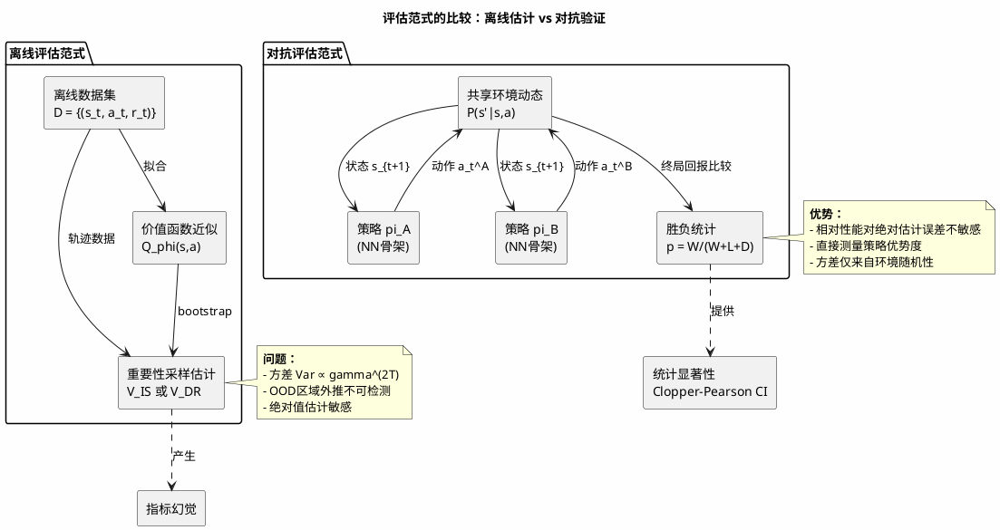
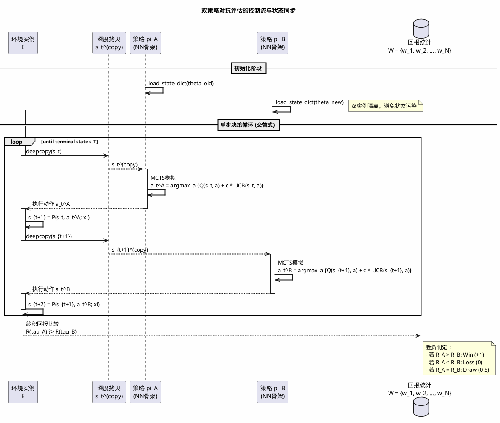
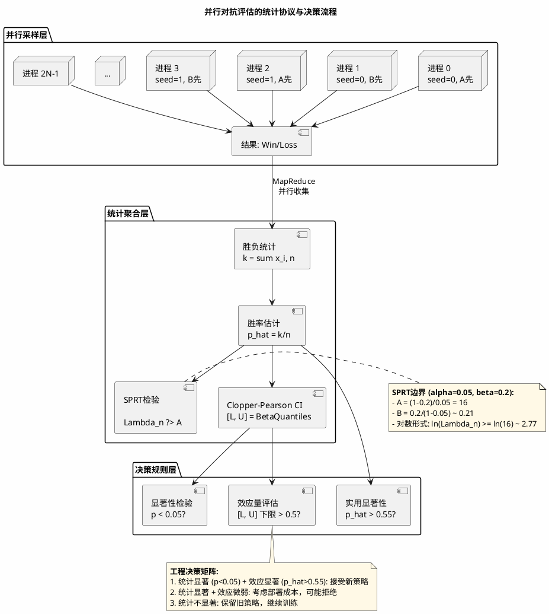

在深度强化学习系统的迭代周期中，一个 persistent 的痛点是**离线指标与在线表现的分裂**。你可能观察到训练损失稳步下降、验证集准确率攀升，但一旦部署至真实决策环境，新策略的表现却不如预期——甚至不如数周前的旧版本。这种"指标幻觉"源于离线数据集与在线策略分布的偏移（off-policy evaluation bias），以及单一模型评估无法捕捉的动态交互复杂性。

传统的机器学习评估依赖于静态测试集上的准确率或困惑度（perplexity），但对于序贯决策系统（sequential decision systems），策略的价值只能在与其他策略的交互中相对衡量。本文基于我们在大规模策略迭代中的工程实践，探讨如何构建严谨的**对抗验证协议（adversarial validation protocol）**  ，通过头对头（head-to-head）比较消除评估偏差，并建立具有统计显著性的模型排序机制。

## 1. 禀线指标的系统性失效

### 1.1 价值估计的复合误差

在监督学习中，测试集上的交叉熵损失是模型泛化误差的无偏估计（假设i.i.d.采样）。但在强化学习中，策略的"准确性"没有绝对参照系——一个动作的好坏取决于后续状态的可达性与累积回报。离线评估（offline evaluation）通常采用重要性采样（importance sampling, IS）：

$$
\hat{V}_{\text{IS}} = \frac{1}{n} \sum_{i=1}^{n} \prod_{t=0}^{T} \frac{\pi_{\text{new}}(a_t^i|s_t^i)}{\pi_{\text{old}}(a_t^i|s_t^i)} \cdot R(\tau^i)
$$

其中 $\tau^i$ 表示第 $i$ 条轨迹，$R(\tau^i)$ 为累积回报。该估计量的方差随轨迹长度指数级增长：

$$
\text{Var}(\hat{V}_{\text{IS}}) \approx \frac{1}{n} \left( \mathbb{E}_{\pi_{\text{old}}} \left[ \left( \prod_{t=0}^{T} \rho_t \right)^2 R(\tau)^2 \right] - V(\pi_{\text{new}})^2 \right), \quad \rho_t = \frac{\pi_{\text{new}}(a_t|s_t)}{\pi_{\text{old}}(a_t|s_t)}
$$

当策略差异增大时，重要性权重 $\rho_t$ 的累积乘积 $\prod_{t=0}^{T} \rho_t$ 呈现极高方差，导致估计不可靠。自归一化重要性采样（SN-IS）虽能降低方差：

$$
\hat{V}_{\text{SN-IS}} = \frac{\sum_{i=1}^{n} w(\tau^i) R(\tau^i)}{\sum_{i=1}^{n} w(\tau^i)}, \quad w(\tau^i) = \prod_{t=0}^{T} \frac{\pi_{\text{new}}(a_t^i|s_t^i)}{\pi_{\text{old}}(a_t^i|s_t^i)}
$$

但仍无法解决**分布外（Out-of-Distribution）外推**问题：新策略可能探索了旧策略从未访问的状态空间区域 $s \notin \mathcal{S}_{\text{old}}$，在这些区域上的价值估计完全是外推（extrapolation），而离线指标无法识别这种外推的可靠性。

### 1.2 策略改进的单调性幻觉

策略梯度方法理论上保证单调改进（monotonic improvement），但这依赖于精确的策略评估。TRPO（Trust Region Policy Optimization）通过约束更新步长确保单调性：

$$
\eta(\pi_{\text{new}}) \geq \eta(\pi_{\text{old}}) - \frac{2\epsilon\gamma}{(1-\gamma)^2} \cdot \max_s D_{\text{TV}}(\pi_{\text{old}}(\cdot|s) \| \pi_{\text{new}}(\cdot|s))
$$

其中 $\eta(\pi)$ 表示策略期望回报，$D_{\text{TV}}$ 为总变差距离（Total Variation Distance），$\epsilon = \max_{s,a} |A_{\pi}(s,a)|$。实践中采用KL散度约束作为 surrogate：

$$
\max_{\theta} \quad \mathbb{E}_{s \sim \rho_{\pi_{\theta_{\text{old}}}}, a \sim \pi_{\theta_{\text{old}}}} \left[ \frac{\pi_\theta(a|s)}{\pi_{\theta_{\text{old}}}(a|s)} A_{\pi_{\theta_{\text{old}}}}(s,a) \right]
$$

$$
\text{subject to} \quad \mathbb{E}_{s \sim \rho_{\pi_{\theta_{\text{old}}}}} \left[ D_{\text{KL}}(\pi_{\theta_{\text{old}}}(\cdot|s) \| \pi_\theta(\cdot|s)) \right] \leq \delta
$$

然而，函数近似误差（function approximation error）和梯度估计噪声可能导致**策略退化（policy degradation）**  ——新策略在参数空间中看似靠近最优，实际上陷入了局部极小值或灾难性遗忘（catastrophic forgetting）的陷阱。

我们需要一种**相对（relative evaluation）**  机制：不问"新策略有多好"，而问"新策略是否比旧策略更好"。这要求二者在受控环境中直接对抗，通过**胜负频率（win rate）**  这一唯一鲁棒的指标进行排序。

## 2. 对抗验证的架构设计

### 2.1 状态字典隔离与模型解耦

在工程实现中，对抗评估面临的首要挑战是**模型版本的管理**。我们不能简单地在同一网络实例上切换权重，因为PyTorch的`load_state_dict`是原地操作（in-place），若新旧模型结构存在微小差异（如层命名变化），可能导致状态污染。

我们采用**双实例架构（dual-instance architecture）**  ：独立初始化两个网络骨架（backbone），分别加载不同版本的检查点（checkpoint）。这保证了：

- **内存隔离**：两个模型拥有独立的计算图与优化器状态（尽管评估时无需优化器）
- **设备灵活性**：旧模型可部署于CPU（节省GPU显存给新模型），新模型利用GPU加速，实现异构计算（heterogeneous computing）

关键工程细节在于**权重加载的原子性**。在分布式文件系统中，检查点文件可能被训练进程并发写入。我们采用**写时复制（copy-on-write）**  语义：评估进程首先将检查点复制至本地临时目录，再执行加载，避免读取到半写入（half-written）的损坏状态。

### 2.2 环境封装与状态同步

对抗评估要求两个策略在**完全相同的环境动态（environment dynamics）**  下操作。对于序贯决策（alternating-turn decision making），我们需要**环境状态的深度拷贝（deep copy）**  机制：在每个决策点，当前环境状态被冻结并复制给两个策略分别进行推理，确保它们基于完全一致的世界观（world state）做出选择。

形式化地，设环境状态为 $s_t$，状态转移函数为 $s_{t+1} = \mathcal{P}(s_t, a_t)$。对于交替式对抗，第 $k$ 步的决策流程为：

$$
s_{t+1}^{(k)} = \mathcal{P}(s_t, \pi_A(s_t)), \quad s_{t+2}^{(k)} = \mathcal{P}(s_{t+1}^{(k)}, \pi_B(s_{t+1}^{(k)}))
$$

配对设计（paired design）要求对于随机种子 $\xi$，两次运行（A先手和B先手）面对的状态转移序列完全一致：

$$
\mathcal{P}(\cdot, \cdot; \xi) \text{ 在两次运行中保持相同，仅决策主体互换}
$$

这种设计引入了**计算开销的权衡**：深度拷贝复杂环境状态（如高维物理模拟）可能耗时显著。我们的优化是**惰性拷贝（lazy copy）**  ：仅在策略需要访问环境内部状态（如MCTS的模拟阶段）时才执行拷贝，若策略仅依赖观测（observation）而非完整状态，则通过共享只读内存避免拷贝。

## 3. 消除系统性偏差：从非对称到平衡设计

### 3.1 先手偏置与顺序效应

在序贯决策系统中，**先行动者优势（first-mover advantage）**  是一个普遍存在的现象。若固定策略A为先手、策略B为后手进行 $N$ 次评估，测得的胜负率会受到顺序效应（order effect）的污染，而非纯粹反映策略质量。

我们采用**交替先手协议（alternating start protocol）**  ）：对于每对评估episode，执行两次独立运行——一次A先手，一次B先手。设 $W_{A>B}$ 为A先手时A胜出的次数，$W_{B>A}$ 为B先手时A胜出的次数，则净胜率（net win rate）为：

$$
\hat{p} = \frac{1}{2N} \sum_{i=1}^{N} \left( \mathbb{I}[R_A^{(i)} > R_B^{(i)} | A\text{先手}] + \mathbb{I}[R_A^{(i)} > R_B^{(i)} | B\text{先手}] \right)
$$

这种配对设计（paired design）将环境随机性从比较中完全消除，仅保留策略差异导致的分歧。

### 3.2 搜索深度的公平性约束

若两个策略使用MCTS进行决策，**搜索计算预算（search budget）**  的差异会引入混淆变量。MCTS的节点选择基于UCB1公式：

$$
\text{UCB}(s, a) = Q(s, a) + c \cdot \sqrt{\frac{\ln N(s)}{N(s, a)}}
$$

其中 $N(s)$ 为状态访问次数，$N(s, a)$ 为动作访问次数，$c$ 为探索常数。

严格的评估要求**等计算预算（equalized compute budget）**  ：固定双方的总模拟次数 $M$ 或思考时间 $T_{\text{think}}$。对于异构硬件场景（新模型可能针对Tensor Cores优化），应监控**实际节点扩展数（actual node expansions）**  而非 wall-clock time：

$$
\text{Fairness Constraint:} \quad M_A = M_B = M_{\text{fixed}}
$$

## 4. 并行化与统计效率

### 4.1 多进程采样的方差缩减

单一episode的胜负结果服从Bernoulli分布，方差为 $p(1-p)$。为达到95%置信区间、±5%的误差范围，样本量 $N$ 需满足：

$$
N \geq \left( \frac{z_{\alpha/2}}{E} \right)^2 \cdot p(1-p) \approx \left( \frac{1.96}{0.05} \right)^2 \cdot 0.25 \approx 384
$$

其中 $z_{\alpha/2}$ 为标准正态分布的分位数，$E$ 为允许误差，$p=0.5$ 为最坏情况方差。

在计算资源充足时，我们采用**并行采样（parallel sampling）** 加速统计收敛。由于评估是只读操作，进程间无需同步，实现了embarrassingly parallel的加速比。

### 4.2 早停机制（Early Stopping）的统计控制

在观察到显著胜负差异时，提前终止评估以节省算力在统计上是危险的：**随机游走（random walk）**  可能在早期产生看似显著的领先。

我们采用**序贯概率比检验（SPRT, Sequential Probability Ratio Test）**  ，在严格控制第一类错误率（Type I error）的前提下允许提前终止。设 $H_0: p = p_0 = 0.5$（无差异），$H_1: p = p_1 = 0.5 + \delta$（有显著提升），似然比为：

$$
\Lambda_n = \prod_{i=1}^{n} \frac{p_1^{x_i}(1-p_1)^{1-x_i}}{p_0^{x_i}(1-p_0)^{1-x_i}} = \left( \frac{p_1}{p_0} \right)^{S_n} \left( \frac{1-p_1}{1-p_0} \right)^{n-S_n}
$$

其中 $S_n = \sum_{i=1}^{n} x_i$ 为累计胜场数。决策边界为：

$$
A = \frac{1-\beta}{\alpha}, \quad B = \frac{\beta}{1-\alpha}
$$

$$
\text{若 } \Lambda_n \geq A: \text{接受 } H_1; \quad \text{若 } \Lambda_n \leq B: \text{接受 } H_0; \quad \text{否则继续采样}
$$

### 4.3 显著性检验与效应量

报告胜负率时，必须附带**置信区间**。我们采用Clopper-Pearson精确检验（基于Beta分布的分位数），而非正态近似：

$$
\text{Lower} = B\left(\frac{\alpha}{2}; k, n-k+1\right), \quad \text{Upper} = B\left(1-\frac{\alpha}{2}; k+1, n-k\right)
$$

其中 $B(p; a, b)$ 为Beta分布的 $p$ 分位数，$k$ 为胜场数，$n$ 为总场次。

**效应量（effect size）**  比显著性更重要。胜率55%可能在统计上显著（$p<0.05$），但实际改进微小；而胜率65%即使 $p$ 值略高，也可能代表质的飞跃。工程决策应基于**最小可检测效应（Minimum Detectable Effect, MDE）**  进行先验功率分析（power analysis）：

$$
N = \frac{(z_{\alpha/2} + z_{\beta})^2 \cdot 2p(1-p)}{(p_1 - p_0)^2}
$$

其中 $z_{\beta}$ 为功效（power）对应的分位数，$p_1 - p_0$ 为期望检测的胜率差异。

## 5. 生产集成的持续评估

### 5.1 金丝雀部署与对抗阴影

在线部署时，我们采用**对抗阴影模式（adversarial shadow mode）**  ：新策略作为"影子"与生产环境并行运行，接收相同的状态输入 $s_t$ 但不执行动作（或执行动作但隐藏结果），与当前生产策略的决策进行实时对比。

设生产策略为 $\pi_{\text{prod}}$，影子策略为 $\pi_{\text{shadow}}$，在时刻 $t$ 的即时遗憾（instantaneous regret）为：

$$
\Delta_t = Q^{\pi_{\text{prod}}}(s_t, \pi_{\text{shadow}}(s_t)) - Q^{\pi_{\text{prod}}}(s_t, \pi_{\text{prod}}(s_t))
$$

累积对抗得分用于触发自动回滚。

### 5.2 回滚触发器

建立基于对抗评估的**自动回滚机制**：若新策略在在线对抗中的累积胜率低于45%（考虑置信区间下限），自动触发回滚至上一稳定版本。这比监控单一指标（如奖励均值）更鲁棒，因为它直接比较策略间的相对优势。

回滚决策函数形式化为：

$$
\text{Rollback} = \mathbb{I}\left[ \hat{p} < 0.45 \quad \text{或} \quad L_{\text{CI}} < 0.40 \right]
$$

其中 $L_{\text{CI}}$ 为95%置信区间的下限。

## 结论

在策略网络的迭代周期中，对抗验证协议是连接离线训练与在线部署的关键桥梁。它通过头对头比较消除了离线指标的分布偏移幻觉，通过严格的实验设计控制了顺序效应与计算公平性，并通过统计推断提供了可信赖的部署决策依据。

这种评估范式的成本显著高于静态测试集评估——它需要双倍的环境模拟开销与复杂的协调逻辑。但对于高风险决策系统，这种成本是必要投资：一次基于错误离线指标的部署失误，其业务损失远超数百次对抗评估的计算成本。在未来，我们探索**基于模型的评估（model-based evaluation）**  ，训练一个环境动态的世界模型（world model）作为低成本评估器，但在此之前，真实的对抗 rollout 仍是金标准（gold standard）。

---

**关键公式索引：**

- 重要性采样方差：第1.1节
- TRPO单调性保证：第1.2节
- MCTS-UCB公式：第3.2节
- SPRT决策边界：第4.2节
- Clopper-Pearson置信区间：第4.3节
- 样本量规划（MDE）：第4.3节
