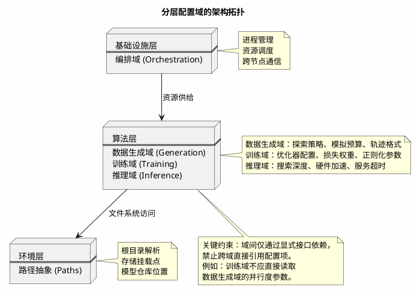
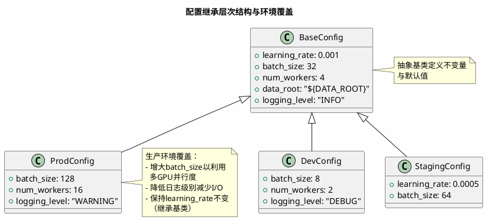
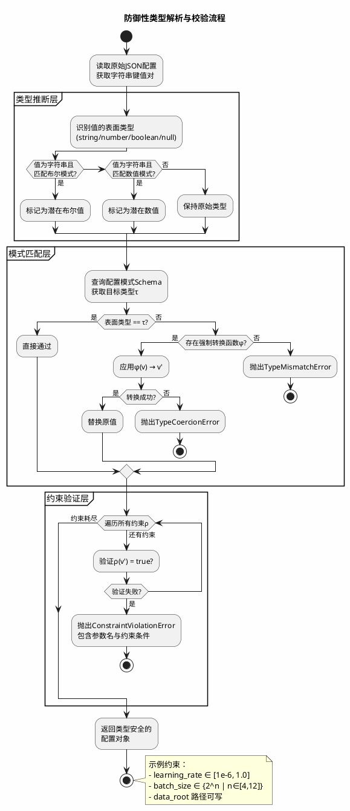
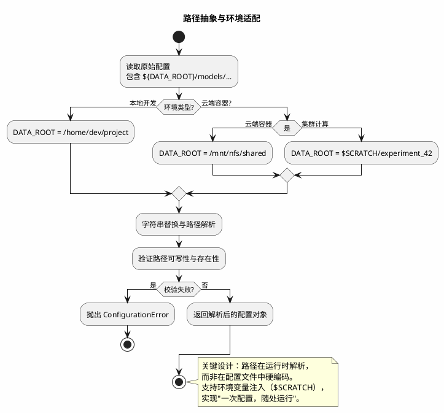
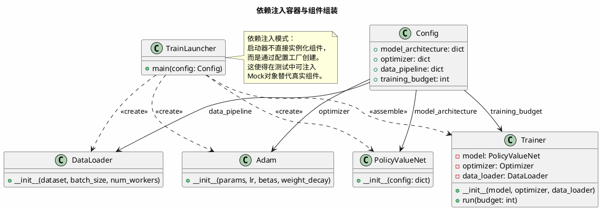
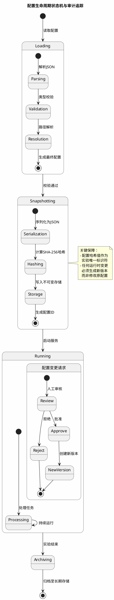

当你从一个单文件原型（single-file prototype）演进至分布式生产系统时，最先失控的往往不是算法逻辑，而是**配置参数**的碎片化。硬编码的批量大小（batch size）、散落在十二个头文件中的路径常量、以及通过命令行参数（argparse）层层传递的布尔标志，共同构成了所谓的"配置地狱"（configuration hell）。在迭代至第三个环境（本地工作站 → 内部集群 → 云端 Kubernetes）时，你会发现相同的代码库需要维护三套互不兼容的入口点，任何超参微调都伴随着痛苦的代码重部署。

本文基于我们在大规模序列决策系统中的工程重构经验，探讨如何通过**配置中心化管理**与**模块化启动器架构**，实现代码与环境的解耦，并建立可审计、可回滚的配置生命周期。

## 1. 配置熵增与关注点分离

### 1.1 单体配置的反模式

早期的工程实践倾向于将所有参数堆积在单一全局配置对象中，或更糟糕地，直接以魔法数字（magic numbers）形式嵌入算法逻辑。这导致**横向关注点污染**：数据生成管线的-workers数量与神经网络的dropout率、日志路径与残差块深度，这些本应属于不同生命周期与维护者（data engineer vs. research scientist）的参数被强行耦合。

我们采用**配置熵（Configuration Entropy）**  来量化这种混乱程度。设配置参数集合为 $C = \{c_1, c_2, \dots, c_n\}$，每个参数 $c_i$ 的维护者为 $m(c_i)$，生命周期阶段为 $l(c_i)$，关注度量为 $\mathcal{A}(c_i) \in [0,1]$。则配置系统的熵定义为：

$$
H(C) = -\sum_{i=1}^{n} \mathcal{A}(c_i) \log \mathcal{A}(c_i) + \lambda \sum_{i<j} \delta(m(c_i), m(c_j)) \cdot d(l(c_i), l(c_j))
$$

其中 $\delta$ 为Kronecker delta函数（当维护者相同时为0，否则为1），$d(\cdot,\cdot)$ 为生命周期差异度量，$\lambda$ 为耦合系数。**高熵配置**表现为跨域参数纠缠，导致变更传播不可控。

我们采用的架构是**分层配置域（layered configuration domains）**  ，将系统解构为四个正交维度：

- **推理域（Inference Domain）**  ：控制实时决策服务的延迟预算、硬件加速选项、搜索深度等运行时参数
- **数据生成域（Data Generation Domain）**  ：管理自博弈（self-play）的并行度、探索噪声系数、轨迹缓冲策略等
- **训练域（Training Domain）**  ：封装学习率调度、正则化强度、优化器状态、梯度累积步数等优化超参
- **编排域（Orchestration Domain）**  ：处理进程池大小、任务队列长度、跨节点通信拓扑等基础设施配置

这种分离遵循**单一职责原则（Single Responsibility Principle）**  ：修改数据生成策略不应触发训练流水线的重启，调整日志级别更不应影响模型推理的数值精度。

**配置依赖图（Configuration Dependency Graph）**  的形式化定义：设域集合为 $\mathcal{D} = \{D_1, D_2, D_3, D_4\}$，依赖关系为边集 $E \subseteq \mathcal{D} \times \mathcal{D}$。我们的架构要求该图为有向无环图（DAG），且满足：

$$
\forall (D_i, D_j) \in E, \text{level}(D_i) < \text{level}(D_j)
$$

其中 $\text{level}(\text{Orchestration})=0, \text{level}(\text{Data/Training/Inference})=1, \text{level}(\text{Environment})=2$。

### 1.2 配置继承与环境覆盖

生产系统通常需要支持**多环境部署**（开发、 staging、生产）。我们引入**配置继承机制**：基础配置文件（`base.json`​）定义默认值，环境特定文件（`prod.json`）通过键值覆盖（override）实现差异化，而非完全复制。

设基础配置为 $C_{base}$，环境配置为 $C_{env}$，合并操作 $\oplus$ 定义为递归字典合并：

$$
C_{final} = C_{base} \oplus C_{env} = \{k \mapsto \begin{cases}
C_{env}(k) & \text{if } k \in \text{dom}(C_{env}) \\
C_{base}(k) & \text{otherwise}
\end{cases} \mid k \in \text{dom}(C_{base}) \cup \text{dom}(C_{env})\}
$$

对于嵌套配置，递归应用此规则。这避免了配置漂移（configuration drift）——那种十个环境拥有十份完全不同配置文件的维护噩梦。

然而，JSON 标准本身不支持继承语法，我们通过**配置加载器的合并逻辑**实现。这要求配置项的**正交性设计**：任何不应被覆盖的关键参数（如随机种子）必须显式声明为环境敏感（environment-sensitive），在合并时触发校验警告。

定义**覆盖风险系数**：

$$
\rho(k) = \frac{|\{env \mid C_{env}(k) \neq C_{base}(k)\}|}{|\mathcal{E}|}
$$

其中 $\mathcal{E}$ 为环境集合。当 $\rho(k) > \theta$（阈值，通常取0.7）时，系统应发出警告，提示该参数可能存在过度覆盖风险。

## 2. 类型系统的脆弱性与防御性解析

### 2.1 字符串类型的陷阱

JSON 作为配置格式的最大缺陷在于其**弱类型系统**。布尔值 `true`​ 容易被误写为字符串 `"True"`​ 或 `"true"`​，数值 `1e-3` 可能被解析为字符串导致科学计数法失效。

定义**类型一致性度量** $\mathcal{T}(v, \tau)$，表示值 $v$ 与目标类型 $\tau$ 的兼容程度：

$$
\mathcal{T}(v, \tau) = \begin{cases}
1 & \text{if } \text{type}(v) = \tau \\
0.5 & \text{if } \text{coercible}(v, \tau) \\
0 & \text{otherwise}
\end{cases}
$$

其中 $\text{coercible}$ 表示可通过安全的类型转换达成兼容（如字符串 `"123"` 转为整数）。

我们的解决方案是**模式校验与强制转换层（Schema Validation & Coercion Layer）**  。在配置加载后、应用逻辑使用前，插入一层**契约定义**。设配置模式为 $\Sigma = \{\sigma_1, \sigma_2, \dots, \sigma_m\}$，其中每个 $\sigma_i = (k_i, \tau_i, \phi_i, \rho_i)$，分别表示键、目标类型类型转换函数、约束谓词。

`

这种**早失败（fail-fast）**  策略在系统启动阶段即捕获类型错误，而非在训练中途因 `str`​ 与 `float`​ 的不兼容操作抛出难以追踪的 `TypeError`。

形式化的校验函数：

$$
\text{validate}(c, \Sigma) = \bigwedge_{(k,\tau,\phi,\rho) \in \Sigma} \rho(\phi(c[k])) \land (\text{type}(\phi(c[k])) = \tau)
$$

### 2.2 路径解析的环境感知

配置中的路径常量（如 `/home/user/data`​）是环境可移植性的杀手。我们引入**根路径抽象（Root Path Abstraction）**  ：通过占位符替换实现环境无关配置。

设路径模板为 $p \in \mathcal{P}$，其中包含占位符变量 $V = \{v_1, v_2, \dots\}$。环境映射为函数 $\mathcal{M}: V \to \mathcal{S}$（字符串）。则实际路径为：

$$
\text{resolve}(p, \mathcal{M}) = \text{substitute}(p, \{(v, \mathcal{M}(v)) \mid v \in \text{vars}(p)\})
$$

这在容器化（containerization）场景中尤为重要：Docker 容器内的路径与宿主机完全不同，通过环境变量注入 `DATA_ROOT`，同一镜像可在开发笔记本与云端 GPU 集群上无需修改地运行。

## 3. 模块化启动器与依赖注入

### 3.1 入口点的职责单一化

传统的 `main.py`​ 往往膨胀为数百行的条件分支地狱：`if args.mode == 'train': ... elif args.mode == 'eval': ...`​。这种**上帝对象（God Object）**  anti-pattern 使得单元测试几乎不可能——你无法在不启动整个训练循环的情况下测试数据加载逻辑。

我们的架构将入口点拆分为**模块化启动器（modular launchers）**  ：

- ​`train_launcher.py`：仅负责训练管线的组装
- ​`generate_launcher.py`：仅负责数据生成管线的编排
- ​`evaluate_launcher.py`：仅负责对抗验证协议的执行

每个启动器遵循**依赖注入（Dependency Injection）**  模式。设组件集合为 $\mathcal{K}$，配置为 $c$，工厂函数为 $\mathcal{F}: c \mapsto \mathcal{K}$。则启动器 $L$ 可表示为：

$$
L(c) = \text{assemble}(\mathcal{F}_1(c_1), \mathcal{F}_2(c_2), \dots, \mathcal{F}_n(c_n))
$$

其中 $c = \bigcup c_i$ 为配置分区，满足 $c_i \cap c_j = \emptyset$（正交性）。

这种设计的优势在于**可测试性（testability）**  ：在单元测试中，你可以注入 mock 对象（如假的数据加载器或随机的模型），而无需修改启动器代码。

### 3.2 配置与代码的版本锁定

当算法迭代时，配置模式（schema）也可能 evolve（例如新增 `gradient_clip_norm`​ 参数）。我们采用**配置版本化（configuration versioning）**  。

设配置模式版本为 $v_c \in \mathbb{N}$，代码期望版本为 $v_{code} \in \mathbb{N}$。兼容性函数为：

$$
\text{compatible}(v_c, v_{code}) = \begin{cases}
\text{FULL} & \text{if } v_c = v_{code} \\
\text{BACKWARD} & \text{if } v_c < v_{code} \land \text{defaults available} \\
\text{INCOMPATIBLE} & \text{otherwise}
\end{cases}
$$

在配置文件中显式声明 `schema_version: 2`，启动器在加载时检查版本兼容性。若代码期望版本 3 但遇到版本 2 的配置，可选择：

- **向后兼容模式**：使用默认值填充缺失参数，并记录警告
- **严格模式**：拒绝启动，强制用户更新配置

这防止了"代码已更新但配置未同步"导致的静默错误（silent failures）。

## 4. 配置的生命周期与治理

### 4.1 配置漂移与审计

在长时间运行的实验（如持续数周的强化学习训练）中，**配置漂移（configuration drift）**  是常见故障源：研究员手动修改了配置文件但未提交版本控制，导致结果不可复现。

定义**配置漂移度量** $\Delta(C_{t_0}, C_t)$，表示初始配置与时刻 $t$ 配置的差异：

$$
\Delta(C_{t_0}, C_t) = \frac{|\{k \mid C_{t_0}(k) \neq C_t(k)\}|}{|\text{dom}(C_{t_0})|} + \gamma \cdot \text{HAMMING}(C_{t_0}, C_t)
$$

其中 $\gamma$ 为权重系数，$\text{HAMMING}$ 为结构差异度量（如嵌套深度变化）。

我们通过**启动时快照（startup snapshot）**  机制缓解：系统在初始化时将完整配置（含环境变量解析后的最终值）序列化为 JSON，与实验日志一同归档，形成**不可变记录（immutable record）**  。

### 4.2 热更新的可行性与风险

理论上，某些参数（如日志级别、学习率）支持**热更新（hot-reloading）**  ——无需重启服务即可生效。然而，在分布式训练场景中，热更新可能导致**参数不一致**。

设分布式系统有 $n$ 个节点，节点 $i$ 在时刻 $t$ 的配置为 $C_i(t)$。一致性要求：

$$
\forall i,j \in \{1,\dots,n\}, \forall t: C_i(t) = C_j(t) \quad \text{(强一致性)}
$$

或至少满足：

$$
\|C_i(t) - C_j(t)\| < \epsilon \quad \text{(最终一致性)}
$$

热更新破坏了强一致性，因为网络延迟导致各节点接收变更的时间不同。对于需要动态调整的参数（如探索系数 $\epsilon$-greedy 中的 $\epsilon$），通过**命令通道（command channel）**  显式传递，而非修改配置文件，确保变更的显式性与可追溯性。

定义**配置更新协议**：

$$
\mathcal{U} = \{(t_i, \delta_i, \sigma_i)\}_{i=1}^m
$$

其中 $t_i$ 为时间戳，$\delta_i$ 为变更内容，$\sigma_i$ 为数字签名。这形成了**审计日志（audit log）**  ，满足：

$$
\forall \tau, C(\tau) = C_0 \oplus \bigoplus_{t_i \leq \tau} \delta_i
$$

### 4.3 敏感信息的隔离

配置文件中常包含敏感信息（如云存储的访问密钥、数据库密码）。我们实施** secrets 分离策略 **：将敏感字段移至环境变量或专用 secrets 管理器（如 HashiCorp Vault）。

设配置中的敏感字段集合为 $S \subset C$，则安全的配置表示为：

$$
C_{safe} = (C \setminus S) \cup \{(k, \text{ref}(v)) \mid (k,v) \in S\}
$$

其中 $\text{ref}(v)$ 为对 secrets 管理器的引用（如 `${VAULT:secret/data/api#key}`​）。在解析阶段通过**环境变量插值（interpolation）** 填充：

$$
\text{resolve}(C_{safe}, \mathcal{V}) = (C \setminus S) \cup \{(k, \mathcal{V}(\text{ref}(v))) \mid (k,v) \in S\}
$$

这允许将配置文件安全地提交至 Git，而 secrets 留在基础设施层。

## 结语

配置治理是软件工程中"隐形的基础设施"。良好的配置架构不会出现在论文的方法论章节，但它决定了算法能否从实验室走向生产环境。通过分层域设计、防御性类型校验、路径抽象与模块化启动器，我们构建了一个既灵活又鲁棒的配置体系。

在配置管理的谱系上，一端是硬编码的僵化，另一端是过度工程的配置语言（如 YAML 的 1000 种方言）。**最优复杂度**可由以下公式近似：

$$
\mathcal{C}_{opt} = \arg\min_{C} \left( \alpha \cdot \text{Complexity}(C) + \beta \cdot \text{Flexibility}(C) + \gamma \cdot \text{Safety}(C) \right)
$$

其中 $\alpha, \beta, \gamma$ 为项目特定权重。找到适合系统复杂度的"甜蜜点"，是每一个机器学习工程师必须修炼的技能。

---

*理论知识如有纰漏，欢迎指正：Yae_SakuRain@outlook.com。*
