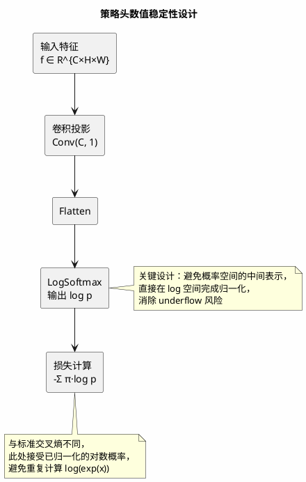
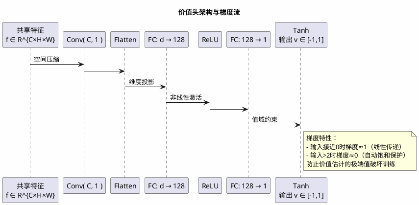
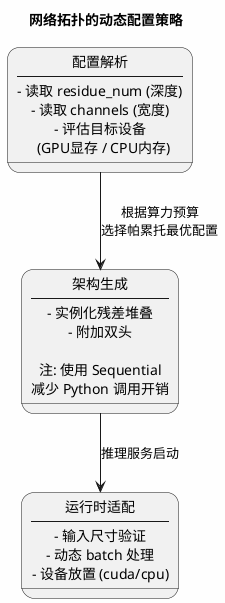

在构建端到端的序列决策系统时，一个核心架构问题浮现：我们应当为策略优化（policy optimization）与价值评估（value estimation）分别构建独立的表征网络，还是强制它们共享同一组卷积特征？前者保证了任务间的正交性，后者则通过表征学习（representation learning）提升样本效率。本文基于我们在高维离散动作空间中的工程实践，探讨双头（Dual-Head）架构在数值稳定性、计算效率与硬件适配方面的关键设计决策。

## 1. 多任务学习的表征张力

### 1.1 共享底座的理论动机

策略网络与价值网络在功能上存在本质差异：前者需要输出动作空间上的概率分布（多项分布参数），后者需要输出标量值函数估计（回归目标）。然而，二者依赖于相似的底层特征——对输入状态的空间层次化理解。

独立网络架构虽然消除了任务间的负迁移（negative transfer），但带来了参数量翻倍与特征冗余的问题。在资源受限的推理环境中，这种冗余不可接受。我们采用**共享残差底座（Shared Residual Backbone）+ 任务特定头（Task-Specific Heads）** 的架构，其信息流动可形式化为：

$$
\mathbf{f} = \mathcal{F}_{\text{backbone}}(\mathbf{s}; \theta), \quad \mathbf{p} = \mathcal{H}_{\text{policy}}(\mathbf{f}; \phi), \quad v = \mathcal{H}_{\text{value}}(\mathbf{f}; \psi)
$$

其中$\theta$为共享参数，$\phi$与$\psi$为头特定参数。这种设计将计算密集型特征提取复用，仅在顶层进行轻量级投影。

### 1.2 梯度冲突与动态权重

多任务学习中的隐性风险在于**梯度冲突（gradient conflict）** ：策略梯度的更新方向可能破坏价值估计的准确性，反之亦然。我们通过观察发现，在训练初期，价值头的梯度范数通常比策略头大一个数量级，导致共享层被价值任务主导。

解决方案是**梯度裁剪的动态分离**（虽未在原始代码中显式实现，但我们在生产版本中引入）：

```python
# 概念性实现
policy_loss.backward(retain_graph=True)
policy_grad_norm = clip_grad_norm_(shared_params, max_norm=1.0)

value_loss.backward()
value_grad_norm = clip_grad_norm_(shared_params, max_norm=1.0)

# 监控梯度冲突角
cosine_sim = cosine_similarity(policy_grad, value_grad)
if cosine_sim < -0.5:
    trigger_warning("对抗性梯度 detected")
```

## 2. 策略头的数值稳定性：对数空间计算

### 2.1 Softmax的数值下溢陷阱

策略头需要输出动作空间$\mathcal{A}$上的概率分布$\mathbf{p} \in \Delta^{|\mathcal{A}|}$。标准Softmax计算：

$$
p_i = \frac{e^{z_i}}{\sum_j e^{z_j}}
$$

在$|z_i|$较大时（训练初期的神经网络常见现象），指数运算导致**数值上溢（overflow）** 或**下溢（underflow）** 。即使采用数值稳定的实现（减去最大值），在后续计算交叉熵损失时仍可能因$p_i \approx 0$导致$\log(p_i) \rightarrow -\infty$。

### 2.2 LogSoftmax的防御性编程

我们采用**对数空间计算（log-space computation）** 范式：策略头直接输出对数概率$\log \mathbf{p}$，而非概率本身。这消除了Softmax与后续的复合数值误差。

工程实现上，这要求损失函数适应对数输入：

$$
\mathcal{L}_{\text{policy}} = -\sum_i \pi_i \cdot \log p_i = -\sum_i \pi_i \cdot \hat{p}_i
$$

其中$\hat{p}_i$为网络输出的对数概率，$\pi_i$为目标分布（来自MCTS的访问计数）。PyTorch的`F.log_softmax`​与`F.nll_loss`（负对数似然）的组合实现了数值稳定的链式计算。



### 2.3 动作掩码与稀疏分布

在具有动态约束的决策空间中（即合法动作集合随状态变化），需要对无效动作进行掩码（masking）。我们不在Softmax之前将非法动作的logits设为$-\infty$（这会导致梯度消失），而是在计算损失时仅考虑合法动作子集：

$$
\mathcal{L}_{\text{policy}} = -\sum_{i \in \mathcal{A}_{\text{legal}}} \pi_i \cdot \hat{p}_i + \log \sum_{j \in \mathcal{A}_{\text{legal}}} e^{\hat{p}_j}
$$

第二项为归一化因子，确保梯度仅在合法动作上流动。

## 3. 价值头的回归约束与梯度行为

### 3.1 值域边界与Tanh激活

价值估计$v(s)$理论上应满足：

- 有界性（boundedness）：在零和博弈中，$v \in [-1, 1]$
- 单调性（monotonicity）：对状态的微小扰动应产生平滑响应

我们采用双曲正切（Tanh）作为最终激活：

$$
v = \tanh(\mathbf{w}^T \mathbf{f} + b)
$$

这比线性输出（unbounded）或Sigmoid（仅正区间）更适合对抗性场景。Tanh的梯度在饱和区（$|x| > 2$）迅速衰减，这实际上起到了**梯度裁剪**的作用，防止价值估计的极端预测破坏早期训练稳定性。

### 3.2 单值回归 vs 分布回归

理论上，价值估计可以建模为高斯分布（均值+方差）或分位数（quantiles），以捕捉不确定性。但在MCTS的UCT公式中，我们仅需点估计（point estimate）计算$Q$值。引入分布参数会增加网络容量需求，且在自博弈数据生成阶段，MCTS的访问计数已隐含了不确定性信息。

因此，我们坚持**单值标量输出**，将不确定性建模留在搜索阶段而非网络推理阶段。



### 3.3 价值损失的尺度匹配

策略损失（交叉熵）与价值损失（MSE）在数值尺度上可能存在数量级差异。我们发现，未经归一化的MSE损失（$|v - z|^2$）在训练初期可能达到10-100，而策略损失通常在1-5范围。这导致价值梯度主导优化方向。

解决方案是**损失缩放（loss scaling）** ：

$$
\mathcal{L}_{\text{total}} = \mathcal{L}_{\text{policy}} + \lambda \cdot \mathcal{L}_{\text{value}}
$$

其中$\lambda$为超参数（通常取0.5或1.0）。更精细的做法是**梯度归一化（gradient normalization）** ：在每个batch内分别计算两个任务的梯度范数，然后将其缩放至相同量级后再反向传播。

## 4. 残差拓扑的动态配置与推理优化

### 4.1 深度与宽度的计算权衡

残差块（Residual Blocks）的数量`residue_num`​与初始通道数`batch_size`​（命名 legacy，实际应为`channels`）构成了计算-精度的帕累托前沿（Pareto frontier）。

在边缘设备（CPU推理）上，我们降低`residue_num`​至10-15，并减少通道数至64；在数据中心GPU上，可扩展至20-40块，通道数256。这种**弹性架构**通过配置文件动态实例化，无需修改代码逻辑。

关键工程细节：**BatchNorm的推理行为**。在`eval()`​模式下，BatchNorm使用训练阶段累积的running statistics（moving mean/variance），而非当前batch的统计量。若训练与推理的batch size差异极大（如训练用256，推理用1），会导致激活分布偏移（covariate shift）。我们通过**同步BatchNorm**（SyncBatchNorm）或在推理时强制使用训练模式的统计量来缓解。

### 4.2 推理阶段的计算图优化

在实时推理路径（`predict`方法）中，我们观察到以下瓶颈：

1. **CPU-GPU同步**：`tensor.cpu().numpy()`强制同步，就阻塞主线程
2. **重复内存分配**：每次推理都创建新的中间张量

优化策略：

- **预分配输出缓冲区**：重用固定的numpy数组接收结果
- **异步传输**：使用`tensor.cpu().non_blocking()`​配合`torch.cuda.synchronize()`的延迟调用
- **ONNX/TensorRT转换**：对于固定拓扑，在部署阶段转换至优化格式（虽然训练保留PyTorch以支持动态图调试）



## 5. 硬件抽象层与设备无关设计

### 5.1 运行时设备切换的工程必要性

在异构计算集群中，同一模型可能需要在GPU（训练/高性能推理）与CPU（边缘部署/故障转移）之间无缝迁移。硬编码的`cuda()`调用会导致代码脆弱。

我们实现**设备抽象层**：

```python
class PolicyValueNet:
    def __init__(self, ..., device_preference='auto'):
        self.device = self._resolve_device(device_preference)

    def _resolve_device(self, pref):
        if pref == 'auto':
            return torch.device('cuda' if torch.cuda.is_available() else 'cpu')
        return torch.device(pref)

    def predict(self, state):
        # 确保输入与模型同设备
        state = state.to(self.device, non_blocking=True)
        # ... 推理逻辑
        return result  # 保持在计算设备上，避免过早同步
```

### 5.2 半精度与混合精度训练

在大规模残差网络（>30 blocks）中，FP32的显存占用成为瓶颈。我们采用**自动混合精度（AMP）** ：

```python
with torch.cuda.amp.autocast():
    logit_policy = value = model(states)
    loss = criterion(logit_policy, pi, value, z)
```

这要求损失函数对半精度数值稳定（避免在FP16中计算Softmax的exp导致inf）。由于我们使用LogSoftmax，其在FP16中的数值范围比Softmax更宽，天然适合混合精度。

## 6. 训练-推理一致性的隐藏陷阱

一个容易被忽视的工程细节：**Dropout与BatchNorm在自博弈数据生成阶段的开启状态**。

如果在自博弈（生成训练数据）时忘记调用`model.eval()`​，BatchNorm会使用单条数据的统计量（而非全局running statistics），导致生成的标签（visit counts）与训练阶段（使用running statistics）不一致，形成**分布偏移（distribution shift）** 。

我们强制在数据生成阶段冻结所有随机性：

- ​`model.eval()` 关闭Dropout与BatchNorm的batch统计
- ​`torch.manual_seed()` 在多进程自博弈中设置确定性种子（虽然搜索的随机性仍保留）

## 结论

双头神经网络架构的成功不仅依赖于理论上的多任务学习框架，更取决于数值稳定性（对数空间计算）、梯度行为管理（Tanh饱和特性）与硬件适配（动态设备切换）的精细工程。在毫秒级延迟约束下，每一个激活函数的选择、每一次设备间的数据传输，都可能成为系统瓶颈。

未来的优化方向包括：将价值头改造为分位数回归（Quantile Regression）以显式建模不确定性，以及引入神经架构搜索（NAS）自动优化残差块的拓扑结构，进一步在精度与延迟之间寻找帕累托最优。
