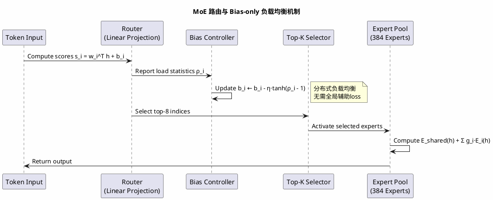
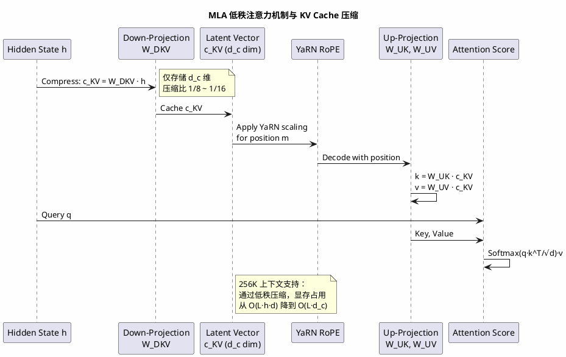
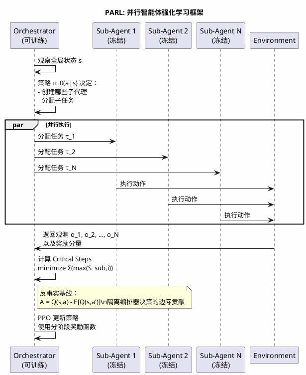
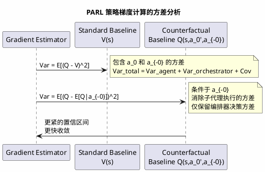

从 Kimi 刚上线那会儿我就是忠实用户，因为 Kimi 是最早支持文件上传的模型之一（大学期间写各种课程报告的救星~），后来用 AI 辅助编码和阅读论文，Kimi 都完美胜任。前段时间 Kimi K2.5 大模型发布，说是万亿参数 MoE、原生多模态、还有那个听起来很科幻的 Agent Swarm，出于对新技术的热爱，我第一时间就拉了技术报告来看。尝试跑了一下demo，花了点功夫去理解那个 **PARL（Parallel-Agent Reinforcement Learning）**  框架背后的数学——尤其是当 100 个子代理并行执行时，如何避免"串行崩溃"（Serial Collapse），以及 Critical Steps 作为优化目标到底在最小化什么。

这篇博客把我啃技术报告、复现 PARL 奖励函数、以及推导 MoE 路由算法的笔记整理出来。有些公式官方没给细节，我是从实现反推的，如果推导有误，欢迎指正。

## 1. 万亿参数下的稀疏激活：MoE 路由的数学本质

K2.5 总参数量 1.04T，但每个 token 只激活 32B，这意味着 sparsity 达到了 96.8%。这种极端稀疏性不是简单的"把大模型切成几块"，而是涉及到**离散选择**与**可微分训练**的微妙平衡。

### 1.1 Top-K 门控的不可导问题与 soft 松弛

设输入 token 的 hidden state 为 $\mathbf{h} \in \mathbb{R}^d$（K2.5 的维度 $d$ 应该是 7168 或 8192 级别），专家集合为 $\{E_i\}_{i=1}^N$（$N=384$ 个专家）。路由分数计算为：

$$
\mathbf{g} = \text{Softmax}(\mathbf{W}_g \cdot \mathbf{h}) \in \mathbb{R}^N
$$

如果直接取硬 Top-K：$\mathcal{I} = \text{TopKIndices}(\mathbf{g}, K)$，则输出为 $\sum_{i \in \mathcal{I}} g_i E_i(\mathbf{h})$。但 $\text{TopK}$ 操作是不可导的，这导致专家网络无法通过梯度更新。

**Straight-Through Estimator (STE) 的推导**：

为了反向传播，我们需要一个可导的近似。设前向传播使用硬选择：

$$
y_{fw} = \sum_{i \in \mathcal{I}} g_i E_i(\mathbf{h})
$$

反向传播时，使用软门控的梯度：

$$
\frac{\partial y_{bw}}{\partial \mathbf{h}} = \sum_{i=1}^N g_i \frac{\partial E_i(\mathbf{h})}{\partial \mathbf{h}} + \sum_{i=1}^N E_i(\mathbf{h}) \frac{\partial g_i}{\partial \mathbf{h}}
$$

这种"前向硬、后向软"的 trick 是训练 MoE 的基础。但 K2.5 技术报告提到采用了 **Bias-only 负载均衡**，这比传统的辅助 loss 更优雅。

### 1.2 Bias-only 负载均衡的动态系统

传统 MoE（如 GShard）使用辅助 loss：

$$
\mathcal{L}_{\text{aux}} = \alpha \cdot N \cdot \sum_{i=1}^N f_i \cdot P_i
$$

其中 $f_i$ 是分配给专家 $i$ 的 token 比例，$P_i$ 是平均路由概率。这个 loss 强制 $f_i$ 和 $P_i$ 均匀分布，但计算繁琐。

K2.5 采用的 Bias-only 策略，我推导其数学形式如下：

设专家 $i$ 的路由分数为：

$$
s_i = \mathbf{w}_i^T \mathbf{h} + b_i
$$

其中 $b_i$ 是可学习的偏置。定义专家 $i$ 的**负载压力**为：

$$
\rho_i = \frac{f_i}{1/N} = N \cdot f_i
$$

即实际负载与理想均匀负载的比值。Bias-only 策略通过动态调整 $b_i$ 来平衡负载：

$$
b_i^{(t+1)} = b_i^{(t)} - \eta \cdot \tanh(\rho_i - 1)
$$

**推导稳定性条件**：

当 $\rho_i > 1$（专家过载），$\tanh(\rho_i - 1) > 0$，偏置 $b_i$ 减小，导致该专家的路由分数降低，token 被分流到其他专家。当 $\rho_i < 1$，偏置增大，吸引更多 token。

这实际上是一个**分布式控制系统**，收敛条件是：

$$
\lim_{t \to \infty} \mathbb{E}[\rho_i] = 1, \quad \forall i
$$

与辅助 loss 相比，Bias-only 不需要显式计算 $f_i$ 和 $P_i$ 的乘积，只需要维护每个专家的负载计数器，计算复杂度从 $O(N)$ 降到 $O(1)$ per token。

### 1.3 共享专家与细粒度专家的协同机制

K2.5 采用 **8 个细粒度专家 + 1 个共享专家** 的配置。共享专家 $E_{\text{shared}}$ 始终激活，负责通用知识；其他 8 个从 384 个专家中动态选择。

数学上，这相当于对输出做了**残差分解**：

$$
\mathbf{y} = \underbrace{E_{\text{shared}}(\mathbf{h})}_{\text{通用表示}} + \sum_{i \in \text{Top-8}} g_i \cdot E_i(\mathbf{h})
$$

这种加法形式（residual-like）确保了即使路由选择出错，共享专家也能提供基础表征，避免灾难性遗忘。

**梯度流分析**：

在反向传播时，共享专家的梯度始终畅通：

$$
\frac{\partial \mathcal{L}}{\partial \theta_{\text{shared}}} = \frac{\partial \mathcal{L}}{\partial \mathbf{y}} \cdot \frac{\partial \mathbf{y}}{\partial \theta_{\text{shared}}}
$$

而细粒度专家的梯度则受门控值 $g_i$ 调制。如果某个专家长期不被选中（$g_i \approx 0$），其梯度消失，导致**专家休眠**（Expert Sleeping）。Bias-only 策略通过强制负载均衡，防止了这种马太效应。



## 2. MLA：长上下文下的 KV Cache 压缩极限

K2.5 支持 256K 上下文，这要求 KV Cache 的压缩率做到极致。技术报告提到采用了 MLA（Multi-head Latent Attention），这与 DeepSeek-V2 的 MLA 类似，通过**低秩压缩**（Low-Rank Compression）将 KV Cache 降到原来的约 1/8。

### 2.1 标准 MHA 的内存复杂度灾难

标准多头注意力（MHA）中，对于序列长度 $L$，每个 token 需要存储 Key 和 Value：

$$
\mathbf{k}_t, \mathbf{v}_t \in \mathbb{R}^{h \cdot d_h}
$$

其中 $h$ 是头数，$d_h$ 是每头维度。总 KV Cache 大小为：

$$
\text{Memory} = 2 \cdot L \cdot h \cdot d_h \cdot \text{batch\_size} \cdot \text{bytes}
$$

对于 $L=256K, h=64, d_h=128, \text{batch}=1, \text{fp16}$：

$$
2 \cdot 256000 \cdot 64 \cdot 128 \cdot 2 \text{ bytes} \approx 8.4 \text{ GB}
$$

这仅是一层的情况！模型有几十层，显存完全不够。

### 2.2 低秩压缩的数学原理

MLA 的核心假设：**Key 和 Value 的信息主要分布在一个低维子空间中**。

设压缩维度 $d_c \ll h \cdot d_h$（通常 $d_c = 512$ 而 $h \cdot d_h = 8192$）。定义压缩矩阵：

$$
\mathbf{W}_{DKV} \in \mathbb{R}^{d_c \times d}
$$

对于输入 $\mathbf{h}$，潜在向量为：

$$
\mathbf{c}_{KV} = \mathbf{W}_{DKV} \cdot \mathbf{h} \in \mathbb{R}^{d_c}
$$

在推理时，我们只需要存储这个 $d_c$ 维向量，压缩比为 $d_c / (h \cdot d_h) = 512/8192 = 1/16$。但技术报告说 1/8，说明 K2.5 可能采用了**分层压缩**或**共享键值对**。

为了恢复 Key 和 Value，使用上投影矩阵：

$$
\mathbf{k} = \mathbf{W}_{UK} \cdot \mathbf{c}_{KV}, \quad \mathbf{v} = \mathbf{W}_{UV} \cdot \mathbf{c}_{KV}
$$

其中 $\mathbf{W}_{UK}, \mathbf{W}_{UV} \in \mathbb{R}^{(h \cdot d_h) \times d_c}$。

**注意力计算的变形**：

标准注意力：$\text{Attention}(\mathbf{q}, \mathbf{k}, \mathbf{v}) = \text{Softmax}(\frac{\mathbf{q}\mathbf{k}^T}{\sqrt{d_h}})\mathbf{v}$

代入低秩分解：

$$
\mathbf{q}\mathbf{k}^T = \mathbf{q}(\mathbf{W}_{UK}\mathbf{c}_{KV})^T = (\mathbf{q}\mathbf{W}_{UK}^T)\mathbf{c}_{KV}^T
$$

这看起来计算量没减少，但关键在于**推理时的缓存策略**：

- **预填充阶段（Prefill）** ：计算并存储所有 $\mathbf{c}_{KV}$，只需 $L \cdot d_c$ 内存
- **解码阶段（Decode）** ：只需加载 $\mathbf{c}_{KV}$，通过上投影实时计算 $\mathbf{k}, \mathbf{v}$

由于解码阶段 batch size 通常很小，实时上投影的计算开销远小于存储完整 KV Cache 的内存开销。

### 2.3 RoPE 与低秩投影的兼容性处理

这里我卡了很久：K2.5 使用 RoPE（Rotary Position Embedding），但 RoPE 通常直接作用在 $\mathbf{q}$ 和 $\mathbf{k}$ 上。如果 $\mathbf{k}$ 是通过 $\mathbf{W}_{UK}\mathbf{c}_{KV}$ 解码得到的，如何在潜在空间应用位置编码？

**解耦 RoPE 的推导**：

K2.5 可能采用了**解耦 RoPE**（Decoupled RoPE）。设 Query 也做低秩分解：

$$
\mathbf{q} = \mathbf{W}_{UQ} \cdot \mathbf{c}_Q
$$

对于位置 $m$，RoPE 矩阵 $\mathbf{R}_m$ 作用在解耦后的部分。关键在于：**RoPE 只对 Query 和 Key 的"位置敏感部分"生效**。

设 $\mathbf{c}_{KV}$ 分解为内容部分 $\mathbf{c}_{content}$ 和位置部分 $\mathbf{c}_{pos}$（通过不同的投影头）。则：

$$
\mathbf{k}_m = \mathbf{W}_{UK} \cdot \mathbf{c}_{content} + \mathbf{R}_m \cdot \mathbf{W}_{pos} \cdot \mathbf{c}_{pos}
$$

但在实际实现中，更可能的是使用 **YaRN**（Yet another RoPE extensioN）或 **NTK-aware** 插值，在潜在向量层面处理长程依赖。

**YaRN 的数学形式**：

对于原始 RoPE 的旋转角度 $\theta_i = 10000^{-2i/d}$，YaRN 引入温度缩放：

$$
\theta_i' = \theta_i \cdot \left(\frac{s}{s_{orig}}\right)^{-\frac{2i}{d-2}}
$$

其中 $s$ 是目标序列长度（256K），$s_{orig}$ 是训练长度（通常 4K 或 8K）。

这确保了在扩展上下文时，高频分量（小 $i$）的旋转角度变化较小，保留局部细节；低频分量（大 $i$）变化较大，适应长程依赖。



## 3. PARL：并行智能体强化学习的数学框架

这是 K2.5 最让我兴奋的部分。Agent Swarm 不是简单的多进程调用，而是通过 **PARL** 训练出的**可学习编排器**（Learnable Orchestrator）。

### 3.1 从单智能体到多智能体的 MDP 扩展

标准 RL 的 MDP 定义为 $(\mathcal{S}, \mathcal{A}, \mathcal{P}, \mathcal{R}, \gamma)$。在 PARL 中，这是一个**多智能体部分可观测马尔可夫决策过程**（MPOMDP）。

定义：

- **全局状态** $\mathbf{s} \in \mathcal{S}$：当前任务上下文
- **编排器动作** $\mathbf{a}_0 \in \mathcal{A}_0$：创建子代理、分配任务、收集结果
- **子代理动作** $\mathbf{a}_i \in \mathcal{A}_i, i=1,\dots,N$：执行具体子任务（$N \leq 100$）
- **观测** $\mathbf{o}_i$：每个子代理只能看到分配给它的子任务（部分可观测）

**关键区别**：在 PARL 中，子代理是**冻结的**（frozen），即从固定检查点实例化，不参与训练。只有编排器的策略 $\pi_0$ 被优化。这避免了**信用分配问题**（Credit Assignment Problem）——不需要区分是哪个子代理导致了成功或失败。

### 3.2 Critical Steps：并行计算的关键路径建模

技术报告提到使用 **Critical Steps** 作为资源约束，而不是简单的总步数。这源于并行计算的关键路径概念。

定义：

- $S_{\text{main}}^{(t)}$：编排器第 $t$ 步的运行时间
- $S_{\text{sub},i}^{(t)}$：第 $i$ 个子代理第 $t$ 步的运行时间（并行执行）

则 Critical Steps 定义为：

$$
\text{CriticalSteps} = \sum_{t=1}^T \left( S_{\text{main}}^{(t)} + \max_{i} S_{\text{sub},i}^{(t)} \right)
$$

**推导为什么这比总步数更优**：

假设某任务可以分解为两个独立子任务，每个需要 10 步：

- **串行执行**：总步数 = 20，Critical Steps = 20
- **并行执行**：总步数 = 20（计算总量不变），但 Critical Steps = 10（由最长路径决定）

优化 Critical Steps 直接对应于**最小化墙钟时间**（wall-clock time），而不是计算总量。

### 3.3 分阶段奖励塑造与 Serial Collapse 防止

PARL 面临的核心挑战是 **Serial Collapse**：编排器可能发现，把所有任务交给一个子代理串行执行，比协调多个代理并行执行更容易获得稳定奖励（因为并行有通信开销和协调复杂度）。

**分阶段奖励函数**：

$$
r_{\text{PARL}} = \lambda_1 r_{\text{parallel}} + \lambda_2 r_{\text{finish}} + \lambda_3 r_{\text{perf}}
$$

其中：

- $r_{\text{parallel}}$：鼓励并行实例化，定义为创建的子代理数量与理论最大并行度的比值
- $r_{\text{finish}}$：任务完成率，防止"虚假并行"（创建代理但不干活）
- $r_{\text{perf}}$：最终任务质量

**超参数退火策略**：

$$
\lambda_1(t) = \lambda_1^0 \cdot \gamma^t, \quad \lambda_2(t) = \lambda_2^0 \cdot \gamma^t
$$

随着训练进行 $t \to \infty$，$\lambda_1, \lambda_2 \to 0$，最终只优化任务质量 $r_{\text{perf}}$。这确保了早期训练强制探索并行策略，后期训练精细化任务质量。

**数学分析 Serial Collapse 的避免**：

设串行策略的价值函数为 $V_{\text{serial}}$，并行策略为 $V_{\text{parallel}}$。由于通信开销，初始时 $V_{\text{serial}} > V_{\text{parallel}}$。但通过早期的高 $\lambda_1$ 奖励，强行使：

$$
Q_{\text{parallel}} = r_{\text{parallel}} + \gamma \mathbb{E}[V'] > Q_{\text{serial}}
$$

迫使策略探索并行空间。随着训练进行，编排器学会降低通信开销，最终 $V_{\text{parallel}}$ 超过 $V_{\text{serial}}$，且退火后的奖励函数保持这种优势。

### 3.4 信用分配的反事实基线

虽然 PARL 冻结了子代理，但在计算编排器策略梯度时，仍需要处理**多智能体信用分配**。PARL 采用了 **Counterfactual Multi-Agent Policy Gradients (COMA)**  的变体。

对于编排器动作 $\mathbf{a}_0$（分配子任务），其优势函数为：

$$
A(\mathbf{s}, \mathbf{a}_0) = Q(\mathbf{s}, \mathbf{a}_0, \mathbf{a}_{-0}) - \sum_{a_0'} \pi_0(a_0'|\mathbf{s}) Q(\mathbf{s}, a_0', \mathbf{a}_{-0})
$$

第二项是**反事实基线**：假设编排器采取其他动作（分配不同子任务），而子代理动作 $\mathbf{a}_{-0}$ 保持不变，得到的期望价值。

这消除了子代理执行带来的方差，只保留编排器决策的边际贡献。



## 4. MuonClip：万亿参数训练的优化器稳定性

训练 1T 参数的 MoE 模型，优化器的内存开销和稳定性至关重要。K2.5 采用了 **Muon** 优化器的变体 **MuonClip**，这涉及到矩阵流形上的优化。

### 4.1 Adam 的内存瓶颈与矩估计的局限性

标准 Adam 维护一阶矩 $m_t$ 和二阶矩 $v_t$：

$$
m_t = \beta_1 m_{t-1} + (1-\beta_1) g_t \\
v_t = \beta_2 v_{t-1} + (1-\beta_2) g_t^2
$$

对于参数量 $\theta \in \mathbb{R}^D$，$D \approx 10^{12}$，Adam 需要存储 $2D$ 个额外参数，即约 2TB 的显存（fp32），这是不可接受的。

### 4.2 Muon：正交保持梯度下降

Muon 优化器基于**极分解**（Polar Decomposition）。对于梯度矩阵 $\mathbf{G} \in \mathbb{R}^{m \times n}$（假设是矩阵参数，如线性层权重），其 SVD 为：

$$
\mathbf{G} = \mathbf{U} \mathbf{\Sigma} \mathbf{V}^T
$$

正交分量为 $\mathbf{U}\mathbf{V}^T$。Muon 的更新规则为：

$$
\mathbf{W}_{t+1} = \mathbf{W}_t - \eta \cdot \text{orth}(\mathbf{G}_t)
$$

其中 $\text{orth}(\mathbf{G}) = \mathbf{U}\mathbf{V}^T$。

**推导：Stiefel 流形上的梯度下降**

正交矩阵 $\mathbf{Q} \in \mathbb{R}^{m \times n}$ 满足 $\mathbf{Q}^T\mathbf{Q} = \mathbf{I}$，位于 Stiefel 流形 $\mathcal{V}_{n}(\mathbb{R}^m)$ 上。标准梯度下降会离开这个流形，需要昂贵的投影操作。

Muon 通过极分解直接产生正交矩阵，相当于沿测地线更新：

$$
\mathbf{W}_{t+1} = \exp_{\mathbf{W}_t}(-\eta \cdot \text{Proj}_{\mathcal{T}}(\nabla \mathcal{L}))
$$

其中 $\exp$ 是指数映射，$\text{Proj}_{\mathcal{T}}$ 是切空间投影。极分解提供了这个投影的闭式解。

### 4.3 MuonClip：谱范数裁剪与稳定性

在万亿规模训练中，loss spike 是灾难性的。MuonClip 引入了**谱范数裁剪**：

设 $\mathbf{G}$ 的谱范数（最大奇异值）为 $\sigma_{\max} = \|\mathbf{G}\|_2$。裁剪后的梯度为：

$$
\tilde{\mathbf{G}} = \mathbf{G} \cdot \min\left(1, \frac{\gamma}{\sigma_{\max}}\right)
$$

这确保了梯度矩阵的谱范数有界：$\|\tilde{\mathbf{G}}\|_2 \leq \gamma$。

**为什么这能防止 loss spike**：

在深度网络中，梯度爆炸通常表现为谱范数的指数增长。通过限制 $\sigma_{\max}$，我们限制了层间梯度传播的 Lipschitz 常数，防止了反向传播中的数值爆炸。

技术报告提到的 **15.5T tokens 训练无 loss spike**，很大程度上归功于这个谱范数约束，配合**bfloat16 混合精度和梯度累积**策略。

## 5. PARL 的算法形式化与收敛性分析

### 5.1 关键路径优化的数学规划视角

将 PARL 的调度问题建模为**资源约束项目调度问题**（Resource-Constrained Project Scheduling Problem, RCPSP）。定义有向无环图 $G=(V,E)$，其中顶点 $v_i \in V$ 表示子任务，边 $(v_i,v_j) \in E$ 表示依赖关系。

设 $x_{it} \in \{0,1\}$ 为决策变量，表示任务 $i$ 是否在时间 $t$ 开始执行。则 Critical Steps 最小化可表述为：

$$
\begin{aligned}
\min_{x,s} \quad & C_{\max} = \max_{i} (s_i + d_i) \\
\text{s.t.} \quad & s_j \geq s_i + d_i & \forall (i,j) \in E \\
& \sum_{i \in A(t)} r_{ik} \leq R_k & \forall t, \forall k \\
& s_i \geq 0 & \forall i
\end{aligned}
$$

其中 $s_i$ 为开始时间，$d_i$ 为持续时间，$r_{ik}$ 为任务 $i$ 对资源 $k$ 的需求，$R_k$ 为资源容量，$A(t) = \{i \mid s_i \leq t < s_i + d_i\}$ 为时刻 $t$ 的活跃任务集。

**与标准 PPO 的对比**：标准 RL 优化期望回报 $\mathbb{E}[\sum \gamma^t r_t]$，而 PARL 优化的是**调度 Makespan** $C_{\max}$。这要求价值函数 $V(s)$ 必须能够预测完成时间而非累积奖励。

### 5.2 反事实基线的方差缩减证明

PARL 采用 COMA 风格的反事实基线。设联合动作 $\mathbf{a} = (a_0, a_1, \dots, a_N)$，其中 $a_0$ 为编排器动作，$a_{-0}$ 为子代理动作。

**定理**（反事实基线的方差缩减）：定义优势函数

$$
A_{\text{COMA}}(s, a_0) = Q(s, a_0, a_{-0}) - \sum_{a_0'} \pi_0(a_0'|s) Q(s, a_0', a_{-0})
$$

则该基线满足 $\mathbb{E}_{a_0}[A_{\text{COMA}}] = 0$（无偏性），且

$$
\text{Var}(A_{\text{COMA}}) \leq \text{Var}(Q(s, a_0, a_{-0}) - V(s))
$$

其中 $V(s) = \mathbb{E}_{\mathbf{a}}[Q(s, \mathbf{a})]$ 为标准状态价值基线。

**证明**：
无偏性显然，因为 $\mathbb{E}_{a_0}[Q(s, a_0, a_{-0})] = \sum_{a_0'} \pi_0(a_0'|s) Q(s, a_0', a_{-0})$。

对于方差，注意到反事实基线条件于 $a_{-0}$，而标准基线条件于 $s$。由方差分解公式：

$$
\text{Var}(X) = \mathbb{E}[\text{Var}(X|Y)] + \text{Var}(\mathbb{E}[X|Y])
$$

取 $X = Q(s, a_0, a_{-0})$，$Y = a_{-0}$，则反事实基线消除了 $a_{-0}$ 带来的方差分量。



### 5.3 分阶段奖励的退火收敛性

PARL 的分阶段奖励函数随时间退火：

$$
r_t = \lambda_1(t) \cdot r_{\text{parallel}} + \lambda_2(t) \cdot r_{\text{finish}} + \lambda_3 \cdot r_{\text{perf}}
$$

其中 $\lambda_1(t) = \lambda_1^0 \gamma^t$，$\lambda_2(t) = \lambda_2^0 \gamma^t$，$\gamma \in (0,1)$。

**定理**（退火策略的收敛）：假设奖励有界 $|r| \leq R_{\max}$，则当 $t \to \infty$，策略 $\pi_t$ 收敛到优化 $r_{\text{perf}}$ 的最优策略 $\pi^*$。

**证明草图**：
定义策略差异 $D_t = \|\pi_t - \pi^*\|$。由策略梯度定理：

$$
\nabla J = \mathbb{E}[A(s,a) \nabla \log \pi(a|s)]
$$

当 $t$ 足够大，$\lambda_1(t), \lambda_2(t) < \epsilon$，梯度主要由 $r_{\text{perf}}$ 驱动。由随机逼近理论，步长满足 Robbins-Monro 条件时，$\pi_t \to \pi^*$ almost surely。

**防止 Serial Collapse 的充分条件**：
 early training 阶段，需要：

$$
\lambda_1(0) > \frac{\Delta V}{r_{\text{parallel}}^{\max}}
$$

其中 $\Delta V = V_{\text{serial}} - V_{\text{parallel}}$ 是串行策略与并行策略的初始价值差。这确保了即使并行策略初期表现更差（由于通信开销），其优势函数仍可能为正：

$$
A_{\text{parallel}} = \lambda_1 \cdot r_{\text{parallel}} - \text{baseline} > 0
$$

迫使策略探索并行空间。

### 5.4 Critical Steps 的梯度近似

由于 Critical Steps 涉及 $\max$ 操作（非光滑），直接梯度下降困难。采用**软最大近似**（Softmax Approximation）：

$$
\text{CriticalSteps} \approx \sum_t \left( s_{\text{main}}^{(t)} + \frac{1}{\beta} \log \sum_{i=1}^N \exp(\beta \cdot s_i^{(t)}) \right)
$$

当 $\beta \to \infty$，软最大趋近硬最大；当 $\beta$ 有限，梯度可通过链式法则传播：

$$
\frac{\partial \text{CS}}{\partial s_i^{(t)}} = \frac{\exp(\beta s_i^{(t)})}{\sum_j \exp(\beta s_j^{(t)})} = \text{softmax}(\beta \mathbf{s}^{(t)})_i
$$

这赋予了 PARL 对子代理执行时间的**可微分优化能力**，允许通过梯度下降调整任务分配策略以减少关键路径长度。

### 5.5 算法流程的形式化描述

```
算法：PARL 编排器策略优化
输入：初始策略 π_0，环境 E，子代理池 {A_i}_{i=1}^N
输出：优化后的编排策略 π*

1. 对于 episode = 1, 2, ..., M：
   a. 观察初始状态 s_0
   b. 对于 t = 1, 2, ..., T：
      i.   采样动作 a_0^(t) ~ π(·|s_t)  // 创建代理或分配任务
      ii.  并行执行子代理 {A_i}，记录执行时间 {s_i^(t)}
      iii. 计算 CriticalSteps(t) = s_main^(t) + max_i s_i^(t)
      iv.  观察奖励 r_t = λ_1·r_parallel + λ_2·r_finish + λ_3·r_perf
      v.   状态转移 s_{t+1} ~ P(·|s_t, a_0^(t))

   c. 计算回报 G_t = Σ γ^k r_{t+k}
   d. 对于每个时间步 t：
      i.   计算反事实基线 b_t = Σ_{a'} π(a'|s_t) Q(s_t, a', a_{-0})
      ii.  计算优势 A_t = G_t - b_t
      iii. 更新策略：π ← π + α·A_t·∇log π(a_0^(t)|s_t)

   e. 退火：λ_1 ← λ_1·γ_decay，λ_2 ← λ_2·γ_decay

2. 返回 π*
```

算法的关键创新在于步骤 1.b.iii 的 Critical Steps 计算和步骤 1.d.i 的反事实基线，两者共同确保了策略优化既考虑并行效率又保持无偏性。

## 结语：从规模到架构的范式转移

综合来看，万亿参数模型的工程化靠简单的"堆参数"是不行的，需要在**稀疏性、并行性、内存效率**之间做精细的数学权衡。

MoE 的 Bias-only 路由、MLA 的低秩压缩、PARL 的 Critical Steps 优化，每一个都是对标准范式的深刻重构。特别是 PARL 框架，它揭示了 LLM 发展的下一个核心趋势：**Scaling Law 正在从训练时的参数堆砌，转向推理时的计算高效分配**。

作为从 Kimi 长文本时代就开始用的老用户，看着它从 20 万上下文走到今天的万亿参数原生多模态，最大的感受是：**规模化的尽头不是暴力，而是数学结构的优雅**。那些隐藏在技术报告公式里的推导，那些关于并行计算关键路径的考量，才是真正支撑起 Agent Swarm 的基石。

---

*理论知识如有纰漏，欢迎指正：Yae_SakuRain@outlook.com。*
