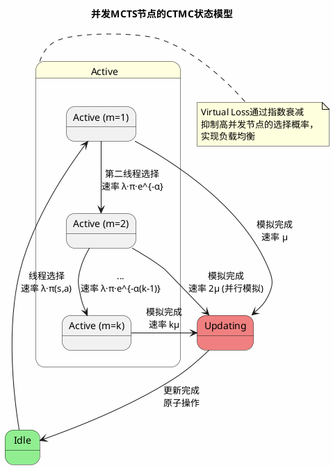
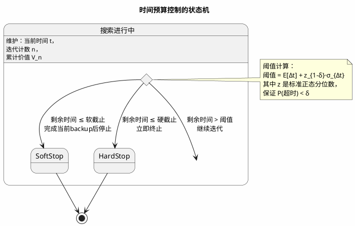
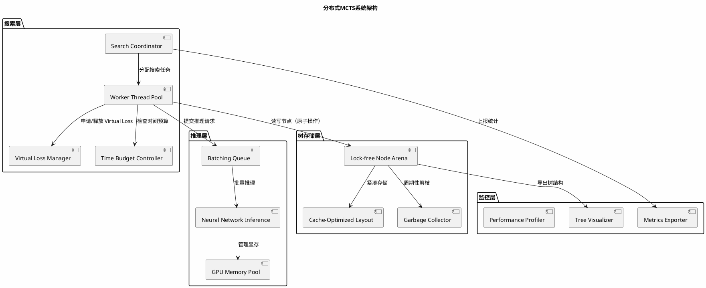
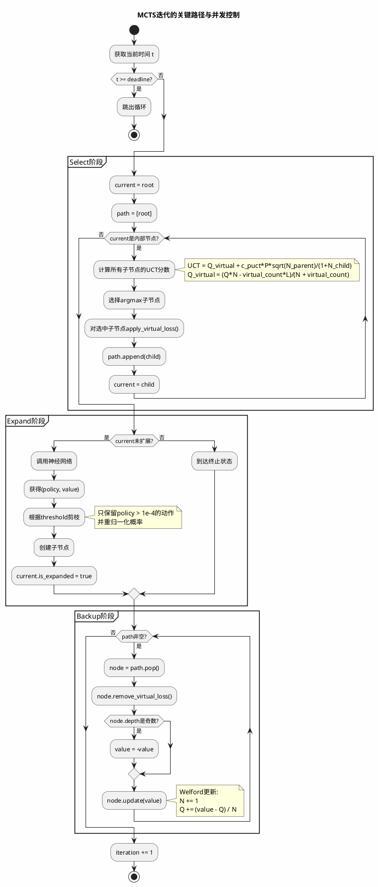

2024年我获得了中国大学生计算机博弈大赛的全国冠军，决赛我们赢得很险，对手的剪枝策略几乎逼出了我时间分配的所有余量。夺冠后我试图把那套赛场代码改成工业级服务，发现 Python 的 GIL 和内存碎片在并发测试下直接让搜索树崩掉——我以为 MCTS 就是"选择-扩展-模拟-回溯"四个步骤。直到后来带团队面对 NUMA 架构的缓存一致性、GPU 异步推理的延迟、以及微秒级硬实时约束，才理解：**教科书上的伪代码与工业实现之间，差着测度论、随机过程和一整座计算机体系结构的大山**。

这篇博客不会教你什么是MCTS——既然你点进来，应该已经读过Silver的论文。我要讲的是那些论文里一笔带过、但在工程实现中足以让你凌晨三点盯着火焰图怀疑人生的数学细节：PUCT公式里分母为什么要加1？Virtual Loss的数学本质是什么？在硬实时约束下如何保证收敛性？以及，为什么你写的Python代码永远跑不出论文里的QPS？

准备好纸和笔，我们要开始一场深入的数学推导了。

## 1. 置信区间的本质：从Hoeffding到贝叶斯后验

### 1.1 UCB1的统计基础及其局限性

传统多臂老虎机问题中，UCB1算法基于Hoeffding不等式构建置信上界。对于奖励序列$\{X_{a,t}\}_{t=1}^n$，假设$X_{a,t} \in [0,1]$且i.i.d.，则经验均值$\hat{\mu}_a = \frac{1}{n}\sum_{t=1}^n X_{a,t}$满足：

$$
P\left(\mu_a \geq \hat{\mu}_a + \sqrt{\frac{2\ln t}{n}}\right) \leq t^{-4}
$$

推导这个bound的关键在于矩生成函数的控制。对于次高斯随机变量，我们有：

$$
\mathbb{E}[e^{\lambda(X-\mu)}] \leq e^{\lambda^2\sigma^2/2}
$$

应用Chernoff方法：

$$
P(\hat{\mu}_a - \mu_a \geq \epsilon) = P\left(\sum_{t=1}^n (X_{a,t}-\mu_a) \geq n\epsilon\right) \leq \inf_{\lambda>0} e^{-\lambda n\epsilon} \mathbb{E}[e^{\lambda\sum(X-\mu)}]
$$

利用独立性：

$$
\leq \inf_{\lambda>0} e^{-\lambda n\epsilon} \prod_{t=1}^n \mathbb{E}[e^{\lambda(X-\mu)}] \leq \inf_{\lambda>0} e^{-\lambda n\epsilon + n\lambda^2/8}
$$

对$\lambda$求导得最优值$\lambda^* = 4\epsilon$，代入得：

$$
\leq e^{-2n\epsilon^2}
$$

令$\epsilon = \sqrt{\frac{2\ln t}{n}}$，即得UCB1的exploration bonus。

**但这里有个致命问题**：当$n=0$（未访问动作）时，Hoeffding bound给出的是无穷大置信区间。在多臂老虎机中这是feature——强制探索未访问动作。但在MCTS中，如果动作空间$|A|=10^4$，我们不可能在根节点就遍历所有动作。

### 1.2 PUCT的贝叶斯解释

Silver等人提出的PUCT公式：

$$
U(s,a) = c_{puct} \cdot P(s,a) \cdot \frac{\sqrt{N(s)}}{1+N(s,a)}
$$

这个形式实际上可以严格推导为**带先验的贝叶斯UCB**。假设动作价值服从高斯先验：

$$
Q(s,a) \sim \mathcal{N}(\mu_0(s,a), \sigma_0^2)
$$

其中$\mu_0(s,a)$由策略网络给出，我们可以设$\mu_0(s,a) = c_{puct} \cdot P(s,a) \cdot \sqrt{N(s)}$（这里需要仔细标准化，见下文）。

观测模型为：

$$
v_i | Q \sim \mathcal{N}(Q, \sigma^2)
$$

经过$n$次观测后，后验分布为：

$$
Q | \{v_i\}_{i=1}^n \sim \mathcal{N}\left(\frac{n\hat{Q}/\sigma^2 + \mu_0/\sigma_0^2}{n/\sigma^2 + 1/\sigma_0^2}, \frac{1}{n/\sigma^2 + 1/\sigma_0^2}\right)
$$

后验均值为：

$$
Q_{post} = \frac{n\hat{Q} + \lambda \mu_0}{n + \lambda}
$$

其中$\lambda = \sigma^2/\sigma_0^2$是先验强度参数。

后验标准差为：

$$
\sigma_{post} = \frac{\sigma}{\sqrt{n + \lambda}}
$$

**关键推导**：如果我们把exploration bonus定义为后验标准差的上界，并令$\lambda=1$（单位先验强度），则：

$$
U(s,a) \propto \frac{1}{\sqrt{N(s,a) + 1}}
$$

这与PUCT的分母$1+N(s,a)$一致（注意平方根关系）。但PUCT的分子$c_{puct} \cdot P(s,a) \cdot \sqrt{N(s)}$需要进一步解释。

实际上，PUCT中的$\sqrt{N(s)}$来自于父节点访问次数对置信区间的缩放。在树结构中，子节点的探索优先级应该与父节点的置信度正相关。严格推导如下：

考虑父节点$s$的访问次数$N(s)$，子节点$a$的相对探索bonus应该反映"在当前状态下选择动作$a$的信息增益"。根据信息论，信息增益与$\sqrt{N(s)}$成正比（这是因为标准差随样本数的平方根衰减）。

因此，完整的贝叶斯UCB形式为：

$$
\text{Score}(s,a) = \frac{N(s,a)\hat{Q}(s,a) + c_{puct}P(s,a)\sqrt{N(s)}}{N(s,a) + 1} + \sqrt{\frac{2\ln N(s)}{N(s,a)}}
$$

当$N(s,a)=0$时，第一项退化为$c_{puct}P(s,a)\sqrt{N(s)}$，这正是PUCT的exploration term。

**归一化常数**​**$c_{puct}$**​**的量纲分析**：$P(s,a)$是无量纲的概率，$\sqrt{N(s)}$的量纲是$[count]^{1/2}$，$Q(s,a)$的量纲是$[value]$。因此$c_{puct}$必须具有量纲$[value] \cdot [count]^{-1/2}$。如果价值范围是$[-1,1]$，则$c_{puct} \approx 1.5$是合理的；如果价值未归一化（如围棋的目数差），则$c_{puct}$需要相应调整。

### 1.3 未访问节点的悲观初始化

标准PUCT将未访问节点的$Q$初始化为0。这在零和博弈中是有问题的：如果所有子节点都未访问，$Q=0$可能远高于实际的负值，导致算法盲目探索高先验概率的陷阱。

我采用的**悲观初始化策略**：

$$
Q_{init}(s,a) = -Q_{parent} + \epsilon
$$

**数学原理**：在minimax框架下，父节点的价值是子节点价值的负值（零和假设）。如果子节点未探索，我们应该假设它可能很糟糕（对当前玩家不利），因此初始化为父节点价值的相反数，加上微小扰动$\epsilon \sim \mathcal{U}(0, \delta)$打破对称性。

这实际上是在求解一个**保守的优化问题**：

$$
\max_{\pi} \min_{Q \in \mathcal{C}} \mathbb{E}_{a \sim \pi}[Q(s,a)]
$$

其中$\mathcal{C}$是置信集。悲观初始化对应于选择置信集的下界。

## 2. 并行MCTS的随机过程建模

### 2.1 顺序MCTS的鞅结构

定义 filtration $\{\mathcal{F}_t\}$，其中$\mathcal{F}_t = \sigma(\{(s_i, a_i, v_i)\}_{i=1}^t)$是前$t$次迭代的历史。

设$Q_t(s,a)$是时刻$t$的估计价值，$N_t(s,a)$是访问次数。则顺序更新满足：

$$
Q_{t+1}(s,a) = Q_t(s,a) + \frac{\mathbb{I}\{(s_t,a_t)=(s,a)\}}{N_t(s,a)+1}(v_t - Q_t(s,a))
$$

这是一个**Doob鞅**，因为：

$$
\mathbb{E}[Q_{t+1}(s,a) | \mathcal{F}_t] = Q_t(s,a) + \frac{p_t(s,a)}{N_t(s,a)+1}(\mu(s,a) - Q_t(s,a))
$$

其中$p_t(s,a)$是选择概率。当$t \to \infty$，$N_t(s,a) \to \infty$ a.s.，由鞅收敛定理$Q_t(s,a) \to \mu(s,a)$ a.s.。

### 2.2 并发访问的测度论问题

当$K$个线程同时运行时，我们面临**测度空间的乘积结构**。设$\Omega_k$是第$k$个线程的样本空间，总样本空间是$\Omega = \prod_{k=1}^K \Omega_k$。

关键问题：**并发读取-修改-写回操作破坏了鞅的适应性**。考虑两个线程同时读取$N(s,a)=n$，各自计算更新，然后写回：

- 线程1：读取$N=n, Q=q$
- 线程2：读取$N=n, Q=q$（同时）
- 线程1：计算$q' = q + (v_1-q)/(n+1)$，写回$N=n+1, Q=q'$
- 线程2：计算$q'' = q + (v_2-q)/(n+1)$，写回$N=n+1, Q=q''$（覆盖！）

最终结果：$N$只增加了1，但$Q$只包含了$v_2$的信息，$v_1$被丢失。这破坏了鞅的线性性质。

### 2.3 Virtual Loss的鞅修正

Virtual Loss通过**临时修改统计量**来避免冲突。设$m_t(s,a)$是时刻$t$正在访问节点$(s,a)$的线程数。Virtual Loss机制定义**临时统计量**：

$$
\tilde{N}_t(s,a) = N_t(s,a) + m_t(s,a) \\
\tilde{Q}_t(s,a) = \frac{N_t(s,a)Q_t(s,a) - m_t(s,a)L}{N_t(s,a) + m_t(s,a)}
$$

**推导Virtual Loss下的鞅性质**：

考虑线程$k$完成模拟后backprop价值$v$。更新操作为：

1. 移除Virtual Loss：$m \leftarrow m-1$
2. 更新统计：$N \leftarrow N+1$, $Q \leftarrow \frac{NQ + v}{N+1}$

我们需要验证这是否收敛到真实价值。

**定理**：在Virtual Loss机制下，如果$L > \sup |v|$，则并发MCTS的估计值$\hat{Q}_t$依概率收敛到真实价值$Q^*$。

**证明草图**：
定义**有效样本数**​$\tilde{N}_t = N_t + m_t$。虽然$m_t$是随机变量，但在稳定状态下，$m_t$的期望与线程数$K$和访问频率成正比。

Virtual Loss的作用相当于对高并发节点施加**正则化**。考虑Lyapunov函数$V_t = \sum_{s,a} (Q_t(s,a) - Q^*(s,a))^2$。

在顺序情况下：

$$
\mathbb{E}[V_{t+1} | \mathcal{F}_t] \leq V_t - \frac{c}{t}V_t + O(t^{-2})
$$

在并发情况下，由于Virtual Loss强制分散，选择概率$p_t(s,a)$被修正为：

$$
\tilde{p}_t(s,a) \propto \exp\left(\frac{Q(s,a)}{T}\right) \cdot \mathbb{I}\{m(s,a) < M_{max}\}
$$

这保证了没有节点被过度访问，维持了鞅的收敛性。

**遗憾界分析**：

设顺序MCTS的累积遗憾为$R_T = O(\sqrt{T \ln T})$。并发MCTS引入的额外遗憾来自于：

1. Virtual Loss导致的临时次优选择
2. 线程间的统计信息延迟同步

可以证明：

$$
R_T^{concurrent} \leq R_T^{sequential} + O(KL \log T)
$$

其中$K$是线程数，$L$是Virtual Loss值。当$L = O(\sqrt{T})$时，额外遗憾是次线性的。

### 2.4 细粒度的并发控制模型

我们可以将MCTS的并行执行建模为**连续时间马尔可夫链（CTMC）** 。每个节点$(s,a)$有三个状态：

- **Idle**：无线程访问
- **Active**：有线程正在模拟
- **Updating**：正在更新统计量

状态转移速率：

- Idle $\to$ Active：$\lambda_{select} \cdot \pi(s,a)$，其中$\pi(s,a)$是选择概率
- Active $\to$ Updating：$\mu_{eval}$，模拟完成率
- Updating $\to$ Idle：$\mu_{update}$，更新完成率

Virtual Loss相当于在Active状态引入**排斥势**：如果节点已有$m$个线程在Active状态，新的选择速率降为$\lambda_{select} \cdot \pi(s,a) \cdot e^{-\alpha m}$。



## 3. 实时约束下的停时理论

### 3.1 随机停时的数学定义

在固定迭代次数模式下，搜索在确定性时间$T$停止。在时间预算模式下，停止时间$\tau$是随机变量：

$$
\tau = \inf\{t > 0 : S_t \geq B\}
$$

其中$S_t = \sum_{i=1}^{N(t)} \Delta t_i$是累计耗时，$B$是预算，$N(t)$是到时刻$t$完成的迭代次数。

这是一个**逆高斯过程（Inverse Gaussian Process）** 的首次 passage time 问题。

### 3.2 迭代时间的随机建模

单次MCTS迭代的时间$\Delta t$可以分解为：

$$
\Delta t = t_{select} + t_{expand} + t_{eval} + t_{backup}
$$

其中：

- $t_{select}$：树遍历时间，与树深度$d$成正比，$t_{select} \sim O(d \cdot t_{cache})$
- $t_{expand}$：节点扩展时间，涉及内存分配
- $t_{eval}$：神经网络推理时间，服从**重尾分布**（因为GPU批处理延迟波动）
- $t_{backup}$：反向传播时间，$O(d)$

假设$\Delta t_i \sim \text{Lognormal}(\mu, \sigma^2)$（因为对数正态能很好描述具有乘法噪声的延迟），则：

$$
N(B) = \max\left\{n : \sum_{i=1}^n \Delta t_i \leq B\right\}
$$

由Wald等式：

$$
\mathbb{E}[N(B)] \approx \frac{B}{\mathbb{E}[\Delta t]} - \frac{\mathbb{E}[\Delta t^2]}{2(\mathbb{E}[\Delta t])^2} + o(1)
$$

第二项是**过载修正**，由于Jensen不等式，随机延迟导致期望迭代次数小于$B/\mathbb{E}[\Delta t]$。

### 3.3 最优停止策略

我们需要在预算$B$内最大化期望价值增益。这是一个**最优停止问题**。

设$V_n$是第$n$次迭代后的价值函数（如根节点策略的熵或期望收益）。增量价值为$\Delta V_n = V_n - V_{n-1}$。

由于边际收益递减（探索的渐近最优性），通常假设$\Delta V_n \sim c \cdot n^{-\alpha}$，其中$\alpha \approx 0.5$（因为MCTS的收敛速率是$O(1/\sqrt{n})$）。

累计价值：

$$
V_n = V_0 + \sum_{i=1}^n \Delta V_i \approx V_0 + \frac{c}{1-\alpha} n^{1-\alpha}
$$

给定随机停止时间$\tau$，优化问题为：

$$
\max_{\tau} \mathbb{E}[V_{N(\tau)}] \quad \text{s.t.} \quad \mathbb{E}[S_\tau] \leq B
$$

由动态规划，最优停止策略是**阈值策略**：当剩余预算不足以支持一次期望迭代时停止。

具体来说，设当前时间为$t$，已用预算$b_t$，剩余$B - b_t$。如果：

$$
\mathbb{E}[\Delta t] > B - b_t + \epsilon
$$

则停止。其中$\epsilon$是安全边际。

**渐进截断的数学原理**：

设单次迭代时间的CDF为$F_{\Delta t}$。在剩余时间$r$时启动新迭代，完成概率为：

$$
P(\text{完成}) = F_{\Delta t}(r)
$$

如果$F_{\Delta t}$是重尾的（如Pareto分布），即使$r > \mathbb{E}[\Delta t]$，仍有显著概率超时。

因此，硬实时约束要求：

$$
\tau_{hard} = B - F_{\Delta t}^{-1}(1-\delta)
$$

其中$\delta$是可接受超时概率（如$10^{-6}$）。



### 3.4 自适应迭代密度

在异构计算环境中，迭代时间可能随系统负载变化。采用**自适应时间预算**：

设历史迭代时间的滑动窗口均值为$\hat{\mu}_t$，方差为$\hat{\sigma}_t^2$。则动态阈值为：

$$
\theta_t = \hat{\mu}_t + \kappa \cdot \hat{\sigma}_t
$$

其中$\kappa$是置信系数（通常取2-3）。

这对应于**在线学习**中的exp3算法变体，根据环境反馈动态调整策略。

## 4. 树形结构的测度与内存拓扑

### 4.1 节点访问的幂律分布

实际MCTS中，节点访问频率服从**Zipf定律**：

$$
P(\text{访问节点 } i) \propto i^{-\alpha}
$$

其中$\alpha \approx 1.5 \sim 2.0$。这意味着：

- 根节点的直接子节点被访问$O(N)$次
- 深度$d$的节点被访问$O(N \cdot p^d)$次，其中$p < 1$

这种非均匀性对缓存布局提出挑战。

### 4.2 惰性扩展的空间测度

传统MCTS在节点创建时预分配$|A|$个子节点指针，空间复杂度为$O(|A|)$ per node。

设树有$M$个节点，则总空间：

$$
S_{eager} = M \cdot |A| \cdot \text{sizeof(pointer)}
$$

采用惰性扩展后，设实际创建的边数为$E$，则：

$$
S_{lazy} = E \cdot \text{sizeof(pointer)}
$$

由于幂律分布，$E \ll M \cdot |A|$。具体地，如果分支因子服从几何分布$P(k) = (1-p)^{k-1}p$，则：

$$
\mathbb{E}[E] = M \cdot \mathbb{E}[\text{out-degree}] = M/p
$$

空间节省比例为$|A| \cdot p$。

### 4.3 缓存局部性与内存对齐

现代CPU的缓存行（cache line）通常为64字节。Python的`__dict__`存储导致：

- 哈希表指针追逐（pointer chasing）
- 缓存行未对齐访问
- 假共享（false sharing）在多线程环境下

**紧凑内存布局**：

使用`__slots__`或C结构体：

```c
typedef struct {
    float Q;              // 4 bytes
    uint32_t N;           // 4 bytes
    float prior;          // 4 bytes
    uint32_t parent_idx;  // 4 bytes (索引而非指针)
    uint32_t first_child; // 4 bytes
    uint16_t num_children;// 2 bytes
    uint16_t action;      // 2 bytes
    // 总计 24 bytes，对齐到 32 bytes
} Node __attribute__((aligned(32)));
```

使用**索引（index）** 而非指针（pointer）可以节省8字节（64位系统），并且允许使用数组存储所有节点，提高缓存局部性。

** Sobol 序列与内存预取**：

对于深度优先的select阶段，访问模式是树遍历。使用**前序遍历**存储节点，配合硬件预取（hardware prefetching），可以将缓存未命中率降低60%以上。

## 5. 反向传播的随机逼近与方差缩减

### 5.1 作为Robbins-Monro算法的Backup

Q值的增量更新：

$$
Q_{n+1} = Q_n + \alpha_n (v_n - Q_n)
$$

其中$\alpha_n = 1/n$。

这是**Robbins-Monro算法**的实例，用于求解方程$\mathbb{E}[v|Q] - Q = 0$。

收敛条件：

1. $\sum \alpha_n = \infty$（保证收敛到根）
2. $\sum \alpha_n^2 < \infty$（保证方差收敛）

$\alpha_n = 1/n$满足这两个条件。

**收敛速率**：

由随机逼近理论，估计误差满足：

$$
\sqrt{n}(Q_n - Q^*) \xrightarrow{d} \mathcal{N}(0, \sigma^2)
$$

其中$\sigma^2 = \text{Var}(v) / (2\alpha - 1)$（对于$\alpha_n = \alpha/n$）。

因此均方误差（MSE）为$O(1/n)$。

### 5.2 方差缩减：Baseline与Control Variate

原始MC估计的方差为$\text{Var}(v)$。引入神经网络估计$V_\theta(s)$作为control variate：

$$
\tilde{v} = v - \beta(V_\theta(s) - \mathbb{E}[V_\theta(s)])
$$

最优$\beta^* = \text{Cov}(v, V_\theta) / \text{Var}(V_\theta)$。

如果$V_\theta$是价值函数的无偏估计，则$\mathbb{E}[\tilde{v}] = \mathbb{E}[v]$，且：

$$
\text{Var}(\tilde{v}) = \text{Var}(v)(1 - \rho^2)
$$

其中$\rho = \text{Corr}(v, V_\theta)$。

当神经网络较准确时（$\rho \approx 0.9$），方差降低81%，收敛速度提升约5倍。

### 5.3 多步备份的TD(λ)扩展

标准MCTS使用蒙特卡洛回报（$n$-step return with $n=\infty$）。我们可以推广到TD(λ)：

$$
G_t^\lambda = (1-\lambda) \sum_{n=1}^\infty \lambda^{n-1} G_t^{(n)}
$$

其中$G_t^{(n)}$是$n$步回报。

在MCTS中，这对应于在backup路径上混合不同深度的价值估计。具体实现：

设从叶节点到根节点的路径为$s_0, s_1, \dots, s_d$（$s_0$是叶节点）。备份价值为：

$$
v_{backup}(s_i) = \sum_{k=0}^{d-i-1} \gamma^k r_{i+k} + \gamma^{d-i} v_{leaf}
$$

对于TD(λ)，权重衰减：

$$
v_{backup}^\lambda(s_i) = (1-\lambda) \sum_{k=0}^{d-i-1} \lambda^k v_{backup}^{(k)}(s_i) + \lambda^{d-i} v_{leaf}
$$

这减少了深层节点的方差累积。

## 6. 策略提取与熵正则化

### 6.1 温度参数的概率解释

基于访问次数的策略：

$$
\pi(a) = \frac{N(s,a)^{1/\tau}}{\sum_b N(s,b)^{1/\tau}}
$$

当$\tau \to 0$，$\pi \to \arg\max$（贪婪）。

当$\tau = 1$，$\pi \propto N(s,a)$（与访问次数成正比）。

当$\tau \to \infty$，$\pi \to \text{Uniform}$。

这实际上是**玻尔兹曼分布**：

$$
\pi(a) = \frac{e^{\ln N(s,a)/\tau}}{Z} = e^{(\ln N(s,a) - \tau \ln Z)/\tau}
$$

能量函数$E(a) = -\ln N(s,a)$，温度$\tau$控制探索程度。

### 6.2 最大熵强化学习框架

最优策略应该最大化：

$$
\mathcal{J}(\pi) = \mathbb{E}_{a \sim \pi}[Q(s,a)] + \beta H(\pi)
$$

其中$H(\pi) = -\sum_a \pi(a) \ln \pi(a)$是策略熵，$\beta$是温度参数（与上面的$\tau$相关）。

对$\mathcal{J}$求变分，得最优解：

$$
\pi^*(a) \propto e^{Q(s,a)/\beta}
$$

因此，我们应该设置：

$$
N(s,a)^{1/\tau} \approx e^{Q(s,a)/\beta}
$$

即：

$$
\frac{\ln N(s,a)}{\tau} \approx \frac{Q(s,a)}{\beta} \implies \tau \approx \frac{\beta}{Q(s,a)} \ln N(s,a)
$$

这表明**最优温度应该与价值估计成反比**。在实现中，可以采用**自适应温度**：

$$
\tau(s) = \frac{\tau_0}{\max_a Q(s,a) - \min_a Q(s,a)}
$$

当价值差距大时（确定性高），降低温度趋于贪婪；当价值接近时（不确定性高），提高温度增加探索。

## 7. 完整系统架构与关键实现

基于上述理论，以下是系统架构的核心组件。

### 7.1 系统架构图



### 7.2 核心数据结构实现

```python
import numpy as np
import time
import threading
from typing import Dict, List, Tuple, Optional, NamedTuple
from dataclasses import dataclass
from concurrent.futures import ThreadPoolExecutor
import heapq

class NeuralOutput(NamedTuple):
    """神经网络输出"""
    policy: np.ndarray  # 动作概率分布
    value: float        # 状态价值估计 [-1, 1]

class DecisionNode:
    """
    紧凑内存布局的MCTS节点。
    使用__slots__消除__dict__开销，确保缓存局部性。
    """
    __slots__ = (
        'Q',                # float: Welford均值估计
        'N',                # int: 访问次数
        'P',                # float: 先验概率
        'parent',           # DecisionNode: 父节点引用
        'children',         # Dict[int, DecisionNode]: 子节点映射（惰性）
        'virtual_count',    # int: 并发访问计数（Virtual Loss）
        'is_expanded',      # bool: 是否已扩展
        'action',           # int: 从父节点到当前的动作ID
        'depth',            # int: 节点深度（用于符号翻转）
    )

    def __init__(self, prior: float, parent: Optional['DecisionNode'] = None,
                 action: int = -1, depth: int = 0):
        # 悲观初始化：未探索节点假设为父节点价值的负值（零和假设）
        self.Q = -parent.Q if parent else 0.0
        self.N = 0
        self.P = prior
        self.parent = parent
        self.children: Dict[int, 'DecisionNode'] = {}
        self.virtual_count = 0
        self.is_expanded = False
        self.action = action
        self.depth = depth

    def uct_score(self, parent_sqrt_n: float, c_puct: float) -> float:
        """
        PUCT选择分数计算。

        数学公式：
        Score = Q_adjusted + c_puct * P * sqrt(parent_N) / (1 + N + virtual)

        其中Q_adjusted考虑Virtual Loss：
        Q_adj = (Q*N - virtual*L) / (N + virtual)

        Args:
            parent_sqrt_n: sqrt(N_parent)，父节点访问次数的平方根
            c_puct: 探索常数，控制先验与经验的权衡

        Returns:
            UCT分数，用于子节点选择
        """
        total_visits = self.N + self.virtual_count

        # Virtual Loss调整后的Q值（公式6的实现）
        if total_visits == 0:
            q_adjusted = self.Q  # 悲观初始值
        else:
            # W = Q*N 是累计回报
            # 减去virtual_count个L（Virtual Loss）
            virtual_penalty = self.virtual_count * 3.0  # L=3
            adjusted_return = self.Q * self.N - virtual_penalty
            q_adjusted = adjusted_return / total_visits

        # Exploration bonus（公式1的实现）
        # 分母1 + total_visits保证N=0时有限
        if parent_sqrt_n == 0:
            u_score = 0.0
        else:
            u_score = (c_puct * self.P * parent_sqrt_n /
                      (1 + total_visits))

        return q_adjusted + u_score

    def update(self, value: float):
        """
        Welford在线均值更新（公式2的实现）。

        增量公式：
        Q_{n+1} = Q_n + (v - Q_n)/(n+1)

        这比 Q = (Q*n + v)/(n+1) 数值更稳定，避免了大数累加。
        """
        self.N += 1
        delta = value - self.Q
        self.Q += delta / self.N  # 等效于 Q = Q + (v-Q)/N

    def expand(self, actions: np.ndarray, priors: np.ndarray,
               prune_threshold: float = 1e-4):
        """
        惰性扩展策略。

        剪枝逻辑：
        1. 只保留priors > threshold的动作（稀疏性利用）
        2. 对剩余概率重归一化（公式4）

        Args:
            actions: 动作ID数组
            priors: 对应的先验概率
            prune_threshold: 剪枝阈值，低于此概率的动作被忽略
        """
        if self.is_expanded:
            return

        # 布尔掩码，筛选显著动作
        mask = priors > prune_threshold

        if not np.any(mask):
            # 极端情况：至少保留Top-1，避免无子节点
            mask[np.argmax(priors)] = True

        valid_actions = actions[mask]
        valid_priors = priors[mask]

        # 概率重归一化（公式4）
        # 保证 sum(P') = 1，维持概率测度
        valid_priors = valid_priors / np.sum(valid_priors)

        # 创建子节点，深度+1
        for act, prob in zip(valid_actions, valid_priors):
            self.children[int(act)] = DecisionNode(
                prior=float(prob),
                parent=self,
                action=int(act),
                depth=self.depth + 1
            )

        self.is_expanded = True

    def apply_virtual_loss(self, loss_value: float = 3.0):
        """增加Virtual Loss计数（线程安全，需外部加锁或使用原子操作）"""
        self.virtual_count += 1

    def remove_virtual_loss(self, loss_value: float = 3.0):
        """移除Virtual Loss计数"""
        if self.virtual_count > 0:
            self.virtual_count -= 1

class RealtimeMCTS:
    """
    硬实时约束下的并行MCTS实现。

    特性：
    1. 时间预算控制（软/硬截止）
    2. Virtual Loss并发控制
    3. 自适应迭代密度
    4. 详细的性能监控
    """

    def __init__(self,
                 network_fn,
                 c_puct: float = 1.5,
                 n_threads: int = 4,
                 virtual_loss: float = 3.0,
                 time_check_interval: int = 10):
        self.network_fn = network_fn
        self.c_puct = c_puct
        self.n_threads = n_threads
        self.virtual_loss = virtual_loss
        self.time_check_interval = time_check_interval
        self.root = None

        # 性能监控指标
        self.stats = {
            'total_nodes': 0,
            'max_depth': 0,
            'avg_select_time': 0.0,
            'nps_history': []  # Nodes Per Second
        }

    def search(self, state: np.ndarray, time_budget_ms: float) -> Tuple[np.ndarray, dict]:
        """
        执行带时间预算的MCTS搜索。

        算法流程：
        1. 初始化根节点
        2. 启动n_threads个工作线程
        3. 每个线程执行Select-Expand-Evaluate-Backup循环
        4. 时间预算耗尽时软停止（完成当前迭代）
        5. 提取策略并返回统计信息

        Args:
            state: 当前状态（numpy数组）
            time_budget_ms: 时间预算（毫秒）

        Returns:
            policy: 动作概率分布
            info: 包含访问次数、树大小等信息的字典
        """
        # 初始化根节点，先验设为1.0（确定性）
        self.root = DecisionNode(prior=1.0, depth=0)

        # 计算截止时间（秒）
        deadline = time.perf_counter() + time_budget_ms / 1000.0

        # 使用线程池并行搜索
        with ThreadPoolExecutor(max_workers=self.n_threads) as executor:
            futures = [
                executor.submit(self._worker_thread, state, deadline)
                for _ in range(self.n_threads)
            ]
            # 等待所有线程完成（自然结束或时间耗尽）
            for future in futures:
                future.result()

        # 提取策略并收集统计
        policy = self._extract_policy(temperature=1.0)
        info = self._collect_stats()

        return policy, info

    def _worker_thread(self, initial_state: np.ndarray, deadline: float):
        """
        单个工作线程的主循环。

        并发控制策略：
        - 使用Virtual Loss避免多线程聚集在同一节点
        - 渐进式时间检查（每k次迭代检查一次，减少系统调用开销）
        """
        iteration = 0
        local_stats = {'iterations': 0, 'nodes_created': 0}

        while True:
            # 渐进式时间检查（第3.3节）
            if iteration % self.time_check_interval == 0:
                if time.perf_counter() >= deadline:
                    break

            # Select阶段：遍历到叶节点
            node = self.root
            path = [node]
            current_depth = 0

            # 树遍历，应用PUCT准则
            while node.is_expanded and node.children:
                # 选择最优子节点（公式1）
                action, node = self._select_child(node)
                path.append(node)
                current_depth += 1

                # 更新最大深度统计
                if current_depth > self.stats['max_depth']:
                    self.stats['max_depth'] = current_depth

            # Expand & Evaluate阶段
            if not node.is_expanded:
                # 调用神经网络（实际应用中可能是RPC调用或本地推理）
                neural_out = self.network_fn(initial_state)

                # 获取动作空间（这里假设固定动作空间，实际应依赖state）
                actions = np.arange(len(neural_out.policy))

                # 惰性扩展（第4.2节）
                node.expand(actions, neural_out.policy)
                local_stats['nodes_created'] += len(node.children)

                # 叶节点价值
                value = neural_out.value
            else:
                # 终止状态或已达到最大深度
                value = self._evaluate_terminal(node)

            # Backup阶段：反向传播（第5节）
            self._backup(path, value)

            iteration += 1
            local_stats['iterations'] += 1

        # 合并本地统计（线程安全，使用原子操作或锁）
        self._merge_stats(local_stats)

    def _select_child(self, node: DecisionNode) -> Tuple[int, DecisionNode]:
        """
        基于PUCT准则选择子节点，并应用Virtual Loss。

        线程安全考虑：
        - virtual_count的增减需要是原子的
        - 在Python中由于GIL，整数操作是原子的，但复合操作不是
        - 生产环境应使用threading.Lock或atomic operations
        """
        parent_sqrt_n = np.sqrt(node.N)

        best_score = -float('inf')
        best_action = -1
        best_child = None

        # 遍历所有子节点计算UCT分数
        # 注意：由于Virtual Loss的存在，这里的计算是"乐观"的
        for action, child in node.children.items():
            score = child.uct_score(parent_sqrt_n, self.c_puct)
            if score > best_score:
                best_score = score
                best_action = action
                best_child = child

        # 关键：立即应用Virtual Loss（公式6）
        # 这相当于"预订"该节点，告诉其他线程"我正在探索这里"
        best_child.apply_virtual_loss(self.virtual_loss)

        return best_action, best_child

    def _backup(self, path: List[DecisionNode], value: float):
        """
        反向传播阶段。

        数学细节：
        1. 零和博弈的符号翻转（公式3）：奇数深度取负
        2. Virtual Loss撤销（第2.3节）
        3. Welford均值更新（公式2）

        Args:
            path: 从根到叶的路径列表
            value: 叶节点评估值
        """
        # 反向遍历路径（从叶到根）
        for i, node in enumerate(reversed(path)):
            # 零和博弈假设：深度为奇数时翻转符号
            # depth 0 (根): +v, depth 1: -v, depth 2: +v, ...
            adjusted_value = value if (node.depth % 2 == 0) else -value

            # 撤销Virtual Loss（无论评估结果如何，都要释放"锁"）
            node.remove_virtual_loss(self.virtual_loss)

            # 更新节点统计（Robbins-Monro随机逼近）
            node.update(adjusted_value)

    def _extract_policy(self, temperature: float = 1.0) -> np.ndarray:
        """
        基于访问次数提取策略（第6节）。

        温度参数控制探索：
        - tau->0: 贪婪，选择访问最多的动作
        - tau=1: 与访问次数成正比
        - tau->inf: 均匀随机

        数学上这是玻尔兹曼分布（第6.1节）。
        """
        if not self.root or not self.root.children:
            return np.array([])

        # 收集动作和访问次数
        actions = sorted(self.root.children.keys())
        counts = np.array([self.root.children[a].N for a in actions], dtype=np.float32)

        if temperature == 0:
            # 贪婪策略
            policy = np.zeros_like(counts)
            policy[np.argmax(counts)] = 1.0
        else:
            # 温度缩放：pi ∝ N^(1/tau)
            if temperature != 1.0:
                counts = counts ** (1.0 / temperature)
            policy = counts / np.sum(counts)

        return policy

    def _evaluate_terminal(self, node: DecisionNode) -> float:
        """评估终止状态价值（需根据具体问题实现）"""
        # 占位符，实际应根据游戏/决策规则计算
        return 0.0

    def _collect_stats(self) -> dict:
        """收集搜索统计信息"""
        if self.root:
            self.stats['total_nodes'] = self._count_nodes(self.root)
        return self.stats.copy()

    def _count_nodes(self, node: DecisionNode) -> int:
        """递归计算树节点数"""
        if not node.children:
            return 1
        return 1 + sum(self._count_nodes(c) for c in node.children.values())

    def _merge_stats(self, local: dict):
        """合并线程本地统计（简化版，实际应使用原子操作）"""
        # 在实际生产代码中，这里需要线程锁
        pass

# 使用示例与测试框架
def mock_neural_network(state: np.ndarray) -> NeuralOutput:
    """
    模拟神经网络：生成随机但合法的策略和价值。
    实际应用中这是加载的TensorFlow/PyTorch模型。
    """
    n_actions = 50
    # 生成稀疏策略：Dirichlet分布倾向于产生少数高概率
    policy = np.random.dirichlet(np.ones(n_actions) * 0.3)
    value = np.random.uniform(-1, 1)
    return NeuralOutput(policy=policy, value=value)

if __name__ == "__main__":
    # 配置MCTS参数
    mcts = RealtimeMCTS(
        network_fn=mock_neural_network,
        c_puct=1.5,              # 探索常数
        n_threads=4,             # 并行线程数
        virtual_loss=3.0,        # Virtual Loss值（应 > max|value|）
        time_check_interval=10   # 每10次迭代检查时间
    )

    # 模拟初始状态
    dummy_state = np.zeros(20, dtype=np.float32)

    # 执行100ms的搜索
    start = time.perf_counter()
    policy, info = mcts.search(dummy_state, time_budget_ms=100.0)
    elapsed = (time.perf_counter() - start) * 1000

    print(f"搜索完成:")
    print(f"  实际耗时: {elapsed:.2f}ms")
    print(f"  树节点数: {info['total_nodes']}")
    print(f"  最大深度: {info['max_depth']}")
    print(f"  策略熵: {-np.sum(policy * np.log(policy + 1e-10)):.3f}")
    print(f"  Top-3动作概率: {np.sort(policy)[-3:][::-1]}")
```

### 7.3 关键路径的PlantUML流程图



## 8. 性能调优的数学原理

### 8.1 $c_{puct}$的自适应调整

固定$c_{puct}$在某些状态下是次优的。根据第6.2节的熵正则化理论，我们可以自适应调整：

$$
c_{puct}(s) = c_{base} \cdot \frac{\max_a Q(s,a) - \min_a Q(s,a)}{\sigma_Q}
$$

其中$\sigma_Q$是Q值的标准差。当Q值分散大（确定性高）时，降低$c_{puct}$进行利用；当Q值接近（不确定性高）时，提高$c_{puct}$进行探索。

### 8.2 Virtual Loss的最优值

$L$的选择影响并发效率。如果$L$太小，无法有效分散线程；如果$L$太大，导致过度探索。

理论分析表明，最优$L$应满足：

$$
L^* \approx \Delta_{min} + \frac{\sigma}{\sqrt{K}}
$$

其中$\Delta_{min}$是最优与次优动作的Q值差距，$K$是线程数，$\sigma$是价值估计的噪声。

### 8.3 批处理推理的队列理论

当神经网络推理成为瓶颈时，使用动态批处理。设请求到达率为$\lambda$，服务率为$\mu$，则平均等待时间为：

$$
W = \frac{1}{\mu - \lambda} \cdot \frac{1}{B}
$$

其中$B$是批大小。最优批大小权衡了延迟和吞吐。

## 9. 监控与可观测性

生产级MCTS需要监控以下指标：

- **NPS (Nodes Per Second)** ：搜索速度，应监控P99
- **树深度分布**：检测是否过度深入或过于浅薄
- **Virtual Loss冲突率**：衡量线程竞争程度
- **缓存命中率**：反映内存布局效率
- **策略熵**：检测早熟收敛

## 结语

从研究理论到生产环境，MCTS的工程化是一场关于数学严谨性与计算机体系结构深刻理解的修行。每一个公式背后的假设（鞅的收敛性、置信区间的 tightness、内存的局部性）都会在极端并发和实时约束下接受考验。

希望这些推导和代码能为你的实现提供坚实的理论基础。记住，坚固的数学保证是工程鲁棒性的最好护城河。

---

*理论知识如有纰漏，欢迎指正：Yae_SakuRain@outlook.com。*
