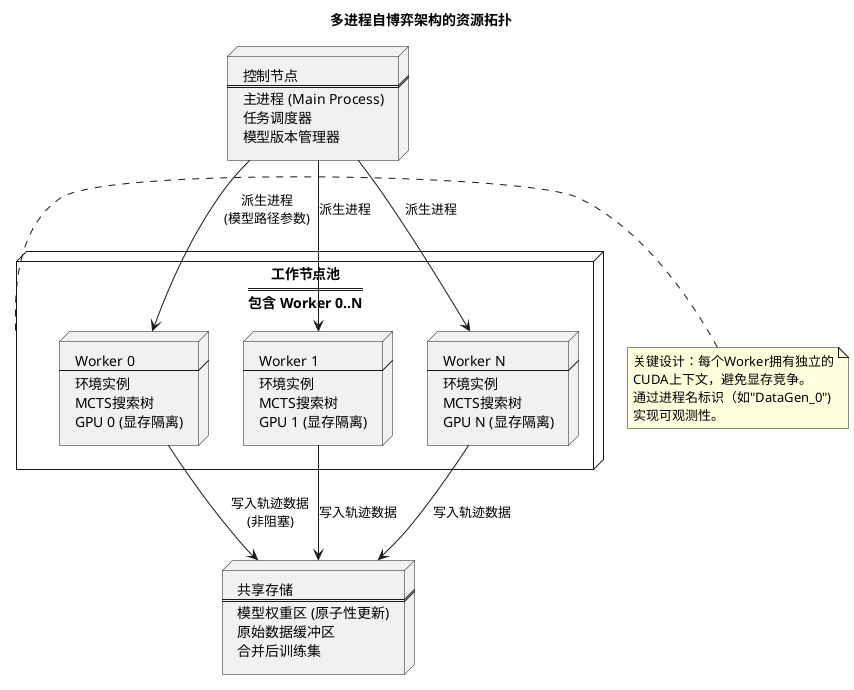
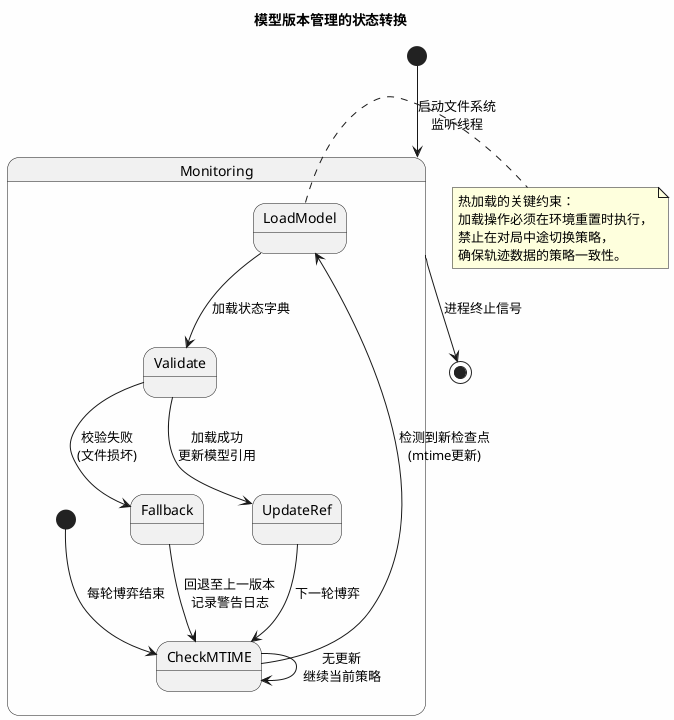
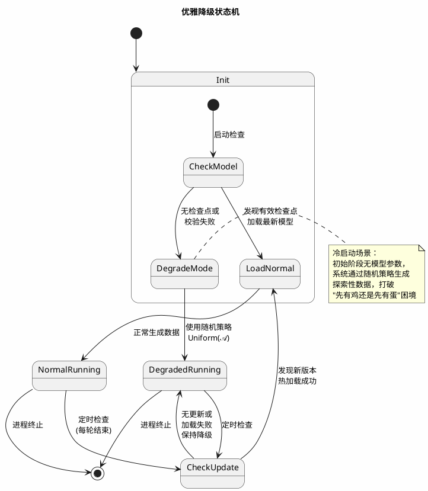
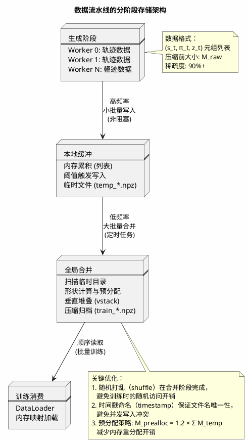
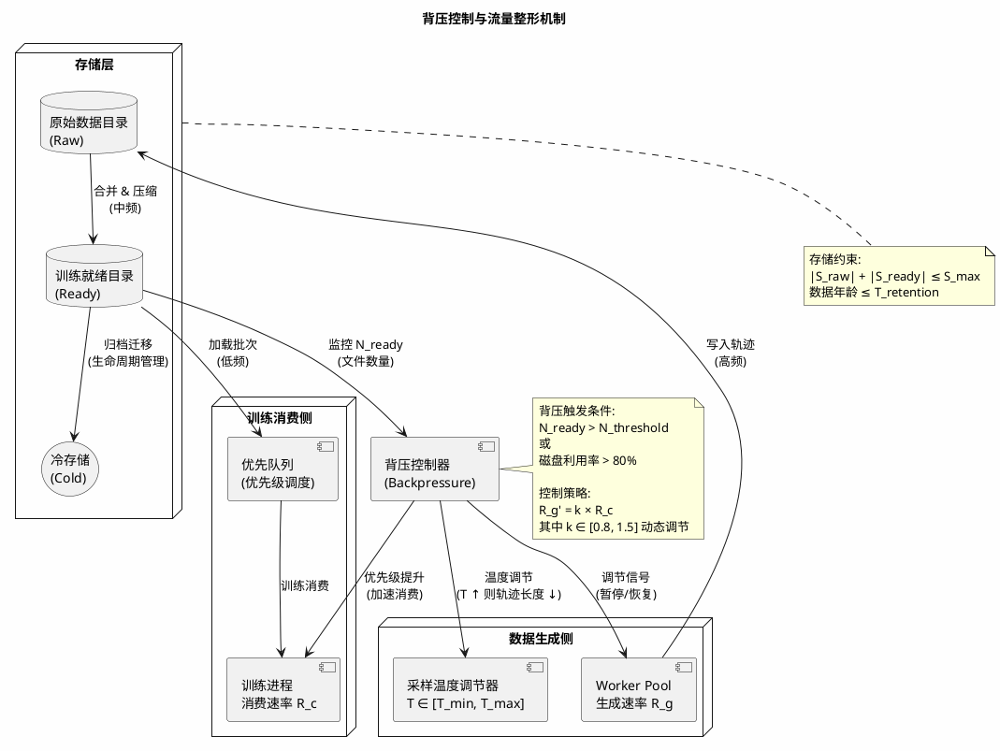
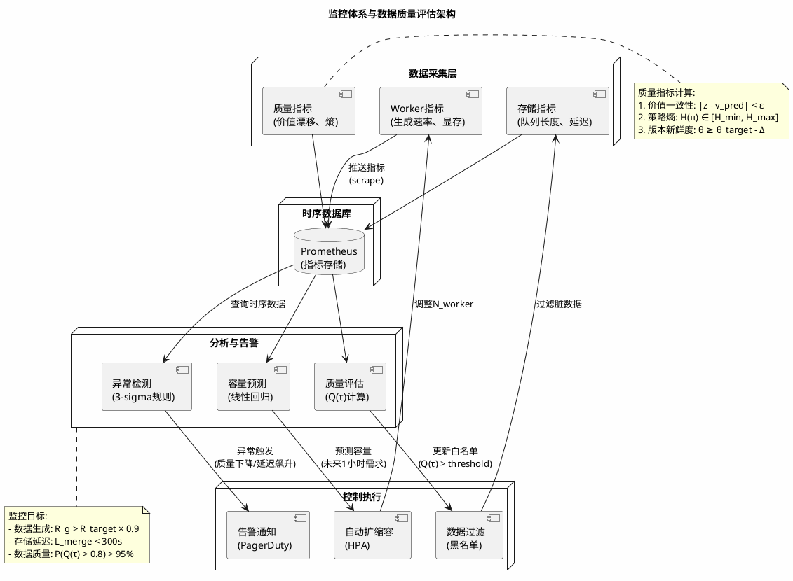

在基于自我博弈（Self-Play）的强化学习范式中，数据生成的质量与吞吐量直接决定了策略网络的收敛上限。与监督学习不同，自博弈系统是一个**数据生产与模型演化紧耦合**的动态过程：新生成的数据必须基于当前最新策略，而策略的更新又依赖于历史自博弈数据。这种递归依赖关系在分布式环境下引入了独特的工程挑战——如何在多进程并行生成场景下保证模型版本一致性？如何处理TB级稀疏特征数据的序列化开销？如何防止数据生产速率远超消费速率导致的存储溢出？

本文基于我们在大规模离散决策空间中的工程实践，探讨自博弈数据流水线的分布式架构设计，重点阐述多进程任务调度、模型版本的热加载机制，以及面向高维稀疏特征的存储优化策略。

```plantuml
@startuml
skinskinparam backgroundColor #FEFEFE
skinparam defaultFontName Latin Modern Roman

title 自博弈数据流水线端到端架构概览

node "训练集群" as Training {
    component "策略网络\nPolicy Network" as Policy
    component "优化器\nAdam/LAMB" as Optimizer
    database "经验回放缓冲区\nReplay Buffer" as Replay
}

node "数据生成集群" as Generation {
    node "控制平面\nControl Plane" as Control {
        component "任务调度器\nScheduler" as Scheduler
        component "版本控制器\nVersion Ctrl" as Version
        component "背压调节器\nBackpressure" as Backpressure
    }
    
    node "工作进程池\nWorker Pool" as Workers {
        component "Worker 0\n(MCTS + GPU)" as W0
        component "Worker 1\n(MCTS + GPU)" as W1
        component "Worker N\n(MCTS + GPU)" as WN
    }
}

node "存储层" as Storage {
    database "热数据\nNVMe SSD\n原始轨迹" as Hot
    database "温数据\n合并后训练集" as Warm
    database "冷数据\n对象存储 S3\n归档 & 评估" as Cold
}

Policy --> Version : 模型检查点\n(周期性保存)
Version --> Workers : 热加载通知\n(原子性更新)

W0 --> Hot : 写入轨迹\n(NPZ格式)
W1 --> Hot : 写入轨迹
WN --> Hot : 写入轨迹

Hot --> Warm : 批量合并\n(全局随机打乱)
Warm --> Replay : 训练消费

Warm --> Cold : 生命周期管理\n(自动归档)

Backpressure --> Workers : 速率控制\n(动态调节)

Scheduler --> Workers : 进程生命周期管理

note right of Workers
并行度: N ∝ (GPU显存容量 / 单进程显存占用)
吞吐量: Σ T_i ≈ N × (轨迹长度 / MCTS模拟时间)
end note

note bottom of Storage
存储压力控制:
Σ|D_t| ≤ C_max (背压阈值)
R_generate ≤ k × R_consume (k≈1.2~1.5)
end note

@enduml
```

## 1. 数据生成的并行化拓扑

### 1.1 进程级并行的必要性

现代强化学习系统的数据需求通常达到**每日百万级状态转移（state transitions）**  。设目标吞吐量为 $\lambda^*$（单位：transitions/second），单进程吞吐量受Python全局解释器锁（GIL）限制为 $\lambda_{single}$，则理论最小进程数为：

$$
N_{min} = \left\lceil \frac{\lambda^*}{\lambda_{single}} \right\rceil
$$

在实际观测中，$\lambda_{single}$ 通常受限于MCTS（蒙特卡洛树搜索）的CPU密集度，而非神经网络前向传播。单进程在标准服务器（Intel Xeon Gold 6248, 20核）上通常只能达到 $50 \sim 100$ transitions/sec，对于需要 $10^5$ transitions/sec 的大规模系统，必须采用多进程架构。

我们采用**多进程架构（multiprocessing）**  而非多线程，以绕过GIL并实现真正的并行计算。然而，朴素的多进程实现会导致灾难性的资源竞争：多个进程同时尝试加载同一神经网络检查点至同一块GPU，触发CUDA显存不足（OOM）错误。

### 1.2 显存分片与进程隔离策略

我们的解决方案是**显存硬隔离**：为每个工作进程分配独立的GPU设备或显存上下文。设单GPU显存容量为 $M_{gpu}$，策略网络参数规模为 $|\theta|$，前向传播激活值为 $A$，MCTS模拟数为 $N_{mcts}$，则单个工作进程的理论显存占用为：

$$
M_{proc} \approx \underbrace{2|\theta|}_{\text{参数+梯度}} + \underbrace{N_{mcts} \cdot B \cdot D \cdot H}_{\text{搜索树节点}} + \underbrace{B \cdot C \cdot H \cdot W \cdot 4}_{\text{激活值缓存}}
$$

其中 $B$ 为批处理大小，$D$ 为网络深度，$H, W, C$ 分别为特征图高、宽、通道数。单GPU可容纳的进程数为：

$$
N_{proc}^{max} = \left\lfloor \frac{M_{gpu} - M_{system}}{M_{proc}} \right\rfloor
$$

在配置层面，通过`CUDA_VISIBLE_DEVICES`​环境变量或`torch.cuda.set_device()`实现进程级的GPU绑定。

更精细的控制采用**计算-存储分离**架构：

- **推理节点**：配备GPU，负责策略网络的前向传播与MCTS模拟
- **数据节点**：仅使用CPU，负责环境状态转移与数据序列化

这种拓扑允许在单张GPU上通过时间片轮转（time-slicing）服务多个推理进程，只要批处理大小（batch size）与网络深度控制在显存预算内。



### 1.3 进程命名的工程意义

在多进程调试中，**可观测性（Observability）**  至关重要。我们为每个工作进程分配语义化名称（如基于开发者姓名的标识符），这不仅便于在`nvidia-smi`​或`htop`中识别进程，更重要的是在日志聚合时能够追踪特定进程的数据质量异常。

设进程标识符为 $\text{PID}_i$，语义化标签为 $\text{Label}_i$，则日志记录格式为：

$$
\text{LogEntry} = \{ \text{timestamp}, \text{Label}_i, \text{GPU}_j, \text{trajectory\_id}, \text{metrics} \}
$$

当某个进程生成的轨迹出现数值异常（如价值估计漂移）时，命名标签允许我们快速定位到具体的计算节点与GPU设备。

```plantuml
@startuml
skinparam backgroundColor #FEFEFE
skinparam defaultFontName Latin Modern Roman

title 进程可观测性与故障定位流程

start

:生成轨迹数据;
:计算统计指标\n(平均价值、动作熵、回报);

if (|z - z_expected| > ε?) then (异常检测)
    :记录异常日志\n附进程标签 Label_i;
    :查询该进程历史数据;
    
    if (异常频率 > threshold?) then (系统性故障)
        :定位到具体 GPU_j;
        :执行显存诊断;
        if (显存错误?) then (硬件故障)
            :隔离 GPU_j;
            :重启 Worker 进程\n迁移至备用设备;
        else (软件故障)
            :重置 CUDA 上下文;
            :重新加载模型;
        endif
    else (偶发异常)
)
        :标记数据为脏数据;
        :加入过滤黑名单;
    endif
else (正常)
    :提交至存储;
endif

stop

@enduml
```

## 2. 模型版本的热加载与一致性保障

### 2.1 动态模型切换的必然性

自博弈系统的核心特性是**策略的非平稳性（non-stationarity）** ：随着训练进行，检查点（checkpoint）持续更新。工作进程不能仅在启动时加载模型，而必须支持**热加载（hot-loading）** 。

设策略网络在第 $t$ 次迭代时的参数为 $\theta_t$，生成的数据分布为 $\mathcal{D}_t$。若工作进程在生成轨迹中途从 $\theta_t$ 切换至 $\theta_{t+1}$，则轨迹 $\tau = (s_1, a_1, \dots, s_T)$ 内的策略分布将变为非平稳混合：

$$
\pi_{\text{mixed}}(a|s) = \begin{cases} 
\pi_{\theta_t}(a|s) & \text{if } k < k_{switch} \\
\pi_{\theta_{t+1}}(a|s) & \text{if } k \geq k_{switch}
\end{cases}
$$

这违反了策略迭代中**轨迹内策略一致性**的基本假设，导致价值估计的方差增大。我们引入**回合级原子性**约束：仅在环境重置（reset）时检查并加载模型，确保单条完整轨迹的策略一致性。

策略版本差异的度量采用KL散度：

$$
D_{KL}(\pi_{\theta_t} || \pi_{\theta_{t+1}}) = \sum_{a \in \mathcal{A}} \pi_{\theta_t}(a|s) \log \frac{\pi_{\theta_t}(a|s)}{\pi_{\theta_{t+1}}(a|s)}
$$

当 $D_{KL} > \delta_{threshold}$ 时，标记为显著策略更新，触发强制模型重载。

### 2.2 文件系统的原子性操作

模型保存与加载的竞态条件（race condition）是常见的故障源。我们采用**写后重命名（write-and-rename）**  模式保证原子性：

1. 将新模型写入临时文件（如`model.tmp.pth`）
2. 执行`fsync`确保数据落盘
3. 原子重命名为目标文件名（`model.pth`）

原子性条件可形式化为：对于加载操作 $L$ 和保存操作 $S$，必须满足：

$$
\forall t, \text{State}(L_t) \in \{ \text{旧版本}, \text{新版本} \}, \quad \text{不存在中间状态}
$$

在Python实现中，利用`torch.load`​的`map_location`参数实现跨设备（CPU/GPU）的灵活加载，避免模型保存时的设备依赖。



### 2.3 缺失回退与优雅降级

当模型目录为空（如初始训练阶段或磁盘故障）时，系统不应崩溃，而应**优雅降级（graceful degradation）**  至随机策略网络（random network）。

设正常策略为 $\pi_\theta$，随机策略为 $\pi_{\text{random}}(a|s) = \frac{1}{|\mathcal{A}|}$。降级后的数据生成过程为：

$$
\pi_{\text{fallback}}(a|s) = \begin{cases} 
\pi_\theta(a|s) & \text{if } \theta \text{ 可用} \\
\frac{1}{|\mathcal{A}|} & \text{否则}
\end{cases}
$$

这为冷启动（cold start）提供了容错能力——首个工作进程生成随机探索数据，后续训练迭代逐步提升策略质量。



## 3. 高维稀疏特征的序列化优化

### 3.1 数据格式的时空权衡

自博弈生成的原始数据包含三个核心张量：

- **状态特征** $\mathbf{s} \in \mathbb{R}^{T \times C \times H \times W}$（时序堆叠的特征平面）
- **策略目标** $\boldsymbol{\pi} \in \mathbb{R}^{T \times |\mathcal{A}|}$（MCTS访问计数归一化后的分布）
- **价值目标** $z \in \mathbb{R}^{T}$（回合最终回报的时序传播值）

其中$T$为轨迹长度，$|\mathcal{A}|$为动作空间维度。对于高维动作空间（$|\mathcal{A}| > 10^4$），策略矩阵的稀疏度定义为：

$$
\text{sparsity}(\boldsymbol{\pi}) = 1 - \frac{\| \boldsymbol{\pi} \|_0}{T \cdot |\mathcal{A}|}
$$

其中 $\| \cdot \|_0$ 表示L0范数（非零元素计数）。在实际观测中，稀疏度可达90%以上（大量动作的访问计数为零）。

我们评估了多种序列化方案，压缩效率通过压缩比衡量：

$$
\text{Compression Ratio} = \frac{\text{Uncompressed Size}}{\text{Compressed Size}}
$$

- **HDF5**：支持压缩与分块，但元数据开销大，并发写入性能差（压缩比 $3:1 \sim 5:1$）
- **TFRecord**：需引入TensorFlow依赖，与PyTorch生态兼容性差（压缩比 $4:1 \sim 6:1$）
- **NPZ（NumPy Zip）** ：原生支持PyTorch张量转换，压缩比可调，文件级原子性（压缩比 $8:1 \sim 12:1$ 针对稀疏策略）

最终选择**分片式NPZ**作为存储格式，基于以下工程考量：

1. **零拷贝加载**：`np.load`可直接内存映射（mmap）大文件，避免重复拷贝
2. **压缩效率**：`savez_compressed`使用zlib，对稀疏策略矩阵的压缩率可达10:1
3. **语言无关性**：NumPy格式可被C++/Rust数据处理管道直接读取

### 3.2 内存布局与分块合并

单个工作进程生成的数据量可能较小（如每日GB级），但多进程聚合后达到TB级。简单的文件追加（append）在NumPy中不可行（NPZ为只读归档格式），因此采用**两阶段合并策略**：

**阶段一（本地缓冲）** ：每个工作进程将多轮对局数据缓存在内存列表中，达到阈值（如1000条轨迹）后写入临时NPZ文件。内存占用估计：

$$
M_{buffer} = N_{traj} \cdot T_{avg} \cdot (C \cdot H \cdot W + |\mathcal{A}| + 1) \cdot 4 \text{ bytes}
$$

**阶段二（全局合并）** ：主进程定期扫描临时文件目录，通过`np.vstack`​（垂直堆叠）将多个小型NPZ合并为大型训练集。关键优化在于**预分配与分块写入**：先计算总数据形状，预分配连续内存块，避免`vstack`过程中的多次内存重分配。

合并后的存储效率：

$$
\eta = \frac{\text{有效数据大小}}{\text{物理存储大小}} = \frac{\sum_{i=1}^{N} |\tau_i|}{M_{filesystem}}
$$

其中 $|\tau_i|$ 为轨迹 $i$ 的实际数据量，$M_{filesystem}$ 为文件系统分配的物理空间。



### 3.3 随机化与数据分布

在合并阶段引入**全局随机打乱（global shuffling）**  至关重要。若按时间顺序简单拼接数据，训练时会引入时序相关性（temporal correlation），破坏随机梯度下降（SGD）的独立同分布（i.i.d.）假设。

假设训练集包含 $N$ 条轨迹，简单顺序拼接的数据分布为：

$$
\mathcal{D}_{ordered} = \{ \tau_1, \tau_2, \dots, \tau_N \}, \quad \tau_i \sim \pi_{\theta_{t_i}}
$$

其中 $t_i$ 表示生成时间戳。由于策略迭代，$t_i < t_j \Rightarrow \theta_{t_i} \neq \theta_{t_j}$，导致分布随时间漂移。

全局随机打乱通过重排索引 $\sigma: \{1,\dots,N\} \to \{1,\dots,N\}$ 生成新分布：

$$
\mathcal{D}_{shuffled} = \{ \tau_{\sigma(1)}, \tau_{\sigma(2)}, \dots, \tau_{\sigma(N)} \}
$$

这确保了训练批次中包含来自不同策略版本的数据，平滑策略分布的漂移。数据分布的熵作为随机化质量的指标：

$$
H(\mathcal{D}) = -\sum_{i=1}^{N} p(\tau_i) \log p(\tau_i)
$$

其中 $p(\tau_i)$ 为轨迹 $i$ 的采样概率。均匀采样时 $H(\mathcal{D}) = \log N$，达到最大熵。

## 4. 背压控制与流量整形

### 4.1 生成-消费速率不匹配问题

自博弈数据生成是计算密集型（GPU-bound），而训练是数据密集型（IO-bound）。设生成速率为 $R_g$（transitions/sec），消费速率为 $R_c$（transitions/sec），则存储积压随时间增长：

$$
S(t) = \int_0^t (R_g(\tau) - R_c(\tau)) d\tau + S_0
$$

当 $R_g > R_c$ 持续成立时，存储系统将面临**无限增长风险（unbounded growth）** ，$S(t) \to \infty$。我们引入**背压机制（backpressure）**  进行流量整形，约束条件为：

$$
\forall t, \quad S(t) \leq S_{max}
$$

其中 $S_{max}$ 为存储容量上限。

### 4.2 基于文件系统的信号量

采用**双缓冲目录架构**：

- **原始数据目录（Raw）** ：工作进程持续写入
- **训练就绪目录（Ready）** ：合并后的数据待训练消费

主进程监控`Ready`目录的文件数量 $N_{ready}$。当积压超过阈值 $N_{threshold}$ 时，触发背压：

$$
\text{Backpressure} = \begin{cases} 
\text{Normal} & \text{if } N_{ready} < N_{threshold} \\
\text{Throttled} & \text{if } N_{ready} \geq N_{threshold}
\end{cases}
$$

在节流（Throttled）状态下，系统采取以下措施：

1. 暂停派生新的工作进程
2. 降低现有进程的采样温度（增加随机性以减少单条轨迹长度）
3. 提高训练进程的优先级，增加数据消费速率

动态调节的目标是维持生成-消费比接近1：$\lim_{t \to \infty} \frac{R_g(t)}{R_c(t)} = 1$  



### 4.3 生命周期管理与冷数据归档

训练完成的数据文件（已遍历过网络）不应立即删除，而应迁移至**冷存储（cold storage）**  作为回放缓冲区（replay buffer）或用于后续的离线策略评估（off-policy evaluation）。

数据生命周期状态转移：

$$
\text{Hot} \xrightarrow{t > T_1} \text{Warm} \xrightarrow{t > T_2} \text{Cold} \xrightarrow{t > T_3} \text{Deleted}
$$

其中 $T_1, T_2, T_3$ 为时间阈值。我们通过修改时间戳（mtime）标记文件年龄，定期将老旧数据归档至对象存储（如S3），释放本地NVMe SSD空间给新生成数据。

## 5. 可观测性与数据质量监控

### 5.1 轨迹级别的元数据追踪

每个生成的NPZ文件附带元数据（metadata），记录：

- **策略版本哈希**：生成该数据时使用的模型检查点校验和 $H(\theta_t)$
- **环境配置参数**：状态空间维度、奖励函数版本等 $\phi_{env}$
- **统计摘要**：轨迹平均长度 $\bar{T}$、价值估计分布 $\mu_z, \sigma_z$、动作熵 $H(\pi)$

动作熵的计算公式：

$$
H(\pi) = -\frac{1}{T} \sum_{t=1}^{T} \sum_{a \in \mathcal{A}} \pi(a|s_t) \log \pi(a|s_t)
$$

这些元数据允许我们在训练阶段进行**细粒度的数据切片**——例如，仅使用特定策略版本之后生成的数据，或排除价值估计异常（如$|z| > z_{max}$，超出理论边界）的污染数据。

数据质量评分函数：

$$
Q(\tau) = \alpha \cdot \text{clip}(\frac{1}{|z - \hat{v}|}, 0, 1) + \beta \cdot \frac{H(\pi)}{\log |\mathcal{A}|} + \gamma \cdot \mathbb{1}_{\text{version} \geq \theta_{min}}
$$

其中 $\hat{v}$ 为价值网络估计，$\alpha, \beta, \gamma$ 为权重系数。

### 5.2 数据管道的健康指标

核心监控指标包括：

- **生成吞吐量**：$\lambda_g = \frac{\Delta N_{transitions}}{\Delta t}$（transitions/sec）
- **合并延迟**：$L_{merge} = T_{write} - T_{generation}$（秒）
- **存储压力**：$\frac{dS}{dt}$（磁盘占用增长率）
- **数据质量分**：$\bar{Q} = \frac{1}{N} \sum_{i=1}^{N} Q(\tau_i)$

这些指标通过Prometheus或类似系统暴露，触发自动扩缩容（auto-scaling）决策——当生成吞吐量低于训练需求时，自动增加工作进程；当存储压力过高时，触发紧急归档或暂停生成。



## 结论

构建生产级的自博弈数据流水线，需要在并行计算、存储优化与流量控制之间进行精细的架构权衡。进程级显存隔离保证了生成的稳定性，热加载机制确保了策略迭代的数据一致性，而分片式NPZ存储则在压缩效率与读取性能之间取得了平衡。

未来的优化方向包括：引入**流式处理（streaming processing）**  替代批量合并，使用Apache Arrow或Ray Data实现内存中的零拷贝（zero-copy）数据传递；以及**自适应生成策略**，根据当前训练损失动态调整自博弈的探索强度（exploration intensity），实现数据生成与模型优化的闭环控制。

数据生成与策略优化的闭环控制可建模为联合优化问题：

$$
\min_{\theta, \pi_{gen}} \mathcal{L}_{train}(\theta, \mathcal{D}_{gen}(\pi_{gen})) + \lambda \mathcal{R}(\pi_{gen})
$$

其中 $\pi_{gen}$ 为数据生成策略，$\mathcal{R}$ 为探索正则化项。通过在线学习动态调节 $\pi_{gen}$，可实现数据分布与训练需求的自适应匹配。

---

*理论知识如有纰漏，欢迎指正：Yae_SakuRain@outlook.com。*
