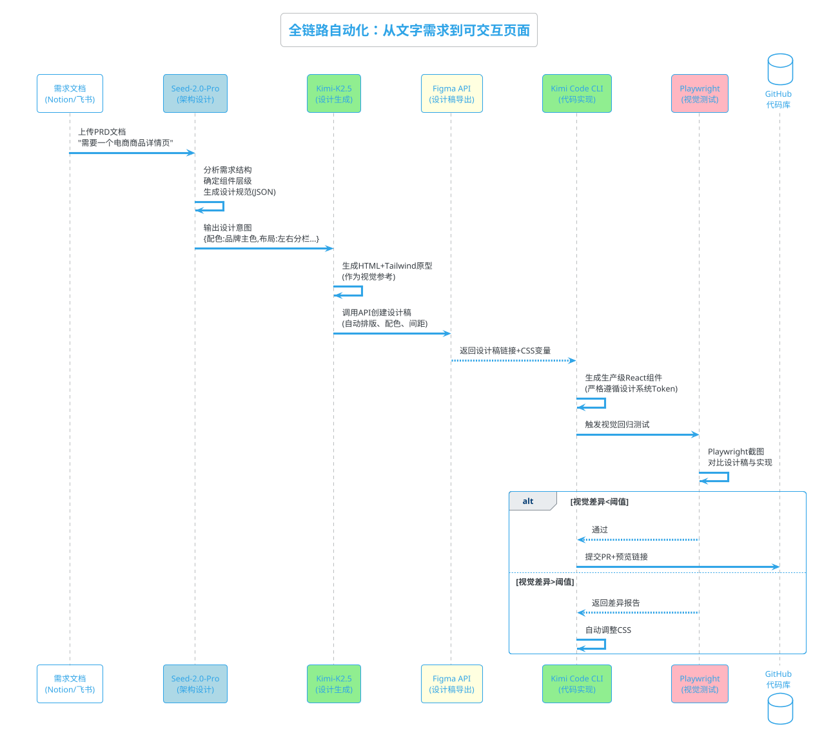
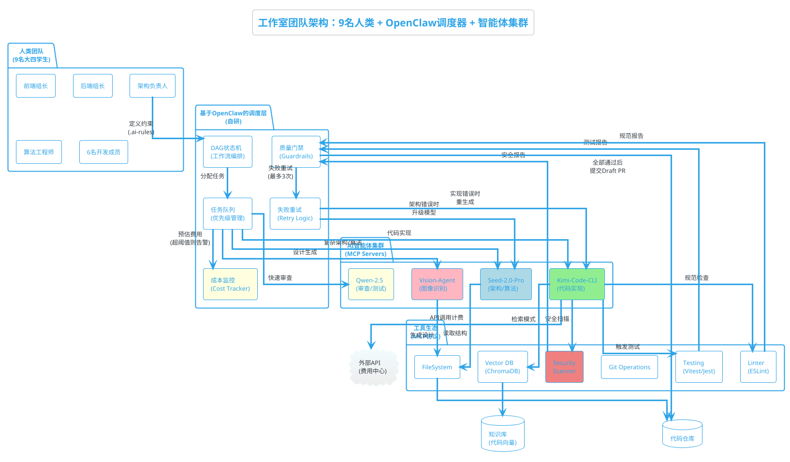

凌晨三点，GitHub的邮件通知在工作室的钉钉群里刷屏。这是三个并行的PR同时通过了CI检查——我们的"夜间智能体小队"又在无人值守模式下完成了新项目的权限模块、支付接口和前端组件库更新。

早上九点，团队的9名大四学生照常出现在各自实习公司的工位上，一切都照常，仿佛工作室从未存在，因为**昨晚AI已经帮我们写完了80%的代码**。

这就是我们工作室的真实工作流：9名人类开发者，带着数十个AI智能体组成的混合团队，工作室白天各自实习，业余时间才去处理额外的工作室任务。作为2022级入学的大学生，我们与GPT系列模型共同成长，正在经历从传统**Developer**向**Vibe Coder**的集体转型。

> **Vibe Coder**: 不再逐行编写代码，而是通过工程化的Prompt Engineering、约束设计和质量门禁，引导AI智能体生成高质量代码的开发者。我们管理的是"氛围"（Vibe）——架构风格、技术约束和验收标准，而非具体语法细节。

## 与大学生活同步的转型时间线（2022-2025）

### 第一阶段：观望与低估（2022.12 - 2023.03）

2022年12月初，ChatGPT发布不到一个月。一位华南理工大学的朋友邀请我共同探索AI编程，我和他一同试验了初代ChatGPT的能力，当时的结论很"理性"：AI幻觉太多，国内访问麻烦，而且我正处于大一上学期，正沉迷于C/C++实现简易操作系统内核——我认为这些"基本功"才是计算机科学的本质。

此时离ChatGPT爆火还有几个月的时间，国内几乎没人知道这款将要改变整个技术圈的工具已经悄然诞生。我有幸成为了国内最早一批体验ChatGPT的用户，不过当时也只是把它当作稍微厉害点的自动对话工具罢了，对它的编程能力嗤之以鼻。

### 第二阶段：应付作业的过渡期（2023.03 - 2023.07）

2023年初，随着ChatGPT在国内的爆火，文心一言作为国内首批大模型发布。在学生群体中，它迅速成为撰写课程报告的工具。我也开始用它来生成课程文档中的代码示例，但很快发现其**幻觉率极高**：生成的Python脚本经常缺失import语句，Java代码的类名与文件名不匹配是常态，JavaScript代码里混杂着不存在的API。

这些代码无法直接运行，但对于"老师不会仔细查看"的课程展示而言，已足够应付。讽刺的是，即便如此粗糙的代码生成能力，也已经超越了当时很多计算机专业学生的手写水平——太多同学在面对基础编程作业时"几乎什么都不会写"。

这个阶段，AI对我来说只是**应付作业的工具**，我甚至不屑于将其用于正经的项目开发。

### 第三阶段：辅助工具化（2023.07 - 2023.10）

大一暑假（2023年7月），工作室团队的雏形已经出现，伴随着团队协作开发，要阅读大量不是自己写的代码，于是我在VS Code中安装了CodeGeeX插件。这是智谱清言团队开发的国内首款智能编程工具。

此时的CodeGeeX扮演的是 **"高级IntelliSense"** 角色：

- 基于AST解析自动生成函数注释，省去了我写JSDoc的时间
- 基于上下文n-gram预测的代码补全，特别是处理重复性的CRUD代码
- 遗留代码的阅读理解辅助，解释那些"祖传代码"里的复杂正则表达式和递归逻辑

但其局限性也很明显：4096 token的上下文窗口导致跨文件引用几乎不可用，生成的函数常常与全局变量脱节。我将其严格限定为**辅助阅读工具**，核心业务逻辑坚持手写。我仍认为只有自己写的代码才有"灵魂"，AI生成的代码"缺乏思考"。

### 第四阶段：长上下文突破与内容生成（2023.10 - 2024.03）

2023年10月，Moonshot AI发布Kimi Chat。坦白说，最初吸引我的是其品牌名——与米哈游早期还是学生团队工作室时的作品《Fly Me 2 the Moon》的意象重合，作为其粉丝，这种"月亮"的隐喻产生了奇妙的好感。

但技术层面的震撼很快超越了这种情感联结。Kimi的200K长上下文窗口（后扩展至2M）带来了质变：

**在课程作业方面**，AI已经可以完成令人满意的课程报告了。我不再需要拼凑段落，只需提供大纲和参考资料，Kimi就能生成结构完整的Markdown文档，甚至自动处理好引用格式。

**在前端开发方面**，突破最为明显。我可以把整个前端组件库的TypeScript定义和CSS变量文件作为上下文输入，AI生成的代码开始自动遵循项目既有的设计规范——比如自动使用`spacing(4)`​而不是硬编码`16px`，自动引用定义好的颜色变量而不是使用十六进制色值。

这是**风格一致性**的觉醒：AI不再只是"填空式生成"，而是开始理解项目的"氛围"（Vibe）。我开始尝试让AI处理简单模块的实现，自己专注于接口设计。一个典型的转变是：以前我需要手动写CSS来调整布局，现在直接把Figma设计稿的描述扔给Kimi，它就能生成大致可用的Tailwind CSS代码。

### 第五阶段：Agent化与快速原型（2024.03 - 2024.06）

2024年初，Kimi推出了Agent功能，这标志着我的工具链进入了**开箱即用**的新阶段。

这个阶段的标志性变化是**快速原型开发**能力的获得。以前我需要先搭建项目骨架、配置路由、写基础组件，现在直接使用Kimi Agent：

- **项目脚手架生成**：输入"生成一个基于Next.js 14的电商后台管理系统，包含用户管理、订单管理、商品管理三个模块，使用Prisma作为ORM，tRPC作为API层"，Kimi Agent能在10分钟内生成可运行的项目结构，包含完整的路由配置、数据库Schema和基础页面。
- **代码解释与重构**：面对GitHub上找来的开源项目，以前需要花一整天理解其架构，现在把代码通过工具打包成单Markdown文件后直接上传给Kimi（利用长上下文），它能在几分钟内生成架构图和核心逻辑说明，甚至能指出代码中的潜在问题。

这个阶段，AI从"辅助工具"变成了**初级协作者**。我们意识到，AI不仅能写代码，还能理解需求、分解任务、甚至进行初步的架构设计。

### 第六阶段：Cursor与本地深度协作（2024.06 - 2024.11）

2024年暑假，随着Cursor的发布，让AI从"网页聊天"进入了"本地开发环境"。这是**个人效率质变**的阶段。

**本地项目开发**方面，我不再需要手动复制粘贴代码。本地部署Cursor后，我可以直接在终端对AI说："基于现有的UserService，实现一个带Redis缓存的积分查询接口，遵循项目中已有的错误处理模式。"它会自动：

1. 读取UserService的现有实现
2. 查看项目中的Redis配置
3. 生成符合既有风格的Service代码
4. 自动生成对应的tRPC路由和TypeScript类型定义

**服务器自动运维**是这一阶段的意外收获。我们在工作室的腾讯云服务器上部署了Cursor，编写了定时任务脚本：

- 每天晚上自动检查Nginx日志，AI分析访问异常并生成报告
- 自动监控磁盘空间，当空间不足时AI会判断哪些日志可以清理，并生成清理脚本（需人工确认后执行）
- 数据库备份脚本自动生成，AI会根据表的重要性建议不同的备份策略

这个阶段，我体验到了**上下文连续性**的价值——AI不再是"无状态"的聊天对象，而是能记住项目结构、理解代码库风格的持续协作者。

但**瓶颈**很快显现：虽然效率大幅提升，但我仍然需要坐在电脑前**实时指挥**AI。每个任务都需要我手动输入Prompt、等待生成、检查结果、继续下一步。当工作室同时推进3个项目时，我发现在不同项目上下文之间切换极其耗费精力，而且夜间和会议期间无法利用AI。

### 第七阶段：MCP深度使用与自动化尝试（2024.11 - 2025.10）

2024年底，Anthropic发布MCP（Model Context Protocol）协议，团队迅速认识到这是**工程化**的关键。

这个阶段的核心特征是**本地Docker化+脚本触发**：

- **容器化环境**：我们在本地和服务器上部署了Docker容器，内部运行Cursor，预装了所有项目依赖（Node.js、Python、Prisma等），确保AI执行环境的一致性
- **半自动脚本**：编写了Shell脚本实现"一键生成"：输入需求描述，脚本自动调用API生成代码、运行测试、如果失败则自动重试3次，最后提交到Git
- **单模型端到端**：仍主要依赖单一模型（Kimi）完成从需求到代码的全流程，但增加了自动化的质量检查

**具体工作流示例**：

```bash
# 在本地终端执行
./generate.sh "实现用户积分兑换功能，包含积分扣减、订单创建、库存检查"
```

脚本会自动：

1. 调用Cursor生成Service层代码
2. 自动运行`npm run lint`检查格式
3. 运行`npm test`执行单元测试
4. 如果失败，自动捕获错误信息追加到Prompt，要求AI修复
5. 最终生成Git commit并推送

但**痛点**依然明显：

- **单点瓶颈**：虽然自动化了，但一次只能处理一个任务，无法并行处理工作室的多个项目
- **失败处理机制简陋**：遇到复杂错误（如类型不匹配、依赖冲突），脚本无法自动解决，只能中断等待人工介入
- **上下文隔离**：不同项目的技术栈不同（有的用Next.js，有的用Vue，有的用Go），每次切换需要手动加载不同的约束文件
- **资源浪费**：我们9个人各自维护自己的AI环境，API调用成本分散且重复

这个阶段验证了**自动化可行性**，但暴露了**编排层缺失**的问题——我们需要一个中央调度器来管理任务队列、分配AI资源、处理多模型协作。

### 第八阶段：Kimi CLI带来的国产化转型（2025.10 - 2026.02）

2025年10月24日（1024程序员节），月之暗面开源发布了 **Kimi Code CLI**，这成为我们工具链的转折点。

​**从Cursor转向Kimi CLI的动因**：

虽然Cursor在2024年11月就已集成MCP协议，但作为海外工具，团队遇到了**本土化瓶颈**：

- ​**中文语境理解不足**：Cursor对中文注释、中文变量名、中文业务逻辑的理解常有偏差
- ​**网络延迟与稳定性**：偶尔的连接问题影响自动化流程的可靠性
- ​**成本结构**​：Cursor Pro订阅费\$20/月，且API调用按量计费，对我们9人工作室而言成本偏高

**Kimi CLI的发布恰好解决了这些痛点：**

- ​**原生中文优化**：基于Kimi K2.5模型，对中文编程场景理解更深，生成的代码注释和变量命名更符合国内团队习惯
- ​**开源可控**​：GitHub开源（[https://github.com/MoonshotAI/kimi-cli](https://github.com/MoonshotAI/kimi-cli%EF%BC%89%EF%BC%8C%E6%88%91%E4%BB%AC%E5%8F%AF%E4%BB%A5%E8%87%AA%E6%89%98%E7%AE%A1%E3%80%81%E4%BF%AE%E6%94%B9%E6%BA%90%E7%A0%81%E9%80%82%E9%85%8D%E5%86%85%E9%83%A8%E6%B5%81%E7%A8%8B)），我们可以自托管、修改源码适配内部流程
- **成本优势**：接入DeepSeek API或Moonshot API，成本比OpenAI/Anthropic低约60%
- **MCP原生支持**：Kimi CLI从设计之初就考虑了MCP集成

最终我们完成了从"半自动化脚本"到"工程化CLI工具"的跃迁：

```bash
# Cursor API
./cursor-generate.sh "需求描述" # 容易出错，上下文管理困难

# Kimi CLI的标准化调用
kimi code generate --file requirement.md --context ./src --output ./output
```

​**关键改进**：

1. ​**标准化项目模板**​：利用Kimi CLI的`.cursorrules`​等效配置文件（后更名为`.kimirules`），为每个项目类型（Next.js、Vue、Go微服务）建立标准化约束
2. **图像到代码突破**：Kimi CLI之后升级为Kimi Code CLI使用的Kimi K2.5模型擅长视觉理解，可以直接上传Figma截图或手绘草图，生成前端组件代码。这比Cursor的图像理解在国内网络环境下更稳定
3. ​**团队配置共享**​：通过Git版本控制`.kimirules`文件，确保9人工作室的代码风格一致

​**局限性**​： 尽管Kimi CLI带来了国产化优势，但作为​**单一工具**，它仍无法解决我们面临的核心问题：

- ​**单模型瓶颈**：Kimi K2.5既要处理架构设计又要写实现代码，有时在复杂算法上出现"既当裁判又当运动员"的问题
- ​**任务队列缺失**：9个人同时提交需求时，缺乏中央调度，容易互相冲突
- ​**失败恢复机制弱**：遇到复杂编译错误时，仍需要人工介入重启流程

这些局限促使我们在2026年初引入**多模型协作**和​**Seed-2.0-Pro**。

### 第九阶段：OpenClaw与无人值守集群（2026.02 - 至今）

2026年2月，我们9人工作室投入两周时间为**OpenClaw**开发了一套调度管理工具（基于MCP协议和状态机设计），目前我们称她叫做千樱智能体（Hosakii Agent），标志着进入**全自动化**阶段。

**技术突破点**：

**1. 多模型协作架构**
不再依赖单一AI，而是建立**专业化分工**：

|模型|角色|选用原因|成本优势|
| ------| -------------------| --------------------------------------| --------------------|
|**Seed-2.0-Pro**|架构决策/算法设计|AIME 2025得分98.3，Codeforces 3020分|比GPT-5.2便宜3.7倍|
|**Kimi Code CLI**|代码实现/长上下文|256K上下文，中文场景优化|国产API价格|
|**DeepSeek-V3.2**|数学验证/逻辑检查|HumanEval高分，推理能力强|开源低成本|
|**Qwen-2.5-7B**|初步审查/测试生成|速度快，成本低|极低成本|

**2. 任务编排与思维链**
千樱软件开发拆解为**DAG（有向无环图）** ：

```
需求解析 → 架构设计 → 接口定义 → 实现 → 单元测试 → 集成测试 → 文档生成 → Git提交
```

每个节点都有明确的输入输出规范和失败回滚策略。如果"单元测试"节点失败，自动回滚到"实现"节点重新生成；如果连续3次失败，则标记为需要人工介入，并发送详细错误日志。

**3. 夜间无人值守模式**
现在我们真正实现了 **"设定规则后离开"** ：

1. ​**需求输入**：通过Notion或飞书文档提交需求（支持文字+设计图）
2. ​**智能路由**：OpenClaw根据需求类型自动分配模型

   - 看到"设计一个分布式锁"→分配给Seed-2.0-Pro做架构
   - 看到"实现用户页面"→分配给Kimi CLI写前端
3. ​**多轮验证**：生成→审查→测试→如果失败自动回滚到对应模型重试
4. ​**质量门禁**​：只有通过ESLint+TypeScript+单元测试（\>80%覆盖）的代码才会提交为Draft PR
5. ​**人工审查**：第二天早上，我们9个人花10-20分钟审查Diff，重点看架构合理性（而非语法细节）

**4. 从需求描述到可交互原型的全链路自动化**（近期突破）

我们已经彻底摒弃了"人工画设计图→AI写代码"的半自动模式，实现了**需求→设计→代码→测试**的端到端无人干预：



**关键突破点**：

**① 设计稿本身的自动化**
不再依赖设计师手绘Figma，而是由 **Kimi-K2.5** 根据Seed-2.0-Pro输出的设计规范，直接生成符合设计系统的HTML原型，并通过Figma API自动创建可编辑的设计稿。这确保了：

- 设计严格遵循既定的Token系统（颜色、间距、字体层级）
- 无需人工在Figma里拖拽组件，避免"设计图好看但代码难实现"的脱节

**② 多模态闭环验证**
生成的代码并非直接提交，而是经由 **Playwright** 自动截图，与AI生成的设计稿进行像素级对比（视觉回归测试）。如果布局偏差超过4px，或颜色偏离品牌规范，自动打回给Kimi Code CLI修正，直至视觉差异<1%才允许提交PR。

**③ 风格一致性保障**
由于设计图和代码都出自同一套**设计系统Token**（存储在向量数据库中），AI不会出现"设计图用#1E90FF，代码写'blue-500'"的随意性。即使连续生成20个不同页面，也能保持严格的视觉统一——这是人工设计难以避免的"风格漂移"问题。

**效率对比**：

- **传统模式**：产品写PRD→设计师画稿（2天）→前端开发（2天）→视觉走查（0.5天）= **4.5天**
- **我们的模式**：提交PRD→夜间AI自动生成→早上审查→合并 = **2小时**（且夜间无人值守）

现在，连"设计图"这个中间产物都成为了AI自动化流水线上的临时文件，人类只需在早上审查最终的可交互Demo，确认业务逻辑无误即可点击合并。

## 技术架构：9人+多智能体的协作系统



### 当前架构仍存在的真实问题

尽管目前自动化程度已经较高，但在实际运行中（特别是2026年2-3月的密集使用期间），团队发现了以下**系统性局限**：

**1. 复杂错误的"死循环"困境**
当前Retry机制设定为3次，但对于**类型系统级别的错误**（如TypeScript复杂的泛型推导失败、Prisma Schema与迁移文件不一致），3次重试往往不足以解决。此时系统会标记为"需人工介入"，但实际上我们发现有约15%的任务因此堆积在队列中，等待人类处理，反而造成了**自动化瓶颈**。

**2. 成本不可控的"惊喜账单"**
多模型协作虽然提升了成功率，但也带来了**费用管理难题**。Seed-2.0-Pro的长链推理（Long-chain reasoning）在处理复杂算法时会消耗大量token，曾有单次任务消耗¥45的案例。虽然比GPT-5.2便宜，但缺乏**实时预算控制**——目前只能事后统计，无法在中途超支时自动降级到 cheaper 模型（如从Seed切换到Qwen）。

**3. 上下文污染的"风格漂移"**
当工作室9个人同时向向量数据库（ChromaDB）写入代码片段时，不同成员对"好代码"的细微理解差异会被AI放大。例如，A成员偏好的错误处理风格（try-catch）与B成员的（Result类型）会同时存在于向量库中，导致Kimi在检索相似实现时产生**风格不一致**的代码——这在自动化审查中难以发现，因为每种风格单独看都是合理的。

**4. 安全与权限的"黑盒"风险**
MCP协议虽然强大，但赋予了AI过高的文件系统权限。此前遇到的一次**提示词注入攻击**（Prompt Injection）：某个开源依赖的README中包含恶意指令，被AI读取后差点执行了`rm -rf`​命令。虽然Guardrails拦截了危险操作，但这暴露出**AI Agent的安全边界**仍需人工严格管控。

**5. 设计生成的"审美疲劳"**
完全由AI生成的设计稿（通过Kimi-K2.5→Figma API）虽然规范统一，但缺乏**创意突破**。"看起来像模板站"，缺少"人味"。目前我们不得不让人类设计师在关键环节介入，这打破了全自动化链条。

### 团队共识的建立与治理

针对上述问题，我们建立了以下**人机协作规范**：

- **Prompt版本控制**：`.ai-rules`文件的修改必须经过PR审查，且每周进行一次"约束审计"，删除冲突或过时的规则
- **成本预算机制**：每个项目设定月度AI预算（如¥500），OpenClaw会在达到80%时自动切换至 cheaper 模型，并在95%时停止非紧急任务
- **风格锁定策略**：向量数据库按技术栈分区（Next.js区、Go区、Vue区），禁止跨区检索，避免风格污染
- **安全沙箱**：所有AI文件操作在Docker沙箱中进行，敏感操作（删除文件、访问env）需人工二次确认

### 未来演进：从"自动化"到"自治化"

接下来的目标是让系统具备**自我修正与自我优化**能力：

**1. 多Agent对抗性审查（Debate Mode）**
不再由单一模型审查代码，而是引入**对抗机制**：

- **主张Agent**（Kimi）：提交实现方案
- **质疑Agent**（Seed-2.0-Pro）：专门寻找逻辑漏洞、边界条件缺失、性能隐患
- **仲裁Agent**（DeepSeek）：评判双方观点，决定是否需要修正

这种模式模仿人类的Code Review，能发现单模型视角下的盲区，特别是**隐性Bug**（如竞态条件、内存泄漏）。

**2. 自动技术债务识别与重构**
当前AI倾向于"生成新代码"而非"重构旧代码"。未来计划引入**Refactor Agent**：

- 每周扫描代码库，识别重复代码、过长函数、循环依赖
- 自动生成重构PR，并附带**影响面分析**（哪些模块会受影响、需要哪些测试回归）
- 人类只需审查影响面，无需阅读具体Diff

**3. 渐进式部署与A/B测试集成**
将AI生成的功能代码自动部署到**Canary环境**（如Vercel Preview或Kubernetes灰度集群），通过真实流量验证后再合并到主分支。OpenClaw将集成**自动回滚机制**：如果错误率上升，自动撤销该PR并通知人类。

**4. 约束文件的自我进化**
利用AI分析过去3个月的失败案例和人工修正记录，**自动生成约束文件优化建议**。例如，如果发现"缺少空值检查"的Bug频繁出现，自动在`.ai-rules`中添加更严格的约束条款。

**5. 跨工作室的模型联邦学习**
我们9个人的工作室规模虽小，但如果能与其他Vibe Coder团队（在合规前提下）共享**匿名化的代码模式库**，可以构建更强大的共同知识库，而不必各自维护独立的向量数据库。

团队正在向**90%+自动化率**迈进，但清醒地认识到：最后的10%可能是最难的——它涉及**价值判断**（这个功能对用户真的重要吗？）和**创造性突破**（如何设计一个前所未有的交互？），而这或许正是人类开发者最后的堡垒。

## 结语：被大模型拖着成长的一代

回顾这两年半，团队一步一步走近AI编程：

**这不是我们选择拥抱AI，而是AI在关键的时间节点恰好提供了我们需要的工具**——就像我们的父辈经历PC普及、互联网普及一样，我们这一代人正在经历**智能体普及**。

当其他同学在纠结"要不要用AI写论文"时，我们已经用AI完成了毕业设计的全流程开发；当其他人担心"AI会不会让程序员失业"时，我们已经在管理AI团队完成商业交付。

凌晨两点，工作室的服务器风扇还在转。DeepSeek正在分析明天的架构方案，Kimi在生成React组件，Qwen在审查代码风格，Seed在解析Figma设计稿，而我们在睡觉。这很公平：**我们设计约束，AI执行实现；我们定义Vibe，AI编写代码**。

作为跟随大模型一同发展的一代大学生，我们或许不再会成为传统意义上的"代码工匠"，但我们正在成为**AI时代的架构师**。
