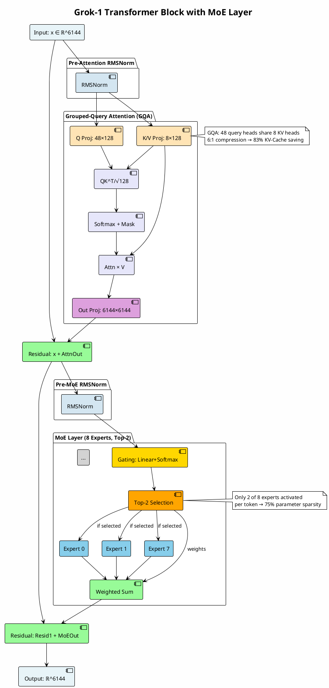
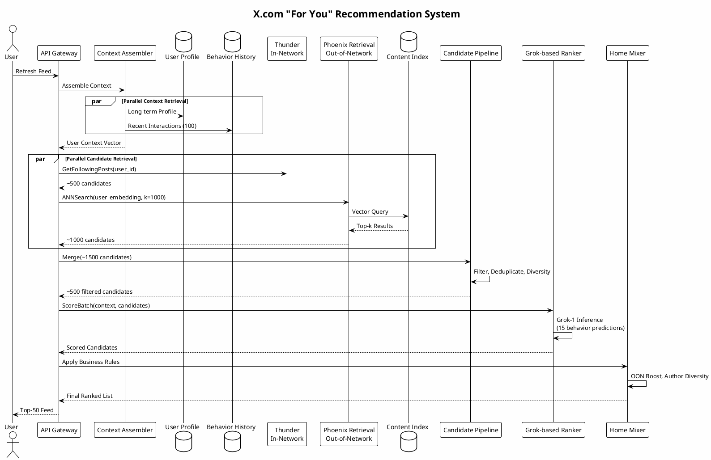
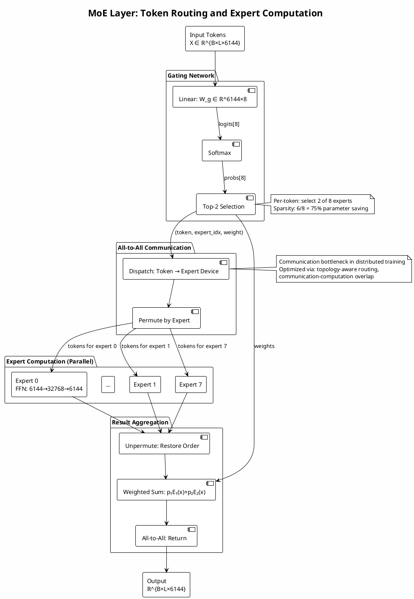

**想象一下**：你刚在X上点赞了一条关于Rust异步编程的帖子，接下来0.1秒内，一个拥有3140亿参数、64层深度的神经网络正在判断——是该给你推一篇Kubernetes踩坑指南，还是某位科技领袖对AI安全的最新评论？这不是科幻，而是每秒发生在X平台千万次请求背后的真实计算流程。

最近，埃隆·马斯克兑现2024年说的"开源算法"的承诺，将X.com（原Twitter）的"For You"推荐系统完整技术栈公之于众。这是一场**推荐系统架构范式的示威**——当大多数平台还在用几百个手工工程特征叠加梯度提升树（GBDT）做排序时，X团队直接押注了端到端的大模型方案：用基于Grok-1的巨型Transformer，从零开始学习"什么是好内容"。

这份技术文档将带你穿透营销话术，直面这个系统的工程本质：MoE（混合专家）架构如何在保持314B参数容量的同时将推理成本压缩4倍？为什么推荐场景需要颠覆传统Transformer的注意力机制（Candidate Isolation）？以及，一个彻底抛弃手工特征的系统，是如何处理"用户刚关注了新话题"这种实时信号的？

如果你厌倦了推荐系统领域那些"协同过滤+精排模型"的陈词滥调，这篇文章将为你展示**规模即正义**（Scale is all you need）的极端实践。我们将看到，当算力不再受限，推荐问题可以如何被重新定义。

让我们开始拆解这个可能是目前工业界最激进的推荐架构。

## 1. 系统架构总览

### 1.1 "For You"信息流整体架构

#### 1.1.1 双源内容融合机制：In-Network与Out-Network

X.com的"For You"信息流推荐系统采用了一种精心设计的双源内容融合架构，这一架构的核心创新在于将传统推荐系统中相互分离的内容来源整合到统一的神经网络处理框架中。系统明确区分了两大内容来源：**In-Network（内部网络）** 和**Out-of-Network（外部网络）** ，分别由代号"Thunder"和"Phoenix Retrieval"的两个子系统负责处理。

**In-Network内容（Thunder组件）** 指的是用户已关注账号所发布的帖子。这一组件的设计目标是实现亚毫秒级的实时内容投递，确保用户能够第一时间获取其社交网络的动态更新。Thunder基于内存存储架构构建，通过Kafka实现实时数据摄取，其技术选型充分体现了对延迟极端敏感场景的深度优化。该组件需要处理高并发的好友关系图遍历——对于拥有数万关注的活跃用户，需要在毫秒级时间内完成关注列表的展开、内容去重与时序排序。

**Out-of-Network内容（Phoenix Retrieval组件）** 承担着内容发现的核心使命。该组件采用**双塔神经网络架构（Two-Tower Neural Network）** ，将用户的历史 engagement 行为编码为稠密向量嵌入，同时将平台上的每一条帖子也编码为相应的向量表示，通过向量相似度搜索实现跨用户社交圈的内容推荐。这种设计的精妙之处在于，它将推荐问题转化为可高效求解的最近邻搜索问题，使得系统能够从数十亿级别的内容库中快速检索出与用户兴趣高度匹配的候选内容。

双源融合机制的技术实现体现了系统工程的高度复杂性。Thunder与Phoenix检索出的候选内容进入统一的处理管道，经过相同的过滤、排序和打分流程，最终混合呈现给用户。这种架构设计确保了系统在处理效率与推荐多样性之间取得了精妙平衡：既保证了社交关系的实时性，又拓展了内容发现的边界。系统在处理过程中会自动执行多层次的过滤操作，包括移除被屏蔽账号的内容、用户明确不感兴趣的主题、以及非法、过时或无效的帖子。

#### 1.1.2 四大核心组件：Thunder、Phoenix Retrieval、Candidate Pipeline、Grok-based Ranker

X推荐系统的技术架构由四个紧密协作的核心组件构成，形成了从内容检索到最终呈现的完整链路：

|组件名称|核心功能|技术特点|处理规模|
| :---------| :-----------------------| :-----------------------------------------| :-----------------|
|**Thunder**|In-Network内容获取|内存存储、Kafka流处理、亚毫秒延迟|用户关注列表规模|
|**Phoenix Retrieval**|Out-of-Network内容检索|双塔模型、ANN向量搜索、语义匹配|数百万→数千候选|
|**Candidate Pipeline**|候选处理与过滤|Rust实现、可组合流水线、并行执行|数千→数百候选|
|**Grok-based Ranker**|最终排序与打分|Grok-1 Transformer、多行为预测、候选隔离|数百→排序输出|

**Thunder组件**作为In-Network内容的基础设施，其设计重点在于高吞吐、低延迟的关系数据服务。该组件采用纯内存存储架构，避免了磁盘I/O带来的延迟开销，同时通过Kafka流处理平台实现数据的实时摄取与同步。

**Phoenix Retrieval组件**的核心是双塔嵌入模型：用户塔将用户的历史交互序列、画像特征编码为固定维度的用户嵌入向量；内容塔则将帖子的文本、媒体、作者特征等编码为内容嵌入向量。两个塔在训练时通过对比学习对齐，推理时则解耦——内容塔的嵌入可离线预计算并建立向量索引，用户塔嵌入实时计算后执行近似最近邻（ANN）搜索。

**Candidate Pipeline**提供了灵活的推荐流水线构建框架，这是X工程团队在系统设计上的重要创新。该组件采用Rust语言实现，核心设计原则包括：流水线执行与业务逻辑的分离、独立阶段的并行执行、优雅的错误处理机制，以及新数据源、特征补充模块、过滤器和评分器的动态添加。管道的设计遵循"关注点分离"原则，将业务逻辑与执行监控解耦，使得算法工程师能够专注于推荐策略的迭代。

**Grok-based Ranker**是整个系统的"大脑"，基于xAI开源的Grok-1模型架构进行适配改造。该组件代表了推荐系统技术的重大范式转移——从传统的手工特征工程与梯度提升树模型，转向端到端的深度学习架构。Ranker接收来自Candidate Pipeline的数百至数千条候选内容，结合用户的完整交互历史，预测每条内容引发各类用户行为（点赞、回复、转发、点击等）的概率，最终加权组合为综合相关性分数。

#### 1.1.3 端到端神经网络替代传统启发式规则的设计哲学

X推荐系统最激进的设计决策在于**完全消除了手工工程特征和大多数启发式规则**，将核心计算完全委托给Grok-based Transformer模型。官方文档明确指出："我们已经从系统中消除了每一个手工设计的特征和大多数启发式规则。基于Grok的Transformer通过理解你的互动历史（点赞、回复、转发等）来完成所有繁重的工作，以此确定哪些内容与你相关"。

这一"零人工特征工程"（Zero Hand-Engineered Features）的哲学标志着推荐系统范式的重要转变：从"规则驱动"走向"学习驱动"，从"工程师定义什么是好内容"走向"模型从用户行为中学习什么是好内容"。传统推荐系统通常采用多阶段流水线架构：召回阶段基于启发式规则快速筛选候选，粗排阶段使用轻量级模型进行初步筛选，精排阶段才应用复杂的深度模型。每个阶段都伴随着信息损失——召回阶段的相似度度量可能遗漏语义相关但嵌入距离较远的内容，粗排阶段的简化模型可能过滤掉精排模型能够正确评估的高质量候选。

X.com的架构通过单一的大规模Transformer模型统一处理所有候选，理论上消除了阶段间的信息瓶颈。这一设计的优势体现在多个维度：首先，**表示学习能够发现人类工程师难以显式编码的复杂模式**，如讽刺性内容的识别、新兴话题的敏感捕捉；其次，**端到端学习使得所有组件针对最终目标（用户满意度）联合优化**，避免了传统流水线中各模块目标不一致的问题；第三，**架构具有更好的泛化能力**——当平台引入新的内容类型、互动形式或用户群体时，模型可以通过持续学习自动适应。

然而，这一设计也带来了新的挑战：**模型的可解释性显著降低**，调试"模型为何推荐某条内容"变得困难；**训练数据的质量要求极高**，任何标注偏差都会被模型放大；**推理计算成本大幅增加**，需要专门的优化与硬件投入。X工程团队通过"候选隔离"机制部分缓解了调试难度，确保单条内容的评分可复现、可缓存。

### 1.2 系统数据流架构

#### 1.2.1 用户请求触发与上下文组装流程

当用户刷新"For You"信息流时，系统触发完整的推荐流水线。用户请求的处理流程体现了现代大规模推荐系统的典型架构模式：

**第一阶段：上下文组装**。系统首先解析用户身份标识和上下文信息，包括地理位置、设备类型、时间特征等。随后，用户画像服务检索该用户的历史行为序列——这是Grok-based Ranker的核心输入。关键设计在于序列长度与信息密度的权衡：Grok-1模型支持最大8192个token的上下文窗口，但推荐场景下的用户交互历史可能远超这一限制。系统采用的策略是**分层采样**：近期交互（如过去24小时）采用全量保留，中期交互（如过去一周）按重要性采样，长期交互（更早）则通过预聚合的摘要嵌入表示。

**第二阶段：双源并行检索**。Thunder与Phoenix Retrieval的并发执行将关键路径上的串行延迟转化为可容忍的并行开销。Thunder查询针对用户的关注列表执行内存中的倒排索引检索；Phoenix Retrieval则将用户上下文编码为查询向量，在内容嵌入索引中执行近似最近邻搜索。两个候选源的查询执行是并行化的，以最小化整体延迟。

**第三阶段：候选处理与排序**。检索结果在Candidate Pipeline中合并、去重和预过滤，形成规模可控的候选池进入精排阶段。Grok-based Ranker为每个候选独立计算多行为概率预测，最终通过可学习权重组合为综合得分。

#### 1.2.2 候选内容检索与隔离机制

**候选隔离（Candidate Isolation）** 是X推荐系统中最具技术独创性的设计之一。在标准Transformer的自注意力机制中，序列内的所有token可以相互关注，这在生成任务中是合理的。但在推荐排序场景中，这一设计会导致严重的问题：若允许候选A的评分依赖于候选B是否出现在同一批次中，则评分结果将不具备稳定性——当候选B被过滤或替换时，候选A的评分可能发生变化，这使得结果缓存、增量更新和A/B测试变得极为困难。

X系统通过精心设计的**注意力掩码**解决了这一问题。在Grok-based Ranker的推理过程中，候选内容token被禁止相互关注，只能关注用户历史上下文。形式化地，对于包含用户历史序列$\mathbf{U} = [u_1, ..., u_m]$和候选内容$\mathbf{C}_i = [c_{i,1}, ..., c_{i,n}]$的输入，注意力掩码$\mathbf{M}$满足：

$$
M_{ij} = \begin{cases} 1 & \text{if } i,j \leq m \text{ (用户历史内部)} \\ 1 & \text{if } i \leq m < j \text{ 或 } j \leq m < i \text{ (用户-候选交互)} \\ 0 & \text{if } i,j > m \text{ 且 } \lceil (j-m)/n \rceil \neq \lceil (i-m)/n \rceil \text{ (候选间隔离)} \end{cases}
$$

这一设计的工程价值在于：**评分可缓存性**（同一候选在不同请求批次中获得相同评分）、**结果稳定性**（候选的相对顺序不受批次组成的影响）、以及**调试可追溯性**（单条内容的评分可独立分析）。

#### 1.2.3 实时反馈闭环与模型更新管道

X推荐系统构建了**多时间尺度的反馈闭环机制**：

|时间尺度|机制|更新内容|
| :---------| :-------------| :----------------------------|
|**毫秒级**|流式特征更新|用户嵌入、实时行为信号|
|**分钟级**|模型嵌入刷新|轻量级在线学习、ANN索引更新|
|**小时级**|模型热更新|预测头参数、温度系数调整|
|**天/周级**|完整重训练|Grok-1主干网络、全参数微调|

实时反馈的技术实现面临**延迟反馈问题**——用户的互动决策可能发生在内容曝光后的任意时刻。X系统可能采用了生存分析或延迟标签技术加以建模，将未观测到的互动视为截断数据，而非简单的负样本。

## 2. Grok-1核心模型架构

### 2.1 模型规格与宏观参数

#### 2.1.1 314B总参数规模与64层深度设计

Grok-1以**3140亿（314B）的总参数量**和**64层Transformer深度**，成为2024年开源时最大规模的语言模型之一。这一规格的设计体现了xAI对"规模即性能"（scale is all you need）理念的坚定信仰，以及对计算资源充足性的信心。

从缩放定律（Scaling Laws）的角度分析，64层的深度选择反映了最优的宽度-深度组合：在给定固定计算预算下，存在使训练损失最小化的模型形状。314B参数与64层的配比，经过整体架构的联合优化，接近特定训练token数量下的计算最优配置。

**关键参数对比**：

|模型|总参数|层数|隐藏维度|上下文长度|
| :---------------| :-------| :-----| :---------| :-----------|
|Grok-1|**314B**|**64**|**6144**|8192|
|LLaMA-2 70B|70B|80|8192|4096|
|GPT-3|175B|96|12288|2048|
|Mixtral 8×22B|141B|56|6144|65536|

314B参数规模的工程意义需要结合**激活稀疏性**来理解。虽然总参数量达到314B，但Grok-1在推理时仅激活约25%的权重，即**有效参数量约为78-86B**。这种"大模型、小计算"的设计理念是MoE架构的核心价值——通过参数规模的膨胀换取模型容量的提升，同时通过稀疏激活控制实际计算成本。

64层的深度带来了优化挑战：梯度消失/爆炸、注意力塌陷（attention collapse）、以及训练不稳定性。Grok-1通过**Pre-LayerNorm架构**（层归一化置于残差分支之前）、**旋转位置编码（RoPE）** 、以及精心设计的初始化策略来缓解这些问题。

#### 2.1.2 Mixture of 8 Experts (MoE)稀疏激活架构

Grok-1的核心架构创新在于采用**Mixture of Experts（MoE）** 设计，具体配置为**8个专家网络**，配合**Top-2稀疏激活**。这一设计使其成为当前开源社区中MoE应用最为深入的大语言模型之一。

MoE层的数学本质是一种**条件计算（Conditional Computation）** 机制：

$$
\text{MoE}(\mathbf{x}) = \sum_{i=1}^{N} G(\mathbf{x})_i \cdot E_i(\mathbf{x})
$$

其中$E_i(\mathbf{x})$为第$i$个专家网络的输出，$G(\mathbf{x}) \in \mathbb{R}^N$是门控网络输出的概率分布。8专家的设计在容量与效率之间取得平衡：专家数量过少（如2-4个）可能导致 specialization 不足，过多（如64个以上）则增加路由噪声和负载均衡难度。

MoE架构的参数效率优势极为显著。Grok-1的314B总参数中，大部分存储于专家网络的权重矩阵。若采用密集架构，同等计算成本下的参数量约为86B（即实际激活参数量的约3.6倍）。换言之，**MoE以相近的推理成本，实现了3.6倍的模型容量扩展**。

#### 2.1.3 Top-2专家路由：每Token仅激活2/8专家

Grok-1采用**Top-2路由策略**，即对于每个输入token，门控网络从8个专家中选择激活概率最高的2个，其余6个专家完全不参与计算。这一设计将每次前向传播的**激活参数量从314B降至约78-86B**（314B × 2/8，考虑非专家参数的调整），实现了约**4倍的计算效率提升**。

Top-k路由的离散选择带来了**不可微分的优化挑战**。Grok-1采用的解决方案是**直通估计器（Straight-Through Estimator, STE）** ：前向传播时执行真实的Top-2硬选择，反向传播时将梯度直接传递给选中的专家。这一启发式方法在实践中表现良好，但理论上存在梯度估计偏差。

Top-2策略的表达能力优势在于：相比单专家路由（k=1），双专家激活提供了**专家组合的灵活性**，允许模型对复杂输入融合多个专家的专业知识；相比更高k值，双专家配置将计算开销控制在可接受范围，使得314B模型的推理延迟接近同等活跃参数量的密集模型。

### 2.2 细粒度架构参数

#### 2.2.1 嵌入维度6144与131072词汇量SentencePiece分词器

Grok-1的嵌入层配置体现了对表达能力和计算效率的精细平衡：

|参数|数值|设计考量|
| :-----| :-----| :------------------------------------------|
|**嵌入维度** **$d_{\text{model}}$**|**6144**|2的倍数，利于张量并行；支持丰富的语义表示|
|**词汇表大小** **$V$**|**131072 =**  **$2^{17}$**|支持多语言与特殊符号；减少序列长度|
|**最大序列长度**|**8192 tokens**|长文档处理能力；内存与计算权衡|
|**分词器**|**SentencePiece**|语言无关，无需预分词；子词单元处理OOV|

6144的嵌入维度是128的倍数（$48 \times 128$），这与注意力头的配置密切相关。大词汇量（131K）相比GPT-3的50K或Llama 2的32K显著更大，支持更细粒度的多语言表示，减少OOV（Out-of-Vocabulary）比例，但也增加了输出层的计算开销。

SentencePiece作为子词分词算法，采用Unigram语言模型或BPE策略，在字符级和词级表示之间取得平衡。其语言无关性使得Grok-1能够有效处理代码、URL、表情符号等非规范文本，这对X平台的社交媒体内容尤为重要。

#### 2.2.2 多头注意力配置：48查询头/8键值头的非对称设计

Grok-1的注意力机制采用了创新的**分组查询注意力（Grouped-Query Attention, GQA）** 变体，其配置显著偏离标准的多头注意力对称设计：

|组件|数值|标准MHA对比|
| :-----| :-----| :------------------|
|**查询头数** **$n_q$**|**48**|通常等于KV头数|
|**键值头数** **$n_{kv}$**|**8**|仅为查询头的1/6|
|**每头维度** **$d_k = d_v$**|**128**|标准配置|
|**总KV维度**|$8 \times 128 = 1024$|显著小于查询维度 $48 \times 128 = 6144$|

这一非对称设计的核心动机是**内存优化**。在自回归解码中，键值缓存（KV Cache）的内存占用与键值头数成正比。Grok-1将KV头数压缩至8，意味着**KV Cache减少为标准配置的1/6**，这对于长上下文推理至关重要。

GQA的数学核心在于查询-键值头数比 $r = n_q / n_{kv} = 6$。这一比率的选择需要在内存节省与表达能力之间权衡：比率过高可能导致键值表征过于压缩，损害注意力精度；比率过低则内存收益有限。Grok-1的6:1比率与LLaMA-2、Mixtral等模型的实践一致，经过了充分的实验验证。

#### 2.2.3 前馈网络中间维度32768与隐藏状态维度

Grok-1的MoE层中，每个专家网络的**中间维度为32768**，相对于输入维度6144的扩展比为**5.33×** （32768/6144），略高于标准Transformer的4倍比例。更大的中间维度增强了每个专家的表达能力，补偿了Top-2稀疏激活可能带来的信息损失。

专家网络的计算量分析：对于单个token，标准FFN的计算量为$2 \times d_{\text{model}} \times d_{\text{ff}}$（两个矩阵乘法）。Top-2 MoE的每token计算量为：

$$
\text{FLOPs}_{\text{token}} = 2 \times 2 \times d_{\text{model}} \times d_{\text{ff}} = 4 \times 6144 \times 32768 \approx 805 \text{ MFLOPs}
$$

对比同等规模的稠密模型（314B参数全部激活）：约300M+ FLOPs/token，MoE实现了 **~4倍计算节省**，但实际激活专家宽度更大，有效计算量相近。

### 2.3 MoE层深度解析

#### 2.3.1 门控网络(Gating Network)的路由决策机制

门控网络是MoE架构的"调度中心"，其设计直接决定了专家分工的效率与负载均衡。Grok-1的门控网络采用简单的**线性投影加Softmax归一化**：

$$
\mathbf{g} = \mathbf{W}_g \mathbf{x} + \mathbf{b}_g, \quad \mathbf{p} = \text{Softmax}(\mathbf{g})
$$

其中$\mathbf{W}_g \in \mathbb{R}^{8 \times 6144}$，$\mathbf{b}_g \in \mathbb{R}^8$。门控网络的参数量仅约49K，相对于专家网络的数十亿参数可忽略不计，但其输出决定了每个token的计算路径。

**Top-2选择的数学实现**：

$$
\text{Top2}(\mathbf{p}) = \{i, j \mid p_i \geq p_k \geq p_j, \forall k \neq i,j\}
$$

经过重新归一化后的门控权重为：

$$
\tilde{p}_i = \frac{p_i}{p_i + p_j}, \quad \tilde{p}_j = \frac{p_j}{p_i + p_j}
$$

门控网络训练的核心挑战在于**路由决策的稳定性与探索性平衡**。训练初期，门控倾向于随机路由；随着训练进行，不同专家逐渐特化到特定的输入分布区域。理想情况下，门控网络学习将语义相关的token路由到相同的专家组合，形成隐式的"专家专业化"。

#### 2.3.2 专家网络(Expert Networks)的并行计算结构

Grok-1的8个专家网络在结构上完全相同，均为标准的**前馈网络（FFN）** ，但参数完全独立。每个专家的具体结构为：

$$
E_i(\mathbf{x}) = \mathbf{W}_{i,2} \cdot \text{SiLU}(\mathbf{W}_{i,1} \mathbf{x} + \mathbf{b}_{i,1}) + \mathbf{b}_{i,2}
$$

其中$\mathbf{W}_{i,1} \in \mathbb{R}^{6144 \times 32768}$，$\mathbf{W}_{i,2} \in \mathbb{R}^{32768 \times 6144}$。单专家的参数量约为$2 \times 6144 \times 32768 \approx 403\text{M}$，8个专家总计约3.2B参数每层。

专家网络的**并行计算**是MoE推理效率的关键。在实际部署中，8个专家通常分布在不同的计算设备（GPU/TPU）上，门控决策确定目标设备后，输入token通过all-to-all通信发送至对应设备，专家计算完成后结果回传并加权聚合。这种"专家并行"（Expert Parallelism）与"数据并行"（Data Parallelism）和"张量并行"（Tensor Parallelism）共同构成了三维并行策略。

#### 2.3.3 负载均衡与专家容量约束的实现

**负载均衡**是MoE训练稳定性的关键保障。Grok-1采用的**辅助损失函数**为：

$$
\mathcal{L}_{\text{balance}} = \alpha \cdot N \cdot \sum_{i=1}^{N} f_i \cdot P_i
$$

其中：

- $f_i$：批次中分配给专家$i$的token比例（路由频率）
- $P_i$：门控网络对专家$i$的平均路由概率
- $N=8$：专家总数
- $\alpha$：超参数控制损失权重

该损失鼓励$f_i$与$P_i$的乘积在各专家间均匀分布。当分布均匀时（$f_i = P_i = 1/N = 0.125$），损失达到最小值；当某个专家过载时，损失显著增大，梯度推动门控减少对该专家的选择。

**专家容量约束（Expert Capacity）** 是另一重要机制：为每个专家预设最大处理token数上限，超出容量的token被溢出到备用专家或重新路由。典型配置将容量因子（capacity factor）设为1.0-1.25，即允许25%的负载波动缓冲。

## 3. 注意力机制的数学原理

### 3.1 标准多头自注意力基础

#### 3.1.1 缩放点积注意力公式推导

自注意力机制是Transformer架构的核心创新，其数学基础是**查询-键-值（Query-Key-Value）** 框架。给定查询矩阵$\mathbf{Q} \in \mathbb{R}^{n \times d_k}$、键矩阵$\mathbf{K} \in \mathbb{R}^{m \times d_k}$、值矩阵$\mathbf{V} \in \mathbb{R}^{m \times d_v}$，缩放点积注意力定义为：

$$
\boxed{\text{Attention}(\mathbf{Q}, \mathbf{K}, \mathbf{V}) = \text{softmax}\left(\frac{\mathbf{Q}\mathbf{K}^T}{\sqrt{d_k}}\right)\mathbf{V}}
$$

**缩放因子**​**$1/\sqrt{d_k}$**​**的统计推导**：

假设$\mathbf{Q}$和$\mathbf{K}$的每个元素是独立随机变量，均值为0，方差为1。则点积$\mathbf{q}_i \cdot \mathbf{k}_j = \sum_{l=1}^{d_k} Q_{il} K_{jl}$的：

- **期望**：$\mathbb{E}[\mathbf{q}_i \cdot \mathbf{k}_j] = 0$
- **方差**：$\text{Var}(\mathbf{q}_i \cdot \mathbf{k}_j) = \sum_{l=1}^{d_k} \text{Var}(Q_{il})\text{Var}(K_{jl}) = d_k$

因此，$\mathbf{q}_i \cdot \mathbf{k}_j$的标准差为$\sqrt{d_k}$。除以$\sqrt{d_k}$将方差归一化为1，**保持Softmax输入的数值稳定性**，避免梯度消失。

从信息检索角度理解：$\mathbf{Q}\mathbf{K}^T$计算查询与所有键的相似度，Softmax将其转化为概率分布（注意力权重），最后与$\mathbf{V}$加权求和实现基于相关性的信息提取。

#### 3.1.2 多头投影与拼接操作的矩阵形式

多头注意力通过$h$组并行投影扩展表达能力：

$$
\boxed{\text{MultiHead}(\mathbf{Q}, \mathbf{K}, \mathbf{V}) = \text{Concat}(\text{head}_1, ..., \text{head}_h)\mathbf{W}^O}
$$

$$
\text{head}_i = \text{Attention}(\mathbf{Q}\mathbf{W}_i^Q, \mathbf{K}\mathbf{W}_i^K, \mathbf{V}\mathbf{W}_i^V)
$$

投影矩阵维度：

- $\mathbf{W}_i^Q, \mathbf{W}_i^K \in \mathbb{R}^{d_{\text{model}} \times d_k}$
- $\mathbf{W}_i^V \in \mathbb{R}^{d_{\text{model}} \times d_v}$
- $\mathbf{W}^O \in \mathbb{R}^{hd_v \times d_{\text{model}}}$

Grok-1的配置：$d_{\text{model}}=6144$，$h_q=48$，$d_k=d_v=128$。输出投影$\mathbf{W}^O$将拼接后的多头输出映射回模型维度。

### 3.2 Grok-1的非对称注意力设计

#### 3.2.1 查询头(48)与键值头(8)数量差异的数学意义

Grok-1的**48:8非对称配置**是GQA的典型实现，其数学结构需深入分析。设分组大小$G = h_q / h_{kv} = 6$，即每6个查询头共享1个键值头。

GQA的注意力计算修改为：对于第$g$个键值头（$g=1,...,8$），其对应的查询头集合为$\mathcal{G}_g = \{6(g-1)+1, ..., 6g\}$。注意力分数计算为：

$$
\text{scores}_{i} = \frac{\mathbf{Q}_i \mathbf{K}_{\lceil i/G \rceil}^T}{\sqrt{d_{hkv}}}, \quad i \in \mathcal{G}_g
$$

这种分组广播机制确保了计算的正确性，同时最小化了键值缓存的存储需求。

**表达能力分析**：GQA限制了查询能够区分的"键空间"维度——48个查询头必须从8组共享的键值表示中选择。然而，独立的查询投影$\mathbf{W}_i^Q$仍允许不同的注意力模式：对于相同的键矩阵$\mathbf{K}_g$，不同的$\mathbf{Q}_i = \mathbf{X}\mathbf{W}_i^Q$产生不同的注意力分布。实证研究表明，在适当配置下，这种限制对最终性能的影响微乎其微。

#### 3.2.2 分组查询注意力(GQA)的内存优化推导

GQA的**KV-Cache内存节省**可精确量化。设批次大小为$b$，序列长度为$L$：

|配置|KV-Cache大小|相对标准MHA|
| :---------------| :-------------| :------------|
|标准MHA (48头)|$2 \times b \times L \times 48 \times 128 \times 2$ bytes|1.0×|
|GQA (8 KV头)|$2 \times b \times L \times 8 \times 128 \times 2$ bytes|**1/6 ≈ 0.167×**|

以Grok-1典型场景（$b=1, L=8192$）计算：

- **标准MHA**：$2 \times 1 \times 8192 \times 48 \times 128 \times 2 \approx 201$ MB
- **GQA**：$2 \times 1 \times 8192 \times 8 \times 128 \times 2 \approx 33.6$ MB

**节省约167.4 MB（83.3%）** ，这使得在单节点8×A100（80GB）上部署全精度Grok-1成为可能，支持更大的批处理或更长序列。

#### 3.2.3 推荐场景下的候选隔离注意力掩码设计

**候选隔离（Candidate Isolation）** 是X推荐系统的关键技术创新。其数学实现通过修改注意力掩码，完全禁止候选之间的信息流动：

设用户历史长度为$m$，候选数量为$k$，总序列长度$n = m + k$。注意力掩码$\mathbf{M} \in \{0, -\infty\}^{n \times n}$定义为：

$$
M_{ij} = \begin{cases} 0 & \text{if } i,j \in [1,m] \text{ (用户历史内部)} \\ 0 & \text{if } i \in [1,m], j \in (m, n] \text{ (用户→候选)} \\ 0 & \text{if } i \in (m, n], j \in [1,m] \text{ (候选→用户)} \\ 0 & \text{if } i=j \in (m, n] \text{ (候选自注意力)} \\ -\infty & \text{if } i,j \in (m, n], i \neq j \text{ (候选间隔离)} \end{cases}
$$

这一设计确保候选$i$的表示计算仅依赖于用户历史和自身内容，而不受其他候选的影响。这与传统列表级排序模型（如Set Transformer）形成鲜明对比，后者显式建模候选间关系以实现列表级优化。

### 3.3 位置编码与旋转嵌入

#### 3.3.1 RoPE(Rotary Position Embedding)的复数域推导

**旋转位置编码（RoPE）** 是Grok-1采用的位置编码方案，其核心思想是将位置信息编码为查询-键向量的旋转变换。对于二维情况，位置$m$的向量$\mathbf{x} = (x_0, x_1)$的RoPE变换为：

$$
\text{RoPE}(\mathbf{x}, m) = \begin{pmatrix} \cos m\theta & -\sin m\theta \\ \sin m\theta & \cos m\theta \end{pmatrix} \begin{pmatrix} x_0 \\ x_1 \end{pmatrix}
$$

这一旋转矩阵正是**复数乘法的矩阵表示**：将$[x_0, x_1]$视为复数$x_0 + ix_1$，乘以$e^{im\theta} = \cos m\theta + i\sin m\theta$。

扩展到$d$维，RoPE将维度两两分组，每组应用不同频率的旋转：

$$
\theta_i = 10000^{-2i/d}, \quad i = 0, 1, ..., d/2-1
$$

**关键性质——相对位置编码**：对于位置$m$的查询和位置$n$的键，其内积满足：

$$
\text{RoPE}(\mathbf{q}, m)^T \cdot \text{RoPE}(\mathbf{k}, n) = \mathbf{q}^T \mathbf{R}(m-n) \mathbf{k}
$$

即**注意力分数仅依赖于相对位置**​**$m-n$**，与绝对位置无关。这使得模型能够自然泛化到训练时未见过的序列长度。

#### 3.3.2 长上下文扩展的位置插值方法

Grok-1的原生训练上下文为**8192 tokens**，但实际部署可能需要更长序列。**位置插值（Position Interpolation, PI）** 将位置索引按比例缩放：

$$
m' = m \times \frac{L_{\text{train}}}{L_{\text{target}}}
$$

使得原本用于位置$[0, L_{\text{train}})$的编码扩展到$[0, L_{\text{target}})$，$L_{\text{target}} > L_{\text{train}}$。

**NTK-aware缩放**进一步优化：对频率维度进行非均匀缩放，保留高频（精细位置）分辨率，扩展低频（粗粒度位置）范围：

$$
\theta'_i = \theta_i \times s^{d/(d-2i)}, \quad s = \frac{L_{\text{target}}}{L_{\text{train}}}
$$

## 4. MoE架构的数学建模

### 4.1 门控函数的概率解释

#### 4.1.1 Softmax门控的稀疏性诱导

MoE门控网络的Softmax输出具有自然的**概率解释**：

$$
\boxed{G(\mathbf{x})_i = \frac{\exp(z_i)}{\sum_{j=1}^{N}\exp(z_j)} = \frac{\exp(\mathbf{w}_i^T \mathbf{x} + b_i)}{\sum_{j=1}^{N}\exp(\mathbf{w}_j^T \mathbf{x} + b_j)}}
$$

$G(\mathbf{x})_i$可解释为给定输入$\mathbf{x}$条件下选择专家$i$的后验概率。这一分布的熵$H(G(\mathbf{x})) = -\sum_i G(\mathbf{x})_i \log G(\mathbf{x})_i$衡量路由的"确定性"——**低熵表示模型对专家选择有明确偏好，高熵表示模糊分配**。

Top-k稀疏化将这一分布截断为稀疏支撑集，实现了**计算稀疏性**与**概率解释**的统一。

#### 4.1.2 Top-k路由的离散选择松弛技巧

Top-k操作的**不可微性**需要特殊处理。主要解决方案：

|方法|前向传播|反向传播|特点|
| :-----| :----------------| :-----------------------| :-------------------|
|**直通估计器（STE）**|硬Top-k|梯度直接复制到选中专家|简单高效，有偏估计|
|**Gumbel-Softmax**|加噪声的Softmax|可微松弛，温度退火|探索-利用平衡|
|**专家选择（EC）**|专家选token|反向路由|改善负载均衡|

Grok-1 likely 采用**STE**，基于JAX的自定义梯度规则实现。

### 4.2 专家混合的输出计算

#### 4.2.1 条件计算的形式化表达

MoE层的核心数学表达是**条件计算的加权求和**：

$$
\boxed{\text{MoE}(\mathbf{x}) = \sum_{i=1}^{N} G(\mathbf{x})_i \cdot E_i(\mathbf{x})}
$$

当采用Top-k稀疏化后，求和简化为仅over选中的专家：

$$
\text{MoE}(\mathbf{x}) = \sum_{i \in \text{TopK}(G(\mathbf{x}))} \frac{\exp(z_i)}{\sum_{j \in \text{TopK}(G(\mathbf{x}))}\exp(z_j)} \cdot E_i(\mathbf{x})
$$

这一形式实现了**输入依赖的动态计算图**——不同输入激活不同的专家子集，与标准神经网络的静态图形成对比。

#### 4.2.2 仅Top-2激活时的计算复杂度分析

Grok-1的Top-2配置使得**实际计算量与理论参数规模解耦**：

|指标|计算公式|Grok-1数值|
| :--------------| :---------| :----------------|
|总参数量|$N \times (2 \times d_{\text{model}} \times d_{\text{ff}})$|~205B (MoE部分)|
|激活参数量|$k \times (2 \times d_{\text{model}} \times d_{\text{ff}})$|~51B (k=2)|
|每token FLOPs|$2 \times k \times d_{\text{model}} \times d_{\text{ff}}$|~805M|
|理论加速比|$N/k = 8/2 = 4$|4×|

实际加速受**通信开销**、**负载不均衡**、**内存带宽**等因素影响，典型实现可达**2-3倍有效加速**。

### 4.3 负载均衡辅助损失

#### 4.3.1 专家重要性系数的方差惩罚

Grok-1采用的**负载均衡损失**可重写为：

$$
\boxed{\mathcal{L}_{\text{balance}} = \alpha \cdot N \cdot \sum_{i=1}^{N} f_i \cdot P_i = \alpha \cdot N \cdot \mathbb{E}_{\text{batch}}[f_i] \cdot \mathbb{E}_{\text{inputs}}[G(\mathbf{x})_i]}
$$

其中$f_i = \frac{1}{B}\sum_{b=1}^{B}\mathbb{1}[\text{token } b \text{ routes to expert } i]$为批次内专家$i$的激活频率。

该损失鼓励$f_i$与$P_i$的乘积在各专家间相等，当分布均匀时（$f_i = P_i = 1/N$）达到最小值。超参数$\alpha$控制均衡强度，需在**负载均衡**与**路由灵活性**间权衡。

#### 4.3.2 设备放置与通信开销的联合优化

大规模MoE的部署涉及**专家并行（Expert Parallelism, EP）** 策略：

|配置|描述|通信模式|
| :-----| :---------------| :-------------------|
|EP=1|所有专家同设备|无专家间通信|
|EP=2|每设备4专家|设备间all-to-all|
|EP=4|每设备2专家|更频繁all-to-all|
|EP=8|每设备1专家|最大并行，最大通信|

Grok-1的8专家配置在8-GPU节点上可实现**完美的1专家/GPU放置**，消除跨节点专家通信。对于更大规模训练，需要**专家并行+张量并行+数据并行**的三维组合，其最优配置依赖于具体的集群拓扑（NVLink、InfiniBand带宽、GPU显存等）。

## 5. 推荐场景下的损失函数设计

### 5.1 多行为预测的统一框架

X推荐系统同时预测**15种用户行为**，形成全面的 engagement 建模：

|行为类别|具体行为|信号强度|稀疏性|优化策略|
| :---------| :-----------------------------| :---------| :--------| :-------------|
|**正反馈**|点赞、转发、点击、回复、收藏|中-高|中-稀疏|主要优化目标|
|**负反馈**|拉黑、不感兴趣、举报、静音|极高|极稀疏|硬负样本加权|
|**隐式反馈**|停留时长、完读率、滚动深度|中|密集|回归或分桶|

**关键挑战**：不同行为的基数差异巨大——点击行为可能比转发频繁100倍，简单共享表示会导致模型偏向高频行为。

### 5.2 多任务学习的损失组合

#### 5.2.1 行为概率的Sigmoid输出与二元交叉熵

每个行为$b$对应一个二分类头，输出概率：

$$
\hat{y}_b = \sigma(f_b(\mathbf{x})) = \frac{1}{1+\exp(-f_b(\mathbf{x}))}
$$

**二元交叉熵损失**：

$$
\boxed{\mathcal{L}_{\text{BCE}}^{(b)} = -\left[ y_b \log \hat{y}_b + (1-y_b)\log(1-\hat{y}_b) \right]}
$$

对于批次$\mathcal{B}$，平均损失为：

$$
\mathcal{L}_b = \frac{1}{|\mathcal{B}|}\sum_{(\mathbf{x},y) \in \mathcal{B}} \mathcal{L}_{\text{BCE}}^{(b)}(\mathbf{x},y)
$$

#### 5.2.2 行为权重向量的可学习优化

最终损失是各行为损失的**加权组合**：

$$
\boxed{\mathcal{L}_{\text{total}} = \sum_{b \in \mathcal{B}_{\text{behaviors}}} w_b \cdot \mathcal{L}_b + \lambda \|\mathbf{w}\|^2}
$$

权重$w_b$的确定策略：

- **手工设定**：基于业务优先级固定
- **网格搜索**：验证集上搜索最优
- **可学习优化**：将$w_b$作为模型参数，梯度下降优化
- **不确定性加权**：基于同方差不确定性自动调整

### 5.3 列表级排序损失

#### 5.3.1 基于Pairwise的RankNet损失推导

**RankNet**直接优化排序质量，对于候选对$(i,j)$，若$i$应排在$j$前：

$$
\mathcal{L}_{\text{RankNet}}(i,j) = -\log \sigma(s_i - s_j) = \log(1+\exp(-(s_i-s_j)))
$$

扩展到列表，对所有有效对求和：

$$
\mathcal{L}_{\text{RankNet}} = \sum_{(i,j): y_i > y_j} -\log \sigma(s_i - s_j)
$$

#### 5.3.2 ListMLE与Softmax近似的列表似然

**ListMLE**直接优化整个列表的排列概率：

$$
\boxed{\mathcal{L}_{\text{ListMLE}} = -\log P(\mathbf{y}|\mathbf{s}) = -\sum_{i=1}^{n}\left[ s_{y_i} - \log\sum_{j=i}^{n}\exp(s_{y_j}) \right]}
$$

即按排序位置依次选择最高分的未选项目，计算复杂度$O(n^2)$。近似方案包括Top-k截断或重要性采样。

## 6. 训练方法与优化策略

### 6.1 预训练阶段

#### 6.1.1 自回归语言建模与下一Token预测

Grok-1的基础训练目标是**自回归语言建模**：

$$
\mathcal{L}_{\text{LM}} = -\sum_{t=1}^{T}\log P(x_t | x_{<t}; \theta)
$$

训练数据截至2023年第三季度，包含互联网内容、书籍、代码及AI导师提供的专门数据集。

#### 6.1.2 8K上下文窗口与文档级采样策略

**8192 tokens**的上下文窗口在当时属于较长配置。文档级采样确保上下文完整性——从同一文档连续采样，而非随机拼接，使模型学习长距离依赖和文档边界感知。

#### 6.1.3 混合精度训练与梯度累积配置

|技术|配置|目的|
| :-----| :------------------------------| :-----------------------|
|**BF16/FP16混合精度**|前向/反向BF16，关键操作FP32|减少内存，保持数值稳定|
|**梯度累积**|有效批次 = 微批次 × 累积步数|模拟大批次，控制内存|
|**激活检查点**|重计算替代存储|以计算换内存，~30%开销|

### 6.2 推荐场景微调

#### 6.2.1 用户-内容交互序列的打包处理

推荐微调将用户历史表示为"伪文档"：

```
[USER] <user_id_emb> [HIST] <content_1_emb> <action_1_emb> <time_1_emb> ... 
[CAND] <cand_emb> <author_emb> <text_tokens...> [PRED]
```

#### 6.2.2 候选隔离：排序时禁止内容间注意力

通过**硬编码的注意力掩码**实现候选隔离，确保评分函数的数学形式为$s(\mathbf{c}_i | \mathbf{u}, \mathbf{\theta})$，而非$s(\mathbf{c}_i | \mathbf{u}, \mathbf{c}_{-i}, \mathbf{\theta})$。

#### 6.2.3 实时特征与历史行为的时序融合

|时间尺度|特征类型|融合策略|
| :---------| :---------| :-----------------------------|
|秒-分钟|实时行为|流式更新，直接注入请求上下文|
|小时-天|短期兴趣|滑动窗口统计，指数衰减加权|
|周-月|长期画像|预聚合嵌入，定期批量更新|

### 6.3 优化器与超参数

#### 6.3.1 AdamW的权重衰减与学习率调度

$$
\boxed{\theta_{t+1} = \theta_t - \eta_t \left( \frac{\hat{m}_t}{\sqrt{\hat{v}_t}+\epsilon} + \lambda \theta_t \right)}
$$

AdamW将权重衰减与梯度更新解耦，避免自适应学习率对正则化的干扰。

#### 6.3.2 预热阶段与余弦退火的联合调度

|阶段|学习率变化|目的|
| :-----------------------| :---------------| :-------------------------|
|预热（0-warmup_steps）|线性增长至峰值|避免早期大梯度破坏初始化|
|稳定训练|恒定或轻微衰减|主要收敛阶段|
|余弦退火|$\eta_t = \eta_{\min} + (\eta_{\max}-\eta_{\min})\frac{1+\cos(\pi T_{\text{cur}}/T_{\max})}{2}$|精细优化，避免震荡|

#### 6.3.3 梯度裁剪与稳定性保障

- **全局梯度范数裁剪**：若$\|\mathbf{g}\| > \tau$，则$\mathbf{g} \leftarrow \mathbf{g} \times \tau/\|\mathbf{g}\|$，典型$\tau=1.0$
- **Pre-LayerNorm**：归一化置于残差分支内，显著提升深层网络训练稳定性

## 7. 推理优化与系统部署

### 7.1 稀疏激活的推理加速

#### 7.1.1 专家并行与数据并行的混合策略

|并行维度|策略|适用场景|
| :---------| :-----------------------| :-----------------|
|**数据并行（DP）**|批次样本分布到多设备|大规模批处理|
|**张量并行（TP）**|单层网络分割到多设备|单专家超单卡容量|
|**专家并行（EP）**|不同专家放置在不同设备|MoE核心策略|
|**流水线并行（PP）**|不同层放置在不同设备|超深网络|

Grok-1的8专家配置天然适合**EP=8**：每GPU承载1专家，消除跨设备专家通信。

#### 7.1.2 动态批处理与请求聚合

- **动态批处理**：在内存约束下最大化批次大小，摊销固定开销
- **请求聚合**：多用户候选检索合并为单大批次，提升GPU利用率
- **迭代级批处理（Orca风格）** ：生成阶段动态调整批次组成

### 7.2 内存优化技术

#### 7.2.1 KV-Cache的分页管理与压缩

|技术|机制|效果|
| :-----| :-------------------| :-------------------|
|**PagedAttention**|固定大小块动态分配|减少碎片，支持共享|
|**GQA压缩**|6:1 KV头减少|83%内存节省|
|**INT8/FP8量化**|低精度缓存|额外50%压缩|

#### 7.2.2 专家权重的按需加载与卸载

- **常驻内存**：当前批次激活的专家权重
- **预取缓存**：基于路由预测提前加载高概率专家
- **CPU/NVMe卸载**：非活跃专家权重降级存储

### 7.3 实时反馈机制

#### 7.3.1 流式特征更新与嵌入漂移检测

- **流式更新**：Kafka + Flink实时处理用户事件，秒级特征刷新
- **漂移检测**：监控用户/内容嵌入的分布变化（KL散度、Wasserstein距离），触发模型刷新或告警

#### 7.3.2 轻量级在线学习与A/B测试框架

|组件|功能|更新频率|
| :-----| :--------------------------------------| :------------|
|**在线学习**|嵌入层轻量级微调（学习率~峰值的0.1%）|分钟-小时级|
|**A/B测试**|流量桶分割，业务指标对比|持续进行|
|**渐进式部署**|灰度发布，自动回滚机制|模型更新时|

## 8. 模型结构可视化

### 8.1 Grok-1 Transformer块内部结构



### 8.2 完整推荐系统数据流



### 8.3 MoE层专家路由与计算流程



## 9. 核心代码片段

### 9.1 MoE层前向传播关键实现

```python
# Simplified MoE layer based on Grok-1 architecture
# Reference: https://github.com/xai-org/grok-1

import jax
import jax.numpy as jnp
from functools import partial

class MoEConfig:
    num_experts: int = 8
    active_experts: int = 2  # Top-k
    d_model: int = 6144
    d_ff: int = 32768
    capacity_factor: float = 1.25

def create_moe_layer(config: MoEConfig):
    """Initialize MoE layer parameters."""
    # Gating network: lightweight routing decision
    gate_w = jnp.zeros((config.d_model, config.num_experts))
    gate_b = jnp.zeros(config.num_experts)
    
    # Expert networks: 8 independent FFNs
    expert_params = [{
        'w1': jnp.zeros((config.d_model, config.d_ff)),
        'b1': jnp.zeros(config.d_ff),
        'w2': jnp.zeros((config.d_ff, config.d_model)),
        'b2': jnp.zeros(config.d_model)
    } for _ in range(config.num_experts)]
    
    return {'gate': (gate_w, gate_b), 'experts': expert_params}

@partial(jax.jit, static_argnums=(2,))
def moe_forward(x, params, config: MoEConfig):
    """
    MoE layer forward pass with Top-k routing.
    
    Args:
        x: input tensor, shape (batch, seq_len, d_model)
        params: MoE parameters
        config: MoE configuration
    
    Returns:
        output: MoE output, same shape as input
        aux_loss: load balancing auxiliary loss
    """
    gate_w, gate_b = params['gate']
    batch, seq_len, d_model = x.shape
    
    # Gating: compute routing logits
    x_2d = x.reshape(-1, d_model)  # (batch*seq_len, d_model)
    logits = jnp.dot(x_2d, gate_w) + gate_b  # (batch*seq_len, num_experts)
    gates = jax.nn.softmax(logits, axis=-1)  # routing probabilities
    
    # Top-k selection
    top_k_vals, top_k_indices = jax.lax.top_k(gates, k=config.active_experts)
    # Renormalize Top-k probabilities
    top_k_gates = top_k_vals / jnp.sum(top_k_vals, axis=-1, keepdims=True)
    
    # Compute expert outputs (sparse: only 2 experts per token)
    output = jnp.zeros_like(x_2d)
    for i in range(config.active_experts):
        expert_idx = top_k_indices[:, i]
        expert_gate = top_k_gates[:, i:i+1]  # (batch*seq_len, 1)
        
        # Route tokens to their selected experts
        for e_idx in range(config.num_experts):
            mask = (expert_idx == e_idx).astype(jnp.float32)[:, None]
            if jnp.sum(mask) == 0:
                continue
            
            # Expert FFN: SwiGLU activation
            expert = params['experts'][e_idx]
            h = jnp.dot(x_2d, expert['w1']) + expert['b1']
            h = jax.nn.swish(h) * (jnp.dot(x_2d, expert['w1_gate']) + expert['b1_gate'])  # SwiGLU
            out = jnp.dot(h, expert['w2']) + expert['b2']
            
            output += mask * expert_gate * out
    
    # Reshape and residual connection
    output = output.reshape(batch, seq_len, d_model)
    
    # Auxiliary load balancing loss
    # f_i: fraction of tokens routed to expert i
    # P_i: mean routing probability for expert i
    router_prob = jnp.mean(gates, axis=0)  # (num_experts,)
    expert_mask = jax.nn.one_hot(top_k_indices, config.num_experts)  # (batch*seq_len, k, num_experts)
    tokens_per_expert = jnp.sum(expert_mask, axis=(0, 1))  # (num_experts,)
    f = tokens_per_expert / jnp.sum(tokens_per_expert)
    aux_loss = config.num_experts * jnp.sum(f * router_prob)
    
    return output + x, aux_loss  # residual connection
```

### 9.2 注意力掩码的候选隔离处理

```python
def create_candidate_isolation_mask(
    user_history_len: int,
    candidate_lens: list[int],
    device=None
):
    """
    Create attention mask for candidate isolation in ranking.
    
    Mask structure:
    - User history: full self-attention (causal or bidirectional)
    - User <-> Candidates: full cross-attention
    - Candidates <-> Candidates: BLOCKED (isolation)
    - Candidate self: allowed
    
    Args:
        user_history_len: length of user interaction history
        candidate_lens: list of token lengths for each candidate
    
    Returns:
        mask: attention mask of shape (total_len, total_len)
              0 = attend, -inf = mask out
    """
    total_candidate_len = sum(candidate_lens)
    total_len = user_history_len + total_candidate_len
    
    # Initialize with zeros (allow all)
    mask = jnp.zeros((total_len, total_len))
    
    # Block candidate-candidate cross attention
    start_idx = user_history_len
    for i, cand_len_i in enumerate(candidate_lens):
        cand_start_i = start_idx + sum(candidate_lens[:i])
        cand_end_i = cand_start_i + cand_len_i
        
        for j, cand_len_j in enumerate(candidate_lens):
            if i == j:
                continue  # allow self-attention within same candidate
            
            cand_start_j = start_idx + sum(candidate_lens[:j])
            cand_end_j = cand_start_j + cand_len_j
            
            # Block attention from candidate i to candidate j
            mask = mask.at[cand_start_i:cand_end_i, cand_start_j:cand_end_j].set(-jnp.inf)
    
    return mask

# Example usage for ranking 3 candidates
user_len = 512  # 512 tokens of user history
candidates = [128, 128, 128]  # 3 candidates, 128 tokens each

mask = create_candidate_isolation_mask(user_len, candidates)
# mask shape: (896, 896)
# mask[0:512, 0:512] = 0  (user self-attention)
# mask[0:512, 512:896] = 0  (user attends to all candidates)
# mask[512:640, 512:640] = 0  (candidate 0 self-attention)
# mask[512:640, 640:768] = -inf  (candidate 0 blocked from candidate 1)
# etc.
```

### 9.3 多任务损失的组合计算

```python
import jax.numpy as jnp

def multi_behavior_loss(
    predictions: dict[str, jnp.ndarray],  # {'like': logits, 'reply': logits, ...}
    labels: dict[str, jnp.ndarray],
    behavior_weights: dict[str, float] | None = None,
    learnable_weights: bool = False,
    weight_l2_reg: float = 0.01
):
    """
    Compute multi-behavior prediction loss for recommendation.
    
    Supports 15 behaviors: like, reply, repost, click, dwell, 
    not_interested, mute, block, report, etc.
    
    Args:
        predictions: dict of behavior name to logits (B,)
        labels: dict of behavior name to binary labels (B,)
        behavior_weights: optional fixed weights, or None for uniform
        learnable_weights: whether to learn behavior weights
        weight_l2_reg: L2 regularization for learned weights
    
    Returns:
        total_loss: scalar loss value
        loss_dict: per-behavior losses for monitoring
        aux: auxiliary outputs (learned weights if applicable)
    """
    behaviors = list(predictions.keys())
    num_behaviors = len(behaviors)
    
    # Initialize or use provided weights
    if behavior_weights is None:
        behavior_weights = {b: 1.0 / num_behaviors for b in behaviors}
    
    if learnable_weights:
        # Learnable weights with softmax normalization
        # In practice, these would be model parameters
        log_weights = {b: jnp.array(0.0) for b in behaviors}  # placeholder
        weight_sum = sum(jnp.exp(lw) for lw in log_weights.values())
        behavior_weights = {
            b: jnp.exp(log_weights[b]) / weight_sum 
            for b in behaviors
        }
    
    # Compute per-behavior BCE loss
    loss_dict = {}
    total_loss = 0.0
    
    for behavior in behaviors:
        logits = predictions[behavior]
        probs = jax.nn.sigmoid(logits)
        targets = labels[behavior].astype(jnp.float32)
        
        # Binary cross-entropy with numerical stability
        bce = -(
            targets * jnp.log(probs + 1e-7) + 
            (1 - targets) * jnp.log(1 - probs + 1e-7)
        )
        loss_dict[behavior] = jnp.mean(bce)
        
        # Weighted contribution
        w = behavior_weights[behavior]
        total_loss = total_loss + w * loss_dict[behavior]
    
    # L2 regularization for learned weights
    aux = {}
    if learnable_weights:
        weight_l2 = sum(w**2 for w in behavior_weights.values())
        total_loss = total_loss + weight_l2_reg * weight_l2
        aux['learned_weights'] = behavior_weights
    
    return total_loss, loss_dict, aux

# RankNet pairwise loss for listwise ranking
def ranknet_loss(scores: jnp.ndarray, labels: jnp.ndarray):
    """
    RankNet pairwise loss for learning to rank.
    
    Args:
        scores: model scores for candidates (n,)
        labels: relevance labels for candidates (n,), higher = more relevant
    
    Returns:
        loss: scalar RankNet loss
    """
    n = len(scores)
    # Create all pairs where label[i] > label[j]
    label_diff = labels[:, None] - labels[None, :]  # (n, n)
    score_diff = scores[:, None] - scores[None, :]  # (n, n)
    
    # Valid pairs: label[i] > label[j]
    valid_pairs = (label_diff > 0).astype(jnp.float32)
    
    # P(i > j) = sigmoid(score[i] - score[j])
    prob_ij = jax.nn.sigmoid(score_diff)
    
    # Cross-entropy: -log P(i > j) for valid pairs
    loss_matrix = -jnp.log(prob_ij + 1e-7) * valid_pairs
    
    # Average over valid pairs
    num_valid = jnp.sum(valid_pairs) + 1e-7
    return jnp.sum(loss_matrix) / num_valid
```

## 10. 结语：大模型推荐时代的冷思考

X选择开源这套系统，本质上是在向行业示威：看，我们能把314B参数的野兽驯化成实时排序引擎。这份代码释放的信号很明确——推荐系统的技术门槛正在被重新定义。手工调优特征的时代过去了，现在比的是谁有更硬的基建、更大的显存、更聪明的稀疏计算策略。

但这种范式转移自带代价。当我们用Grok-1这样的端到端模型取代传统的"召回-粗排-精排"流水线，我们实际上是在用**可解释性换取容量**。传统系统出了问题，工程师可以逐层排查：是召回漏掉了内容，还是粗排打分偏低？现在面对的是一个黑箱，你只能看到输入和输出，中间那64层Transformer在想什么，没人知道。Candidate Isolation机制缓解了部分痛苦（至少单个候选的打分是稳定的），但一旦模型出现系统性偏见（比如持续压低某种政治立场的内容），调试会变成噩梦。

MoE架构看似是解决之道，实则充满妥协。Top-2路由把计算成本砍到1/4，却引入了新的复杂度：All-to-All通信、专家负载均衡、设备放置策略。在8卡A100节点上这很优雅，到了跨机部署场景，网络延迟可能吃掉所有理论收益。稀疏激活不是免费的午餐，它只是把计算瓶颈从FLOPs转移到了通信带宽。

更棘手的是推荐系统与生俱来的**延迟反馈诅咒**。Grok-1能处理8K的上下文，能记住你上周点赞的每条梗图，但它分不清"用户还没看到"和"用户看到了但不想互动"的区别。那条悬而未决的转发，到底是被算法埋没了，还是内容本身不够好？生存分析模型能部分缓解这个问题，但无法根除。实时反馈管道（Thunder组件）再快，也快不过人类善变的注意力。

对于想复制这套架构的团队，我的建议很直接：

**第一，先别急着堆参数。**  X用314B模型有其业务特殊性——社交内容极度非结构化，用户行为信号又极其稀疏。如果你在做一个电商推荐，商品属性结构化、购买反馈明确，一个70B的密集模型配合精心设计的特征工程，性价比可能远超巨型MoE。大模型推荐不是信仰，是算力账。

**第二，投资pipeline比投资模型更重要。**  这套系统最值得借鉴的不是Grok-1本身，而是Thunder和Phoenix的双源设计，以及Candidate Isolation的工程智慧。这些解决的是**系统可维护性**——打分可缓存、结果可复现、A/B测试可信任。没有这些基础设施，大模型只是不可控的炼丹炉。

**第三，警惕稀疏性的陷阱。**  MoE在论文里看起来很美，实际部署时，专家并行的通信开销、负载不均衡导致的显存碎片、不同专家的训练抖动，每个都是坑。除非你的集群有NVLink或高速IB网络，否则Top-2路由的延迟可能不如一个优化良好的密集模型。

展望未来，推荐系统的演进方向正在清晰：

**多模态融合**是下一个高地。目前的Grok-based Ranker主要消费文本嵌入（即使处理图片，也是通过ALT文本或OCR）。当原生Vision Transformer与语言模型深度融合，实现像素级理解（看懂梗图里的微表情、理解代码截图的语法高亮），推荐质量将迎来质变。到那时，"内容理解"才名副其实。

**长上下文竞赛**不会止步于8K。对于重度用户，8192 tokens的窗口仍捉襟见肘。线性注意力（Linear Attention）或状态空间模型（Mamba）可能取代标准Transformer，把上下文扩展到百万级token，让模型真正记住你三年前提到的那个小众爱好。这改变了冷启动的游戏规则——不再需要复杂的试探策略，直接读取用户的完整数字历史。

**个性化将走向极致。**  目前的"用户嵌入"仍是静态向量。下一步是**连续学习**或**元学习**——为每个用户维护轻量级的LoRA适配器，让模型权重本身随行为动态微调。不再是"一个模型服务所有人"，而是"千人千模"，每个用户拥有经过微调的专属Grok实例。成本高昂，但体验诱人。

技术终要回归人性。当314B参数的模型控制着信息流的每个角落，**可解释性**不再是可选项，而是监管刚需。我们需要工具回答"为什么给我推这条"，而不仅是"模型觉得你会喜欢"。Candidate Isolation已经迈出第一步，让单个候选的评分可被审计。接下来，注意力可视化、专家功能解耦（弄清楚哪个专家处理政治内容，哪个处理娱乐），将成为研究热点。

X的开源揭示了一个事实：**推荐系统的竞争已从算法创新转向工程执行力。**  训练一次314B模型的成本数千万美元，不是谁都能烧得起。但架构思想的民主化——MoE的稀疏智慧、GQA的内存优化、端到端的训练哲学——属于每一个愿意重构推荐管道的工程师。

说到底，最好的推荐系统不该是预测你会点击什么，而是帮你发现**连你自己都不知道在寻找的东西**。技术只是手段，拓展认知边界才是目的。在这个信息过载的时代，我们需要的不是更聪明的过滤气泡，而是更勇敢的破壁人。

---

*理论知识如有纰漏，欢迎指正：Yae_SakuRain@outlook.com。*
