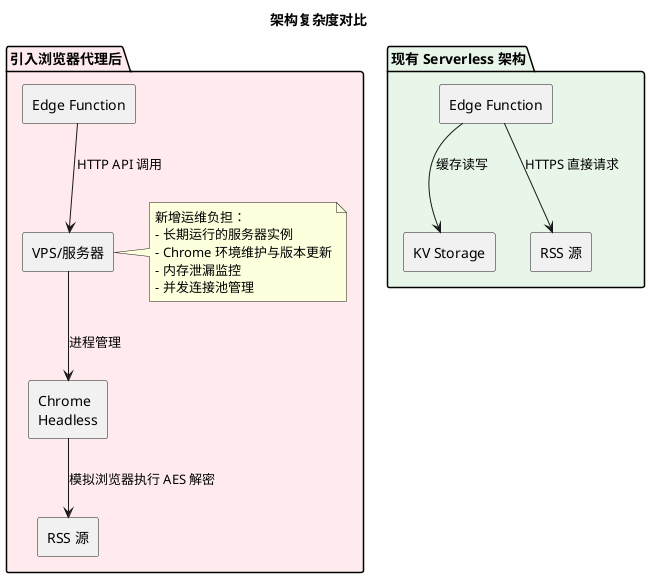
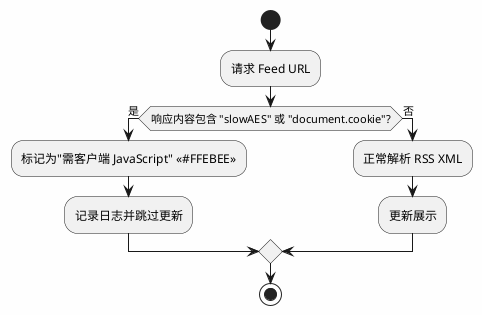

今天，在我开发和调试本站「朋友圈」模块（聚合展示友站 RSS 更新的功能）时，发现一个异常：某个友站的更新始终无法获取。

对方网站首页显示近期有文字发布，浏览器直接访问 `/?feed=rss2` 路径亦返回格式正确的 XML，时间戳新鲜。然而本站的自动化抓取服务始终获取不到数据。这构成了一个典型的调试谜题。

## 嫌疑犯排查的演绎法

面对「浏览器可访问，程序不可访问」的症状，我按可能性优先级展开排查。

**假设一：请求头识别**

部分站点的访问控制规则会基于 User-Agent 字符串进行过滤。我检查了边缘函数（Edge Function）的出站请求配置，默认使用 `SAKURAIN-RSS-Bot/1.0` 作为标识。该标识可能被识别为自动化工具而遭拦截。

验证方法是模拟 Chrome 浏览器的完整 UA 字符串进行请求。结果依旧返回空数据，故排除此假设。

**假设二：URL 编码与路径解析异常**

对方 Feed 地址格式为 `https://example.com/?feed=rss2`​，即在根路径后直接使用查询参数（query string）指向 RSS 资源，而非传统路径如 `/feed.xml`。这种 URL 结构在某些 HTTP 客户端或边缘计算环境中可能存在特殊处理逻辑。

我怀疑 `?`​ 字符可能被错误地二次编码为 `%3F`​，或者某些请求库在处理以 `?` 开头的查询参数时与服务器路由解析存在差异。此外，部分边缘网络的 URL 规范化（normalization）逻辑可能会忽略或错误重组此类参数，导致实际请求的 URI 与预期不符。

验证方法是将浏览器地址栏的完整 URL 原样复制到代码中进行硬编码请求，并检查实际发出的 HTTP 请求行（request line）是否准确保留了 `?feed=rss2` 结构。结果证实 URL 传输无误，服务器确实收到了正确的查询参数，故排除此假设。

**假设三：边缘缓存失效**

考虑到本站使用 EdgeOne KV 作为 RSS 数据的缓存层，我怀疑是缓存过期策略配置错误，导致旧的错误响应被长期保持。

通过 EdgeOne 控制台手动清除该 URL 的缓存，并强制刷新，问题依旧。这说明故障发生在请求链路的最前端，数据尚未到达缓存层即已丢失。

**假设四：传输层指纹差异**

现代反爬系统会检测 TLS 指纹（JA3/JA4）或 HTTP/2 帧序列的细微差异。边缘函数运行时的 TLS 握手特征与桌面浏览器确实存在差异。

然而，TLS 层拦截通常返回连接重置或 403 状态码，而非我观察到的「响应成功但内容为空」现象。

## 终端里的真相

使用 Postman 直接请求该 Feed 地址，终于揭示了浏览器背后隐藏的机制：

```bash
curl -s https://example.com/?feed=rss2
```

返回的并非 RSS XML，而是一段包含 AES 加密的 HTML：

```html
<html>
<body>
<script type="text/javascript" src="/aes.js"></script>
<script>
function toNumbers(d) {
    var e = [];
    d.replace(/(..)/g, function(d) {
        e.push(parseInt(d, 16))
    });
    return e
}
function toHex() {
    for (var d = [], d = 1 == arguments.length && arguments[0].constructor == Array ? arguments[0] : arguments, e = "", f = 0; f < d.length; f++)
        e += (16 > d[f] ? "0" : "") + d[f].toString(16);
    return e.toLowerCase()
}
var a = toNumbers("f655ba9d09a112d4968c63579db590b4")
  , b = toNumbers("98344c2eee86c3994890592585b49f80")
  , c = toNumbers("f76feacfe2bea1c484af6221c420c842");
document.cookie = "__test=" + toHex(slowAES.decrypt(c, 2, a, b)) + "; max-age=21600; expires=Thu, 31-Dec-37 23:55:55 GMT; path=/";
location.href = "https://imshimao.com/?feed=rss2&i=1 ";
</script>
<noscript>This site requires Javascript to work...</noscript>
</body>
</html>
```

**技术机制分析：**

该防护系统采用客户端 AES 解密挑战。服务端返回页面包含三个十六进制密钥参数 `a`​、`b`​、`c`​，要求浏览器执行 `slowAES.decrypt()`​ 计算出一个值，设置为名为 `__test` 的 Cookie，然后重定向到实际 Feed 地址。

RSS 抓取程序通常基于简单的 HTTP 客户端，不具备 JavaScript 执行能力，无法完成 AES 解密计算，因此无法通过验证。

问题的症结在于：对方为主站启用了反爬机制，但未将 `/?feed=rss2` 路径加入白名单。这导致 RSS 协议的标准客户端（包括 Feedly、Inoreader 等阅读器及本站聚合服务）均被拦截，而人类用户通过浏览器访问时因自动执行了脚本而无感知。

## 技术解法的权衡

为应对此类挑战，业界通常采用基于 WebDriver 的浏览器自动化方案。通过在服务器部署无头浏览器（Headless Chrome），模拟真实用户执行 JavaScript，完成挑战计算后获取目标内容。

该方案在技术上可行，但需引入以下架构组件：



引入浏览器代理意味着在原本无服务器的架构中插入一个**有状态、需运维的节点**。这与 Serverless 的架构哲学存在根本冲突。

## 架构哲学的边界

本站采用纯 Serverless 架构：

- 计算层运行于 Edge Functions（边缘函数）
- 数据持久化使用 KV 与 D1
- 无长期运行的服务器，无操作系统维护负担

Serverless 的核心价值在于**事件驱动、自动扩缩容、零服务器运维**。若为解决单个 RSS 源的抓取问题引入 WebDriver 代理，将产生以下技术债务：

1. **运维复杂性**：需维护 Chrome 运行环境，处理依赖更新及安全补丁
2. **资源成本**：需保持 VPS 长期运行，而非按请求付费
3. **可靠性风险**：浏览器自动化存在内存泄漏风险，需额外监控与重启机制
4. **延迟增加**：边缘函数与中心 VPS 之间的网络往返增加响应时间

更重要的是，**这是对方可修复的配置问题**。通过调整 WAF 规则，将 RSS 路径加入白名单，或允许已知 RSS 阅读器的 User-Agent 通过，即可解决。此举比所有客户端自行实现浏览器自动化更为合理。

## 尾声：防御性设计的实践

最终，我采用**优雅降级**策略处理此类异常。在抓取逻辑中增加内容类型检测：



系统不报错、不阻塞其他源的更新，仅在控制台记录信息级日志。在「朋友圈」页面 UI 上，该源暂时不显示最新内容，用户无感知。

这体现了 Serverless 架构下的工程权衡：**放弃对边缘情况（edge case）的完全兼容，换取核心架构的简洁性与可维护性**。有时，承认某些技术约束并选择不处理，比引入复杂变通方案更为合理。

当然，若该站站长看到此文，建议检查反爬规则中对 RSS 路径的豁免配置。RSS 协议基于无状态 HTTP 请求，期望直接返回 XML，而非执行加密挑战。
