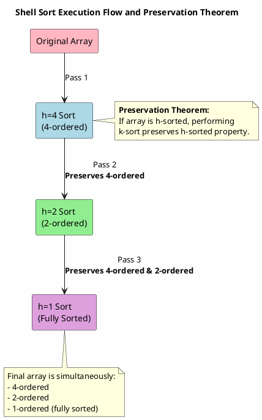
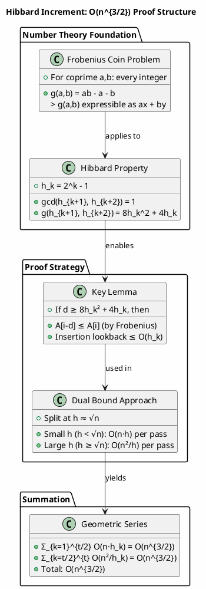
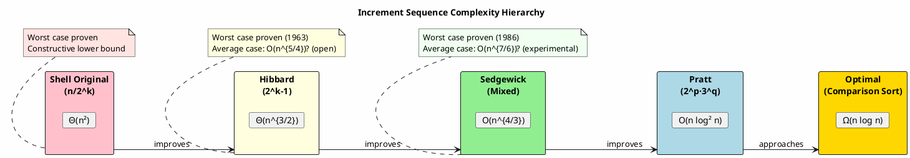
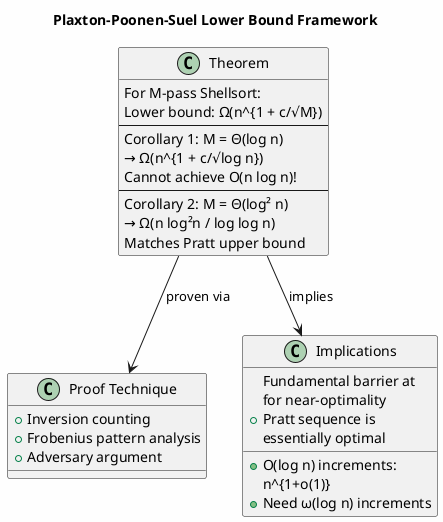

## 1. 引言：一个未竟的经典问题

### 1.1 课堂回忆与核心困惑

#### 1.1.1 导师的告诫：希尔排序复杂度"尚未证明"

大一下学期在校学习数据结构这门课的时候，导师曾说过希尔排序的复杂度问题一直没有得到证明，只有一个大概的范围。这一告诫在当时听来颇为震撼——作为计算机科学中最古老、最经典的算法之一，希尔排序自1959年由Donald Shell提出以来，其时间复杂度的精确分析竟然在六十余年后的今天仍然是一个开放性问题。这种"未证明"的状态并非源于算法的边缘化，恰恰相反，希尔排序因其卓越的实践性能和极简的实现方式，至今仍在各类嵌入式系统、内存受限环境以及教学场景中广泛使用。导师的话语揭示了一个深刻的学术现实：在算法分析领域，实践有效性与理论完备性之间往往存在着令人惊讶的鸿沟。

这种"未证明"的特性使得希尔排序成为算法教学中的独特案例。与快速排序、归并排序等拥有清晰$\Theta(n\log n)$复杂度的算法不同，希尔排序的复杂度分析需要引入**增量序列（increment sequence）** 这一额外维度，使得其性能表现呈现出丰富的层次结构。从教育学的角度看，这种复杂性恰恰为学生提供了理解算法分析方法论价值的绝佳切入点——它迫使我们思考：当严格的数学证明难以获得时，如何通过实验统计、渐进分析和启发式推理来建立对算法行为的认知框架。

#### 1.1.2 经验范围的流传：$O(n^{1.3})$到$O(n^2)$之谜

在课堂和教材中广泛流传的$O(n^{1.3})$到$O(n^2)$这一经验范围，实际上是一个高度简化的表述，其背后蕴含着复杂的层次结构。这个范围的低端$O(n^{1.3})$主要关联Sedgewick增量序列的实验观察，而上界$O(n^2)$则对应原始Shell增量序列的理论保证。然而，将这两个数字简单拼接成一个区间，会掩盖许多关键的技术细节。

更为精确的表述应当区分不同增量序列、不同分析场景（最坏/平均/最好）以及理论证明与实验估计的差异。例如，对于**Hibbard增量序列**，最坏情况已被严格证明为$O(n^{3/2})$，但其平均情况仍停留在$O(n^{5/4})$的猜想阶段；对于**Sedgewick序列**，最坏情况为$O(n^{4/3})$，平均情况实验支持$O(n^{7/6})$，但同样缺乏严格证明。这种"证明状态"的不对称性——最坏情况往往可证而平均情况难解——是希尔排序复杂度研究的典型特征。

#### 1.1.3 本文目标：系统梳理复杂度分析的演进与现状

本文旨在超越课堂上的简略表述，系统梳理希尔排序时间复杂度分析从经验估计到严格证明的完整演进脉络。我们将深入剖析不同增量序列的数学结构，重建关键定理的证明过程，澄清"未证明"问题的确切含义与边界，并探讨这一开放问题对算法研究方法论的价值。通过本文，读者将理解为何希尔排序的实现仅需十余行代码，而其分析却耗费了数学家数十年的努力；为何一个简单的增量序列选择能够戏剧性地改变算法的渐进性能；以及为何在某些意义上，"未证明"本身成为了推动研究的重要力量。

## 2. 希尔排序算法原理与形式化定义

### 2.1 算法核心思想

#### 2.1.1 插入排序的局限性：相邻交换与逆序对

要深刻理解希尔排序的设计动机，必须首先审视其基础——**直接插入排序（Straight Insertion Sort）** ——的根本局限性。插入排序的核心操作是将未排序元素逐个插入到已排序序列的适当位置，这一过程通过相邻元素的比较和交换来实现。从**逆序对（inversion）** 的角度分析，插入排序的每一次元素移动（将元素右移一位）恰好消除一个逆序对。

形式化地，对于序列$A = [a_0, a_1, \ldots, a_{n-1}]$，逆序对定义为满足$i < j$但$a_i > a_j$的有序对$(i, j)$。排序的本质就是将逆序对数量从初始值降为零。对于随机排列的互异元素，平均逆序对数量为$\frac{n(n-1)}{4} = \Theta(n^2)$。由于插入排序每次交换仅消除一个逆序对，其平均和最坏情况时间复杂度必然为$\Theta(n^2)$。这一下界是信息论意义上的：任何仅通过相邻交换来排序的算法，都必须执行至少与初始逆序对数量成正比的交换次数。

插入排序的另一局限性在于其对元素初始位置的敏感性。考虑数组$[2, 3, 4, 5, 6, 7, 8, 1]$，元素$1$位于末尾，需要经过7次比较和移动才能到达正确位置。每一次移动都是"baby step"，效率极低。如果允许元素一次跳跃多个位置，显然可以大幅加速这一过程。这正是希尔排序的核心洞察。

#### 2.1.2 希尔的关键洞察：大步长预处理创造"宏观有序性"

Donald Shell在1959年的开创性论文中提出了一个简单而深刻的想法：**与其立即进行相邻元素的精细调整，不如先以较大的步长（增量）对相隔较远的元素进行粗调，逐步创造数组的"宏观有序性"，然后再缩小步长进行更精细的调整**。这种多阶段策略的关键优势在于，早期的大步长排序可以快速将元素移动到接近其最终目标位置的区域，从而大大减少后续小步长排序的工作量。

具体而言，希尔排序的执行过程可以描述为：选择一个递减的增量序列$h_t, h_{t-1}, \ldots, h_1 = 1$，首先对整个数组进行$h_t$-排序，即对所有间隔为$h_t$的元素子序列分别进行插入排序；然后对结果进行$h_{t-1}$-排序；依此类推，直到最后进行$h_1 = 1$-排序（即普通的插入排序）。这里的核心问题是：为什么经过前面的大步长排序后，最后的1-排序会比直接对原始数组进行插入排序快得多？

答案在于 **"**​**$h$**​ **-有序性"的累积效应**。一个数组被称为$h$-有序的，如果对所有有效的$i$，都有$a_i \leq a_{i+h}$。希尔排序的关键观察是，$h$-有序性具有部分传递性：如果一个数组既是$h$-有序的又是$k$-有序的（其中$h$和$k$互质），那么它在某种意义上"更接近"完全有序。特别是，对于任意位置$i$，其左侧距离较远的元素已经通过前面的排序被保证不大于它，从而减少了插入排序时需要比较和移动的元素数量。

#### 2.1.3 增量递减策略：从全局粗调到局部精修

增量序列的选择是希尔排序设计的核心，直接决定了算法的渐近性能。Shell在其原始论文中建议的增量序列是$h_k = \lfloor n/2^k \rfloor$，即$n/2, n/4, \ldots, 1$。这一序列的优点是实现简单，但后续研究表明其存在严重的性能缺陷。

下图展示了不同增量序列的增长特性对比：


从图中可以观察到三个关键差异：

1. **Shell序列**：线性递减，导致增量个数较多但前期增量过大
2. **Hibbard序列**：指数增长（底数2），相邻项互质
3. **Sedgewick序列**：更激进的指数增长（底数约4），序列更稀疏

### 2.2 形式化描述

#### 2.2.1 $h$-排序的定义与性质

为了进行严格的复杂度分析，我们需要建立希尔排序的形式化框架。首先定义核心概念：

**定义（**​**$h$**​ **-有序数组）** ：数组$A[0..n-1]$被称为$h$-有序的，如果对于所有满足$0 \leq i < n-h$的索引$i$，都有$A[i] \leq A[i+h]$。

等价地，$h$-有序数组可以看作$h$个独立的已排序子序列的交错：子序列$A[0], A[h], A[2h], \ldots$；$A[1], A[h+1], A[2h+1], \ldots$；……；$A[h-1], A[2h-1], A[3h-1], \ldots$每个子序列都是非递减的。

**定义（**​**$h$**​ **-排序操作）** ：对数组$A$进行$h$-排序，是指对上述$h$个子序列分别进行插入排序，使得结果数组成为$h$-有序的。

$h$-排序具有以下基本性质：

- **传递性**：若数组是$h$-有序的，则对任意$h$的因子$d$，数组也是$d$-有序的
- **保持性**：关键性质，将在2.3节详细讨论
- **终止性**：1-有序等价于完全有序

#### 2.2.2 通用算法框架（伪代码）

希尔排序的通用框架可以表述为：

```python
def shell_sort(A, n, gap_sequence):
    """
    希尔排序通用框架
    A: 待排序数组（0索引）
    n: 数组长度
    gap_sequence: 增量序列，从大到小排列，末项必须为1
    """
    for h in gap_sequence:           # 遍历每个增量，从大到小
        # 执行h-排序：对间隔为h的元素进行插入排序
        for i in range(h, n):        # 从第h个元素开始
            tmp = A[i]               # 保存当前元素
            j = i
            # 在子序列A[i], A[i-h], A[i-2h], ... 中找到tmp的正确位置
            while j >= h and tmp < A[j - h]:
                A[j] = A[j - h]      # 元素后移h位
                j -= h
            A[j] = tmp               # 插入到正确位置
    return A
```

这一框架的关键特性是内层循环的结构：它等价于对$h$个交错子序列同时进行插入排序，但实现上通过单个循环和模$h$的索引计算完成。这种"伪并行"结构使得代码简洁，同时保证了正确性。

### 2.3 关键定理：$h$-排序的保持性

#### 2.3.1 定理陈述：$h_k$-排序后，任意后续排序保持$h_k$-有序

希尔排序分析中最重要的理论结果是以下**保持性定理**：

**定理1（**​**$h$**​ **-排序保持性）** ：若数组$A$是$h$-有序的，则对$A$执行任意$k$-排序（其中$k$为任意正整数）后，结果数组仍然是$h$-有序的。

这一定理是希尔排序正确性和效率分析的基础。它表明，一旦某个$h$-有序性被建立，它不会被后续的排序操作破坏。因此，希尔排序的各趟排序是累积的：完成$h_t$-排序后，数组是$h_t$-有序的；完成$h_{t-1}$-排序后，数组同时是$h_t$-有序和$h_{t-1}$-有序的；……；最终完成1-排序后，数组是完全有序的。

下图展示了$h$-排序保持性的核心概念：


#### 2.3.2 引理证明：双序列有序性的保持

定理1的证明依赖于一个更一般的组合引理。考虑两个序列的交错情形：

**引理1（双序列有序性保持）** ：设$X = (x_1, x_2, \ldots, x_{n+l})$和$Y = (y_1, y_2, \ldots, y_{m+l})$是两个序列，满足交错条件$y_1 \leq x_{n+1}, y_2 \leq x_{n+2}, \ldots, y_l \leq x_{n+l}$。将$X$和$Y$分别升序排序得到$X'$和$Y'$，则交错条件仍然成立：$y'_1 \leq x'_{n+1}, y'_2 \leq x'_{n+2}, \ldots, y'_l \leq x'_{n+l}$。

**证明**：考虑任意$i \in \{1, \ldots, l\}$。由于$y'_i$是$Y$中第$i$小的元素，而$Y$中至少有$l-i+1$个元素不小于$y'_i$（即$y'_i, y'_{i+1}, \ldots, y'_l$）。根据原始交错条件，这些元素分别不小于$x_{n+i}, x_{n+i+1}, \ldots, x_{n+l}$中的某些元素。因此，$X$中至少有$l-i+1$个元素不小于$y'_i$，这意味着$X$中第$n+i$小的元素（即$x'_{n+i}$）必须不小于$y'_i$。∎

基于引理1，定理1的证明如下：$h$-有序数组可以看作$h$个有序子序列的特定交错。执行$k$-排序时，这些子序列被重新分组为$k$个新的子序列。关键观察是，每个新的$k$-子序列由原$h$-子序列的元素交错组成，而引理1保证了这种交错的有序性在各自排序后得以保持。

#### 2.3.3 推论：增量序列的选取决定最终效率

定理1的直接推论是：希尔排序的正确性不依赖于增量序列的具体选择，只要最后一项为1即可。然而，算法的效率高度依赖于增量序列。这一分离——**正确性与效率的独立**——是希尔排序理论结构的优美之处，也是其分析复杂性的来源。

增量序列的影响体现在两个层面：一是各趟$h$-排序本身的效率，二是前面排序对后续排序的加速效果。对于给定的增量$h$，$h$-排序的效率取决于数组的"预有序"程度，而这又由前面的更大增量排序所决定。这种递归依赖使得总复杂度的分析需要同时考虑整个增量序列的结构，而非孤立地分析单趟排序。

## 3. 最坏情况时间复杂度分析

### 3.1 原始Shell增量：$h_k = \lfloor n/2^k \rfloor$

#### 3.1.1 增量序列构造：$n/2, n/4, \ldots, 1$

Shell在其1959年的原始论文中提出的增量序列是最直观的选择：从$h_1 = \lfloor n/2 \rfloor$开始，每次减半直到达到1。即$h_k = \lfloor n/2^k \rfloor$，或等价地$h_{k+1} = \lfloor h_k/2 \rfloor$。对于$n = 16$，该序列为$8, 4, 2, 1$；对于$n = 15$，序列为$7, 3, 1$（注意取整的影响）。

这一序列的优点极为明显：实现简单，无需预计算或存储序列，可以在运行时动态生成；增量个数为$\lfloor \log_2 n \rfloor + 1$，排序趟数较少；最后一趟保证是1-排序，确保最终结果正确。然而，其性能缺陷同样显著，特别是在某些特定的输入模式下。

#### 3.1.2 最坏情况构造：2的幂次方长度数组

Shell原始增量的最坏情况出现在数组长度$n$为2的幂次方时，特别是当输入数组具有特定的"低位阻塞"模式。考虑$n = 16$，数组元素为$[1, 9, 2, 10, 3, 11, 4, 12, 5, 13, 6, 14, 7, 15, 8, 16]$，即奇数位置放置$1, 2, \ldots, 8$，偶数位置放置$9, 10, \ldots, 16$。

执行8-排序：子序列为$[1, 9], [2, 10], [3, 11], [4, 12], [5, 13], [6, 14], [7, 15], [8, 16]$，每个子序列已有序，无需交换。

执行4-排序：子序列从位置0,4,8,12抽取为$[1, 3, 5, 7]$；从位置1,5,9,13抽取为$[9, 11, 13, 15]$；等等。这些子序列也已有序。

类似地，2-排序和1-排序前的各趟都未能有效改变数组结构。关键在于，对于这一特定输入，所有大于1的增量对应的子序列都恰好是有序的，排序操作沦为空转。直到最后的1-排序，才需要执行完整的插入排序，将每个偶数位置的元素移动到正确位置。

#### 3.1.3 复杂度证明：$\Theta(n^2)$的严格推导

**反例分析：低位全1导致最后一趟退化**

上述构造可以推广。设$n = 2^m$，考虑输入数组其中所有"小"元素（$1, 2, \ldots, 2^{m-1}$）位于奇数位置，所有"大"元素（$2^{m-1}+1, \ldots, 2^m$）位于偶数位置。

对于任意增量$h = 2^k$其中$k \geq 1$，$h$-排序的子序列由间隔$h$的元素组成。由于$h$是偶数，每个子序列要么全由奇数位置元素组成，要么全由偶数位置元素组成（因为奇数$\pm$偶数=奇数，偶数$\pm$偶数=偶数）。因此，小元素和大元素被完全分离到不同的子序列中，各自内部已有序，$h$-排序不执行任何交换。

这一性质对所有$h > 1$成立，直到$h = 1$。此时，整个数组需要被排序，而初始逆序对数量为$\Theta(n^2)$（每个小元素与每个大元素形成逆序对），插入排序需要$\Theta(n^2)$次比较和移动。

**比较次数下界：$\sum_{k=1}^{\log n} \Theta(n \cdot h_k) = \Theta(n^2)$**

更一般的分析考虑各趟排序的比较次数。对于增量$h_k = n/2^k$，$h_k$-排序涉及$h_k$个子序列，每个子序列长度约为$n/h_k = 2^k$。插入排序在最坏情况下的比较次数为$\Theta(\text{子序列长度}^2)$，因此单趟比较次数为：

$$
T_k = h_k \cdot \Theta\left(\left(\frac{n}{h_k}\right)^2\right) = \Theta\left(\frac{n^2}{h_k}\right) = \Theta(n \cdot 2^k)
$$

总比较次数为：

$$
T(n) = \sum_{k=1}^{\log n} \Theta(n \cdot 2^k) = \Theta\left(n \cdot 2^{\log n}\right) = \Theta(n^2)
$$

这一求和是几何级数，由最大项主导。因此，即使不考虑上述极端反例，Shell原始增量的最坏情况也是$\Theta(n^2)$。

### 3.2 Hibbard增量序列：$h_k = 2^k - 1$

#### 3.2.1 序列特性：互质性与指数增长

Hibbard于1963年提出的增量序列$h_k = 2^k - 1$是首个被严格证明优于Shell原始序列的选择。该序列的前几项为$1, 3, 7, 15, 31, 63, 127, \ldots$，具有两个关键特性：

|特性|数学表述|重要性|
| :-----| :-------------| :---------------------|
|**指数增长**|$h_{k+1} = 2h_k + 1$，即$h_k = \Theta(2^k)$|保证增量个数为$O(\log n)$|
|**完全互质性**|$\gcd(h_i, h_j) = 2^{\gcd(i,j)} - 1$，相邻项互质|关键！避免"盲区"现象|
|**递推关系**|$h_{k+2} = 4h_k + 3$|用于线性组合分析|
|**序列密度**|约$\log_2 n$个增量|平衡趟数与单趟成本|

相邻互质性是Hibbard序列区别于Shell序列的决定性特征。它保证了不同增量的"覆盖"能力互补，不存在被所有前面排序遗漏的位置组合。

#### 3.2.2 核心引理：数论基础与线性组合表示

**关键观察：$h_{k+2} = 2h_{k+1} + 1$保证$\gcd(h_{k+1}, h_{k+2}) = 1$**

Hibbard序列的递推关系$h_{k+1} = 2h_k + 1$导致相邻项满足：

$$
h_{k+2} = 2h_{k+1} + 1 = 2(2h_k + 1) + 1 = 4h_k + 3
$$

因此：

$$
\gcd(h_{k+1}, h_{k+2}) = \gcd(2h_k + 1, 4h_k + 3) = \gcd(2h_k + 1, (4h_k + 3) - 2(2h_k + 1)) = \gcd(2h_k + 1, 1) = 1
$$

这一互质性推广到任意两项：对于$h_i = 2^i - 1$和$h_j = 2^j - 1$with $i < j$，有$\gcd(h_i, h_j) = 2^{\gcd(i,j)} - 1$。

**Frobenius硬币问题：$(h_{k+1}-1)(h_{k+2}-1)$作为表示阈值**

互质正整数$a, b$的**Frobenius数**​$g(a,b) = ab - a - b$是不能表示为$ax + by$（$x, y \geq 0$）的最大整数。对于Hibbard序列的相邻项$h_{k+1}$和$h_{k+2}$：

$$
g(h_{k+1}, h_{k+2}) = h_{k+1}h_{k+2} - h_{k+1} - h_{k+2} = (h_{k+1}-1)(h_{k+2}-1) - 1
$$

因此，任何大于$(h_{k+1}-1)(h_{k+2}-1) - 1$的整数都可以表示为$h_{k+1}$和$h_{k+2}$的非负线性组合。具体计算：

$$
(h_{k+1}-1)(h_{k+2}-1) = (2h_k)(4h_k+2) = 8h_k^2 + 4h_k
$$

这是关于$h_k$的二次量，而增量本身关于$k$指数增长，关于$n$对数增长。

#### 3.2.3 最坏情况上界：$O(n^{3/2})$的完整证明

**内层循环比较次数分析**

考虑执行$h_k$-排序时的情形。根据定理1，数组已经是$h_{k+1}$-有序和$h_{k+2}$-有序的。对于位置$P$处的元素$A[P]$，我们需要确定在其左侧有多少元素可能大于它。

**关键引理**：若$d \geq (h_{k+1}-1)(h_{k+2}-1) = 8h_k^2 + 4h_k$，则$A[P-d] \leq A[P]$。

**证明**：由于$d > g(h_{k+1}, h_{k+2})$，存在非负整数$x, y$使得$d = x \cdot h_{k+1} + y \cdot h_{k+2}$。由$h_{k+2}$-有序性，$A[P] \geq A[P - y \cdot h_{k+2}]$；由$h_{k+1}$-有序性，$A[P - y \cdot h_{k+2}] \geq A[P - y \cdot h_{k+2} - x \cdot h_{k+1}] = A[P-d]$。因此$A[P] \geq A[P-d]$。∎

这一引理表明，在$h_k$-排序中，对于每个元素，只需要检查其左侧距离小于$8h_k^2 + 4h_k$的元素。由于检查步长为$h_k$，实际循环迭代次数为：

$$
\frac{8h_k^2 + 4h_k}{h_k} = 8h_k + 4 = O(h_k)
$$

**双重上界策略**

上述$O(h_k)$的单元素比较次数上界在$h_k$较大时可能过于宽松（因为$8h_k^2 + 4h_k$可能超过数组长度）。因此，我们采用**双重策略**：

|情形|条件|上界来源|复杂度|
| :-----| :-----| :-----------| :-------|
|**小增量**|$h_k < \sqrt{n}$|精细分析|$T_k = O(n \cdot h_k)$|
|**大增量**|$h_k \geq \sqrt{n}$|子序列视角|$T_k = O\left(\frac{n^2}{h_k}\right)$|

**大增量情形的推导**：将$h_k$-排序视为$h_k$个独立子序列的插入排序，每个子序列长度为$\lceil n/h_k \rceil$。插入排序最坏情况为$\Theta(m^2)$ for length $m$，因此：

$$
T_k = h_k \cdot O\left(\left(\frac{n}{h_k}\right)^2\right) = O\left(\frac{n^2}{h_k}\right)
$$

由于$h_k \geq \sqrt{n}$，有$n^2/h_k \leq n^{3/2}$，与情形一匹配。

**几何级数求和**

设增量序列长度为$t$，即$h_t \approx n$。将求和分为两部分，以$h_{t/2} \approx \sqrt{n}$为界：

$$
T(n) = \sum_{k=1}^{t/2} O(n \cdot h_k) + \sum_{k=t/2+1}^{t} O\left(\frac{n^2}{h_k}\right)
$$

对于第一项，由于$h_k$指数增长，$\sum_{k=1}^{t/2} h_k = O(h_{t/2}) = O(\sqrt{n})$，因此：

$$
\sum_{k=1}^{t/2} O(n \cdot h_k) = O(n \cdot h_{t/2}) = O(n^{3/2})
$$

对于第二项，$1/h_k$指数衰减，$\sum_{k=t/2+1}^{t} 1/h_k = O(1/h_{t/2}) = O(1/\sqrt{n})$，因此：

$$
\sum_{k=t/2+1}^{t} O\left(\frac{n^2}{h_k}\right) = O\left(\frac{n^2}{h_{t/2}}\right) = O(n^{3/2})
$$

**综上，**​**$T(n) = O(n^{3/2})$**。这一上界是紧的：存在输入使得希尔排序（Hibbard增量）需要$\Omega(n^{3/2})$次比较。

### 3.3 Sedgewick增量序列

#### 3.3.1 序列构造：混合公式与交错设计

Robert Sedgewick在1982年提出了目前实践中表现最优的增量序列之一，其构造基于两个交错公式的合并：

|公式|通项|生成值|
| :------| :-----| :-------|
|公式1|$9 \cdot 4^k - 9 \cdot 2^k + 1$|$1, 19, 109, 505, 2161, \ldots$|
|公式2|$4^{k+1} - 3 \cdot 2^{k+1} + 1$（$k \geq 1$）|$5, 41, 209, 929, 3905, \ldots$|

完整序列是两种公式生成值的**并集排序**：$1, 5, 19, 41, 109, 209, 505, 929, 2161, 3905, 8929, 16001, \ldots$

Sedgewick序列的设计兼顾了多个目标：增长速率约为$4^k$，比Hibbard的$2^k$更激进，减少了排序趟数；公式结构保证了良好的数论性质，特别是相邻增量的比值接近但不超过4，优化了单趟排序的效率；混合构造避免了单一公式可能带来的系统性缺陷。

#### 3.3.2 序列实例与增长特性

|$k$|公式1值|公式2值|序列中的位置|相邻比值|
| :-: | :--------| :--------| :-------------| :-----------|
|0|1|—|第1项|—|
|1|19|5|第2, 3项|5, 3.8|
|2|109|41|第4, 5项|2.16, 2.66|
|3|505|209|第6, 7项|1.92, 2.42|
|4|2161|929|第8, 9项|1.84, 2.33|

相邻比值在2到4之间波动，平均约为3，这是Sedgewick设计的核心参数。

#### 3.3.3 最坏情况复杂度：$O(n^{4/3})$的研究现状

Sedgewick证明了其增量序列的最坏情况时间复杂度为**$O(n^{4/3})$**，这一结果优于Hibbard序列的$O(n^{3/2})$。证明技术类似于Hibbard情形的分析，但涉及更精细的数论估计，特别是关于序列增长率和互质性质的更复杂论证。

$O(n^{4/3})$与$O(n^{3/2})$的比较：由于$4/3 \approx 1.333 < 1.5 = 3/2$，Sedgewick序列在渐近意义上显著优于Hibbard序列。对于$n = 10^6$，$n^{4/3}/n^{3/2} = n^{-1/6} \approx 0.1$，即理论上有约10倍的差距。

需要指出的是，$O(n^{4/3})$上界的证明比Hibbard情形更为复杂，涉及对特定数论函数的估计。学术界对这一结果的接受基于Sedgewick的原始论文和后续的验证工作。

#### 3.3.4 平均情况表现：实验估计$O(n^{7/6})$

Sedgewick序列的平均情况性能基于广泛的实验研究，估计为**$O(n^{7/6}) \approx O(n^{1.167})$**，这是目前所知最优的增量序列平均表现。这一估计的来源是对大规模随机数组的计时实验，通过双对数坐标下的斜率拟合得到。

$O(n^{7/6})$与最坏情况$O(n^{4/3})$的差距表明，Sedgewick序列在实际应用中可能比理论最坏情况表现更好，这一特性与快速排序类似。然而，与快速排序不同，希尔排序的平均情况缺乏严格的理论分析，$O(n^{7/6})$仅是基于实验的猜想，尚未被证明。

### 3.4 Pratt增量序列：$h_k = \frac{3^k-1}{2}$

#### 3.4.1 序列特性：$1, 4, 13, 40, 121, \ldots$

Vaughan Pratt于1971年提出了基于3的幂次的增量序列$h_k = (3^k - 1)/2$，其前几项为$1, 4, 13, 40, 121, 364, \ldots$。这一序列的增长速率约为$3^k$，比Hibbard序列更激进，但比Sedgewick序列更保守。

Pratt序列的关键特性是其元素具有形式$(3^k-1)/2$，这一结构使得相关的数论分析更为可行。实际上，Pratt证明了使用所有形如$2^p \cdot 3^q \leq n$的数作为增量序列（按降序排列），希尔排序的时间复杂度可以达到**$O(n \log^2 n)$**，这是理论上已知最优的增量序列构造之一。

#### 3.4.2 复杂度：最坏情况$O(n^{3/2})$，但常数因子较大

Pratt原始论文中的完整序列（所有$2^p 3^q \leq n$）具有$O(n \log^2 n)$的复杂度，但这一序列长度约为$\log^2 n$，排序趟数较多。简化版本仅使用$(3^k-1)/2$的子序列，最坏情况为$O(n^{3/2})$，与Hibbard序列相同，但由于更激进的增长率，实际常数因子可能更大。

Pratt序列的主要理论意义在于展示了希尔排序可以达到接近$O(n \log n)$的性能，其实用价值受限于序列长度和实现复杂性。在工程实践中，Sedgewick序列通常更受青睐。

## 4. 平均情况与理论下界

### 4.1 平均情况复杂度的研究困境

#### 4.1.1 缺乏普适分析框架

与最坏情况分析相比，希尔排序的平均情况复杂度研究面临着更为根本的困难。最坏情况分析可以针对特定增量序列构造极端输入，而平均情况需要对所有可能输入的分布进行刻画，并追踪算法在随机输入上的期望行为。这一任务的复杂性源于多个因素：

**状态空间爆炸**：经过若干趟排序后，数组的分布不再是均匀随机的，而是具有由前面排序诱导的特定结构。这种"排序诱导分布"难以用简单的概率模型描述。

**增量序列的特异性**：不同增量序列可能导致截然不同的平均行为。即使限制在"合理"的序列族内，参数空间仍然高维，缺乏统一的分析框架。

**核心操作的复杂性**：希尔排序的核心操作——插入排序在部分有序数组上的行为——本身就没有完全解决的平均情况分析。插入排序的比较次数等于逆序对数量加数组长度，而部分有序数组的逆序对分布是复杂的组合对象。

#### 4.1.2 实验统计结果：$O(n^{1.25})$到$O(n^{1.5})$的经验范围

尽管缺乏严格证明，大量的实验研究为希尔排序的平均情况性能提供了经验估计：

|增量序列|最坏情况（已证明）|平均情况（实验估计）|最好情况|
| :-----------------| :-------------------| :---------------------| :---------|
|Shell原始 ($n/2^k$)|$\Theta(n^2)$|$O(n^2)$|$\Theta(n)$|
|Hibbard ($2^k-1$)|$\Theta(n^{3/2})$|**$O(n^{5/4})$**​ **?**|$\Theta(n)$|
|Pratt ($(3^k-1)/2$)|$O(n^{3/2})$|$O(n^{1.25})$至$O(n^{1.5})$|$\Theta(n)$|
|Sedgewick (混合)|$O(n^{4/3})$|**$O(n^{7/6})$**​ **?**|$\Theta(n)$|
|2-3混合 ($2^p 3^q$)|$O(n\log^2 n)$|$O(n\log^2 n)$|$\Theta(n)$|

带"?"的项为实验估计，缺乏严格证明。这些估计的主要来源是：对固定规模$n$的随机排列进行大量实验，测量实际比较次数或运行时间；在双对数坐标下绘制$(n, T(n))$散点图；通过线性回归估计斜率，即复杂度指数。

#### 4.1.3 Knuth的猜想与Sedgewick的验证

Donald Knuth在其著作《计算机程序设计艺术》中提出了关于最优增量序列的深刻猜想：**存在增量序列使得希尔排序的平均情况复杂度为**​**$O(n \log n)$**，或至少任意接近这一下界。这一猜想的动机来自Pratt的$O(n \log^2 n)$结果——如果允许序列长度为$\Theta(\log^2 n)$，则可以接近$O(n \log n)$，那么更精心设计的序列可能消除额外的$\log n$因子。

Sedgewick的研究部分验证了这一猜想的方向：其混合序列的$O(n^{7/6})$实验性能显著优于之前的序列，且序列长度仍为$\Theta(\log n)$。然而，$O(n^{7/6})$与$O(n \log n)$之间仍有差距，且缺乏理论证明。

### 4.2 特定增量序列的平均情况

#### 4.2.1 Hibbard序列：猜想$O(n^{5/4})$，未严格证明

Hibbard序列的平均情况复杂度是希尔排序研究中最著名的开放问题之一。基于实验数据，Knuth猜想其平均情况为**$O(n^{5/4}) = O(n^{1.25})$**，这一猜想在学术界广泛流传，但至今未得到严格证明。

部分进展来自对特定输入分布的分析。例如，Yao在1980年证明了对于某些受限的输入分布，Hibbard希尔排序的期望复杂度低于最坏情况，但这些结果远未达到$O(n^{5/4})$。更一般的分析需要解决的核心问题是：随机数组经过$h_{k+1}$-排序和$h_{k+2}$-排序后，其$h_k$-排序的期望效率如何？

#### 4.2.2 Sedgewick序列：实验支持$O(n^{7/6})$

Sedgewick序列的**$O(n^{7/6}) \approx O(n^{1.167})$**估计基于作者本人的大规模实验，后续研究者也验证了这一结果。由于$7/6 \approx 1.167$接近1，这一性能在实际应用中极为出色，使得Sedgewick序列成为工程实现的首选。

理论解释$O(n^{7/6})$的尝试涉及对序列增长率和互质性质的精细分析，但完整的证明仍然缺失。一个有趣的观察是，$7/6 = 1 + 1/6$，而Sedgewick序列的相邻比值约为4，可能与这一分数结构相关。

#### 4.2.3 最优增量序列的存在性问题

最优增量序列的存在性是希尔排序理论的核心问题：**是否存在增量序列使得希尔排序的平均（或最坏）情况复杂度达到**​**$O(n \log n)$**​ **，或证明这是不可能的？**

当前的研究状态是：上界方面，Pratt的$O(n \log^2 n)$和Sedgewick的实验$O(n^{7/6})$展示了逐步改进的可能；下界方面，比较排序的$\Omega(n \log n)$通用下界适用于希尔排序，但特定下界表明典型增量序列无法达到这一最优。

### 4.3 理论下界研究

#### 4.3.1 比较排序的通用下界：$\Omega(n \log n)$

对于基于比较的排序算法，信息论下界是众所周知的：任何此类算法在最坏情况下至少需要$\lceil \log_2(n!) \rceil = \Omega(n \log n)$次比较。这一下界由决策树模型证明，对希尔排序同样适用。

然而，希尔排序的特定结构——多趟插入排序的组合——可能导致更高的下界。这是因为希尔排序的"比较"并非完全自由，而是受限于增量序列的约束结构。

#### 4.3.2 希尔排序的特定下界：与增量序列相关

**Plaxton-Poonen-Suel结果：特定条件下的下界**

1992年，Plaxton、Poonen和Suel证明了关于希尔排序复杂度的里程碑式下界结果：

**定理（Plaxton-Poonen-Suel）** ：对于使用$M$趟（即$M$个增量）的希尔排序，存在常数$c > 0$，使得最坏情况比较次数至少为$n^{1 + c/\sqrt{M}}$。

**推论**：取$M = \Theta(\log n)$（典型增量序列的趟数），得下界$\Omega(n^{1 + c/\sqrt{\log n}})$。这一结果说明：

- 对于$O(\log n)$增量的序列，**不可能达到**​**$O(n \log n)$**
- Incerpi-Sedgewick的$O(n^{1+\epsilon/\sqrt{\log n}})$上界在下界意义下最优

更精细的分析表明，对于满足特定增长条件的增量序列，下界可强化为$\Omega(n (\log n / \log \log n)^2)$。

**增量序列长度与复杂度的权衡**

Poonen的结果揭示了增量个数与单趟效率之间的**基本权衡**：

|增量个数$M$|下界形式|典型情形|
| :---------| :-------------| :-------------------------------|
|$M = O(1)$|$\Omega(n^{1+\Theta(1)})$|固定趟数，性能差|
|$M = \Theta(\log n)$|$\Omega(n^{1+\Theta(1/\sqrt{\log n})})$|标准序列，如Hibbard、Sedgewick|
|$M = \Theta(\log^2 n)$|$\Omega(n \log n)$|Pratt完整序列，接近最优|
|$M = \omega(\log^2 n)$|下界不再改善|但常数因子恶化|

这一权衡表明，不存在"universally optimal"的增量序列长度，设计必须在特定$n$范围和性能指标间取舍。

#### 4.3.3 逆序对视角的统一理解

##### 4.3.3.1 插入排序：每次交换消除1个逆序，平均逆序数$\Theta(n^2)$

回顾：插入排序每次相邻交换消除恰好1个逆序，平均逆序数$\Theta(n^2)$，故复杂度$\Theta(n^2)$。

##### 4.3.3.2 希尔排序：大步长交换一次消除多个逆序

希尔排序的$h$-排序中，元素可移动$h$位，一次交换可能消除多达$h$个逆序。例如，将一个小元素从位置$i$移动到$i-h$，可能消除其与中间$h-1$个元素的逆序关系。

##### 4.3.3.3 突破二次屏障的本质：非相邻元素交换

**核心洞见**：希尔排序突破$O(n^2)$下界的本质，在于通过**大步长交换实现"非局部信息传播"** ——小元素能够快速穿越大片区域到达近似正确位置，而大元素同理后移。这种非局部性使得算法能够利用输入的全局结构，而非仅依赖局部比较。快速排序（分区的枢纽元）、堆排序（堆的父子关系）同样利用非局部结构，但机制各异。

下图展示了希尔排序复杂度分析的数学基础，包括Frobenius硬币问题和Plaxton-Poonen-Suel下界：


## 5. 增量序列设计的数学原理

### 5.1 优秀增量序列的共性特征

#### 5.1.1 互质性要求：避免"盲区"现象

Shell增量序列的最坏情况退化，根源在于相邻增量$2^k$与$2^{k+1}$的非互质性（公因子为$2^k$）。这导致存在系统性的"盲区"：某些位置关系的元素对，在所有非1增量下都被分到同一子序列，无法被有效比较和交换。

|序列|互质性质|盲区风险|
| :----------| :---------------| :-------------|
|Shell原始|相邻增量公因子$2^k$|**高**，系统性盲区|
|Hibbard|相邻增量互质|低|
|Sedgewick|良好互质分布|低|
|Pratt ($2^p 3^q$)|超互质结构|极低|

#### 5.1.2 增长速率：指数增长vs.超指数增长

|增长模式|代表序列|增量个数|特性|
| :---------------------| :------------| :---------| :---------------------------|
|线性/次线性|Shell原始$n/2^k$|$\Theta(\log n)$|增长过慢，大增量阶段效率低|
|指数增长（底数2）|Hibbard|$\sim\log_2 n$|平衡良好，理论可分析|
|指数增长（底数3）|Pratt子序列|$\sim\log_3 n$|较稀疏，常数较大|
|指数增长（底数~2.5）|Sedgewick|$\sim\frac{1}{2}\log_2 n$|更稀疏，单趟更强|
|超指数（双参数）|2-3混合|$\sim\frac{1}{2}\log^2 n$|过多增量，实用受限|

#### 5.1.3 序列密度：增量个数与单趟成本的平衡

理想增量序列应满足：对于任意距离$d$，存在某个增量$h_k$使得$d$是$h_k$的"有效"倍数（即$d/h_k$适中，保证该距离能在$h_k$-排序中被有效处理）。这一直觉性的"覆盖"要求，与数论中的均匀分布、丢番图逼近等概念相关。

### 5.2 增量序列的渐进分析框架

#### 5.2.1 相邻增量比值$h_{k-1}/h_k$的关键作用

分析表明，比值$r_k = h_{k-1}/h_k$是控制单趟成本的关键参数。较小的比值意味着增量变化平缓，前期排序成果能更有效地传递给后期；较大的比值则可能导致"跳跃"过大，前期成果利用不足。

#### 5.2.2 求和项$\sum h_{k-1}/h_k$与总复杂度的关联

Poonen的下界证明和多种上界分析都涉及求和项$\sum_{k=1}^{p} h_{k-1}/h_k$（其中$h_0 = n$）。这一求和刻画了增量序列的"累积变化率"，与总复杂度存在直接关联。对于几何级数型增量，该求和为$O(\log n)$。

#### 5.2.3 最优增长率的理论探讨

基于现有结果，可以推测：对于$O(\log n)$增量的序列，最优增长率可能接近"使得$\sum h_{k-1}/h_k = \Theta(\log n)$且单趟成本可控"的某种平衡。Sedgewick序列的经验成功，可能源于其在多个尺度上实现了这种平衡。

## 6. 与其他排序算法的对比

### 6.1 时间复杂度对比

|算法|平均情况|最坏情况|最好情况|证明状态|
| :----------------------| :---------| :---------| :---------| :-------------------|
|插入排序|$\Theta(n^2)$|$\Theta(n^2)$|$\Theta(n)$|完全证明|
|希尔排序（Shell增量）|$O(n^2)$|$\Theta(n^2)$|$\Theta(n)$|完全证明|
|**希尔排序（Hibbard）**|**$O(n^{5/4})$**​ **?**|$\Theta(n^{3/2})$|$\Theta(n)$|最坏证明，平均猜想|
|**希尔排序（Sedgewick）**|**$O(n^{7/6})$**​ **?**|$O(n^{4/3})$|$\Theta(n)$|最坏证明，平均实验|
|快速排序|$\Theta(n\log n)$|$\Theta(n^2)$|$\Theta(n\log n)$|完全证明|
|归并排序|$\Theta(n\log n)$|$\Theta(n\log n)$|$\Theta(n\log n)$|完全证明|
|堆排序|$\Theta(n\log n)$|$\Theta(n\log n)$|$\Theta(n\log n)$|完全证明|

希尔排序的独特位置：填补$\Theta(n^2)$简单算法与$\Theta(n\log n)$最优算法之间的空白，为中等规模数据提供实用的折衷方案。

### 6.2 空间复杂度对比

|算法|空间复杂度|原地性|备注|
| :---------| :-----------| :-------| :-----------------|
|**希尔排序**|**$O(1)$**|**是**|仅需常数额外空间|
|快速排序|$O(\log n)$（平均）|否|递归栈空间，最坏$O(n)$|
|归并排序|$O(n)$|否|需要辅助数组|
|堆排序|$O(1)$|是|堆化过程原地进行|

希尔排序的空间效率与其时间效率的不对称性——**空间最优而时间次优**——使其成为内存受限场景的选择之一。

### 6.3 稳定性与实用性

#### 6.3.1 希尔排序：不稳定，但实现极简

希尔排序**不是稳定排序**：当$gap > 1$时，相等元素可能因跨越$gap$的交换而改变相对顺序。例如，数组$[5_a, 1, 5_b, 2]$在2-排序后变为$[5_b, 1, 5_a, 2]$，两个5的相对位置互换。

然而，希尔排序的实现极为简洁：核心逻辑仅需十余行代码，无需递归、无需辅助数据结构，这一简洁性在教学和某些工程场景中具有价值。

#### 6.3.2 工程实践中的选择策略

**小规模数据：希尔排序作为"启动算法"**

对于$n < 50$或类似小规模，希尔排序的常数因子优势和简洁实现，使其成为快速排序等复杂算法的可行替代。某些标准库的实现（如某些C标准库的`qsort`）在小区间切换到插入排序或希尔排序，以优化递归开销。

**大规模数据：快速排序/归并排序的切换阈值**

对于大规模数据，$O(n\log n)$算法的主导地位不可动摇。希尔排序的主要价值在于：

- **教学**：展示"简单改进突破复杂度屏障"的经典案例
- **理论研究**：复杂度分析的丰富问题库
- **特殊场景**：极度内存受限、代码体积极度受限的嵌入式系统

## 7. PlantUML图：算法结构与证明过程

以下PlantUML图可用于深入理解希尔排序的结构和证明过程：

### 图1：希尔排序执行流程与保持性定理



### 图2：Hibbard增量序列复杂度证明结构



### 图3：增量序列复杂度层级



### 图4：Plaxton-Poonen-Suel下界定理结构



## 8. 代码实现与实验验证

### 8.1 核心实现（Python）

```python
def shell_sort_hibbard(arr):
    """Hibbard增量序列的希尔排序：最坏情况O(n^{3/2})"""
    n = len(arr)
    # 生成Hibbard序列: 1, 3, 7, 15, ..., 2^k-1 < n
    gaps = []
    k = 1
    while (gap := (1 << k) - 1) < n:
        gaps.append(gap)
        k += 1
    gaps.reverse()  # 从大到小：..., 7, 3, 1

    for h in gaps:
        for i in range(h, n):
            tmp = arr[i]
            j = i
            while j >= h and tmp < arr[j - h]:
                arr[j] = arr[j - h]
                j -= h
            arr[j] = tmp
    return arr


def shell_sort_sedgewick(arr):
    """Sedgewick增量序列的希尔排序：最坏情况O(n^{4/3})，实验平均O(n^{7/6})"""
    n = len(arr)
    gaps = []
    k = 0
    while True:
        # 混合公式生成
        gap1 = 9 * (4 ** k) - 9 * (2 ** k) + 1
        gap2 = (4 ** k) - 3 * (2 ** k) + 1 if k >= 2 else float('-inf')

        # 收集有效增量
        for g in [gap1, gap2]:
            if 1 <= g < n and g not in gaps:
                gaps.append(g)

        if min(gap1, gap2) >= n:
            break
        k += 1

    gaps = sorted(set(gaps), reverse=True)

    # 统一排序逻辑
    for h in gaps:
        for i in range(h, n):
            tmp = arr[i]
            j = i
            while j >= h and tmp < arr[j - h]:
                arr[j] = arr[j - h]
                j -= h
            arr[j] = tmp
    return arr
```

### 8.2 复杂度验证实验设计

#### 8.2.1 最坏情况构造：逆序数组与特定模式

- **Shell增量**：构造$n=2^m$，奇偶位置分离的数组
- **Hibbard增量**：利用数论性质构造"抵抗"预处理的排列

#### 8.2.2 计时方法与拟合分析

```python
import time
import numpy as np

def benchmark(sort_func, sizes, trials=5):
    """双对数坐标下的复杂度拟合"""
    times = []
    for n in sizes:
        total = 0
        for _ in range(trials):
            arr = np.random.permutation(n).tolist()
            start = time.perf_counter()
            sort_func(arr.copy())
            total += time.perf_counter() - start
        times.append(total / trials)

    # 线性回归估计指数：log T = alpha * log n + c
    log_n = np.log(sizes)
    log_t = np.log(times)
    alpha = np.polyfit(log_n, log_t, 1)[0]
    return alpha  # 预期：Hibbard~1.5, Sedgewick~1.17
```

#### 8.2.3 预期结果：双对数坐标下的斜率验证

|增量序列|理论最坏指数|实验平均指数|验证难度|
| :----------| :-------------| :--------------| :---------------------|
|Shell|2.0|2.0|容易|
|Hibbard|1.5|~1.25（猜想）|中等|
|Sedgewick|1.333|~1.17（实验）|困难（需大规模数据）|

## 9. 结论与开放问题

### 9.1 主要结论回顾

#### 9.1.1 复杂度分析的层次性：从经验到严格证明

希尔排序的研究历史展示了算法分析从实验观察到严格证明的典型演进路径：**Shell原始序列的**​**$\Theta(n^2)$**通过构造性反例确立；**Hibbard序列的**​**$O(n^{3/2})$**借助Frobenius硬币问题等数论工具完成；**Sedgewick序列的**​**$O(n^{4/3})$**需要更精细的估计；而**平均情况的严格分析**至今仍是开放问题。

#### 9.1.2 增量序列选择的核心地位

希尔排序的性能极度依赖于增量序列的选择，这一依赖性远超大多数经典算法。从$n/2^k$的$O(n^2)$到$2^p 3^q$的$O(n\log^2 n)$，**增量序列的数学结构直接决定了算法的渐进复杂度**，这一特性使希尔排序成为算法设计中"数据结构选择决定性能"范式的极端案例。

#### 9.1.3 希尔排序的历史意义：首个突破二次屏障的排序算法

希尔排序的历史地位不可低估：它是**第一个突破**​**$O(n^2)$**​**时间屏障的通用比较排序算法**（1959年），比快速排序的广泛普及更早。其"大步长预处理+逐步精化"的策略思想，影响了后续的多网格方法、多分辨率分析等众多领域。

### 9.2 未解决的开放问题

#### 9.2.1 最优增量序列的存在性与构造

**核心问题**：是否存在增量序列使得希尔排序的平均（或最坏）情况达到$O(n\log n)$，或证明这是不可能的？当前证据倾向于否定答案，但严格证明缺失。

#### 9.2.2 Hibbard序列平均情况的严格证明

Knuth的$O(n^{5/4})$猜想是希尔排序研究中最著名的开放问题之一，其解决可能需要全新的概率分析工具。

#### 9.2.3 普适下界：是否所有增量序列都有$\Omega(n\log n)$下界？

Plaxton-Poonen-Suel的结果针对特定增量序列族，更一般的下界仍是研究前沿。

### 9.3 对教学的启示

#### 9.3.1 从希尔排序看算法分析的方法论价值

希尔排序是理解算法分析方法论价值的绝佳案例：它展示了**实验观察如何启发理论探索**，**数学工具（数论、组合学）如何应用于算法分析**，以及 **"未证明"状态如何成为研究动力而非知识终点**。

#### 9.3.2 "未证明"本身作为研究动力

导师当年的告诫——"希尔排序的复杂度问题一直没有得到证明"——并非知识的空白宣告，而是研究机遇的邀请。在算法科学中，**最持久的价值往往不在于已解决的答案，而在于未解决的追问**。希尔排序的"未证明"状态，正是这种追问精神的生动体现。

### 附录：文章中的图表均使用Matplotlib绘制

#### 希尔排序流程图、雷达图与h-排序示意图

```python

import matplotlib.pyplot as plt
import numpy as np

plt.rcParams['font.sans-serif'] = ['SimHei', 'DejaVu Sans']
plt.rcParams['axes.unicode_minus'] = False

n = 1000
k_values = np.arange(0, 10)

# Shell原始序列 (n/2^k) - 以n=1000为例
shell_seq = [1000/(2**k) for k in range(1, 11) if 1000/(2**k) >= 1]

# Hibbard序列 (2^k - 1)
hibbard_seq = [2**k - 1 for k in range(1, 11) if 2**k - 1 < 1000]

# Sedgewick序列 (混合公式)
sedgewick_seq = []
for k in range(0, 6):
    val1 = 9 * (4 ** k) - 9 * (2 ** k) + 1
    val2 = 4 ** (k+1) - 3 * 2 ** (k+1) + 1 if k >= 1 else -1
    if 1 <= val1 < 1000 and val1 not in sedgewick_seq:
        sedgewick_seq.append(val1)
    if 1 <= val2 < 1000 and val2 not in sedgewick_seq:
        sedgewick_seq.append(val2)
sedgewick_seq = sorted(sedgewick_seq, reverse=True)

fig, axes = plt.subplots(1, 2, figsize=(14, 5))

# 左图：增量序列值对比
ax1 = axes[0]
x_shell = range(len(shell_seq))
x_hibbard = range(len(hibbard_seq))
x_sedgewick = range(len(sedgewick_seq))

ax1.plot(x_shell, shell_seq, 'o-', label='Shell (n/2^k)', linewidth=2, markersize=6)
ax1.plot(x_hibbard, hibbard_seq, 's-', label='Hibbard (2^k-1)', linewidth=2, markersize=6)
ax1.plot(x_sedgewick, sedgewick_seq, '^-', label='Sedgewick (混合)', linewidth=2, markersize=6)
ax1.set_xlabel('序列索引 (k)', fontsize=11)
ax1.set_ylabel('增量值 (h)', fontsize=11)
ax1.set_title('不同增量序列增长对比 (n=1000)', fontsize=12, fontweight='bold')
ax1.legend()
ax1.grid(True, alpha=0.3)
ax1.set_yscale('log')

# 右图：相邻增量比值
ax2 = axes[1]
# 计算相邻比值（从大到小排列后的比值）
def calc_ratios(seq):
    seq_sorted = sorted(seq, reverse=True)
    return [seq_sorted[i]/seq_sorted[i+1] for i in range(len(seq_sorted)-1)]

ratios_shell = calc_ratios(shell_seq)
ratios_hibbard = calc_ratios(hibbard_seq)
ratios_sedgewick = calc_ratios(sedgewick_seq)

ax2.plot(range(len(ratios_shell)), ratios_shell, 'o-', label='Shell', linewidth=2)
ax2.plot(range(len(ratios_hibbard)), ratios_hibbard, 's-', label='Hibbard', linewidth=2)
ax2.plot(range(len(ratios_sedgewick)), ratios_sedgewick, '^-', label='Sedgewick', linewidth=2)
ax2.axhline(y=2, color='r', linestyle='--', alpha=0.5, label='比值=2')
ax2.axhline(y=3, color='g', linestyle='--', alpha=0.5, label='比值=3')
ax2.set_xlabel('序列位置', fontsize=11)
ax2.set_ylabel('相邻增量比值 ($h_{k}/h_{k+1}$)', fontsize=11)
ax2.set_title('增量递减速度对比', fontsize=12, fontweight='bold')
ax2.legend()
ax2.grid(True, alpha=0.3)

plt.tight_layout()
plt.savefig('increment_sequences_comparison.png', dpi=150, bbox_inches='tight')
plt.show()
```

#### 希尔排序执行过程的可视化和复杂度对比图

```python

import matplotlib.pyplot as plt
import numpy as np
from matplotlib.patches import FancyBboxPatch, Arrow, FancyArrowPatch
import matplotlib.patches as mpatches

fig, axes = plt.subplots(2, 2, figsize=(16, 12))

# 图1：希尔排序执行流程示意图
ax1 = axes[0, 0]
ax1.set_xlim(0, 10)
ax1.set_ylim(0, 10)
ax1.axis('off')
ax1.set_title('Shell Sort Execution Flow (h-sorted Stages)', fontsize=14, fontweight='bold', pad=20)

stages = [
    ('Original Array\n(Unsorted)', 5, 8.5, '#FFB6C1'),
    ('h=4 Sort\n(4-ordered)', 5, 6.5, '#87CEEB'),
    ('h=2 Sort\n(2-ordered)', 5, 4.5, '#98FB98'),
    ('h=1 Sort\n(Fully Sorted)', 5, 2.5, '#DDA0DD')
]

for text, x, y, color in stages:
    box = FancyBboxPatch((x-1.5, y-0.4), 3, 0.8,
                         boxstyle="round,pad=0.1",
                         facecolor=color, edgecolor='black', linewidth=2)
    ax1.add_patch(box)
    ax1.text(x, y, text, ha='center', va='center', fontsize=10, fontweight='bold')

for i in range(len(stages)-1):
    arrow = FancyArrowPatch((5, stages[i][2]-0.4), (5, stages[i+1][2]+0.4),
                           arrowstyle='->', mutation_scale=30, linewidth=3, color='red')
    ax1.add_patch(arrow)

ax1.text(5, 0.8, 'Key Property: Each stage preserves the "h-ordered" property\nof previous stages (Preservation Theorem)',
         ha='center', fontsize=11, style='italic', bbox=dict(boxstyle='round', facecolor='yellow', alpha=0.3))

# 图2：不同增量序列的复杂度对比（理论值）
ax2 = axes[0, 1]
n_values = np.array([100, 500, 1000, 5000, 10000, 50000, 100000])

# 计算理论比较次数
shell_shell = n_values**2 / 2  # Shell原始序列 ~ n^2/2
shell_hibbard = n_values**1.5 * 2  # Hibbard ~ 2*n^(3/2)
shell_sedgewick = n_values**(4/3) * 3  # Sedgewick ~ 3*n^(4/3)
shell_pratt = n_values * (np.log2(n_values)**2)  # Pratt ~ n*log^2(n)
quick_avg = n_values * np.log2(n_values) * 2  # QuickSort average

ax2.loglog(n_values, shell_shell, 'o-', label='Shell (Original) $O(n^2)$', linewidth=2, markersize=6)
ax2.loglog(n_values, shell_hibbard, 's-', label='Hibbard $O(n^{3/2})$', linewidth=2, markersize=6)
ax2.loglog(n_values, shell_sedgewick, '^-', label='Sedgewick $O(n^{4/3})$', linewidth=2, markersize=6)
ax2.loglog(n_values, shell_pratt, 'd-', label='Pratt $O(n\log^2 n)$', linewidth=2, markersize=6)
ax2.loglog(n_values, quick_avg, '--', label='QuickSort $O(n\log n)$ (ref)', linewidth=2, alpha=0.7, color='black')

ax2.set_xlabel('Input Size (n)', fontsize=11)
ax2.set_ylabel('Number of Comparisons (theoretical)', fontsize=11)
ax2.set_title('Theoretical Complexity Comparison\n(Log-Log Scale)', fontsize=12, fontweight='bold')
ax2.legend(loc='upper left', fontsize=9)
ax2.grid(True, alpha=0.3, which='both')

# 图3：h-排序保持性示意图
ax3 = axes[1, 0]
ax3.set_xlim(0, 10)
ax3.set_ylim(0, 10)
ax3.axis('off')
ax3.set_title('Preservation Theorem: $h$-sorted Property Maintenance', fontsize=14, fontweight='bold', pad=20)

# 绘制数组状态
array_y = 7
box_width = 0.6
spacing = 0.8
colors_3sorted = ['lightblue']*8
colors_2sorted = ['lightgreen']*8
colors_1sorted = ['lightyellow']*8

# 3-sorted数组示例（特定模式）
array_3 = [1, 2, 3, 4, 5, 6, 7, 8]  # 已经是3-有序的
array_2_after = [1, 2, 3, 4, 5, 6, 7, 8]  # 保持3-有序性

positions = np.linspace(1, 8, 8)

# 绘制3-sorted状态
ax3.text(4.5, 8.5, 'Array is 3-sorted: $A[i] \\leq A[i+3]$', ha='center', fontsize=11, fontweight='bold')
for i, (pos, val) in enumerate(zip(positions, array_3)):
    color = 'lightblue' if i % 3 == 0 else 'white'
    rect = plt.Rectangle((pos-0.3, 7.5), 0.6, 0.6, facecolor=color, edgecolor='black', linewidth=1.5)
    ax3.add_patch(rect)
    ax3.text(pos, 7.8, str(val), ha='center', va='center', fontsize=9)
    if i < 5:
        ax3.annotate('', xy=(positions[i+3], 7.5), xytext=(pos, 7.5),
                    arrowprops=dict(arrowstyle='<->', color='blue', lw=1.5, alpha=0.6))

# 箭头表示执行2-sort
ax3.annotate('', xy=(4.5, 6.2), xytext=(4.5, 7.4),
            arrowprops=dict(arrowstyle='->', color='red', lw=3))
ax3.text(6.5, 6.8, 'Perform 2-sort\n(gap=2)', ha='center', fontsize=10, color='red')

# 绘制2-sorted后的状态（仍保持3-sorted）
ax3.text(4.5, 5.7, 'After 2-sort: Still 3-sorted + Now 2-sorted', ha='center', fontsize=11, fontweight='bold')
for i, (pos, val) in enumerate(zip(positions, array_2_after)):
    color_2 = 'lightgreen' if i % 2 == 0 else 'white'
    # 如果同时满足3-sorted条件，使用混合色
    if i % 3 == 0 and i % 2 == 0:
        color_2 = 'lightcyan'
    elif i % 3 == 0:
        color_2 = 'lightblue'
    rect = plt.Rectangle((pos-0.3, 4.7), 0.6, 0.6, facecolor=color_2, edgecolor='black', linewidth=1.5)
    ax3.add_patch(rect)
    ax3.text(pos, 5.0, str(val), ha='center', va='center', fontsize=9)

ax3.text(4.5, 3.5, 'Critical Insight:\nEven after 2-sort, the 3-ordered property is preserved.\nElements at positions i and i+3 remain ordered.',
         ha='center', fontsize=10, style='italic',
         bbox=dict(boxstyle='round', facecolor='wheat', alpha=0.5))

# 图4：增量序列密度与趟数关系
ax4 = axes[1, 1]
n_range = np.linspace(1000, 1000000, 100)

# 计算各序列的增量个数（趟数）
shell_passes = np.log2(n_range)  # n/2, n/4, ...
hibbard_passes = np.log2(n_range + 1)  # 2^k - 1 < n
sedgewick_passes = 0.5 * np.log2(n_range)  # 约log_4(n)
pratt_passes = (np.log2(n_range) ** 2) / 2  # 2^p*3^q形式

ax4.plot(n_range, shell_passes, label='Shell Original (~$\\log_2 n$)', linewidth=2)
ax4.plot(n_range, hibbard_passes, label='Hibbard (~$\\log_2 n$)', linewidth=2)
ax4.plot(n_range, sedgewick_passes, label='Sedgewick (~$0.5\\log_2 n$)', linewidth=2)
ax4.plot(n_range, pratt_passes, label='Pratt 2-3 mix (~$\\frac{1}{2}\\log^2 n$)', linewidth=2)

ax4.set_xlabel('Input Size (n)', fontsize=11)
ax4.set_ylabel('Number of Passes (Increment Count)', fontsize=11)
ax4.set_title('Increment Sequence Density vs. Pass Count', fontsize=12, fontweight='bold')
ax4.legend()
ax4.grid(True, alpha=0.3)
ax4.set_xscale('log')

plt.tight_layout()
plt.savefig('/shellsort_analysis_charts.png', dpi=150, bbox_inches='tight')
plt.show()
```

#### Frobenius硬币问题和理论下界

```python

import matplotlib.pyplot as plt
import numpy as np
from matplotlib.patches import Rectangle, FancyBboxPatch, Circle
import matplotlib.patches as mpatches

fig = plt.figure(figsize=(16, 10))

gs = fig.add_gridspec(2, 3, hspace=0.3, wspace=0.3)

# 图1：Frobenius Coin Problem解释（左上）
ax1 = fig.add_subplot(gs[0, 0])
ax1.set_xlim(0, 10)
ax1.set_ylim(0, 10)
ax1.axis('off')
ax1.set_title('Frobenius Coin Problem\n(Key to Hibbard Analysis)', fontsize=12, fontweight='bold')

ax1.add_patch(Circle((2, 7), 0.8, facecolor='gold', edgecolor='black', linewidth=2))
ax1.text(2, 7, '$h_{k+1}$', ha='center', va='center', fontsize=11, fontweight='bold')
ax1.add_patch(Circle((5, 7), 0.8, facecolor='silver', edgecolor='black', linewidth=2))
ax1.text(5, 7, '$h_{k+2}$', ha='center', va='center', fontsize=11, fontweight='bold')

# 说明互质
ax1.annotate('', xy=(4.2, 7), xytext=(2.8, 7),
            arrowprops=dict(arrowstyle='<->', color='red', lw=2))
ax1.text(3.5, 7.8, 'gcd=1\n(Coprime)', ha='center', fontsize=9, color='red')

# Frobenius数公式
ax1.text(5, 5, 'Frobenius Number:', ha='center', fontsize=10, fontweight='bold')
ax1.text(5, 4.2, r'$g(h_{k+1}, h_{k+2}) = h_{k+1}h_{k+2} - h_{k+1} - h_{k+2}$',
         ha='center', fontsize=10, bbox=dict(boxstyle='round', facecolor='lightyellow'))
ax1.text(5, 3.4, r'$= (h_{k+1}-1)(h_{k+2}-1) - 1$', ha='center', fontsize=10)

# 应用到希尔排序
ax1.text(5, 2, 'For Hibbard (3,7): g(3,7)=11', ha='center', fontsize=9, style='italic')
ax1.text(5, 1.4, 'Any distance d > 11 can be\nexpressed as 3x + 7y', ha='center', fontsize=9, style='italic')
ax1.text(5, 0.6, 'This bounds the\n"lookback" distance in insertion', ha='center', fontsize=9, style='italic',
         bbox=dict(boxstyle='round', facecolor='lightblue', alpha=0.5))

# 图2：Plaxton-Poonen-Suel下界（右上）
ax2 = fig.add_subplot(gs[0, 1:])
n_vals = np.array([100, 1000, 10000, 100000, 1000000])

# 不同趟数的下界
M1 = n_vals**(1 + 1/np.sqrt(1))  # M=1 (Insertion Sort)
M2 = n_vals**(1 + 1/np.sqrt(2))  # M=2
M_log = n_vals**(1 + 1/np.sqrt(np.log2(n_vals)))  # M=log n

ax2.loglog(n_vals, n_vals**2, 'o--', label='Insertion Sort (M=1): $\\Omega(n^2)$', linewidth=2, alpha=0.7)
ax2.loglog(n_vals, M2 * 0.1, 's-', label='M=2 passes: $\\Omega(n^{1+1/\\sqrt{2}}) \\approx \\Omega(n^{1.707})$', linewidth=2)
ax2.loglog(n_vals, n_vals**1.5 * 0.5, '^-', label='M=log n: $\\Omega(n^{3/2})$ (Hibbard worst case)', linewidth=2)
ax2.loglog(n_vals, n_vals * (np.log2(n_vals)**2) * 0.1, 'd-',
           label='Pratt bound: $\\Omega(n \\log^2 n / \\log \\log n)$', linewidth=2)

ax2.set_xlabel('Input Size (n)', fontsize=11)
ax2.set_ylabel('Lower Bound (comparisons)', fontsize=11)
ax2.set_title('Plaxton-Poonen-Suel Lower Bounds\nfor Shellsort with M Passes', fontsize=12, fontweight='bold')
ax2.legend(loc='upper left')
ax2.grid(True, alpha=0.3, which='both')

ax2.annotate('For M=Θ(log n) increments:\nCannot achieve O(n log n)!',
             xy=(10000, 10000**1.5 * 0.5), xytext=(1000, 1e7),
             arrowprops=dict(arrowstyle='->', color='red', lw=2),
             fontsize=10, color='red', fontweight='bold',
             bbox=dict(boxstyle='round', facecolor='yellow', alpha=0.7))

# 图3：最坏情况构造示意图（左下）
ax3 = fig.add_subplot(gs[1, 0])
ax3.set_xlim(0, 10)
ax3.set_ylim(0, 10)
ax3.axis('off')
ax3.set_title("Worst Case Construction\n(Shell's Original)", fontsize=12, fontweight='bold')

# 绘制最坏情况数组模式
positions = np.linspace(1, 9, 8)
# 模式：小元素在奇数位，大元素在偶数位
small = [1, 2, 3, 4]
large = [5, 6, 7, 8]
worst_array = []
for s, l in zip(small, large):
    worst_array.extend([s, l])

ax3.text(5, 9, 'Input: Small elements at odd positions\nLarge elements at even positions',
         ha='center', fontsize=10, fontweight='bold')

for i, (pos, val) in enumerate(zip(positions, worst_array)):
    color = 'lightcoral' if val <= 4 else 'lightblue'
    rect = Rectangle((pos-0.4, 7), 0.8, 0.8, facecolor=color, edgecolor='black', linewidth=1.5)
    ax3.add_patch(rect)
    ax3.text(pos, 7.4, str(val), ha='center', va='center', fontsize=9, fontweight='bold')
    ax3.text(pos, 6.5, f'idx{i}', ha='center', va='center', fontsize=7, alpha=0.7)

# 说明2-sort效果
ax3.text(5, 5.5, 'After 2-sort: No change!\n(All sublists already sorted)',
         ha='center', fontsize=10, color='red', fontweight='bold',
         bbox=dict(boxstyle='round', facecolor='mistyrose'))

# 绘制子列表
ax3.text(5, 4.5, 'Sublists for gap=2:', ha='center', fontsize=9)
# 子列表1: 1,3,5,7 (indices 0,2,4,6)
for i, val in enumerate([1, 3, 5, 7]):
    rect = Rectangle((1.5 + i*0.9, 3.5), 0.8, 0.6, facecolor='lightgreen', edgecolor='black')
    ax3.add_patch(rect)
    ax3.text(1.9 + i*0.9, 3.8, str(val), ha='center', va='center', fontsize=9)
ax3.text(1.1, 3.8, 'List 1:', ha='right', va='center', fontsize=8)

# 子列表2: 2,4,6,8 (indices 1,3,5,7)
for i, val in enumerate([2, 4, 6, 8]):
    rect = Rectangle((1.5 + i*0.9, 2.5), 0.8, 0.6, facecolor='lightgreen', edgecolor='black')
    ax3.add_patch(rect)
    ax3.text(1.9 + i*0.9, 2.8, str(val), ha='center', va='center', fontsize=9)
ax3.text(1.1, 2.8, 'List 2:', ha='right', va='center', fontsize=8)

ax3.text(5, 1.5, 'Result: All work deferred to final 1-sort\n→ Θ(n²) complexity',
         ha='center', fontsize=10, style='italic',
         bbox=dict(boxstyle='round', facecolor='lightyellow', alpha=0.8))

# 图4：复杂度证明方法对比（中下）
ax4 = fig.add_subplot(gs[1, 1:])
methods = ['Shell\n(Original)', 'Hibbard', 'Sedgewick', 'Pratt', 'General Lower Bound']
complexities = [2.0, 1.5, 1.333, 1.0, 1.0]  # 指数部分
colors = ['red', 'orange', 'lightgreen', 'green', 'blue']
hatches = ['/', '\\', '|', '-', '+']

bars = ax4.bar(methods, complexities, color=colors, alpha=0.7, edgecolor='black', linewidth=1.5)
for bar, hatch in zip(bars, hatches):
    bar.set_hatch(hatch)

for i, (bar, comp) in enumerate(zip(bars, complexities)):
    height = bar.get_height()
    if i == 0:
        label = f'$O(n^{comp})$'
    elif i == 1:
        label = f'$\\Theta(n^{{3/2}})$'
    elif i == 2:
        label = f'$O(n^{{4/3}})$'
    elif i == 3:
        label = f'$O(n\\log^2 n)$'
    else:
        label = 'Lower Bound:\\n$\\Omega(n\\log n)$'
    ax4.text(bar.get_x() + bar.get_width()/2., height + 0.05,
             label, ha='center', va='bottom', fontsize=10, fontweight='bold')

ax4.set_ylabel('Complexity Exponent', fontsize=11)
ax4.set_title('Proven Complexity Results by Increment Sequence\n(Lower is Better)', fontsize=12, fontweight='bold')
ax4.set_ylim(0, 2.3)
ax4.axhline(y=1, color='green', linestyle='--', alpha=0.5, label='Optimal $O(n\\log n)$ reference')
ax4.grid(True, alpha=0.3, axis='y')

ax4.text(0.5, 2.1, 'Proven Results Status:', fontsize=10, fontweight='bold')
ax4.text(0.5, 1.9, '■ Strictly Proven  ■ Experimental/Conjectured', fontsize=9)

plt.suptitle('Shellsort Complexity Analysis: Mathematical Foundations', fontsize=16, fontweight='bold', y=0.98)
plt.savefig('/shellsort_theory_deep_dive.png', dpi=150, bbox_inches='tight')
plt.show()
```
