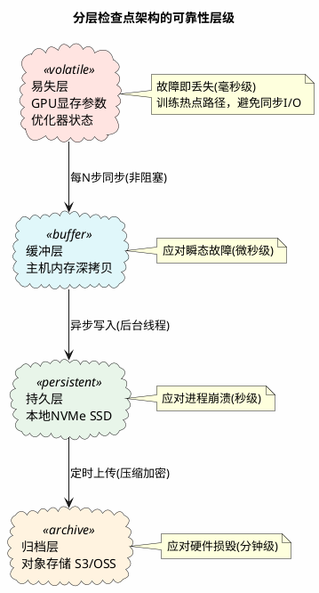
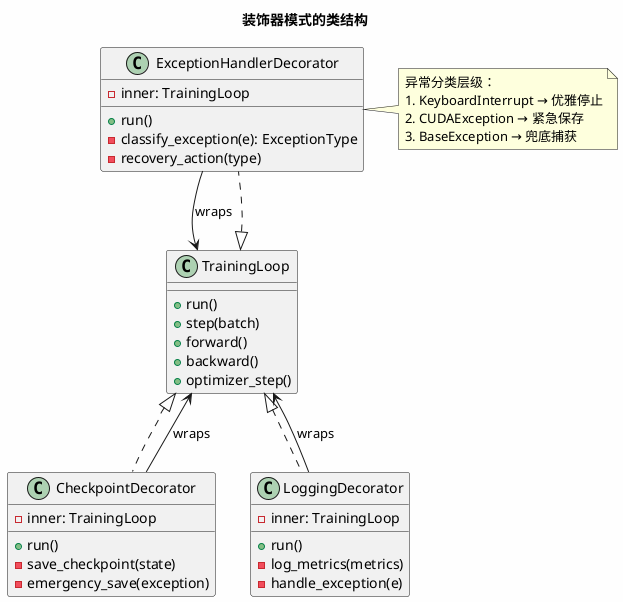
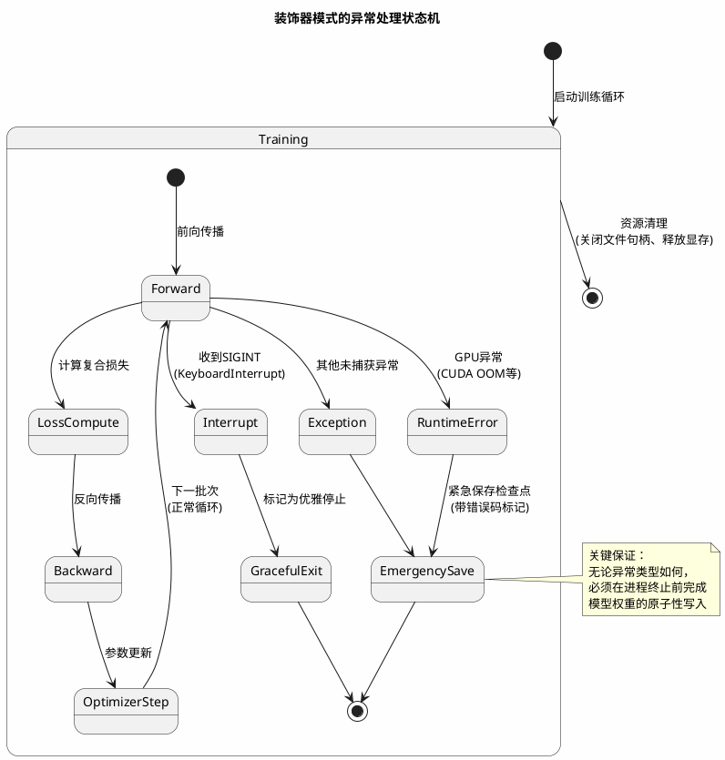
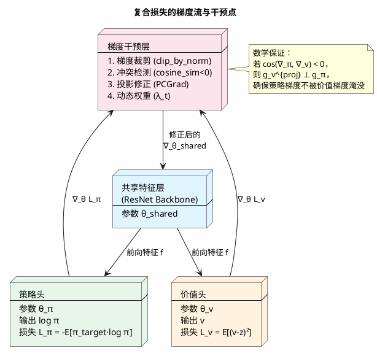
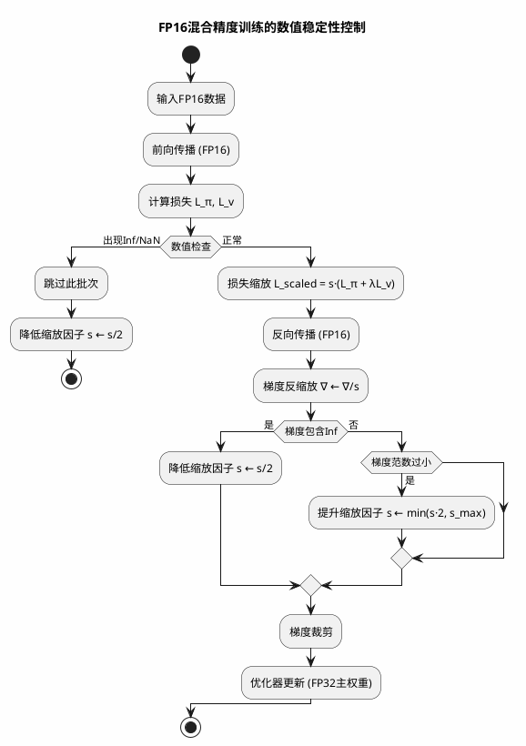
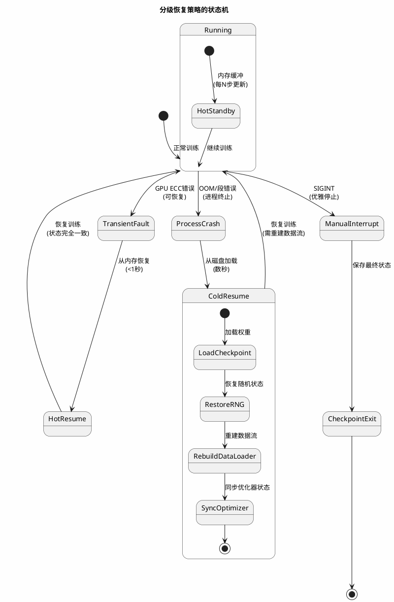
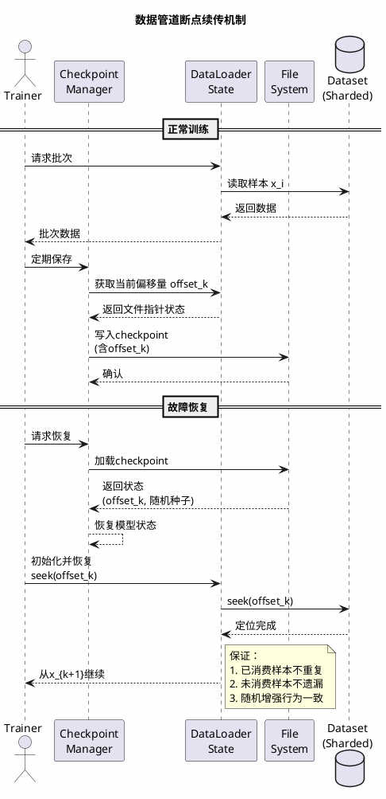
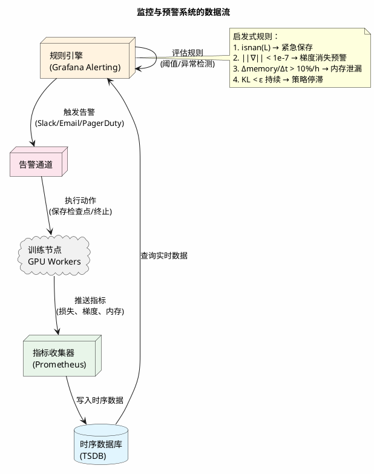

在构建生产级的深度强化学习系统时，训练阶段的可靠性往往比算法本身的理论收敛性更具工程挑战性。与监督学习不同，强化学习的训练过程涉及**环境模拟、策略搜索与网络优化**的复杂闭环，任何环节的单点故障（如GPU显存溢出、数据管道阻塞或人为中断）都可能导致数小时甚至数天的计算成果瞬间蒸发。更棘手的是，策略梯度方法的非凸优化特性使得训练对中断点极为敏感——从中断处恢复训练可能陷入与从头开始截然不同的优化轨迹。

本文基于我们在大规模分布式训练中的工程实践，探讨如何构建具备**容错能力（fault tolerance）**  与**状态一致性（state consistency）**  的训练管线，重点阐述装饰器模式在断点保护中的应用、复合损失函数的梯度动力学，以及异常分类与分级恢复策略。

## 1. 训练脆断性与检查点经济学

### 1.1 强化学习训练的故障模式

深度策略网络的训练故障可归纳为三类：

- **硬件故障**：GPU ECC错误、NVLink通信超时、散热导致的降频（thermal throttling）
- **软件异常**：数据加载器的死锁（deadlock）、CUDA内存碎片导致的OOM、浮点异常（NaN/Inf）
- **人为干预**：超参调整需要中断训练、集群调度抢占（preemption）、调试需求

在传统的监督学习中，断点续训（resume training）只需保存模型权重与优化器状态；但在强化学习中，**训练数据（training data）分布本身依赖于当前策略**，中断后若简单恢复，可能导致策略与数据分布的错配（off-policy程度加剧）。

### 1.2 检查点频率与存储开销的权衡

频繁保存检查点（每100步）可提供细粒度的恢复点，但带来显著的存储开销与I/O延迟——大型残差网络的权重文件可达数百MB，写入操作可能阻塞训练循环数秒。反之，稀疏保存（每10,000步）虽减少开销，但故障时丢失的进度代价高昂。

设单次检查点写入时间为 $t_{save}$，故障间隔服从参数为 $\lambda$ 的指数分布，则期望时间损失为：

$$
E[\text{loss}] = \frac{1}{2} \cdot \Delta t_{checkpoint} + \frac{t_{save}}{\lambda \cdot \Delta t_{checkpoint}}
$$

最优检查点间隔 $\Delta t^*$ 可通过最小化期望损失求得：

$$
\Delta t^* = \sqrt{\frac{2 \cdot t_{save}}{\lambda}}
$$

我们的解决方案是**分层检查点策略**：

- **内存缓冲检查点**：将模型状态缓存于RAM（通过`deepcopy`），实现亚毫秒级保存，应对瞬态故障
- **磁盘持久化检查点**：异步写入NVMe SSD，用于应对进程崩溃
- **冷存储归档**：定期上传至对象存储，作为长期备份

## 2. 装饰器模式的断点保护机制

### 2.1 异常捕获的粒度控制

Python的异常处理机制允许我们在不同层级捕获故障。在训练管线中，我们采用**装饰器（Decorator）模式**包装主训练循环，实现横切关注点（cross-cutting concerns）的分离——训练逻辑专注于前向/反向传播，而容错逻辑（保存状态、记录日志、资源清理）由装饰器统一处理。

这种设计的核心优势在于**异常类型的精细区分**：

- ​`KeyboardInterrupt`（SIGINT）：用户主动中断，视为优雅停止（graceful shutdown）
- ​`RuntimeError`​ / `CUDAException`：硬件或运行时故障，需紧急保存并上报
- ​`BaseException`的其他子类：兜底捕获，确保任何情况下不丢失权重

### 2.2 状态保存的原子性协议

在异常处理路径中保存模型时，必须保证**文件的原子性**——若写入过程中进程被强制终止（如OOM killer介入），不应产生损坏的半写文件。我们采用**写后重命名（write-then-rename）**  协议：

1. 写入临时文件（`.tmp`后缀）
2. 强制同步文件系统缓冲区（`fsync`）
3. 原子重命名为目标文件名

原子性保证的形式化描述：  
设 $W$ 为写操作，$R$ 为重命名操作，$C$ 为崩溃事件，则必须满足：

$$
P(\text{file corrupted} | C) = 0 \iff \text{write to temp} \land \text{fsync} \land \text{atomic rename}
$$

此外，优化器状态（Adam的动量缓存、学习率调度器状态）必须与模型权重同步保存，否则恢复训练时会出现优化轨迹的不连续（trajectory discontinuity）。

### 2.3 训练元数据的持久化

除模型权重外，**训练日志（loss curves、学习率历史、迭代计数）**  的持久化同样关键。我们采用**追加写日志（append-only log）**  模式，将结构化数据（JSON格式）逐行写入，而非周期性覆盖文件。这种写时复制（copy-on-write）的语义确保即使写入过程中断，历史记录依然完整可读。

## 3. 复合损失函数的梯度动力学

### 3.1 策略梯度与价值回归的耦合

双头网络的损失函数由两项构成：

- **策略损失** $\mathcal{L}_\pi$：衡量网络策略与MCTS目标分布的偏离（交叉熵形式）

  $$
  \mathcal{L}_\pi(\theta) = -\sum_a \pi_{target}(a|s) \log \pi_\theta(a|s)
  $$
- **价值损失** $\mathcal{L}_v$：衡量状态价值估计与蒙特卡洛回报的偏差（L2或Huber损失）

  $$
  \mathcal{L}_v(\theta) = \mathbb{E}_{s,z}[(v_\theta(s) - z)^2]
  $$

总损失 $\mathcal{L} = \mathcal{L}_\pi + \lambda \mathcal{L}_v$ 的梯度流存在**尺度不匹配（scale mismatch）**  问题。在训练初期，价值估计的误差通常较大（随机初始化导致），其梯度范数可能超过策略梯度一个数量级，导致共享层参数被价值任务主导，策略头欠拟合。

### 3.2 梯度归一化与裁剪策略

我们采用**自适应梯度缩放（adaptive gradient scaling）**  缓解这一问题：

**独立梯度裁剪**：  
对策略梯度与价值梯度分别执行L2范数裁剪（gradient clipping），防止单一方爆炸：

$$
g_{clipped} = \begin{cases} 
g & \text{if } \|g\|_2 \leq \tau \\
\tau \cdot \frac{g}{\|g\|_2} & \text{otherwise}
\end{cases}
$$

**相对权重动态调整**：  
监控两任务的有效样本方差，动态调整$\lambda$使两损失的梯度贡献大致平衡：

$$
\lambda_{t+1} = \lambda_t \cdot \exp\left(\eta \cdot \left(\frac{\|\nabla_\pi\|}{\|\nabla_\pi\| + \|\nabla_v\|} - 0.5\right)\right)
$$

更精细的做法是**梯度手术（Gradient Surgery / PCGrad）**  ：在共享层的反向传播中，若两任务梯度夹角为钝角（方向冲突），则投影其中之一至正交方向，消除负迁移（negative transfer）。

设 $g_\pi$ 和 $g_v$ 分别为策略和价值任务对共享参数的梯度，当 $g_\pi \cdot g_v < 0$ 时，将 $g_v$ 投影到 $g_\pi$ 的正交方向：

$$
g_v^{proj} = g_v - \frac{g_v \cdot g_\pi}{\|g_\pi\|^2} g_\pi
$$

投影后的梯度更新为：

$$
\Delta \theta = g_\pi + \lambda \cdot g_v^{proj}
$$

### 3.3 数值稳定性与半精度训练

在混合精度（FP16）训练中，策略损失的交叉熵计算与价值损失的平方项可能因数值范围差异导致下溢或上溢。我们采用**损失缩放（Loss Scaling）**  技术：

设缩放因子为 $s = 2^{k}$（通常 $k=10$），则前向传播时：

$$
\mathcal{L}_{scaled} = s \cdot (\mathcal{L}_\pi + \lambda \cdot \mathcal{L}_v)
$$

反向传播后，梯度相应缩放：

$$
\nabla_\theta = \frac{1}{s} \cdot \nabla_\theta \mathcal{L}_{scaled}
$$

保持数值精度同时避免动态范围损失。

## 4. 异常恢复与状态一致性

### 4.1 热恢复与冷恢复

根据故障严重程度，恢复策略分为两级：

- **热恢复（Hot Resume）**  ：从内存缓冲层恢复，适用于瞬态故障（如短暂的GPU ECC错误），恢复时间<1秒，优化器状态完全保留
- **冷恢复（Cold Resume）**  ：从磁盘检查点加载，适用于进程崩溃，需重新初始化数据加载器与随机数生成器状态

冷恢复时必须注意**随机数状态的同步**：Python的`random`​与NumPy的`random`状态、CUDA的cuRAND状态若未正确恢复，会导致数据增强与Dropout行为与中断前不一致，引入不可复现性。

设随机状态为 $S_{rand} = (S_{python}, S_{numpy}, S_{cuda})$，必须满足：

$$
\text{Resume}(S_{rand}^{(t)}) = S_{rand}^{(t+1)} \equiv \text{Continue}(S_{rand}^{(t)})
$$

### 4.2 数据管道的断点续传

在分布式数据加载场景中，训练中断可能导致数据分区（shard）的消费进度丢失。我们采用**基于文件指针的续传机制**：定期记录当前数据文件的读取偏移量（offset），恢复时通过`seek`操作跳过已消费样本，避免重复训练导致的过拟合。

设数据流为序列 $\{x_i\}_{i=1}^N$，记录检查点时的索引 $k$，恢复后从 $x_{k+1}$ 继续，确保样本不重复、不遗漏。

### 4.3 分布式训练的一致性保障

在多机分布式训练（Distributed Data Parallel, DDP）中，单节点故障的恢复更为复杂。我们采用**弹性训练（elastic training）**  模式：允许动态增减工作节点，通过AllReduce操作的barrier超时机制检测节点失效，自动重组通信组（communication group），而非终止整个训练任务。

采用**一致性哈希**重新分配数据分片，确保节点增减时数据迁移最小化。

## 5. 监控与可观测性架构

### 5.1 实时训练诊断

通过TensorBoard或类似工具暴露以下关键指标：

- **损失分解**：$\mathcal{L}_\pi$、$\mathcal{L}_v$与总损失的独立曲线
- **梯度范数比**：$\gamma = \frac{\|\nabla_\pi\|}{\|\nabla_v\|}$，监控两任务的梯度平衡，理想值 $\gamma \approx 1$
- **有效样本量**：$n_{eff} = \frac{(\sum_i w_i)^2}{\sum_i w_i^2}$，监控重要性采样的退化
- **学习率调度**：当前有效学习率（含warmup与decay）

  $$
  \eta_t = \eta_{min} + (\eta_{max} - \eta_{min}) \cdot \min\left(1, \frac{t}{T_{warmup}}\right) \cdot \frac{1 + \cos(\pi \cdot \frac{t - T_{warmup}}{T_{total} - T_{warmup}})}{2}
  $$

### 5.2 异常预警的启发式规则

设置自动化监控规则：

- **NaN检测**：若任一损失在连续10步内出现NaN，立即触发检查点保存并终止训练（防止污染磁盘）
- **梯度消失**：若共享层梯度范数<1e-7持续超过100步，预警可能的死层（dead neurons）
- **内存泄漏**：监控主机内存占用增长率，若每小时增长超过10%，提示数据加载器或日志系统存在泄漏
- **训练停滞**：若若KL散度 $D_{KL}(\pi_{target} \| \pi_\theta) < \epsilon$ 持续超过阈值，提示策略更新不足

## 结论

构建可靠的强化学习训练管线需要在算法优雅性与工程鲁棒性之间寻找平衡。装饰器模式提供的横切容错机制、复合损失的梯度动力学调控（特别是PCGrad投影与自适应梯度裁剪），以及分层检查点策略，共同构成了训练过程的"安全带"。这些机制虽然增加了代码复杂度，但确保了在硬件故障、数据异常或人为干预下，训练状态的可恢复性与最终模型的收敛保证。

未来的优化方向包括：引入**检查点差异压缩**（仅保存权重增量 $\Delta \theta$ 而非全量），降低存储开销；以及**自动化超参恢复**（从中断点的Hessian矩阵特征值自动调整学习率），减少人工干预需求。
