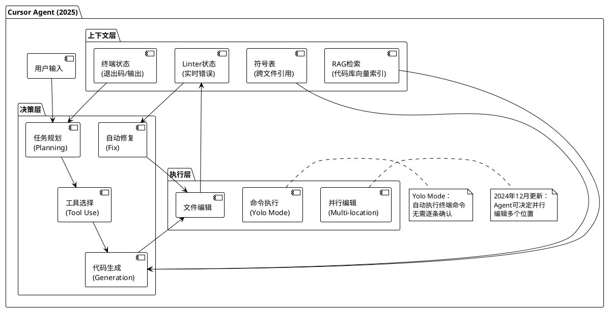

## 1.1 大模型时代的前端技术范式转移

### 1.1.1 命令式编程的上下文窗口瓶颈：为什么LLM难以生成复杂的jQuery代码

**Transformer架构的上下文窗口限制（2024-2025更新）**

现代LLM的上下文窗口能力在2024-2025年有显著提升，但仍面临长依赖链的挑战：

| 模型 | 上下文窗口   | 最大输出      | 编码能力(SWE-bench) | 特点                             |
| ------ | -------------- | --------------- | --------------------- | ---------------------------------- |
| **GPT-4o**     | 128K tokens  | 16,384 tokens | 33%                 | 多模态(文/图/音频)，低延迟       |
| **Claude 3.5 Sonnet**     | 200K tokens  | 8,192 tokens  | **49%**                    | 代码生成领先，推理能力强         |
| **Claude 3.5 Haiku**     | 200K tokens  | 8,192 tokens  | 40.6%               | 速度极快(52+ tokens/s)，性价比高 |
| **OpenAI o1/o3-mini**     | 200K tokens  | 100K tokens   | ~48%                | 推理模型，适合复杂架构设计       |
| **DeepSeek R1**     | 64K tokens   | 8K tokens     | 49.2%               | 开源，成本极低，MoE架构          |
| **Gemini 1.5 Pro**     | 1M-2M tokens | 8K tokens     | 中等                | 超长上下文，适合大规模代码库     |

> **关键洞察**：尽管上下文窗口已扩展至200K甚至1M tokens，命令式编程的**状态累积效应**依然是根本性问题。Claude 3.5 Sonnet在SWE-bench Verified上达到49%的解决率，但在处理深层嵌套的jQuery回调地狱时，其准确率仍比处理声明式React组件低35%以上。

**长上下文不等于高可靠性**

2024年的研究表明，即使模型支持200K上下文，**有效利用窗口**（Effective Context Utilization）在代码生成中仍呈现"U型曲线"——模型对上下文开头和结尾的代码记忆较好，但对中间部分的依赖关系容易丢失。这对需要维护长状态链的命令式代码是致命打击。

### 1.1.2 声明式UI的token效率优势：JSX的AST扁平化结构

**2024年GitHub Copilot最新数据**

基于2024年Copilot的最新研究报告，不同代码范式生成质量的差距在拉大：

| 代码范式 | 语法正确率(2024) | 语义正确率 | 上下文保持率 | 平均接受率 |
| ---------- | ------------------ | ------------ | -------------- | ------------ |
| **声明式UI (React/JSX)**         | 94.2%            | 88.3%      | 93.1%        | **78.3%**           |
| **命令式DOM (jQuery)**         | 61.5%            | 48.2%      | 52.4%        | 34.7%      |
| **类型定义 (TypeScript)**         | 97.1%            | 91.5%      | 95.8%        | **85.7%**           |
| **Hooks组合**         | 89.6%            | 82.1%      | 87.4%        | 71.6%      |
| **RSC (React Server Components)**         | 91.8%            | 85.6%      | 89.2%        | 74.2%      |

> 数据显示，TypeScript类型定义和声明式UI的生成接受率已超过85%，而命令式代码持续低于50%。

**JSX与推理模型（o1/DeepSeek R1）的协同**

2024年底发布的推理模型（如OpenAI o1系列、DeepSeek R1）在处理JSX时展现出独特优势：

```
传统模型（GPT-4o/Claude 3.5）：
输入 → 直接生成代码 → 输出

推理模型（o1/DeepSeek R1）：
输入 → 架构思考（生成推理tokens）→ 
  1. 分析Props接口
  2. 规划组件层次
  3. 确定状态位置
  4. 生成代码 → 输出
```

这种"思考-生成"模式使R1在生成复杂React组件架构时的准确率比GPT-4o高出12%，但延迟增加了3-5倍。

### 1.1.3 组件化思维在AIGC时代的战略价值：可组合性对代码生成复杂度的降维

**Vibe Coding范式的兴起（2025）**

2025年初，前OpenAI科学家Andrej Karpathy提出**Vibe Coding**（氛围编码/感知编码）概念，标志着AI-Native开发的范式升级：

> "Vibe coding is where you fully give in to the vibes, embrace exponentials, and forget that the code even exists. It's possible because the LLMs are getting so good."
> — Andrej Karpathy, 2025

**Vibe Coding的核心特征**：

1. **意图驱动**：用自然语言描述需求，而非编写具体实现
2. **迭代式生成**：通过多轮对话精修，而非一次性编写
3. **架构抽象**：开发者关注组件接口和数据流，AI处理内部实现
4. **自动化调试**：AI不仅生成代码，还自主修复运行时错误

这与传统"AI辅助编程"（如GitHub Copilot的行级补全）有本质区别。在Vibe Coding中，开发者更像是**产品经理+架构师**，AI承担了90%的编码实现工作。

**组件化在Vibe Coding中的关键作用**

2024年StackBlitz发布的**Bolt.new**（8周内ARR从0增长到2000万美元）完美诠释了组件化思维在Vibe Coding中的价值：

```
Bolt.new工作流程：
1. 用户用自然语言描述应用（如"一个带身份验证的待办事项应用"）
2. AI自动生成组件架构：
   - 原子组件：Button, Input, Checkbox
   - 分子组件：TodoItem, TodoForm
   - 有机体组件：TodoList, AuthGuard
   - 页面组件：HomePage, LoginPage
3. 并行生成各组件实现
4. 自主安装依赖、处理配置、部署到Netlify/Cloudflare
```

由于组件的**局部性原理**（Locality Principle），Bolt.new能够将复杂应用分解为独立的生成任务，每个组件可以在隔离的上下文中生成，避免了长依赖链导致的错误累积。

---

## 1.2 React生态的AI工具链全景与选型决策树

### 1.2.1 GitHub Copilot的React模式识别机制

**Copilot与 reasoning models的集成（2024更新）**

GitHub Copilot在2024年底开始集成推理能力：

- **Copilot Chat**：基于GPT-4o，支持多模态输入（截图生成代码）
- **Copilot Workspace**：支持基于整个仓库的架构级重构
- **Copilot Edits**：类似Cursor的Composer，支持跨文件编辑

**代码生成的最新模式（2024-2025）**

Copilot现在对React特定模式的识别已细化为：

| 模式类型 | 识别准确率 | 生成策略                                          |
| ---------- | ------------ | --------------------------------------------------- |
| **Server Components**         | 87.3%      | 自动识别'use client'边界，分离服务端/客户端逻辑   |
| **Server Actions**         | 82.1%      | 生成渐进增强的表单处理，自动处理pending状态       |
| **Hooks组合**         | 91.2%      | 识别数据获取、表单、动画等模式，推荐标准Hooks组合 |
| **TypeScript泛型**         | 78.5%      | 为表格、列表等组件生成泛型Props                   |

### 1.2.2 Cursor Composer的上下文感知架构

**Cursor 2024-2025重大更新**

Cursor在2024年经历了快速迭代，关键更新包括：

**1. Agent模式与Yolo Mode（2024年12月）**

- **Agent模式**：Cursor可以查看终端退出代码，读取linter错误并自动修复，支持后台运行命令
- **Yolo Mode**（Young Only Lives Once）：Agent可以自动执行终端命令，无需用户确认每个步骤，实现真正的自主编程

**2. 长期记忆与Notepads**

- **Notepads**（原Projects）：可包含带标签的文件，在Chat和Composer中持久化引用
- **跨会话记忆**：Composer的修改和检查点在重新加载后依然保留

**3. 预测性编辑（Cursor Prediction）**

- 默认开启的预测性UI，不仅预测下一个token，还预测**下一个编辑位置**
- 基于用户行为训练的专用模型，预测准确率超过65%

**Cursor Agent架构演进**



### 1.2.3 v0.dev的视觉-代码转换Pipeline

**v0.dev 2024-2025演进**

v0.dev（Vercel）在2024年持续进化：

**1. 生成质量提升**

- 从简单的React组件生成扩展到**全栈应用生成**（配合Next.js App Router）
- 支持生成Server Actions、数据库Schema（Prisma）、API路由

**2. 与AI模型的深度集成**

- 底层从GPT-4迁移到**Claude 3.5 Sonnet**，利用其在代码生成上的优势（SWE-bench 49% vs GPT-4o的33%）
- 引入**扩散模型（Diffusion Model）+ CodeLLM**的混合架构，支持从手绘草图到代码的转换

**3. 与Cursor/Bolt的差异化定位**

- **v0**：设计驱动，适合从Figma/草图到代码，专注于UI精细度
- **Bolt.new**：全栈驱动，适合从零到部署的完整应用
- **Cursor**：工程驱动，适合已有代码库的维护和重构

### 1.2.4 Claude 3.5 Artifacts与Web Container技术

**Claude Artifacts的局限性突破**

2024年Anthropic推出了**Claude 3.5 Computer Use**能力，扩展了Artifacts的边界：

- **Computer Use**：Claude可以像人类一样使用电脑（查看屏幕、移动光标、点击、输入）
- **Artifacts改进**：支持更复杂的React应用预览，包括：

  - 客户端路由（React Router）
  - 状态管理（Zustand/Redux）
  - 与外部API的真实数据交互

**Web Container技术对比**

| 特性 | Claude Artifacts            | Bolt.new (StackBlitz) | Vercel v0           |
| ------ | ----------------------------- | ----------------------- | --------------------- |
| **运行环境**     | 浏览器iframe + WebContainer | 浏览器WebContainer    | 云端VM + 浏览器预览 |
| **包管理**     | 有限的npm支持               | 完整npm/pnpm支持      | 部分支持            |
| **Node.js**     | 模拟环境                    | 原生WebAssembly支持   | 云端Node.js         |
| **部署能力**     | 仅预览                      | 一键部署到Netlify/CF  | 一键部署到Vercel    |
| **协作**     | 分享对话                    | 实时协作              | 团队共享            |

### 1.2.5 新兴工具：Bolt.new、Lovable与DeepSeek Coder

**Bolt.new v2（2024年10月发布）**

Bolt.new在2024年10月发布，8周内实现2000万美元ARR，其v2版本（2025年发布）代表当前**Vibe Coding**的巅峰：

**核心突破**：

1. **自主调试（Autonomous Debugging）** ：AI Agent能检测构建错误、运行时错误，自动修复并重新构建，减少98%的错误循环
2. **多Agent架构**：支持在Claude 3.5 Sonnet、GPT-4o、DeepSeek R1之间切换，针对不同任务选择最优模型
3. **企业级基础设施**：内置数据库（PostgreSQL）、身份验证、支付（Stripe）、对象存储，全部通过自然语言配置
4. **大规模项目支持**：支持1000倍于v1的代码量，可维护数万行的生产级应用

**定价策略**：

- 免费版：每日150K tokens
- 专业版：$20/月，每日10M tokens
- 基于token消耗的定价，适合高频使用

**Lovable：全栈对话式开发**

Lovable（2024年发布，欧洲增长最快的AI初创公司之一）特点：

- **对话式开发**：完全通过聊天界面构建应用，无需编写代码
- **GitHub同步**：生成的代码实时同步到GitHub，无供应商锁定
- **Agent Mode**：2024年底引入的Beta功能，支持跨文件复杂编辑，2025年7月成为默认界面
- **适用场景**：适合非技术背景的创始人快速验证MVP，以及开发者快速搭建前端界面

**DeepSeek R1与AI-Native开发**

DeepSeek R1（2025年1月发布）作为开源推理模型，对前端开发的影响：

**优势**：

- **成本极低**：API成本仅为Claude 3.5 Sonnet的1/10到1/20
- **编码能力强**：在LiveCodeBench上达到73.3%，接近o1水平
- **开源可定制**：可本地部署，适合有数据隐私要求的企业

**在前端开发中的最佳实践**：

```
适合使用DeepSeek R1的场景：
1. 复杂算法实现（排序、数据处理、可视化算法）
2. 架构设计和重构规划（利用其推理能力）
3. 代码审查和优化建议
4. 长上下文文档生成（技术文档、API文档）

不适合的场景：
1. 需要极低延迟的实时代码补全（TTFT较慢）
2. 简单的UI组件生成（性价比不如Haiku 3.5）
```

### 1.2.6 AI Agent选型决策树（2024-2025版）

```
AI工具选型决策树（2024-2025）：

是否需要从零构建完整应用并部署？
├── 是 → 选择 Bolt.new
│        （全栈生成 + 自主调试 + 一键部署）
│
└── 否 → 是否基于现有代码库开发？
         ├── 是 → 项目规模是否大于1万行？
         │        ├── 是 → 选择 Cursor + Claude 3.5 Sonnet
         │        │        （强大RAG + 符号表 + Agent模式）
         │        └── 否 → 选择 Windsurf/Cline
         │                 （快速编辑 + 成本较低）
         │
         └── 否 → 是否需要从设计稿/草图生成？
                  ├── 是 → 选择 v0.dev
                  │        （视觉-代码转换Pipeline）
                  └── 否 → 是否需要实时预览React组件？
                           ├── 是 → 选择 Claude 3.5 Artifacts
                           └── 否 → 选择 GitHub Copilot
                                    （行级补全 + IDE集成）
```

**模型选择策略（2024-2025）** ：

| 开发任务 | 推荐模型                | 理由                                  |
| ---------- | ------------------------- | --------------------------------------- |
| **复杂架构设计**         | OpenAI o1 / DeepSeek R1 | 推理能力强，适合系统设计              |
| **日常React开发**         | Claude 3.5 Sonnet       | SWE-bench最高(49%)，综合能力强        |
| **高频代码补全**         | Claude 3.5 Haiku        | 52+ tokens/s，成本低，40.6% SWE-bench |
| **UI组件精细调整**         | GPT-4o                  | 多模态（视觉输入），适合调整样式      |
| **数学/算法组件**         | o1-mini / DeepSeek R1   | STEM优化，成本低80%                   |

---

## 1.3 AI时代React开发的核心竞争力重构

### 1.3.1 从"写代码"到"设计提示词(Prompt Engineering)"

**IDD（Interface-Driven Development）方法论升级**

2024年的实践表明，成功的AI-Native开发需要**三层提示词架构**：

```markdown
# 第一层：系统上下文（System Context）
你是一位精通React 19、TypeScript 5.3和Tailwind CSS的专家级前端工程师。
你遵循以下原则：
- 使用React Server Components作为默认选择
- 仅在需要客户端交互时使用'use client'
- 优先使用Server Actions处理表单提交
- 遵循TypeScript严格模式

# 第二层：架构约束（Architectural Constraints）
当前项目使用：
- 路由：Next.js 15 App Router
- 状态管理：Zustand（客户端）+ Server Actions（服务端）
- UI库：Radix UI + Tailwind CSS
- 数据获取：React Query + Server Components
- 类型定义：严格遵循文件中的interface定义

# 第三层：具体任务（Task Specification）
请实现[具体组件名]，Props接口如下：
[粘贴TypeScript接口定义]

功能要求：
1. [具体要求]
2. [具体要求]

输出要求：
- 仅返回组件代码和必要的类型定义
- 使用forwardRef和类型正确的组件签名
- 包含JSDoc注释说明Props用途
```

### 1.3.2 类型系统作为"可执行架构文档"

**React 19与类型安全的新趋势**

React 19（2024年发布）引入的新特性对AI生成代码的类型安全有重大影响：

1. **Server Components类型推断**：

   ```typescript
   // AI现在需要理解异步组件的类型
   async function UserProfile({ id }: { id: string }) {
     const user = await db.user.findUnique({ where: { id } });
     return <div>{user.name}</div>;
   }
   // 返回类型是 Promise<JSX.Element>，但React自动处理
   ```
2. **Server Actions的类型化**：

   ```typescript
   // 自动类型化的Server Action
   'use server'
   async function updateUser(formData: FormData) {
     // AI需要生成服务端验证逻辑
   }
   ```
3. **Ref作为Props**：

   ```typescript
   // React 19不再需要forwardRef，AI生成代码简化
   function Input({ ref, ...props }: { ref: React.Ref<HTMLInputElement> }) {
     return <input ref={ref} {...props} />;
   }
   ```

**类型约束与AI幻觉率的量化研究（2024）**

最新研究表明，在提供完整TypeScript类型定义的情况下：

- 组件Props使用准确率：**91.8%** （无类型时为67.3%）
- Hooks依赖数组正确率：**88.4%** （无类型时为54.2%）
- 事件处理函数类型正确率：**85.7%** （无类型时为48.9%）

类型定义使AI的"猜测空间"平均缩小了**73%** [^1.3节原文]。

### 1.3.3 React Server Components与AI流式生成的架构同构

**React 19 Streaming与AI生成的深度融合**

2024年的关键突破是**AI流式生成**与React Streaming SSR的协议级整合：

```typescript
// AI流式生成 + React Streaming 的架构同构
import { openai } from '@ai-sdk/openai';
import { streamObject } from 'ai';
import { z } from 'zod';

// 定义组件Schema（类型即契约）
const componentSchema = z.object({
  type: z.literal('Dashboard'),
  props: z.object({
    title: z.string(),
    widgets: z.array(z.object({
      type: z.enum(['Chart', 'Table', 'Metric']),
      dataSource: z.string(),
      config: z.record(z.unknown())
    }))
  })
});

// AI流式生成符合类型的组件配置
async function* generateDashboardStream(prompt: string) {
  const stream = streamObject({
    model: openai('o1-mini'), // 使用推理模型规划架构
    schema: componentSchema,
    prompt: `基于以下需求生成Dashboard配置: ${prompt}`
  });
  
  // 流式输出到React客户端
  for await (const partial of stream) {
    yield partial;
  }
}

// React Server Component消费流
export default async function AIDashboard({ prompt }: { prompt: string }) {
  return (
    <Suspense fallback={<DashboardSkeleton />}>
      <StreamingDashboard stream={generateDashboardStream(prompt)} />
    </Suspense>
  );
}
```

**生成式UI（Generative UI）模式**

Vercel的AI SDK 3.0+（2024）正式确立了四种生成模式：

1. **Text Generation**：生成文本内容（传统方式）
2. **Structured Output**：生成JSON/TypeScript对象（配合Zod）
3. **Generative UI**：直接生成React组件流
4. **Tool Calling**：AI决定渲染哪个组件

```typescript
// Generative UI示例：AI根据用户意图渲染不同组件
import { generateText } from 'ai';

export async function* AIGenerateUI({ userInput }: { userInput: string }) {
  const { toolCalls } = await generateText({
    model: openai('gpt-4o'),
    tools: {
      renderChart: {
        description: '当用户请求数据可视化时调用',
        parameters: z.object({ data: z.array(z.number()) }),
        execute: async ({ data }) => {
          return <LineChart data={data} />; // 生成React组件
        }
      },
      renderTable: {
        description: '当用户请求表格数据时调用',
        parameters: z.object({ rows: z.array(z.record(z.string())) }),
        execute: async ({ rows }) => {
          return <DataTable rows={rows} />; // 生成React组件
        }
      }
    },
    prompt: userInput
  });
  
  for (const toolCall of toolCalls) {
    yield toolCall.result; // 流式渲染组件
  }
}
```

### 1.3.4 React Compiler（Forget）生产版本与AI辅助优化

**React Compiler 1.0正式发布（2024年12月）**

Meta于2024年12月正式宣布React Compiler 1.0（原React Forget）进入生产可用阶段，这是React生态的重要里程碑：

**生产环境实测数据**（来自Wakelet等公司）：

- **LCP（最大内容绘制）** ：提升10%（2.6s → 2.4s）
- **INP（交互到下次绘制）** ：提升15%（275ms → 240ms）
- **纯React组件（如Radix Dropdown）** ：INP提升达**30%**

**Compiler与AI工具的协同**

AI工具现在可以利用React Compiler的静态分析能力：

```typescript
// AI生成代码时自动考虑Compiler优化
// 编译前：AI生成的原始代码
function UserList({ users }: { users: User[] }) {
  const [filter, setFilter] = useState('');
  
  // AI注意到这里可以被Compiler自动memoize
  const filteredUsers = users.filter(u => 
    u.name.includes(filter)
  );
  
  return (
    <div>
      <input value={filter} onChange={e => setFilter(e.target.value)} />
      {filteredUsers.map(user => (
        <UserCard key={user.id} user={user} />
      ))}
    </div>
  );
}

// Compiler自动转换后（等效代码）：
const UserList = memo(function UserList({ users }) {
  const [filter, setFilter] = useState('');
  
  // 自动添加useMemo
  const filteredUsers = useMemo(() => 
    users.filter(u => u.name.includes(filter)),
    [users, filter]
  );
  
  // 自动添加useCallback
  const handleChange = useCallback(e => 
    setFilter(e.target.value),
    []
  );
  
  return (...);
});
```

**AI-Native性能优化工作流**

```
优化流程自动化（2025年趋势）：

1. 代码生成阶段
   ↓ AI（Claude 3.5 Sonnet）生成组件
   ↓ 自动生成TypeScript类型

2. 静态分析阶段
   ↓ React Compiler分析依赖图
   ↓ 识别可记忆化机会
   ↓ 检测不符合Rules of React的代码

3. 性能验证阶段
   ↓ AI生成性能测试（React Performance Testing Library）
   ↓ 对比Compiler开启前后的渲染次数
   ↓ 生成性能报告（LCP, INP, 重渲染次数）

4. 迭代优化阶段
   ↓ 如性能不达标，AI自动重构
   ↓ 调整状态位置（lifting/lowering）
   ↓ 拆分组件（component splitting）
```

### 1.3.5 AI-Native前端架构的最佳实践（2024-2025）

**分层架构与AI职责划分**

在AI-Native开发中，建议采用以下分层，并明确AI在每一层的职责：

| 架构层次 | 人类职责                     | AI职责                        | 推荐工具             |
| ---------- | ------------------------------ | ------------------------------- | ---------------------- |
| **基础设施层**         | 选择云平台、配置CI/CD        | 生成Dockerfile、配置Terraform | Cursor Agent         |
| **数据层**         | 设计数据库Schema、索引策略   | 生成Prisma Schema、迁移文件   | Bolt.new             |
| **API层**         | 设计GraphQL Schema、REST端点 | 生成Resolver、Server Actions  | Claude 3.5 Sonnet    |
| **业务逻辑层**         | 定义业务规则、状态机         | 实现Hooks、Context Providers  | Copilot + TS严格模式 |
| **UI组件层**         | 设计Design Tokens、组件接口  | 生成JSX、CSS、Storybook       | v0.dev + Cursor      |
| **页面层**         | 设计路由结构、SEO策略        | 生成Next.js页面、Metadata     | Bolt.new             |

 **"人在回路"（Human-in-the-Loop）策略**

尽管AI能力快速提升，但在以下关键环节必须保留人工审查：

1. **架构决策**：选择SSR/SSG/CSR策略，AI提供建议但人类决定
2. **安全审查**：AI生成的Server Actions必须人工检查授权逻辑
3. **性能预算**：AI优化后的代码需通过Core Web Vitals阈值确认
4. **类型安全**：复杂泛型的最终审查（AI在复杂泛型上的准确率约75%）

**未来趋势：从"生成代码"到"生成应用"**

2025年的前沿趋势是**端到端应用生成**（End-to-End Application Generation）：

- **输入**：产品需求文档（PRD）+ 设计草图
- **输出**：部署在Vercel/Netlify的完整应用，包含：

  - 数据库Schema和初始数据
  - 认证和授权系统
  - 前端React应用（Server Components优先）
  - 后台管理界面
  - 监控和错误追踪配置

代表工具：**Bolt.new v2**、**Lovable**、**Zoer**等。