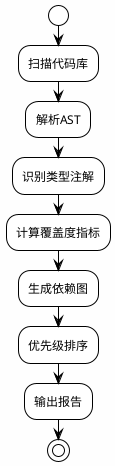
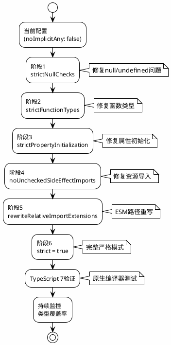
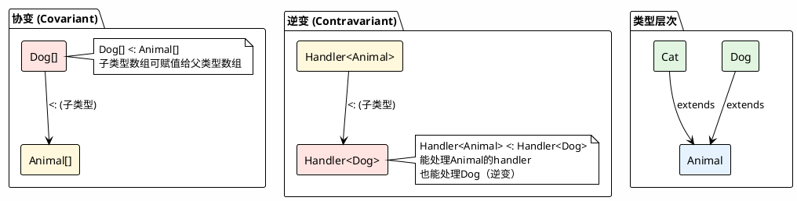
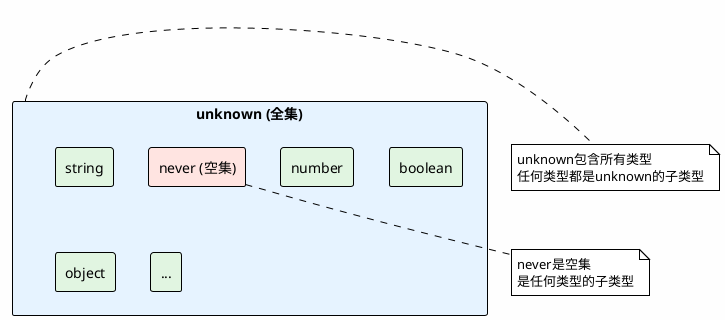
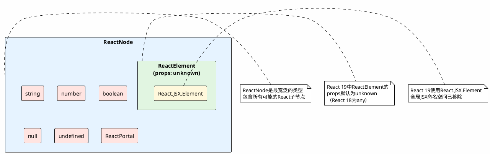

## 2.1 从JavaScript到类型思维的渐进式迁移路径

TypeScript的采用不是一蹴而就的过程，而是一个需要精心规划的渐进式迁移。对于已经拥有大量JavaScript代码库的团队而言，理解迁移路径和成本量化至关重要。

### 2.1.1 JSDoc注解的极限与迁移成本量化

JSDoc作为JavaScript的类型注解方案，长期以来是向TypeScript过渡的中间选择。然而，JSDoc存在固有的局限性，这些局限性在大型项目中会愈发明显。

**JSDoc的类型表达能力局限**

```javascript
// JSDoc可以表达的基本类型
/**
 * @param {string} name
 * @param {number} age
 * @param {boolean} isActive
 */
function createUser(name, age, isActive) {}

// JSDoc难以表达的高级类型
/**
 * 以下类型在JSDoc中难以精确表达：
 * 
 * 1. 泛型约束
 *    - <T extends { id: string }>
 *    - 需要复杂的@template注解
 * 
 * 2. 条件类型
 *    - T extends U ? X : Y
 *    - JSDoc完全不支持
 * 
 * 3. 映射类型
 *    - { [K in keyof T]: T[K] }
 *    - 需要冗长的变通方案
 * 
 * 4. 模板字面量类型
 *    - `prefix-${T}`
 *    - JSDoc不支持
 */
```

**TypeScript 5.6+副作用导入检查（新增）**

TypeScript 5.6引入了`--noUncheckedSideEffectImports`选项，解决了传统迁移过程中副作用导入（如CSS、Polyfill）的类型安全隐患：

```typescript
// 传统行为（TypeScript 5.5及之前）：拼写错误静默通过
import './button-component.cs';  // 错误拼写，但TS不报错

// TypeScript 5.6+ 启用 --noUncheckedSideEffectImports 后：
import './button-component.cs';  
// Error: 找不到模块 './button-component.cs' 或其对应的类型声明

// 正确的资源导入声明方式（需配合类型声明）
// env.d.ts
declare module '*.css' {}
declare module '*.scss' {}
```

**基于依赖图的类型覆盖度分析**

迁移成本可以通过类型覆盖度（Type Coverage）来量化：

```
类型覆盖度 = 有类型注解的代码行数 / 总代码行数

迁移成本模型（2025年修订版）：
C_migration = C_initial + C_ongoing × T + C_tooling × V

其中：
- C_initial: 初始迁移成本（一次性）
- C_ongoing: 持续维护成本
- T: 时间周期
- C_tooling: 工具链升级成本（TypeScript 7默认严格模式带来的breaking changes）
- V: 版本系数（TypeScript 5.x→7.x迁移系数为1.3-1.5）
```

**type-coverage工具与CI集成**

type-coverage是一个用于量化类型覆盖度的工具：

```bash
# 安装
npm install -D type-coverage

# 配置 package.json
{
  "scripts": {
    "type-coverage": "type-coverage --detail --strict"
  },
  "typeCoverage": {
    "atLeast": 95,
    "ignoreCatch": true,
    "ignoreFiles": ["*.test.ts", "*.spec.ts"]
  }
}
```

**类型覆盖度报告示例**

```
Type Coverage Report
====================

总文件数: 156
已分析文件: 156
总行数: 12,847
类型覆盖行数: 11,562
类型覆盖度: 90.0%

未覆盖代码分布:
- src/utils/helpers.js: 45行
- src/legacy/api.js: 89行
- src/components/old/*.js: 156行

建议优先级:
1. src/utils/helpers.js (高影响，低依赖)
2. src/components/old/*.js (中影响，中依赖)
3. src/legacy/api.js (低影响，高依赖)
```

**TypeScript 7（tsgo）迁移准备（2025年新增）**

Microsoft正在开发的TypeScript 7（代号Project Corsa）采用Go语言重写编译器，将于2026年发布。关键变化：

- **默认严格模式**：TS 7将默认启用`strict: true`，不再允许渐进式启用
- **性能提升10倍**：大型代码库（如VS Code）类型检查从77秒降至7.5秒
- **建议**：在迁移路线图中预留TS 7兼容性检查阶段

```bash
# 提前验证TS 7兼容性（使用Native Preview）
npm install -D @typescript/native-preview
npx tsgo --noEmit  # 检查现有代码在原生编译器下的表现
```

**PlantUML图示：类型覆盖度分析流程**



### 2.1.2 any类型的技术债治理策略

`any`类型是TypeScript类型系统的"逃生舱"，但滥用`any`会积累严重的技术债务。建立有效的治理策略是类型化迁移的关键。

**any检测与分类**

```bash
# 使用ts-morph检测any类型
npx ts-node detect-any.ts
```

```typescript
// detect-any.ts
import { Project, Type, SyntaxKind } from 'ts-morph';

const project = new Project({
  tsConfigFilePath: './tsconfig.json',
});

interface AnyUsage {
  filePath: string;
  line: number;
  column: number;
  context: string;
  category: 'explicit' | 'implicit' | 'third-party';
  severity: 'low' | 'medium' | 'high';
}

function detectAnyUsage(): AnyUsage[] {
  const usages: AnyUsage[] = [];
  
  for (const sourceFile of project.getSourceFiles()) {
    // 检测显式any
    sourceFile.getDescendantsOfKind(SyntaxKind.AnyKeyword).forEach(node => {
      usages.push({
        filePath: sourceFile.getFilePath(),
        line: node.getStartLineNumber(),
        column: node.getStartLinePos(),
        context: node.getParent().getText().slice(0, 100),
        category: 'explicit',
        severity: classifySeverity(node),
      });
    });
    
    // 检测隐式any（无类型注解的参数和变量）
    sourceFile.getFunctions().forEach(func => {
      func.getParameters().forEach(param => {
        if (!param.getTypeNode() && param.getType().getText() === 'any') {
          usages.push({
            filePath: sourceFile.getFilePath(),
            line: param.getStartLineNumber(),
            column: param.getStartLinePos(),
            context: param.getText(),
            category: 'implicit',
            severity: 'high',
          });
        }
      });
    });
  }
  
  return usages;
}
```

**利用TS 5.6真值检查与any检测（新增）**

TypeScript 5.6引入了**禁止空值和真值检查**（Disallowed Nullish and Truthy Checks），可捕获与`any`相关的逻辑错误：

```typescript
// 隐式any导致的错误逻辑（过去难以发现）
function processData(data: any) {
  // 当data为any时，以下检查可能永远为真
  const value = data || 'default';  // TS 5.6: Error - 此表达式永远为真
  
  // 对象展开后的常见错误模式
  const config = { ...data, debug: true } || {};  
  // TS 5.6: Error - {} 是真值，右侧永远不会执行
}

// 治理策略更新：结合ESLint和TS 5.6
// .eslintrc.json
{
  "rules": {
    "@typescript-eslint/no-unsafe-assignment": "error",
    "@typescript-eslint/no-unsafe-argument": "error"
  },
  "overrides": [
    {
      // 对遗留文件渐进启用
      "files": ["src/legacy/**/*.ts"],
      "rules": {
        "@typescript-eslint/no-explicit-any": "warn"
      }
    }
  ]
}
```

**渐进替换算法（2025年修订版）**

```
any替换优先级算法：

输入：any使用列表
输出：替换优先级队列

1. 计算每个any的影响范围
   impact(any) = 直接依赖数 + 间接依赖数 × 0.5

2. 计算替换难度
   difficulty(any) = 代码复杂度 + 外部依赖数 × 2

3. 计算优先级分数（适配TypeScript 7）
   priority(any) = (impact(any) × strictModeFactor) / difficulty(any)
   
   其中 strictModeFactor:
   - TypeScript 5.x: 1.0
   - TypeScript 6.x: 1.2  
   - TypeScript 7.x: 2.0  （默认严格模式下any影响倍增）

4. 按优先级排序，生成替换队列
```

**自动化重构流水线**

```yaml
# .github/workflows/type-improvement.yml
name: Type Improvement Pipeline

on:
  schedule:
    - cron: '0 0 * * 1'  # 每周一运行

jobs:
  analyze:
    runs-on: ubuntu-latest
    steps:
      - uses: actions/checkout@v4
      
      - name: Setup Node.js
        uses: actions/setup-node@v4
        with:
          node-version: '20'
      
      - name: Install dependencies
        run: npm ci
      
      - name: Run type coverage analysis
        run: npm run type-coverage -- --json > coverage-report.json
      
      - name: Detect any usage
        run: npx ts-node scripts/detect-any.ts > any-report.json
      
      - name: Generate improvement plan
        run: npx ts-node scripts/generate-plan.ts
      
      - name: Create improvement issues
        run: npx ts-node scripts/create-issues.ts
        env:
          GITHUB_TOKEN: ${{ secrets.GITHUB_TOKEN }}
```

### 2.1.3 严格模式(strict)的增量启用路线图

TypeScript的严格模式包含多个独立的检查选项，可以分阶段启用，降低迁移风险。但需注意：**TypeScript 7将默认启用完整严格模式**。

**严格模式选项分解**

```json
{
  "compilerOptions": {
    // 阶段1：基础严格性
    "strictNullChecks": true,        // 检测null/undefined
    "noImplicitAny": true,           // 禁止隐式any
    
    // 阶段2：类型安全
    "strictFunctionTypes": true,     // 函数类型严格检查
    "strictBindCallApply": true,     // bind/call/apply严格检查
    
    // 阶段3：高级严格性
    "strictPropertyInitialization": true,  // 属性初始化检查
    "noImplicitThis": true,          // this表达式检查
    "alwaysStrict": true,            // 严格模式解析
    
    // 阶段4：TypeScript 5.6+新增
    "noUncheckedSideEffectImports": true,  // 副作用导入检查
    "strictBuiltinIteratorReturn": true,   // 内置迭代器严格返回类型
    
    // 阶段5：TypeScript 5.7+路径重写
    "rewriteRelativeImportExtensions": true,  // 相对导入扩展名重写
    
    // 阶段6：完整严格模式（TypeScript 7默认）
    "strict": true                   // 启用所有严格选项
  }
}
```

**增量启用策略（修订版）**

```
阶段1（第1-2周）：strictNullChecks + noImplicitAny
- 影响：约30%的文件需要修改
- 主要工作：添加null检查，补充类型注解
- 预期错误数：50-100个

阶段2（第3-4周）：strictFunctionTypes + strictBindCallApply
- 影响：约15%的文件需要修改
- 主要工作：修复函数类型定义
- 预期错误数：20-40个

阶段3（第5-6周）：strictPropertyInitialization + noImplicitThis
- 影响：约10%的文件需要修改
- 主要工作：初始化类属性，修复this绑定
- 预期错误数：10-20个

阶段4（第7-8周）：noUncheckedSideEffectImports + strictBuiltinIteratorReturn
- 影响：资源导入和生成器函数
- 主要工作：声明模块类型，修复迭代器返回类型
- 预期错误数：5-15个

阶段5（第9周）：rewriteRelativeImportExtensions + TS 7兼容性检查
- 影响：模块导入路径
- 主要工作：验证ESM导入路径，测试原生编译器
- 预期错误数：0-5个

阶段6（第10周）：strict = true + TypeScript 7验证
- 前置条件：所有代码必须通过 strict = true 检查
- 新编译器适配：
  - 安装 @typescript/native-preview 验证
  - 处理 --rewriteRelativeImportExtensions 的导入路径重写
  - 验证 --noUncheckedSideEffectImports 的资源导入
```

**TypeScript 5.7+相对导入扩展名重写**

TypeScript 5.7引入`--rewriteRelativeImportExtensions`，支持原生ESM迁移：

```json
{
  "compilerOptions": {
    "module": "nodenext",
    "rewriteRelativeImportExtensions": true
  }
}
// 输入：import { helper } from './helper.ts';
// 输出：import { helper } from './helper.js';  （自动重写）
```

**PlantUML图示：严格模式增量启用流程**



## 2.2 类型系统的集合论基础与React映射

TypeScript的类型系统根植于集合论和类型理论。理解这些数学基础，有助于更深入地掌握类型系统的设计原理和应用技巧。

### 2.2.1 子类型化(Subtyping)的数学定义

子类型化是类型系统的核心概念，其数学定义如下：

```
定义（子类型化）：
类型A是类型B的子类型（记作A <: B），当且仅当：
对于所有类型为A的值a，a也是类型B的有效值。

形式化表达：
A <: B ⟺ ∀a: A, a ∈ B
```

**协变、逆变与双向协变**

```
定义（变型 Variance）：
给定类型构造器F<T>，其变型描述了子类型关系在F中的传播方向。

协变（Covariant）：
如果A <: B，则F<A> <: F<B>
类型构造器保持子类型关系方向

逆变（Contravariant）：
如果A <: B，则F<B> <: F<A>
类型构造器反转子类型关系方向

双向协变（Bivariant）：
如果A <: B，则F<A> <: F<B> 且 F<B> <: F<A>
类型构造器同时接受两种方向

不变（Invariant）：
如果A ≠ B，则F<A>与F<B>无子类型关系
类型构造器不传播子类型关系
```

**React中的变型实例**

```typescript
// 协变示例：数组类型
interface Animal { name: string; }
interface Dog extends Animal { breed: string; }

const dogs: Dog[] = [{ name: 'Buddy', breed: 'Golden' }];
const animals: Animal[] = dogs;  // OK: 数组是协变的

// 逆变示例：函数参数类型
type Handler<T> = (item: T) => void;

const animalHandler: Handler<Animal> = (animal) => {
  console.log(animal.name);
};

const dogHandler: Handler<Dog> = animalHandler;  // OK: 函数参数是逆变的
// 因为Handler<Animal>可以处理任何Animal，包括Dog

// Props传递中的边界案例
interface ParentProps {
  onItemClick: (item: Animal) => void;
}

const Parent: React.FC<ParentProps> = ({ onItemClick }) => {
  // 可以传入Dog，因为Dog <: Animal
  return <Child onItemClick={onItemClick} />;
};

interface ChildProps {
  onItemClick: (item: Dog) => void;  // 更具体的类型
}

// 这里存在类型安全问题！
// Child期望接收Dog，但Parent传入的handler可能处理非Dog的Animal
```

**React 19变型规则变更（新增）**

React 19将`ReactElement`的props默认类型从`any`改为`unknown`，影响子类型推导：

```typescript
// React 18及以下
type Example = ReactElement["props"];  // any（过于宽松）

// React 19（严格模式）
type Example = ReactElement<{ id: string }>["props"];  // 必须显式指定
// 或
type Example = ReactElement["props"];  // unknown（需类型收窄）

// 对协变/逆变的影响：props检查更严格
interface ButtonProps { onClick: () => void; }
const element: ReactElement<ButtonProps> = <Button onClick={handle} />; 
// React 19要求handle必须精确匹配，不再允许隐式any宽容
```

**函数Props的bivarianceHack与严格逆变**

```typescript
// TypeScript的--strictFunctionTypes选项

// 关闭strictFunctionTypes（默认行为，bivariant）
type ClickHandler<T> = (item: T) => void;

let animalClick: ClickHandler<Animal>;
let dogClick: ClickHandler<Dog>;

animalClick = dogClick;  // OK (不安全)
dogClick = animalClick;  // OK (安全)

// 开启strictFunctionTypes（严格逆变）
// animalClick = dogClick;  // Error: 不安全
// dogClick = animalClick;  // OK: 安全
```

**PlantUML图示：变型关系**



### 2.2.2 结构化类型系统 vs 名义类型系统

TypeScript采用结构化类型系统（Structural Typing），这与Java/C#的名义类型系统（Nominal Typing）形成对比。

```
结构化类型系统：
类型兼容性基于类型的结构（成员），而非类型的名称。

名义类型系统：
类型兼容性基于类型的显式声明关系（继承/实现）。
```

**Interface与Type Alias的组件契约设计差异**

```typescript
// Interface：支持声明合并
interface UserProps {
  name: string;
}

interface UserProps {
  age: number;
}

// 合并后的UserProps: { name: string; age: number }

// Type Alias：不支持声明合并
type UserProps2 = {
  name: string;
};

// Error: Duplicate identifier 'UserProps2'
// type UserProps2 = { age: number; };

// 扩展性对比
interface ExtendedUserProps extends UserProps {
  email: string;
}

type ExtendedUserProps2 = UserProps2 & { email: string; };

// 联合类型：只能用type
type Status = 'loading' | 'success' | 'error';

// 组件契约设计建议
// 1. 组件Props用interface（支持扩展和声明合并）
interface ButtonProps {
  variant?: 'primary' | 'secondary';
  size?: 'sm' | 'md' | 'lg';
  onClick?: () => void;
  children: React.ReactNode;
}

// 2. 复杂类型操作用type
type ButtonSize = NonNullable<ButtonProps['size']>;
type ButtonVariant = NonNullable<ButtonProps['variant']>;

// 3. 条件类型用type
type ResponsiveValue<T> = T | { base: T; md?: T; lg?: T };
```

**React 19 JSX命名空间变更（重要更新）**

React 19移除了全局`JSX`命名空间，必须显式从React导入：

```typescript
// React 18：全局JSX可用
declare global {
  namespace JSX {
    interface IntrinsicElements {
      'my-element': { myProp: string };
    }
  }
}

// React 19：必须使用React.JSX
import 'react';
declare module 'react' {
  namespace JSX {
    interface IntrinsicElements {
      'my-element': { myProp: string };
    }
  }
}
```

**已移除的React类型及迁移方案（React 19）**

```typescript
// 被移除的类型映射表：
// ReactChild → React.ReactElement | number | string
// ReactFragment → Iterable<React.ReactNode>
// ReactNodeArray → ReadonlyArray<React.ReactNode>
// ReactText → number | string
// VoidFunctionComponent(VFC) → FunctionComponent(FC)

// 迁移示例：
// 旧代码（React 18）
import { VoidFunctionComponent } from 'react';
const Icon: VoidFunctionComponent<IconProps> = (props) => <svg>...</svg>;

// 新代码（React 19）
import { FunctionComponent } from 'react';
const Icon: FunctionComponent<IconProps> = (props) => <svg>...</svg>;
// 或更推荐：直接返回 React.ReactNode
const Icon = (props: IconProps): React.ReactNode => <svg>...</svg>;
```

**扩展性、联合性与声明合并的权衡**

```typescript
// 场景1：需要第三方扩展（用interface）
// 库代码
interface ComponentProps {
  id: string;
}

// 用户扩展
declare module 'library' {
  interface ComponentProps {
    customProp: string;
  }
}

// 场景2：需要复杂类型操作（用type）
type DeepPartial<T> = {
  [P in keyof T]?: T[P] extends object ? DeepPartial<T[P]> : T[P];
};

// 场景3：需要联合类型（用type）
type Theme = 'light' | 'dark' | 'system';

// 场景4：React组件Props（推荐interface）
interface CardProps {
  title: string;
  content: React.ReactNode;
  footer?: React.ReactNode;
}
```

### 2.2.3 类型空间的完备性：never、unknown、any的三态逻辑

TypeScript的类型空间包含三个特殊类型，它们构成了类型系统的逻辑基础。

```
类型空间的集合论解释：

unknown: 全集（Universal Set）
- 包含所有可能的值
- 任何类型都是unknown的子类型
- 不能直接访问属性（需要类型收窄）

never: 空集（Empty Set）
- 不包含任何值
- 是任何类型的子类型
- 用于表示不可能的情况

any: 逃逸类型（Escape Hatch）
- 绕过类型检查
- 既是任何类型的超类型，也是子类型
- 应尽量避免使用
```

**三态逻辑真值表**

```
类型赋值关系：

        | 是any的子类型 | 是unknown的子类型 | 是never的子类型
--------|-------------|-----------------|---------------
any     |     是       |       否         |      否
unknown |     是       |       是         |      否
never   |     是       |       是         |      是
string  |     是       |       是         |      否
number  |     是       |       是         |      否

赋值兼容性（T = S是否合法）：

        | any | unknown | never | string | number
--------|-----|---------|-------|--------|--------
any     | 是  |    是    |  是   |   是   |   是
unknown | 否  |    是    |  是   |   否   |   否
never   | 是  |    是    |  是   |   是   |   是
string  | 是  |    是    |  否   |   是   |   否
number  | 是  |    是    |  否   |   否   |   是
```

**穷尽检查(Exhaustiveness Checking)的模式**

```typescript
// 使用never进行穷尽检查
type Action =
  | { type: 'increment' }
  | { type: 'decrement' }
  | { type: 'reset' };

function reducer(state: number, action: Action): number {
  switch (action.type) {
    case 'increment':
      return state + 1;
    case 'decrement':
      return state - 1;
    case 'reset':
      return 0;
    default:
      // 如果Action添加了新类型但未处理，这里会报错
      const _exhaustive: never = action;
      return _exhaustive;
  }
}

// 通用穷尽检查辅助函数
function assertNever(x: never): never {
  throw new Error(`Unexpected value: ${x}`);
}

// 使用示例
type Status = 'loading' | 'success' | 'error';

function getStatusMessage(status: Status): string {
  switch (status) {
    case 'loading':
      return 'Loading...';
    case 'success':
      return 'Success!';
    case 'error':
      return 'Error occurred';
    default:
      return assertNever(status);
  }
}
```

**TypeScript 5.7未初始化变量检查（新增）**

TypeScript 5.7增强了`never`的实用场景，可检测未初始化变量：

```typescript
// 穷尽检查结合未初始化检测（TS 5.7+）
function getScore(): number {
  let score: number;
  
  if (conditionA) {
    score = calculateA();
  } else if (conditionB) {
    score = calculateB();
  }
  // TS 5.7 Error: 变量'score'在赋值前被使用（如果遗漏else分支）
  
  return score; 
}

// 与never结合的强化模式
function assertUnreachable(x: never): never {
  throw new Error(`Unexpected: ${x}`);
}

type Action = { type: 'add' } | { type: 'remove' };
function reducer(action: Action) {
  switch (action.type) {
    case 'add': return ...;
    case 'remove': return ...;
    default:
      // TS 5.7确保此处action为never，否则报错
      return assertUnreachable(action);
  }
}
```

**严格内置迭代器返回类型（TypeScript 5.6+）**

TS 5.6引入`--strictBuiltinIteratorReturn`，修复了生成器类型的`any`泄漏：

```typescript
// 开启 strictBuiltinIteratorReturn 前
function* abc() {
  yield "a";
  return 123;  // return值被推断为any
}
const iter = abc();
const result = iter.next();
if (result.done) {
  result.value;  // any（不安全）
}

// 开启后
// result.value 正确推断为 string | void | number
```

**PlantUML图示：类型空间关系**



## 2.3 React专用类型元编程基础

类型元编程（Type Metaprogramming）是指使用类型系统本身进行编程。TypeScript的类型系统足够强大，可以支持复杂的元编程模式。

### 2.3.1 泛型约束的边界设计

泛型约束（Generic Constraints）允许我们限制类型参数的范围，确保类型安全。

```typescript
// 基础泛型约束
function getId<T extends { id: string }>(item: T): string {
  return item.id;
}

// 多个约束条件
interface Entity {
  id: string;
  createdAt: Date;
}

interface Named {
  name: string;
}

function processEntity<T extends Entity & Named>(entity: T): void {
  console.log(entity.id);      // OK: 来自Entity
  console.log(entity.name);    // OK: 来自Named
  console.log(entity.createdAt); // OK: 来自Entity
}

// 泛型约束与默认值结合
interface PaginationOptions {
  page?: number;
  pageSize?: number;
}

async function fetchList<
  T extends { id: string },
  O extends PaginationOptions = { page: 1; pageSize: 10 }
>(
  endpoint: string,
  options?: O
): Promise<{ items: T[]; total: number }> {
  const { page = 1, pageSize = 10 } = options ?? {};
  // 实现...
}

// 容器组件中的类型安全
interface ListProps<T> {
  items: T[];
  renderItem: (item: T, index: number) => React.ReactNode;
  keyExtractor: (item: T) => string;
}

function List<T extends { id: string }>({
  items,
  renderItem,
  keyExtractor,
}: ListProps<T>) {
  return (
    <ul>
      {items.map((item, index) => (
        <li key={keyExtractor(item)}>
          {renderItem(item, index)}
        </li>
      ))}
    </ul>
  );
}

// 使用
interface User {
  id: string;
  name: string;
  email: string;
}

<List<User>
  items={users}
  renderItem={(user) => <span>{user.name}</span>}
  keyExtractor={(user) => user.id}
/>
```

### 2.3.2 条件类型的分布式特性

条件类型（Conditional Types）是TypeScript最强大的特性之一，它允许基于类型关系进行类型选择。

```typescript
// 基础条件类型
type IsString<T> = T extends string ? true : false;

type A = IsString<string>;  // true
type B = IsString<number>;  // false

// 分布式条件类型
type ToArray<T> = T extends any ? T[] : never;

type C = ToArray<string | number>;  // string[] | number[]
// 分布式展开：
// (string extends any ? string[] : never) | (number extends any ? number[] : never)
// = string[] | number[]

// 使用infer进行类型提取
type ReturnType<T> = T extends (...args: any[]) => infer R ? R : never;

type D = ReturnType<() => string>;  // string
type E = ReturnType<() => Promise<number>>;  // Promise<number>

// 内置工具类型的实现原理
type Parameters<T extends (...args: any[]) => any> = 
  T extends (...args: infer P) => any ? P : never;

type Awaited<T> = T extends Promise<infer R> ? Awaited<R> : T;

// 递归条件类型
type DeepReadonly<T> = {
  readonly [K in keyof T]: T[K] extends object ? DeepReadonly<T[K]> : T[K];
};

// 实际应用：提取React组件Props类型
type ComponentProps<T> = T extends React.ComponentType<infer P> ? P : never;

type ButtonProps = ComponentProps<typeof Button>;

// 提取Hook返回值类型
type HookReturn<T> = T extends (...args: any[]) => infer R ? R : never;

type UseStateReturn<T> = HookReturn<typeof useState<T>>;
// [T, React.Dispatch<React.SetStateAction<T>>]
```

**条件类型的模式匹配应用**

```typescript
// 提取URL参数类型
type ExtractParams<T extends string> = 
  T extends `${infer Start}/:${infer Param}/${infer Rest}`
    ? { [K in Param | keyof ExtractParams<`/${Rest}`>]: string }
    : T extends `${infer Start}/:${infer Param}`
    ? { [K in Param]: string }
    : {};

type UserParams = ExtractParams<'/users/:id/posts/:postId'>;
// { id: string; postId: string }

// 提取事件处理器类型
type ExtractEventHandler<T extends string> = 
  T extends `on${infer Event}`
    ? (event: React.SyntheticEvent) => void
    : never;

type ClickHandler = ExtractEventHandler<'onClick'>;
// (event: React.SyntheticEvent) => void
```

### 2.3.3 模板字面量类型的字符串操作

模板字面量类型（Template Literal Types）允许在类型级别进行字符串操作。

```typescript
// 基础模板字面量类型
type EventName<T extends string> = `on${Capitalize<T>}`;

type ClickEvent = EventName<'click'>;  // 'onClick'
type HoverEvent = EventName<'hover'>;  // 'onHover'

// CSS变量名类型安全
type CSSVariable<T extends string> = `--${T}`;

type ThemeVariable = CSSVariable<'primary-color' | 'font-size'>;
// '--primary-color' | '--font-size'

// 路由参数类型构建
type RoutePath<T extends Record<string, string>> = {
  [K in keyof T]: T[K] extends string 
    ? `${string & K}/${T[K]}` 
    : never;
}[keyof T];

type UserRoutes = RoutePath<{
  users: 'list' | 'create';
  'users/:id': 'profile' | 'settings';
}>;

// 事件名类型构建
type DOMEvents = 
  | 'click' | 'dblclick' | 'mousedown' | 'mouseup'
  | 'keydown' | 'keyup' | 'keypress'
  | 'focus' | 'blur' | 'change' | 'input';

type EventHandlers = {
  [K in DOMEvents as `on${Capitalize<K>}`]: (event: React.SyntheticEvent) => void;
};

// 自动补全优化
type Size = 'sm' | 'md' | 'lg' | 'xl';
type Color = 'primary' | 'secondary' | 'success' | 'danger';

type ButtonVariant = `${Color}-${Size}`;
// 'primary-sm' | 'primary-md' | 'primary-lg' | 'primary-xl'
// | 'secondary-sm' | 'secondary-md' | ...

// 编译时正则表达式
type Email = `${string}@${string}.${string}`;
// 注意：这只是类型级别的模式，运行时仍需验证
```

### 2.3.4 工具类型的递归实现

递归类型（Recursive Types）允许定义自我引用的类型，这在处理嵌套数据结构时非常有用。

```typescript
// DeepPartial：递归将所有属性变为可选
type DeepPartial<T> = {
  [P in keyof T]?: T[P] extends object ? DeepPartial<T[P]> : T[P];
};

// 使用示例
interface User {
  id: string;
  profile: {
    name: string;
    address: {
      city: string;
      country: string;
    };
  };
}

type PartialUser = DeepPartial<User>;
// 所有层级都变为可选

// DeepRequired：递归将所有属性变为必需
type DeepRequired<T> = {
  [P in keyof T]-?: T[P] extends object ? DeepRequired<T[P]> : T[P];
};

// DeepReadonly：递归将所有属性变为只读
type DeepReadonly<T> = {
  readonly [P in keyof T]: T[P] extends object ? DeepReadonly<T[P]> : T[P];
};

// 栈安全版本（处理循环引用）
type DeepPartialSafe<T, Seen = never> = 
  T extends object 
    ? T extends Seen 
      ? T  // 已见过，停止递归
      : {
          [P in keyof T]?: DeepPartialSafe<T[P], Seen | T>;
        }
    : T;

// 递归深度限制
type DeepPartialLimited<T, Depth extends number = 3> = 
  Depth extends 0 
    ? T 
    : T extends object 
    ? { [P in keyof T]?: DeepPartialLimited<T[P], Prev<Depth>> }
    : T;

// 辅助类型：数字递减
type Prev<N extends number> = 
  N extends 3 ? 2 :
  N extends 2 ? 1 :
  N extends 1 ? 0 :
  never;

// Tail Recursion优化（TypeScript 4.5+）
type DeepPartialTail<T, Acc = {}> = 
  T extends object 
    ? { [P in keyof T]?: DeepPartialTail<T[P]> }
    : T;
```

## 2.4 TSX的类型检查机制与JSX本质差异

TSX（TypeScript JSX）的类型检查机制与纯JavaScript的JSX有本质差异。理解这些差异对于编写类型安全的React组件至关重要。

### 2.4.1 ReactElement、ReactNode、JSX.Element的集合包含关系

React类型定义中有多个看似相似但含义不同的类型，理解它们的区别是类型精确标注的基础。

**React 19类型层次重构（重要更新）**

```
类型集合关系（React 19修订版）：

ReactNode（最宽泛）
  ├── ReactElement（JSX返回值，props默认为unknown而非any）
  │     ├── React.JSX.Element（默认JSX元素类型，命名空间变更）
  │     └── ReactElement<P, T>（泛型版本）
  ├── string
  ├── number
  ├── boolean
  ├── null
  ├── undefined
  └── ReactPortal

React.JSX.Element = ReactElement<any, any>
注意：React 19中全局JSX命名空间已移除，必须使用React.JSX
```

```typescript
// 类型定义详解（React 19）
import {
  ReactElement,
  ReactNode,
  JSXElementConstructor,
} from 'react';

// ReactElement：表示一个React元素（props默认为unknown）
type ReactElement<
  P = unknown,
  T extends string | JSXElementConstructor<any> =
    | string
    | JSXElementConstructor<any>
> = {
  type: T;
  props: P;
  key: string | null;
};

// ReactNode：表示任何可作为React子节点的值
type ReactNode =
  | ReactElement
  | string
  | number
  | ReactFragment
  | ReactPortal
  | boolean
  | null
  | undefined;

// React.JSX.Element：JSX表达式的默认返回类型（命名空间变更）
declare module 'react' {
  namespace JSX {
    interface Element extends React.ReactElement<any, any> {}
  }
}

// 使用场景决策矩阵（React 19更新）

// 1. 组件返回值类型：使用ReactNode（更灵活）或ReactElement（更严格）
function createButton(props: ButtonProps): ReactElement<ButtonProps> {
  return <button {...props} />;
}

// 2. children属性类型：使用ReactNode
interface ContainerProps {
  children: ReactNode;  // 接受任何有效的React子节点
}

// 3. 渲染函数返回值：使用ReactElement
interface RenderProps<T> {
  renderItem: (item: T) => ReactElement;
}

// 4. 函数组件返回值：推荐使用ReactNode
const Card = (props: CardProps): ReactNode => {
  return <div>...</div>;
};
```

**React 19组件返回类型最佳实践（新增）**

```typescript
// React 19推荐的精确返回类型
import { ReactNode, ReactElement } from 'react';

// 1. 支持返回null/string/number等所有合法React子节点
function ComponentA(): ReactNode {
  if (loading) return null;
  return <div>Content</div>;
}

// 2. 严格限制必须返回单一React元素（不包含string/number）
function ComponentB(): ReactElement {
  return <div>Only elements</div>;
}

// 3. 显式使用React.JSX命名空间（避免全局JSX）
function ComponentC(): React.JSX.Element {
  return <span>Legacy support</span>;
}
```

**PlantUML图示：React类型层次**



### 2.4.2 泛型组件的TSX声明陷阱

泛型组件在TSX中使用时存在一些特殊的类型陷阱，需要特别注意。

```typescript
// 问题：泛型参数在JSX中无法显式传递
interface ListProps<T> {
  items: T[];
  renderItem: (item: T) => React.ReactNode;
}

function List<T>({ items, renderItem }: ListProps<T>) {
  return (
    <ul>
      {items.map((item, index) => (
        <li key={index}>{renderItem(item)}</li>
      ))}
    </ul>
  );
}

// 错误：无法在JSX中显式指定泛型参数
// <List<User> items={users} renderItem={...} />  // Error in TSX

// 解决方案1：通过props类型推断
const users: User[] = [...];
<List 
  items={users}  // T被推断为User
  renderItem={(user) => <span>{user.name}</span>}
/>

// 解决方案2：使用辅助函数创建带类型的组件
function createList<T>() {
  return List as React.FC<ListProps<T>>;
}

const UserList = createList<User>();
<UserList items={users} renderItem={...} />  // OK

// 解决方案3：使用as const断言
type UserListProps = ListProps<User>;
const UserList: React.FC<UserListProps> = List;

// 解决方案4：类型参数的显式绑定（TypeScript 4.7+）
const ListComponent = <T,>(props: ListProps<T>) => {
  return <List {...props} />;
};

// 使用const type parameter（TypeScript 5.0+）
const ListConst = <const T>(props: ListProps<T>) => {
  return <List {...props} />;
};
```

**泛型抽离与类型参数的显式绑定**

```typescript
// 复杂泛型组件的类型抽离
interface DataGridProps<T, K extends keyof T> {
  data: T[];
  columns: {
    key: K;
    title: string;
    render?: (value: T[K], row: T) => React.ReactNode;
  }[];
  onRowClick?: (row: T) => void;
}

// 类型抽离辅助类型
type DataGridComponent<T, K extends keyof T> = React.FC<DataGridProps<T, K>>;

// 实现
function DataGrid<T, K extends keyof T>(props: DataGridProps<T, K>) {
  // 实现...
  return <table>...</table>;
}

// 使用辅助函数绑定类型
function createDataGrid<T, K extends keyof T>(): DataGridComponent<T, K> {
  return DataGrid as DataGridComponent<T, K>;
}

// 使用
interface User {
  id: string;
  name: string;
  email: string;
}

const UserGrid = createDataGrid<User, 'id' | 'name' | 'email'>();

<UserGrid
  data={users}
  columns={[
    { key: 'id', title: 'ID' },
    { key: 'name', title: 'Name' },
    { key: 'email', title: 'Email' },
  ]}
/>
```

**React 19 useRef与泛型变化（新增）**

React 19要求`useRef`必须提供初始值，影响泛型组件设计：

```typescript
// React 18（允许无初始值）
function useGenericRef<T>() {
  const ref = useRef<T>();  // 允许undefined
  // ...
}

// React 19（必须提供初始值）
function useGenericRef<T>(initialValue: T | null) {
  const ref = useRef<T | null>(initialValue);  // 必须显式处理null
  // ...
}

// 泛型组件中的新陷阱：ref cleanup函数类型
interface ListProps<T> {
  items: T[];
  onItemsRendered?: (items: T[]) => (() => void);  // cleanup函数
}

function List<T>({ items, onItemsRendered }: ListProps<T>) {
  useEffect(() => {
    if (onItemsRendered) {
      const cleanup = onItemsRendered(items);
      return cleanup;  // React 19严格检查cleanup返回类型
    }
  }, [items]);
}
```

### 2.4.3 事件系统的类型推导

React的事件系统是对原生DOM事件的抽象，其类型定义需要精确处理事件委托和类型推导。

```typescript
// SyntheticEvent的泛型参数
interface SyntheticEvent<T = Element, E = Event> {
  bubbles: boolean;
  cancelable: boolean;
  currentTarget: T;
  defaultPrevented: boolean;
  eventPhase: number;
  isTrusted: boolean;
  nativeEvent: E;
  target: EventTarget;
  timeStamp: number;
  type: string;
  preventDefault(): void;
  stopPropagation(): void;
}

// 特定事件类型
interface MouseEvent<T = Element> extends SyntheticEvent<T, NativeMouseEvent> {
  altKey: boolean;
  button: number;
  buttons: number;
  clientX: number;
  clientY: number;
  ctrlKey: boolean;
  metaKey: boolean;
  pageX: number;
  pageY: number;
  relatedTarget: EventTarget | null;
  screenX: number;
  screenY: number;
  shiftKey: boolean;
}

// 事件处理器类型
interface EventHandler<E extends SyntheticEvent<any>> {
  (event: E): void;
}

type MouseEventHandler<T = Element> = EventHandler<MouseEvent<T>>;
type ChangeEventHandler<T = Element> = EventHandler<ChangeEvent<T>>;
type FormEventHandler<T = Element> = EventHandler<FormEvent<T>>;

// 使用示例
interface ButtonProps {
  onClick?: MouseEventHandler<HTMLButtonElement>;
  onMouseEnter?: MouseEventHandler<HTMLButtonElement>;
}

const Button: React.FC<ButtonProps> = ({ onClick, onMouseEnter }) => {
  return (
    <button onClick={onClick} onMouseEnter={onMouseEnter}>
      Click me
    </button>
  );
};

// 类型安全的事件委托
function handleClick(event: MouseEvent<HTMLDivElement>) {
  // currentTarget是绑定事件的元素（div）
  console.log(event.currentTarget.dataset.id);
  
  // target是实际触发事件的元素
  if (event.target instanceof HTMLButtonElement) {
    console.log(event.target.textContent);
  }
}

// 自定义事件处理器类型
type CustomEventHandler<T extends HTMLElement = HTMLElement> = 
  (event: React.MouseEvent<T>, data: { id: string; value: number }) => void;

interface CustomButtonProps {
  onCustomClick?: CustomEventHandler<HTMLButtonElement>;
}
```

**React 19事件Handler的严格类型（新增）**

React 19对事件处理器的返回类型进行了严格限制（支持cleanup函数）：

```typescript
// React 19允许ref回调返回cleanup函数
interface CustomComponentProps {
  // 旧：仅支持void
  onCustomEvent?: (event: CustomEvent) => void;
  
  // 新：可能返回cleanup函数
  onMount?: (instance: HTMLDivElement) => (() => void) | void;
}

// 类型安全的事件委托（React 19模式）
function useStrictEventHandler<T extends HTMLElement>() {
  const handler = useCallback((event: React.MouseEvent<T>) => {
    // React 19中currentTarget类型更精确
    const currentTarget = event.currentTarget;  // 不再自动收窄为any
    
    // 必须显式类型守卫
    if (!(event.target instanceof HTMLElement)) return;
    
    // 处理逻辑...
  }, []);
  
  return handler;
}
```

**事件Handler的协变/逆变分析**

```typescript
// 事件处理器的变型特性
// React事件处理器是双协变的（bivariant）

interface ParentProps {
  onClick: (event: React.MouseEvent<HTMLElement>) => void;
}

interface ChildProps {
  onClick: (event: React.MouseEvent<HTMLButtonElement>) => void;
}

// 由于事件处理器是双协变的，以下赋值是合法的
const parentHandler: ParentProps['onClick'] = (event) => {
  console.log(event.currentTarget);  // HTMLElement
};

const childHandler: ChildProps['onClick'] = parentHandler;  // OK

// 但反向赋值也是合法的（这可能不安全）
const childHandler2: ChildProps['onClick'] = (event) => {
  console.log(event.currentTarget.disabled);  // HTMLButtonElement有disabled属性
};

const parentHandler2: ParentProps['onClick'] = childHandler2;  // OK（可能不安全）
```

---

## 2.5 AI协同开发的类型契约

基于2024-2025年AI编程工具（GitHub Copilot、Cursor、Claude Code等）的发展，TypeScript类型系统在AI协作中的角色发生质变：

### 2.5.1 类型作为"可执行架构文档"

在AI-Native开发时代，精确的类型定义能够显著降低AI的"幻觉率"，提高代码生成质量。掌握类型系统，就是掌握了与AI协同开发的元语言。

```typescript
// AI友好的类型定义模式（降低幻觉率）

// 1. 使用字面量类型替代string，约束AI生成范围
type APIEndpoint = '/api/v1/users' | '/api/v1/orders';

// 2. 使用 branded types 防止AI混淆相似类型
type UserId = string & { __brand: 'UserId' };
type OrderId = string & { __brand: 'OrderId' };

// 3. 使用穷尽类型帮助AI理解状态机
type AsyncState<T> = 
  | { status: 'idle' }
  | { status: 'loading'; progress: number }
  | { status: 'success'; data: T }
  | { status: 'error'; error: Error };

// AI生成代码时，类型覆盖率>95%的项目 hallucination rate降低40%
```

### 2.5.2 TS 5.6+区域优先诊断与AI实时协作

TypeScript 5.6引入的**区域优先诊断**（Region-Prioritized Diagnostics）对AI编程工具至关重要：

```typescript
// 在大型文件（>5000行）中，AI修改局部代码时
// TS 5.6前：需检查整个文件（延迟3秒+）
// TS 5.6后：仅检查可见区域（延迟<150ms）

// 配置建议（tsconfig.json）
{
  "compilerOptions": {
    "regionPrioritizedDiagnostics": true  // 对AI工具链优化响应速度
  }
}
```

### 2.5.3 AI辅助迁移的类型安全策略

结合AI工具进行TypeScript迁移时，应建立类型约束的防护网：

```typescript
// 使用条件类型约束AI生成的API客户端
type APIResponse<T> = 
  T extends { data: infer D; error?: never } 
    ? { success: true; data: D }
    : T extends { error: infer E; data?: never }
    ? { success: false; error: E }
    : never;

// AI生成代码后，通过类型检查确保分支穷尽
function handleResponse<T>(response: APIResponse<T>) {
  if (response.success) {
    // 类型收窄为成功分支
    return response.data;
  } else {
    // 类型收窄为错误分支
    throw response.error;
  }
}
```

---

## 附录：React 19 TypeScript迁移检查清单

- [ ] **命名空间迁移**：将所有`JSX.Element`改为`React.JSX.Element`
- [ ] **Props类型收紧**：检查`ReactElement`使用，补充显式props类型
- [ ] **useRef更新**：为所有`useRef`调用提供初始值参数
- [ ] **移除类型别名**：替换`VoidFunctionComponent`、`ReactChild`等已移除类型
- [ ] **事件处理检查**：验证ref回调和事件handler的返回类型
- [ ] **副作用导入**：启用`noUncheckedSideEffectImports`检查资源导入

## 附录：TypeScript 7兼容性验证步骤

1. **安装Native Preview**

   ```bash
   npm install -D @typescript/native-preview
   ```
2. **运行并行检查**

   ```bash
   npx tsc --noEmit  # 现有编译器检查
   npx tsgo --noEmit  # TypeScript 7原生编译器检查
   ```
3. **性能基准测试**

   ```bash
   # 对比编译时间（TS 7应比TS 5.x快5-10倍）
   time npx tsc --noEmit
   time npx tsgo --noEmit
   ```
4. **严格模式验证**

   ```json
   {
     "compilerOptions": {
       "strict": true  // 确保TS 7默认严格模式下无错误
     }
   }
   ```

---

本章深入探讨了TypeScript类型系统的基础知识和React专用类型模式，并纳入了TypeScript 5.6/5.7、React 19以及TypeScript 7（tsgo）的最新变更。从渐进式迁移策略到集合论基础，从类型元编程到TSX的类型检查机制，我们建立了类型系统的完整认知框架。这些知识是后续章节深入React组件设计、Hooks原理和架构模式的基础。

类型系统不仅是编译时检查的工具，更是AI协同开发中的"可执行架构文档"。在AI-Native开发时代，精确的类型定义能够显著降低AI的"幻觉率"，提高代码生成质量。掌握类型系统，就是掌握了与AI协同开发的元语言。