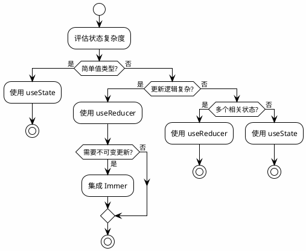
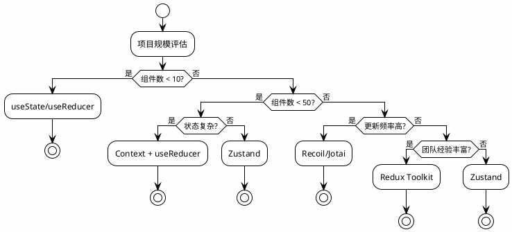

## 第4章 状态管理与数据流架构：AI辅助的状态设计

### 4.1 本地状态管理的类型策略与AI生成

本地状态管理是React应用的基础，选择合适的状态管理策略对于应用的可维护性至关重要。TypeScript的类型系统可以帮助我们做出更明智的决策。

#### 4.1.1 useState与useReducer的选择决策树

useState和useReducer是React提供的两个基础状态管理Hook，它们各有适用的场景。

**选择决策树**

```
状态管理Hook选择决策树：

状态类型是什么？
├── 简单值类型（string, number, boolean）
│   └── 使用 useState
│
├── 对象类型，更新逻辑简单
│   └── 使用 useState + 展开运算符
│
├── 对象类型，更新逻辑复杂
│   └── 使用 useReducer
│
├── 多个相关状态需要一起更新
│   └── 使用 useReducer
│
└── 状态转换有明确的业务规则
    └── 使用 useReducer + Immer
```

**简单值类型vs复杂状态机的Reducer模式**

```typescript
// 场景1：简单值类型 - useState
function Counter() {
  const [count, setCount] = useState(0);
  
  return (
    <div>
      <p>{count}</p>
      <button onClick={() => setCount(c => c + 1)}>+</button>
      <button onClick={() => setCount(c => c - 1)}>-</button>
    </div>
  );
}

// 场景2：复杂状态机 - useReducer
interface FormState {
  values: { username: string; password: string };
  errors: { username?: string; password?: string };
  touched: { username: boolean; password: boolean };
  isSubmitting: boolean;
  isValid: boolean;
}

type FormAction =
  | { type: 'SET_FIELD'; field: string; value: string }
  | { type: 'SET_ERROR'; field: string; error: string }
  | { type: 'SET_TOUCHED'; field: string }
  | { type: 'SUBMIT_START' }
  | { type: 'SUBMIT_SUCCESS' }
  | { type: 'SUBMIT_ERROR'; error: string };

function formReducer(state: FormState, action: FormAction): FormState {
  switch (action.type) {
    case 'SET_FIELD':
      return {
        ...state,
        values: { ...state.values, [action.field]: action.value },
      };
    case 'SET_ERROR':
      return {
        ...state,
        errors: { ...state.errors, [action.field]: action.error },
      };
    case 'SET_TOUCHED':
      return {
        ...state,
        touched: { ...state.touched, [action.field]: true },
      };
    case 'SUBMIT_START':
      return { ...state, isSubmitting: true };
    case 'SUBMIT_SUCCESS':
      return { ...state, isSubmitting: false, values: { username: '', password: '' } };
    case 'SUBMIT_ERROR':
      return { ...state, isSubmitting: false };
    default:
      return state;
  }
}

function LoginForm() {
  const [state, dispatch] = useReducer(formReducer, {
    values: { username: '', password: '' },
    errors: {},
    touched: {},
    isSubmitting: false,
    isValid: false,
  });
  
  // 使用dispatch更新状态
}
```

**Immer的集成类型与不可变更新**

```typescript
import produce from 'immer';

// 使用Immer简化Reducer
function formReducerWithImmer(
  state: FormState,
  action: FormAction
): FormState {
  return produce(state, (draft) => {
    switch (action.type) {
      case 'SET_FIELD':
        draft.values[action.field] = action.value;
        break;
      case 'SET_ERROR':
        draft.errors[action.field] = action.error;
        break;
      case 'SET_TOUCHED':
        draft.touched[action.field] = true;
        break;
      case 'SUBMIT_START':
        draft.isSubmitting = true;
        break;
      case 'SUBMIT_SUCCESS':
        draft.isSubmitting = false;
        draft.values = { username: '', password: '' };
        break;
    }
  });
}

// Immer的类型推导
type Draft<T> = T extends object ? { -readonly [K in keyof T]: Draft<T[K]> } : T;
// produce函数返回的类型与输入类型相同
```

**PlantUML图示：useState vs useReducer选择流程**



#### 4.1.2 状态提升(Lifting State Up)的类型传播

状态提升是React中共享状态的标准模式，TypeScript的类型系统确保状态在组件树中正确传播。

**跨组件状态共享的类型一致性保障**

```typescript
// 状态定义
interface TemperatureState {
  temperature: number;
  scale: 'c' | 'f';
}

// 父组件持有状态
function Calculator() {
  const [state, setState] = useState<TemperatureState>({
    temperature: 0,
    scale: 'c',
  });

  const handleCelsiusChange = (temperature: number) => {
    setState({ temperature, scale: 'c' });
  };

  const handleFahrenheitChange = (temperature: number) => {
    setState({ temperature, scale: 'f' });
  };

  const celsius = state.scale === 'f' ? convert(state.temperature, toCelsius) : state.temperature;
  const fahrenheit = state.scale === 'c' ? convert(state.temperature, toFahrenheit) : state.temperature;

  return (
    <div>
      <TemperatureInput
        scale="c"
        temperature={celsius}
        onTemperatureChange={handleCelsiusChange}
      />
      <TemperatureInput
        scale="f"
        temperature={fahrenheit}
        onTemperatureChange={handleFahrenheitChange}
      />
    </div>
  );
}

// 子组件Props类型
interface TemperatureInputProps {
  scale: 'c' | 'f';
  temperature: number;
  onTemperatureChange: (temperature: number) => void;
}

function TemperatureInput({ scale, temperature, onTemperatureChange }: TemperatureInputProps) {
  const handleChange = (e: React.ChangeEvent<HTMLInputElement>) => {
    onTemperatureChange(parseFloat(e.target.value));
  };

  return (
    <fieldset>
      <legend>Enter temperature in {scale === 'c' ? 'Celsius' : 'Fahrenheit'}:</legend>
      <input value={temperature} onChange={handleChange} />
    </fieldset>
  );
}
```

**Co-location状态与全局状态的边界**

```typescript
// 状态位置决策矩阵

/**
 * 状态位置原则：
 * 
 * 1. Co-location（组件本地）
 *    - 只被单个组件使用
 *    - 不需要持久化
 *    - 生命周期与组件绑定
 * 
 * 2. 父组件提升
 *    - 被多个兄弟组件共享
 *    - 需要协调子组件状态
 * 
 * 3. Context
 *    - 被跨层级组件共享
 *    - 主题、认证等全局状态
 * 
 * 4. 全局状态管理（Redux/Zustand）
 *    - 跨页面共享
 *    - 需要持久化
 *    - 复杂的状态逻辑
 */

// Co-location示例
function useLocalFormState() {
  const [values, setValues] = useState<Record<string, string>>({});
  const [errors, setErrors] = useState<Record<string, string>>({});
  
  // 只在组件内部使用
  return { values, setValues, errors, setErrors };
}

// Context示例
interface ThemeContextValue {
  theme: Theme;
  setTheme: (theme: Theme) => void;
}

const ThemeContext = createContext<ThemeContextValue | null>(null);

// 全局状态示例
interface AppState {
  user: User | null;
  cart: CartItem[];
  notifications: Notification[];
}

const useAppStore = create<AppState>(() => ({
  user: null,
  cart: [],
  notifications: [],
}));
```

#### 4.1.3 派生状态的计算缓存

派生状态（Derived State）是从现有状态计算得出的状态，合理使用缓存可以避免不必要的重计算。

**useMemo与计算属性的区别**

```typescript
// 场景：购物车计算
interface CartItem {
  id: string;
  price: number;
  quantity: number;
  discount?: number;
}

function ShoppingCart({ items }: { items: CartItem[] }) {
  // 不使用useMemo：每次渲染都重新计算
  const totalWithoutMemo = items.reduce(
    (sum, item) => sum + item.price * item.quantity * (1 - (item.discount || 0)),
    0
  );

  // 使用useMemo：只在items变化时计算
  const { subtotal, discount, total } = useMemo(() => {
    const subtotal = items.reduce((sum, item) => sum + item.price * item.quantity, 0);
    const discount = items.reduce(
      (sum, item) => sum + item.price * item.quantity * (item.discount || 0),
      0
    );
    const total = subtotal - discount;
    return { subtotal, discount, total };
  }, [items]);

  // 使用useCallback缓存事件处理器
  const handleCheckout = useCallback(() => {
    // 使用total
    checkout(total);
  }, [total]);

  return (
    <div>
      <p>Subtotal: ${subtotal.toFixed(2)}</p>
      <p>Discount: ${discount.toFixed(2)}</p>
      <p>Total: ${total.toFixed(2)}</p>
      <button onClick={handleCheckout}>Checkout</button>
    </div>
  );
}
```

**引用稳定性与重渲染触发条件的AI辅助优化建议**

```typescript
// AI辅助优化建议示例

/**
 * 优化建议1：避免在useMemo中创建新对象
 * 问题：每次返回新对象，导致子组件重渲染
 */
const badExample = useMemo(() => ({
  total: calculateTotal(items),
  count: items.length,
}), [items]);

// 优化：分别缓存
const total = useMemo(() => calculateTotal(items), [items]);
const count = useMemo(() => items.length, [items]);

/**
 * 优化建议2：注意依赖数组的完整性
 * 问题：缺少依赖导致陈旧闭包
 */
const badCallback = useCallback(() => {
  console.log(currentPage);  // 可能使用过期的currentPage
}, []);  // 缺少currentPage依赖

// 优化：包含所有依赖
const goodCallback = useCallback(() => {
  console.log(currentPage);
}, [currentPage]);

/**
 * 优化建议3：使用函数式更新避免依赖
 */
const [count, setCount] = useState(0);

// 不好的做法：需要count作为依赖
const increment = useCallback(() => {
  setCount(count + 1);
}, [count]);

// 优化：使用函数式更新
const increment = useCallback(() => {
  setCount(c => c + 1);
}, []);  // 不需要依赖
```

### 4.2 跨组件通信的类型安全方案

跨组件通信是React应用中的常见需求，TypeScript的类型系统可以确保通信的类型安全。

#### 4.2.1 Context API的泛型约束

Context API是React提供的跨组件状态共享机制，泛型约束确保Context的类型安全。

**createContext的Non-null断言与默认值设计**

```typescript
// 问题：Context的默认值可能导致运行时错误
const ThemeContext = createContext<Theme>('light');  // 简单默认值

function useTheme() {
  const theme = useContext(ThemeContext);
  return theme;  // 类型是Theme，但可能是默认值
}

// 更好的做法：使用null和类型守卫
interface ThemeContextValue {
  theme: Theme;
  setTheme: (theme: Theme) => void;
}

const ThemeContext = createContext<ThemeContextValue | null>(null);

// 类型安全的Hook
function useTheme(): ThemeContextValue {
  const context = useContext(ThemeContext);
  if (context === null) {
    throw new Error('useTheme must be used within a ThemeProvider');
  }
  return context;
}

// Provider实现
interface ThemeProviderProps {
  children: React.ReactNode;
  initialTheme?: Theme;
}

function ThemeProvider({ children, initialTheme = 'light' }: ThemeProviderProps) {
  const [theme, setTheme] = useState<Theme>(initialTheme);
  
  const value = useMemo(() => ({ theme, setTheme }), [theme]);
  
  return (
    <ThemeContext.Provider value={value}>
      {children}
    </ThemeContext.Provider>
  );
}
```

**泛型参数在Provider中的传递与消费**

```typescript
// 泛型Context定义
interface DataContextValue<T> {
  data: T | null;
  loading: boolean;
  error: Error | null;
  refetch: () => Promise<void>;
}

function createDataContext<T>() {
  const Context = createContext<DataContextValue<T> | null>(null);
  
  function useDataContext(): DataContextValue<T> {
    const context = useContext(Context);
    if (!context) {
      throw new Error('useDataContext must be used within Provider');
    }
    return context;
  }
  
  return [Context.Provider, useDataContext] as const;
}

// 使用
interface User {
  id: string;
  name: string;
}

const [UserProvider, useUser] = createDataContext<User>();

// 在组件中使用
function UserProfile() {
  const { data: user, loading, error } = useUser();
  
  if (loading) return <Loading />;
  if (error) return <Error message={error.message} />;
  if (!user) return <NotFound />;
  
  return <div>{user.name}</div>;  // 类型安全
}
```

#### 4.2.2 发布订阅模式的类型保障

发布订阅模式（Pub/Sub）是一种灵活的组件通信方式，类型系统确保事件和数据的类型安全。

**EventEmitter的泛型封装与类型化事件映射**

```typescript
// 类型化事件映射
type EventMap = {
  'user:login': { userId: string; timestamp: number };
  'user:logout': { userId: string };
  'cart:updated': { items: CartItem[]; total: number };
  'notification:received': Notification;
};

// 类型安全的EventEmitter
class TypedEventEmitter<Events extends Record<string, any>> {
  private listeners: {
    [K in keyof Events]?: Array<(data: Events[K]) => void>;
  } = {};

  on<K extends keyof Events>(
    event: K,
    listener: (data: Events[K]) => void
  ): () => void {
    if (!this.listeners[event]) {
      this.listeners[event] = [];
    }
    this.listeners[event]!.push(listener);
    
    return () => this.off(event, listener);
  }

  off<K extends keyof Events>(
    event: K,
    listener: (data: Events[K]) => void
  ): void {
    const listeners = this.listeners[event];
    if (listeners) {
      const index = listeners.indexOf(listener);
      if (index > -1) {
        listeners.splice(index, 1);
      }
    }
  }

  emit<K extends keyof Events>(event: K, data: Events[K]): void {
    const listeners = this.listeners[event];
    if (listeners) {
      listeners.forEach((listener) => listener(data));
    }
  }
}

// 创建全局事件总线
const eventBus = new TypedEventEmitter<EventMap>();

// 使用
function LoginButton() {
  const handleLogin = () => {
    // 类型安全的事件发射
    eventBus.emit('user:login', {
      userId: '123',
      timestamp: Date.now(),
    });
  };
  
  return <button onClick={handleLogin}>Login</button>;
}

function ActivityLog() {
  useEffect(() => {
    // 类型安全的事件监听
    const unsubscribe = eventBus.on('user:login', (data) => {
      console.log(`User ${data.userId} logged in at ${data.timestamp}`);
    });
    
    return unsubscribe;
  }, []);
  
  return <div>...</div>;
}
```

**事件名到Payload的映射类型与类型安全的事件总线**

```typescript
// 更高级的事件总线类型
type EventPayload<T> = T extends { payload: infer P } ? P : never;

type EventHandler<T> = (payload: T) => void;

interface EventBus<Events extends Record<string, any>> {
  on<K extends keyof Events>(
    event: K,
    handler: EventHandler<Events[K]>
  ): () => void;
  
  once<K extends keyof Events>(
    event: K,
    handler: EventHandler<Events[K]>
  ): void;
  
  emit<K extends keyof Events>(
    event: K,
    payload: Events[K]
  ): void;
  
  off<K extends keyof Events>(
    event: K,
    handler: EventHandler<Events[K]>
  ): void;
}

// React Hook封装
function useEvent<K extends keyof EventMap>(
  event: K,
  handler: (data: EventMap[K]) => void
) {
  useEffect(() => {
    return eventBus.on(event, handler);
  }, [event, handler]);
}

// 使用
function CartWatcher() {
  useEvent('cart:updated', ({ items, total }) => {
    // items和total都有正确的类型
    console.log(`Cart has ${items.length} items, total: $${total}`);
  });
  
  return null;
}
```

#### 4.2.3 Refs转发与命令式接口

Refs转发允许父组件访问子组件的DOM节点或实例方法，这在某些场景下是必要的。

**useImperativeHandle的类型定义与forwardRef的泛型参数**

```typescript
import { forwardRef, useImperativeHandle, useRef } from 'react';

// 定义命令式接口
interface InputFieldRef {
  focus: () => void;
  blur: () => void;
  clear: () => void;
  getValue: () => string;
  setValue: (value: string) => void;
  validate: () => boolean;
}

interface InputFieldProps {
  label: string;
  required?: boolean;
  validator?: (value: string) => string | null;
}

// forwardRef的泛型参数：RefType, PropsType
const InputField = forwardRef<InputFieldRef, InputFieldProps>(
  ({ label, required, validator }, ref) => {
    const inputRef = useRef<HTMLInputElement>(null);
    const [error, setError] = useState<string | null>(null);

    useImperativeHandle(ref, () => ({
      focus: () => inputRef.current?.focus(),
      blur: () => inputRef.current?.blur(),
      clear: () => {
        if (inputRef.current) {
          inputRef.current.value = '';
        }
      },
      getValue: () => inputRef.current?.value ?? '',
      setValue: (value) => {
        if (inputRef.current) {
          inputRef.current.value = value;
        }
      },
      validate: () => {
        const value = inputRef.current?.value ?? '';
        if (required && !value) {
          setError('This field is required');
          return false;
        }
        if (validator) {
          const error = validator(value);
          if (error) {
            setError(error);
            return false;
          }
        }
        setError(null);
        return true;
      },
    }));

    return (
      <div>
        <label>{label}</label>
        <input ref={inputRef} />
        {error && <span className="error">{error}</span>}
      </div>
    );
  }
);

// 使用
function Form() {
  const inputRef = useRef<InputFieldRef>(null);

  const handleSubmit = () => {
    const isValid = inputRef.current?.validate();
    if (isValid) {
      const value = inputRef.current?.getValue();
      // 提交表单
    }
  };

  return (
    <form onSubmit={handleSubmit}>
      <InputField ref={inputRef} label="Username" required />
      <button type="submit">Submit</button>
    </form>
  );
}
```

**组件暴露方法的类型契约与AI生成的ref接口**

```typescript
// AI生成ref接口的Prompt模板

/**
 * 需求：创建一个可复用的Modal组件，支持命令式打开/关闭
 * 
 * AI生成目标：
 * 1. 定义ModalRef接口
 * 2. 实现forwardRef组件
 * 3. 使用useImperativeHandle暴露方法
 */

// AI生成的代码
interface ModalRef {
  open: (options?: { title?: string; content?: React.ReactNode }) => void;
  close: () => void;
  toggle: () => void;
  isOpen: () => boolean;
}

interface ModalProps {
  defaultTitle?: string;
  onOpen?: () => void;
  onClose?: () => void;
  children?: React.ReactNode;
}

const Modal = forwardRef<ModalRef, ModalProps>(
  ({ defaultTitle, onOpen, onClose, children }, ref) => {
    const [isOpen, setIsOpen] = useState(false);
    const [title, setTitle] = useState(defaultTitle);
    const [content, setContent] = useState<React.ReactNode>(children);

    useImperativeHandle(ref, () => ({
      open: (options) => {
        if (options?.title) setTitle(options.title);
        if (options?.content) setContent(options.content);
        setIsOpen(true);
        onOpen?.();
      },
      close: () => {
        setIsOpen(false);
        onClose?.();
      },
      toggle: () => {
        setIsOpen((prev) => {
          const next = !prev;
          if (next) onOpen?.();
          else onClose?.();
          return next;
        });
      },
      isOpen: () => isOpen,
    }));

    if (!isOpen) return null;

    return (
      <div className="modal-overlay">
        <div className="modal">
          <h2>{title}</h2>
          <div className="modal-content">{content}</div>
        </div>
      </div>
    );
  }
);
```

### 4.3 AI驱动的状态架构设计

AI不仅可以辅助代码生成，还可以辅助状态架构的设计和决策。

#### 4.3.1 从需求文档生成状态机

状态机是管理复杂状态的有力工具，AI可以从需求文档中自动提取状态并生成状态机定义。

**XState与TypeScript的集成**

```typescript
import { createMachine, interpret, assign } from 'xstate';

// 需求："创建一个文件上传组件，支持选择文件、上传中、上传成功、上传失败状态"

// AI生成的状态机
interface FileUploadContext {
  file: File | null;
  progress: number;
  error: string | null;
  url: string | null;
}

type FileUploadEvent =
  | { type: 'SELECT_FILE'; file: File }
  | { type: 'UPLOAD' }
  | { type: 'PROGRESS'; progress: number }
  | { type: 'SUCCESS'; url: string }
  | { type: 'FAILURE'; error: string }
  | { type: 'RETRY' }
  | { type: 'RESET' };

const fileUploadMachine = createMachine({
  id: 'fileUpload',
  initial: 'idle',
  context: {
    file: null,
    progress: 0,
    error: null,
    url: null,
  } satisfies FileUploadContext,
  states: {
    idle: {
      on: {
        SELECT_FILE: {
          target: 'selected',
          actions: assign({ file: (_, event) => event.file }),
        },
      },
    },
    selected: {
      on: {
        UPLOAD: 'uploading',
        SELECT_FILE: {
          actions: assign({ file: (_, event) => event.file }),
        },
      },
    },
    uploading: {
      on: {
        PROGRESS: {
          actions: assign({ progress: (_, event) => event.progress }),
        },
        SUCCESS: {
          target: 'success',
          actions: assign({ url: (_, event) => event.url }),
        },
        FAILURE: {
          target: 'error',
          actions: assign({ error: (_, event) => event.error }),
        },
      },
    },
    success: {
      on: {
        RESET: 'idle',
      },
    },
    error: {
      on: {
        RETRY: 'uploading',
        SELECT_FILE: {
          target: 'selected',
          actions: assign({ file: (_, event) => event.file, error: null }),
        },
      },
    },
  },
});

// React集成
function useFileUpload() {
  const [state, send] = useMachine(fileUploadMachine);
  
  return {
    state: state.value,
    context: state.context,
    selectFile: (file: File) => send({ type: 'SELECT_FILE', file }),
    upload: () => send('UPLOAD'),
    retry: () => send('RETRY'),
    reset: () => send('RESET'),
  };
}
```

**AI从用户故事生成状态图与状态类型**

```markdown
# AI状态机生成Prompt

## 用户故事
作为用户，我希望能够：
1. 浏览商品列表
2. 将商品添加到购物车
3. 修改购物车中的商品数量
4. 从购物车移除商品
5. 提交订单
6. 查看订单状态

## 输出要求
1. 识别所有可能的状态
2. 定义状态之间的转换
3. 识别上下文数据
4. 生成XState状态机代码
5. 生成TypeScript类型定义

## 输出格式
```typescript
// 上下文类型
interface Context { ... }

// 事件类型
type Event = ...;

// 状态机
const machine = createMachine({ ... });
```
```

#### 4.3.2 状态管理的选型决策树

AI可以基于项目特征推荐合适的状态管理方案。

**基于项目规模、团队熟悉度、性能需求的LLM推荐系统**

```typescript
// 状态管理选型决策矩阵

/**
 * 决策因素：
 * 
 * 1. 项目规模
 *    - 小型（<10个组件）：useState/useReducer
 *    - 中型（10-50个组件）：Context + useReducer
 *    - 大型（>50个组件）：Redux/Zustand/Recoil
 * 
 * 2. 状态复杂度
 *    - 简单：useState
 *    - 中等：useReducer
 *    - 复杂：Redux + Redux Toolkit
 * 
 * 3. 跨组件共享需求
 *    - 局部：Co-location
 *    - 跨分支：Context
 *    - 全局：全局状态管理
 * 
 * 4. 性能要求
 *    - 一般：任何方案
 *    - 高频更新：Recoil/Jotai（原子化）
 *    - 大量数据：Zustand（选择性订阅）
 * 
 * 5. 团队熟悉度
 *    - 新手友好：Zustand
 *    - 经验丰富：Redux
 *    - 函数式偏好：Recoil/Jotai
 */

// AI推荐函数示例
interface ProjectProfile {
  componentCount: number;
  teamSize: number;
  stateComplexity: 'simple' | 'medium' | 'complex';
  updateFrequency: 'low' | 'medium' | 'high';
  teamExperience: 'beginner' | 'intermediate' | 'advanced';
}

function recommendStateManagement(profile: ProjectProfile): string {
  const { componentCount, stateComplexity, updateFrequency, teamExperience } = profile;
  
  // 小型项目
  if (componentCount < 10) {
    return 'useState/useReducer';
  }
  
  // 中型项目
  if (componentCount < 50) {
    if (stateComplexity === 'complex') {
      return 'Context + useReducer';
    }
    return 'Zustand';
  }
  
  // 大型项目
  if (updateFrequency === 'high') {
    return 'Recoil/Jotai';
  }
  
  if (teamExperience === 'advanced') {
    return 'Redux Toolkit';
  }
  
  return 'Zustand';
}
```

**PlantUML图示：状态管理选型决策树**



---

本章深入探讨了React状态管理的类型策略和AI辅助设计。从useState与useReducer的选择决策，到状态提升的类型传播，再到跨组件通信的类型安全方案，我们建立了完整的本地状态管理知识体系。同时，我们探讨了AI如何辅助状态机生成和状态管理选型，为AI-Native开发提供了实践指导。

状态管理是React应用的核心，类型安全的状态管理不仅能够减少运行时错误，还能够提高AI代码生成的质量。在下一部分中，我们将深入探讨Hooks原理、副作用工程和并发特性，建立对React运行机制的深层理解。
