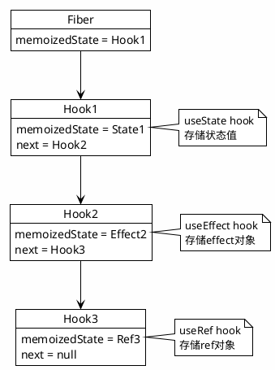

# 第三部分：Hooks原理与副作用工程：从使用规范到内存模型

## 第5章 Hooks运行机制与闭包陷阱：源码级理解与AI诊断

### 5.1 Hooks的链表存储与Dispatcher模式

Hooks是React 16.8引入的革命性特性，它允许在函数组件中使用状态和其他React特性。理解Hooks的底层实现机制，是掌握React高级用法的基础。

#### 5.1.1 Fiber节点中的Hooks链表结构

React使用链表结构来存储组件中的Hooks状态，这一设计决定了Hooks的使用规则。

**memoizedState的环形队列与数组索引的对应关系**

```
Hooks链表结构：

Fiber.memoizedState ──→ Hook1 ──→ Hook2 ──→ Hook3 ──→ null
                          │         │         │
                          ▼         ▼         ▼
                       State1    Effect2   Ref3

每个Hook节点包含：
- memoizedState: 当前状态值
- baseState: 基础状态（用于批量更新）
- baseQueue: 待处理的更新队列
- queue: 更新队列
- next: 下一个Hook节点
```

```typescript
// React Hooks内部类型定义（简化版）
interface Hook {
  memoizedState: any;
  baseState: any;
  baseQueue: Update<any> | null;
  queue: UpdateQueue<any> | null;
  next: Hook | null;
}

interface Update<State> {
  lane: Lane;
  action: Action<State>;
  eagerReducer: ((state: State, action: Action<State>) => State) | null;
  eagerState: State | null;
  next: Update<State>;
}

interface UpdateQueue<State> {
  pending: Update<State> | null;
  lanes: Lanes;
  dispatch: ((action: Action<State>) => void) | null;
  lastRenderedReducer: ((state: State, action: Action<State>) => State) | null;
  lastRenderedState: State;
}
```

**mount vs update阶段的dispatcher差异**

```typescript
// React内部使用不同的Dispatcher处理Mount和Update阶段

// Mount阶段的Dispatcher
const HooksDispatcherOnMount: Dispatcher = {
  readContext,
  useCallback: mountCallback,
  useContext: readContext,
  useEffect: mountEffect,
  useImperativeHandle: mountImperativeHandle,
  useLayoutEffect: mountLayoutEffect,
  useMemo: mountMemo,
  useReducer: mountReducer,
  useRef: mountRef,
  useState: mountState,
  useDebugValue: mountDebugValue,
  useDeferredValue: mountDeferredValue,
  useTransition: mountTransition,
  useMutableSource: mountMutableSource,
  useSyncExternalStore: mountSyncExternalStore,
  useId: mountId,
};

// Update阶段的Dispatcher
const HooksDispatcherOnUpdate: Dispatcher = {
  readContext,
  useCallback: updateCallback,
  useContext: readContext,
  useEffect: updateEffect,
  useImperativeHandle: updateImperativeHandle,
  useLayoutEffect: updateLayoutEffect,
  useMemo: updateMemo,
  useReducer: updateReducer,
  useRef: updateRef,
  useState: updateState,
  useDebugValue: updateDebugValue,
  useDeferredValue: updateDeferredValue,
  useTransition: updateTransition,
  useMutableSource: updateMutableSource,
  useSyncExternalStore: updateSyncExternalStore,
  useId: updateId,
};
```

**PlantUML图示：Hooks链表结构**



#### 5.1.2 HooksDispatcher的分环境注入

React根据不同的执行环境注入不同的Dispatcher，这是Hooks能够正确工作的关键。

**MountDispatcher、UpdateDispatcher与ContextOnlyDispatcher的源码级差异**

```typescript
// ReactInternals的暴露机制

// 1. 渲染阶段注入
export function renderWithHooks<Props, SecondArg>(
  current: Fiber | null,
  workInProgress: Fiber,
  Component: (p: Props, arg: SecondArg) => any,
  props: Props,
  secondArg: SecondArg,
  nextRenderLanes: Lanes,
): any {
  // 根据current是否为null选择Dispatcher
  // current === null: Mount阶段
  // current !== null: Update阶段
  ReactCurrentDispatcher.current =
    current === null || current.memoizedState === null
      ? HooksDispatcherOnMount
      : HooksDispatcherOnUpdate;
  
  // 执行组件函数
  const children = Component(props, secondArg);
  
  // 重置Dispatcher
  ReactCurrentDispatcher.current = ContextOnlyDispatcher;
  
  return children;
}

// 2. ContextOnlyDispatcher：用于检测Hooks在组件外调用
const ContextOnlyDispatcher: Dispatcher = {
  readContext,
  useCallback: throwInvalidHookError,
  useContext: throwInvalidHookError,
  useEffect: throwInvalidHookError,
  useImperativeHandle: throwInvalidHookError,
  useLayoutEffect: throwInvalidHookError,
  useMemo: throwInvalidHookError,
  useReducer: throwInvalidHookError,
  useRef: throwInvalidHookError,
  useState: throwInvalidHookError,
  // ... 所有Hooks都抛出错误
};

function throwInvalidHookError(): void {
  throw new Error(
    'Invalid hook call. Hooks can only be called inside of the body of a function component.',
  );
}
```

**Dispatcher注入的时机和原因**

```
Dispatcher注入流程：

1. 组件渲染前
   ↓
2. 根据current Fiber判断Mount/Update
   ↓
3. 注入对应的Dispatcher
   ↓
4. 执行组件函数（Hooks被调用）
   ↓
5. 重置为ContextOnlyDispatcher
   ↓
6. 渲染完成

为什么要重置为ContextOnlyDispatcher？
- 防止Hooks在渲染之外被调用
- 提供清晰的错误信息
- 确保Hooks调用的确定性
```

#### 5.1.3 调用顺序的确定性保证

Hooks的调用顺序必须保持一致，这是React Hooks的核心规则之一。

**为什么Hooks不能放在条件语句中**

```typescript
// 错误的用法：Hooks在条件语句中
function BadComponent({ condition }) {
  if (condition) {
    const [state, setState] = useState(0);  // 错误！
  }
  const [otherState, setOtherState] = useState(0);
  return <div />;
}

// 问题分析：
// 第一次渲染：condition = true
//   Hook1: useState(0) → 创建state
//   Hook2: useState(0) → 创建otherState
//
// 第二次渲染：condition = false
//   Hook1: useState(0) → 错误！期望otherState，但得到的是state

// 正确的用法：Hooks始终在顶层调用
function GoodComponent({ condition }) {
  const [state, setState] = useState(0);
  const [otherState, setOtherState] = useState(0);
  
  // 使用状态来实现条件逻辑
  const effectiveState = condition ? state : null;
  
  return <div />;
}
```

**严格模式的检测机制**

```typescript
// React StrictMode会故意双重调用某些函数来检测副作用

// 开发环境下：
function Component() {
  console.log('Component render');  // 会打印两次！
  
  const [count, setCount] = useState(0);
  
  useEffect(() => {
    console.log('Effect run');  // 也会执行两次
  }, []);
  
  return <div>{count}</div>;
}

// StrictMode的双重调用：
// 1. 第一次调用：检测副作用
// 2. 第二次调用：实际渲染
// 如果两次调用结果不一致，说明存在副作用
```

### 5.2 闭包陈旧(Stale Closure)问题的类型诊断与AI修复

闭包陈旧是Hooks使用中最常见的问题之一，理解其成因和解决方案对于编写正确的React代码至关重要。

#### 5.2.1 依赖数组的完备性检查

依赖数组告诉React何时重新执行Effect或重新创建Callback，不完整的依赖数组会导致闭包陈旧问题。

**ESLint规则react-hooks/exhaustive-deps的静态分析原理**

```
eslint-plugin-react-hooks的检测逻辑：

1. 解析Effect/Callback的函数体
2. 识别所有外部变量引用
3. 对比依赖数组中的项
4. 报告缺失的依赖

检测范围：
- useEffect
- useLayoutEffect
- useCallback
- useMemo
- useImperativeHandle
```

```typescript
// ESLint可以检测到的缺失依赖
function Component({ userId, onUpdate }) {
  const [data, setData] = useState(null);
  
  useEffect(() => {
    // ESLint警告：缺少依赖 'userId'
    fetch(`/api/users/${userId}`)
      .then(res => res.json())
      .then(setData);
  }, []);  // 依赖数组不完整
  
  const handleClick = useCallback(() => {
    // ESLint警告：缺少依赖 'onUpdate'
    onUpdate(data);
  }, [data]);  // 缺少onUpdate
  
  return <button onClick={handleClick}>Update</button>;
}

// 修复后的代码
function Component({ userId, onUpdate }) {
  const [data, setData] = useState(null);
  
  useEffect(() => {
    fetch(`/api/users/${userId}`)
      .then(res => res.json())
      .then(setData);
  }, [userId]);  // 完整的依赖
  
  const handleClick = useCallback(() => {
    onUpdate(data);
  }, [data, onUpdate]);  // 完整的依赖
  
  return <button onClick={handleClick}>Update</button>;
}
```

**自定义Hooks的依赖传播**

```typescript
// 自定义Hook需要正确传播依赖
function useApi(url: string, options?: RequestInit) {
  const [data, setData] = useState(null);
  const [loading, setLoading] = useState(true);
  const [error, setError] = useState<Error | null>(null);
  
  useEffect(() => {
    setLoading(true);
    fetch(url, options)
      .then(res => res.json())
      .then(setData)
      .catch(setError)
      .finally(() => setLoading(false));
  }, [url, options]);  // 传播所有依赖
  
  return { data, loading, error };
}

// 问题：options是对象，每次渲染都是新引用
// 解决方案1：在调用处使用useMemo
function Component() {
  const options = useMemo(() => ({
    headers: { Authorization: 'Bearer token' }
  }), []);
  
  const { data } = useApi('/api/data', options);
  return <div>{data}</div>;
}

// 解决方案2：在Hook内部处理
function useApiV2(url: string, options?: RequestInit) {
  const [data, setData] = useState(null);
  const [loading, setLoading] = useState(true);
  
  // 使用JSON.stringify来比较对象内容
  const optionsKey = JSON.stringify(options);
  
  useEffect(() => {
    setLoading(true);
    fetch(url, options)
      .then(res => res.json())
      .then(setData)
      .finally(() => setLoading(false));
  }, [url, optionsKey]);
  
  return { data, loading };
}
```

#### 5.2.2 函数引用的稳定性优化

函数引用的稳定性对于子组件的性能优化至关重要。

**useCallback的缓存策略与引用相等性陷阱**

```typescript
// 问题：内联函数导致子组件重渲染
function Parent() {
  const [count, setCount] = useState(0);
  
  // 每次渲染都创建新函数
  const handleClick = () => {
    console.log('Clicked');
  };
  
  // Child组件会每次都重渲染，即使handleClick逻辑没变
  return <Child onClick={handleClick} />;
}

// 解决方案：使用useCallback
function ParentFixed() {
  const [count, setCount] = useState(0);
  
  // 函数被缓存，只有依赖变化时才重新创建
  const handleClick = useCallback(() => {
    console.log('Clicked');
  }, []);  // 空依赖数组，函数永不改变
  
  return <Child onClick={handleClick} />;
}

// 陷阱：依赖数组不完整导致陈旧闭包
function Counter() {
  const [count, setCount] = useState(0);
  
  const increment = useCallback(() => {
    // 问题：count永远是0（初始值）
    setCount(count + 1);
  }, []);  // 缺少count依赖
  
  return <button onClick={increment}>{count}</button>;
}

// 修复：使用函数式更新
function CounterFixed() {
  const [count, setCount] = useState(0);
  
  const increment = useCallback(() => {
    // 使用函数式更新，不依赖外部count
    setCount(c => c + 1);
  }, []);  // 不需要依赖
  
  return <button onClick={increment}>{count}</button>;
}
```

**子组件重渲染阻断的触发条件**

```typescript
// React.memo的工作原理
const MemoizedChild = React.memo(Child);

// 重渲染触发条件：
// 1. Props引用变化
// 2. 内部状态变化
// 3. 父组件重渲染（如果没有memo）

// 优化策略
function OptimizedParent() {
  const [count, setCount] = useState(0);
  const [name, setName] = useState('');
  
  // 缓存回调函数
  const handleNameChange = useCallback((value: string) => {
    setName(value);
  }, []);
  
  // 缓存对象
  const config = useMemo(() => ({
    maxLength: 100,
    placeholder: 'Enter name',
  }), []);
  
  return (
    <div>
      <p>{count}</p>
      {/* 只有当name变化时，NameInput才会重渲染 */}
      <MemoizedChild 
        value={name} 
        onChange={handleNameChange}
        config={config}
      />
    </div>
  );
}
```

#### 5.2.3 异步操作中的状态一致性

异步操作中的状态一致性是React开发中的常见问题，useRef提供了一种解决方案。

**useRef的突变(Mutable)模式与闭包捕获的最新值引用**

```typescript
// 问题：异步操作中的陈旧状态
function SearchComponent() {
  const [query, setQuery] = useState('');
  
  const handleSearch = async () => {
    // 等待1秒后发送请求
    await new Promise(resolve => setTimeout(resolve, 1000));
    
    // 问题：query可能是1秒前的值
    const results = await fetch(`/api/search?q=${query}`);
    // ...
  };
  
  return <button onClick={handleSearch}>Search</button>;
}

// 解决方案1：使用useRef保存最新值
function SearchComponentFixed() {
  const [query, setQuery] = useState('');
  const queryRef = useRef(query);
  
  // 保持ref与state同步
  useEffect(() => {
    queryRef.current = query;
  }, [query]);
  
  const handleSearch = async () => {
    await new Promise(resolve => setTimeout(resolve, 1000));
    
    // 使用ref获取最新值
    const results = await fetch(`/api/search?q=${queryRef.current}`);
    // ...
  };
  
  return <button onClick={handleSearch}>Search</button>;
}

// 解决方案2：使用useCallback配合依赖
function SearchComponentFixed2() {
  const [query, setQuery] = useState('');
  
  // 每次query变化都重新创建函数
  const handleSearch = useCallback(async () => {
    const results = await fetch(`/api/search?q=${query}`);
    // ...
  }, [query]);  // 包含query依赖
  
  return <button onClick={handleSearch}>Search</button>;
}
```

**事件处理程序的稳定性保障与Concurrent Mode下的风险**

```typescript
// Concurrent Mode下的额外考虑
function ConcurrentSafeComponent() {
  const [count, setCount] = useState(0);
  const countRef = useRef(count);
  
  // 在Concurrent Mode中，渲染可能中断
  // useEffect的同步更新确保ref总是最新的
  useLayoutEffect(() => {
    countRef.current = count;
  });
  
  const handleClick = useCallback(() => {
    // 使用ref获取最新值，避免中断导致的问题
    console.log(countRef.current);
  }, []);
  
  return <button onClick={handleClick}>{count}</button>;
}
```

### 5.3 AI辅助的Hooks逻辑抽象与生成

AI可以辅助识别可抽象的Hooks逻辑，并生成自定义Hooks。

#### 5.3.1 从业务逻辑描述生成自定义Hooks

AI可以将自然语言描述的业务逻辑转换为自定义Hooks。

**自然语言到useEffect/useCallback组合的转换**

```markdown
# AI Hooks生成Prompt

## 业务逻辑描述
"创建一个Hook来管理表单状态，包括：
1. 跟踪表单字段值
2. 验证字段
3. 处理提交
4. 支持重置"

## 输出要求
1. 完整的TypeScript类型定义
2. 使用React内置Hooks
3. 包含错误处理
4. 提供使用示例
```

```typescript
// AI生成的表单管理Hook
interface UseFormOptions<T> {
  initialValues: T;
  validate?: (values: T) => Partial<Record<keyof T, string>>;
  onSubmit: (values: T) => Promise<void> | void;
}

interface UseFormReturn<T> {
  values: T;
  errors: Partial<Record<keyof T, string>>;
  touched: Partial<Record<keyof T, boolean>>;
  isSubmitting: boolean;
  handleChange: (field: keyof T) => (value: any) => void;
  handleBlur: (field: keyof T) => () => void;
  handleSubmit: (e?: React.FormEvent) => Promise<void>;
  reset: () => void;
}

function useForm<T extends Record<string, any>>(
  options: UseFormOptions<T>
): UseFormReturn<T> {
  const { initialValues, validate, onSubmit } = options;
  
  const [values, setValues] = useState<T>(initialValues);
  const [errors, setErrors] = useState<Partial<Record<keyof T, string>>>({});
  const [touched, setTouched] = useState<Partial<Record<keyof T, boolean>>>({});
  const [isSubmitting, setIsSubmitting] = useState(false);
  
  const handleChange = useCallback(
    (field: keyof T) => (value: any) => {
      setValues((prev) => ({ ...prev, [field]: value }));
      
      // 如果字段已被触碰，实时验证
      if (touched[field] && validate) {
        const fieldErrors = validate(values);
        setErrors((prev) => ({ ...prev, [field]: fieldErrors[field] }));
      }
    },
    [touched, validate, values]
  );
  
  const handleBlur = useCallback(
    (field: keyof T) => () => {
      setTouched((prev) => ({ ...prev, [field]: true }));
      
      if (validate) {
        const fieldErrors = validate(values);
        setErrors((prev) => ({ ...prev, [field]: fieldErrors[field] }));
      }
    },
    [validate, values]
  );
  
  const handleSubmit = useCallback(
    async (e?: React.FormEvent) => {
      e?.preventDefault();
      
      // 验证所有字段
      if (validate) {
        const allErrors = validate(values);
        setErrors(allErrors);
        
        if (Object.keys(allErrors).length > 0) {
          return;
        }
      }
      
      setIsSubmitting(true);
      try {
        await onSubmit(values);
      } finally {
        setIsSubmitting(false);
      }
    },
    [onSubmit, validate, values]
  );
  
  const reset = useCallback(() => {
    setValues(initialValues);
    setErrors({});
    setTouched({});
    setIsSubmitting(false);
  }, [initialValues]);
  
  return {
    values,
    errors,
    touched,
    isSubmitting,
    handleChange,
    handleBlur,
    handleSubmit,
    reset,
  };
}

// 使用示例
function LoginForm() {
  const form = useForm({
    initialValues: { email: '', password: '' },
    validate: (values) => {
      const errors: Partial<typeof values> = {};
      if (!values.email) errors.email = 'Email is required';
      if (!values.password) errors.password = 'Password is required';
      return errors;
    },
    onSubmit: async (values) => {
      await login(values);
    },
  });
  
  return (
    <form onSubmit={form.handleSubmit}>
      <input
        value={form.values.email}
        onChange={(e) => form.handleChange('email')(e.target.value)}
        onBlur={form.handleBlur('email')}
      />
      {form.errors.email && <span>{form.errors.email}</span>}
      
      <input
        type="password"
        value={form.values.password}
        onChange={(e) => form.handleChange('password')(e.target.value)}
        onBlur={form.handleBlur('password')}
      />
      {form.errors.password && <span>{form.errors.password}</span>}
      
      <button type="submit" disabled={form.isSubmitting}>
        Login
      </button>
    </form>
  );
}
```

#### 5.3.2 通用逻辑抽象库

AI可以识别常见的逻辑模式并生成可复用的Hooks。

**useFetch的AbortController集成**

```typescript
interface UseFetchOptions extends RequestInit {
  immediate?: boolean;
}

interface UseFetchReturn<T> {
  data: T | null;
  loading: boolean;
  error: Error | null;
  execute: (url?: string, options?: RequestInit) => Promise<void>;
  abort: () => void;
}

function useFetch<T = any>(
  url?: string,
  options: UseFetchOptions = {}
): UseFetchReturn<T> {
  const { immediate = true, ...fetchOptions } = options;
  
  const [data, setData] = useState<T | null>(null);
  const [loading, setLoading] = useState(false);
  const [error, setError] = useState<Error | null>(null);
  
  const abortControllerRef = useRef<AbortController | null>(null);
  
  const abort = useCallback(() => {
    abortControllerRef.current?.abort();
  }, []);
  
  const execute = useCallback(
    async (executeUrl?: string, executeOptions?: RequestInit) => {
      // 取消之前的请求
      abort();
      
      const controller = new AbortController();
      abortControllerRef.current = controller;
      
      setLoading(true);
      setError(null);
      
      try {
        const response = await fetch(executeUrl || url || '', {
          ...fetchOptions,
          ...executeOptions,
          signal: controller.signal,
        });
        
        if (!response.ok) {
          throw new Error(`HTTP error! status: ${response.status}`);
        }
        
        const result = await response.json();
        setData(result);
      } catch (err) {
        if (err.name !== 'AbortError') {
          setError(err instanceof Error ? err : new Error(String(err)));
        }
      } finally {
        setLoading(false);
      }
    },
    [url, fetchOptions, abort]
  );
  
  // 组件卸载时取消请求
  useEffect(() => {
    return () => abort();
  }, [abort]);
  
  // 立即执行
  useEffect(() => {
    if (immediate && url) {
      execute();
    }
  }, [immediate, url, execute]);
  
  return { data, loading, error, execute, abort };
}
```

**useDebounce的定时器类型**

```typescript
function useDebounce<T>(value: T, delay: number): T {
  const [debouncedValue, setDebouncedValue] = useState<T>(value);
  const timerRef = useRef<ReturnType<typeof setTimeout> | null>(null);
  
  useEffect(() => {
    // 清除之前的定时器
    if (timerRef.current) {
      clearTimeout(timerRef.current);
    }
    
    // 设置新的定时器
    timerRef.current = setTimeout(() => {
      setDebouncedValue(value);
    }, delay);
    
    // 清理函数
    return () => {
      if (timerRef.current) {
        clearTimeout(timerRef.current);
      }
    };
  }, [value, delay]);
  
  return debouncedValue;
}

// 使用
function SearchInput() {
  const [query, setQuery] = useState('');
  const debouncedQuery = useDebounce(query, 500);
  
  useEffect(() => {
    // 只在debouncedQuery变化时执行搜索
    search(debouncedQuery);
  }, [debouncedQuery]);
  
  return (
    <input
      value={query}
      onChange={(e) => setQuery(e.target.value)}
    />
  );
}
```

**useLocalStorage的存储事件同步**

```typescript
function useLocalStorage<T>(
  key: string,
  initialValue: T
): [T, (value: T | ((prev: T) => T)) => void] {
  // 获取初始值
  const [storedValue, setStoredValue] = useState<T>(() => {
    try {
      const item = window.localStorage.getItem(key);
      return item ? (JSON.parse(item) as T) : initialValue;
    } catch (error) {
      console.error(`Error reading localStorage key "${key}":`, error);
      return initialValue;
    }
  });
  
  // 设置值并同步到localStorage
  const setValue = useCallback(
    (value: T | ((prev: T) => T)) => {
      try {
        const valueToStore = value instanceof Function ? value(storedValue) : value;
        setStoredValue(valueToStore);
        window.localStorage.setItem(key, JSON.stringify(valueToStore));
      } catch (error) {
        console.error(`Error setting localStorage key "${key}":`, error);
      }
    },
    [key, storedValue]
  );
  
  // 监听其他标签页的存储变化
  useEffect(() => {
    const handleStorageChange = (event: StorageEvent) => {
      if (event.key === key && event.newValue !== null) {
        try {
          setStoredValue(JSON.parse(event.newValue) as T);
        } catch (error) {
          console.error(`Error parsing storage change for key "${key}":`, error);
        }
      }
    };
    
    window.addEventListener('storage', handleStorageChange);
    return () => window.removeEventListener('storage', handleStorageChange);
  }, [key]);
  
  return [storedValue, setValue];
}
```

---

本章深入探讨了React Hooks的运行机制、闭包陷阱和AI辅助的Hooks生成。从Fiber节点中的Hooks链表结构，到Dispatcher的分环境注入，再到闭包陈旧问题的诊断和修复，我们建立了对Hooks底层原理的深入理解。同时，我们探讨了AI如何辅助识别可抽象的Hooks逻辑并生成自定义Hooks。

Hooks是React现代开发的核心，理解其原理对于编写高效、正确的React代码至关重要。在下一章中，我们将深入探讨副作用管理和异步流程，建立对React副作用系统的完整认知。
