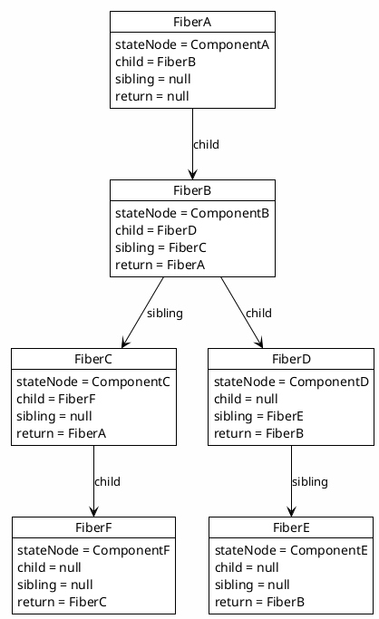
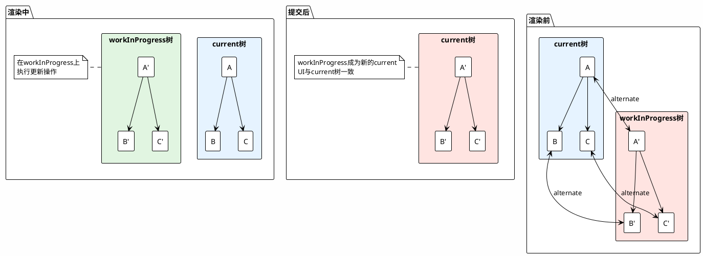

# 第四部分：Fiber架构与并发渲染：React内核源码级剖析

## 第7章 React Fiber架构：可中断的渲染调度机制

### 7.1 Fiber节点的数据结构全景

Fiber架构是React 16引入的核心重构，它彻底改变了React的协调（Reconciliation）机制，使得渲染可以被中断和恢复，为并发特性奠定了基础。

#### 7.1.1 链表表示的三叉树

Fiber使用链表结构来表示组件树，这种设计使得遍历可以灵活地中断和恢复。

**child、sibling、return指针的遍历算法与栈模拟**

```
Fiber节点结构：

interface Fiber {
  // 实例相关
  stateNode: any;           // 对应的DOM节点或组件实例
  
  // 工作相关
  pendingProps: Props;      // 新的Props
  memoizedProps: Props;     // 已应用的Props
  memoizedState: any;       // 已处理的状态（Hooks链表）
  updateQueue: UpdateQueue; // 更新队列
  
  // 关系指针
  child: Fiber | null;      // 第一个子节点
  sibling: Fiber | null;    // 下一个兄弟节点
  return: Fiber | null;     // 父节点
  
  // 副作用相关
  flags: Flags;             // 副作用标记
  subtreeFlags: Flags;      // 子树副作用标记
  
  // 双缓冲
  alternate: Fiber | null;  // 对应的工作单元（current/workInProgress）
}

树形结构示例：

      A (return: null)
     / \
    B   C (sibling: null)
   / \   \
  D   E   F

链表表示：
A.child = B
B.sibling = C
B.child = D
D.sibling = E
C.child = F
B.return = A
C.return = A
D.return = B
E.return = B
F.return = C
```

**深度优先遍历的递归改循环优化与空间复杂度分析**

```typescript
// 递归遍历（传统方式，可能栈溢出）
function traverseRecursive(fiber: Fiber | null, callback: (f: Fiber) => void) {
  if (!fiber) return;
  
  callback(fiber);
  traverseRecursive(fiber.child, callback);
  traverseRecursive(fiber.sibling, callback);
}

// 循环遍历（Fiber使用的方式，可中断）
function traverseIterative(root: Fiber, callback: (f: Fiber) => void) {
  let current: Fiber | null = root;
  
  while (current !== null) {
    callback(current);
    
    // 优先访问子节点
    if (current.child !== null) {
      current = current.child;
      continue;
    }
    
    // 没有子节点，访问兄弟节点
    if (current.sibling !== null) {
      current = current.sibling;
      continue;
    }
    
    // 向上回溯
    while (current !== null) {
      if (current.sibling !== null) {
        current = current.sibling;
        break;
      }
      current = current.return;
    }
  }
}

// 可中断的遍历（React实际使用）
function* traverseInterruptible(root: Fiber): Generator<Fiber, void, boolean> {
  let current: Fiber | null = root;
  
  while (current !== null) {
    // yield当前节点，外部可以决定是否继续
    const shouldContinue = yield current;
    if (!shouldContinue) return;
    
    if (current.child !== null) {
      current = current.child;
    } else if (current.sibling !== null) {
      current = current.sibling;
    } else {
      while (current !== null) {
        if (current.sibling !== null) {
          current = current.sibling;
          break;
        }
        current = current.return;
      }
    }
  }
}
```

**PlantUML图示：Fiber链表结构**



#### 7.1.2 Fiber节点的属性分类

Fiber节点的属性可以分为几个主要类别，每个类别承担不同的职责。

**实例相关、工作相关、副作用相关的内存布局**

```typescript
// Fiber节点完整类型定义（简化版）
interface Fiber {
  // ========== 标识 ==========
  tag: WorkTag;              // 组件类型标记
  key: string | null;        // key属性
  elementType: any;          // 元素类型（用于DevTools）
  type: any;                 // 组件类型（函数、类、DOM标签）
  
  // ========== 实例相关 ==========
  stateNode: any;            // 
  // - 对于HostComponent：对应的DOM节点
  // - 对于ClassComponent：组件实例
  // - 对于FunctionComponent：null
  
  // ========== 工作相关 ==========
  pendingProps: Props;       // 新的Props（等待处理）
  memoizedProps: Props;      // 已应用的Props
  memoizedState: any;        // 
  // - 对于ClassComponent：state
  // - 对于FunctionComponent：Hooks链表头
  updateQueue: UpdateQueue | null;  // 更新队列
  
  // ========== 关系指针 ==========
  return: Fiber | null;      // 父节点
  child: Fiber | null;       // 第一个子节点
  sibling: Fiber | null;     // 下一个兄弟节点
  index: number;             // 在兄弟节点中的索引
  
  // ========== 副作用相关 ==========
  flags: Flags;              // 当前节点的副作用
  subtreeFlags: Flags;       // 子树的副作用汇总
  deletions: Fiber[] | null; // 待删除的子节点
  
  // ========== 双缓冲 ==========
  alternate: Fiber | null;   // 对应的工作单元
  // current.alternate = workInProgress
  // workInProgress.alternate = current
  
  // ========== 调度相关 ==========
  lanes: Lanes;              // 当前节点的更新优先级
  childLanes: Lanes;         // 子树的更新优先级
  
  // ========== 调试相关 ==========
  _debugSource?: Source;
  _debugOwner?: Fiber;
  _debugNeedsRemount?: boolean;
}

// WorkTag枚举
enum WorkTag {
  FunctionComponent = 0,
  ClassComponent = 1,
  IndeterminateComponent = 2,  // 初始渲染前不确定类型
  HostRoot = 3,                // 根节点
  HostPortal = 4,
  HostComponent = 5,           // DOM节点
  HostText = 6,                // 文本节点
  Fragment = 7,
  Mode = 8,
  ContextConsumer = 9,
  ContextProvider = 10,
  ForwardRef = 11,
  Profiler = 12,
  SuspenseComponent = 13,
  MemoComponent = 14,
  SimpleMemoComponent = 15,
  LazyComponent = 16,
  IncompleteClassComponent = 17,
  DehydratedFragment = 18,
  SuspenseListComponent = 19,
  ScopeComponent = 21,
  OffscreenComponent = 22,
  LegacyHiddenComponent = 23,
  CacheComponent = 24,
  TracingMarkerComponent = 25,
}

// Flags（副作用标记）
enum Flags {
  NoFlags = 0,
  PerformedWork = 1,
  Placement = 2,           // 需要插入
  Update = 4,              // 需要更新
  ChildDeletion = 16,      // 需要删除子节点
  ContentReset = 32,
  Callback = 64,
  DidCapture = 128,        // 捕获到错误
  Ref = 256,               // Ref需要更新
  Snapshot = 1024,
  Passive = 2048,          // Passive effect（useEffect）
  Visibility = 4096,
  StoreConsistency = 8192,
  // ... 更多标记
}
```

#### 7.1.3 双缓冲(Double Buffering)技术

双缓冲是React实现高效更新的核心技术，它通过维护两棵Fiber树来实现。

**current树与workInProgress树的alternate指针同步与UI一致性保障**

```
双缓冲机制：

阶段1：初始渲染
- current = null（还没有UI）
- 创建workInProgress树
- 渲染完成后，workInProgress成为current

阶段2：更新
- current = 当前显示的UI对应的Fiber树
- 基于current创建workInProgress树（alternate关系）
- 在workInProgress上执行更新
- 提交完成后，workInProgress成为新的current

alternate关系：
current Fiber <-> workInProgress Fiber
     A                 A'
    / \               / \
   B   C             B'  C'

A.alternate = A'
A'.alternate = A
B.alternate = B'
...
```

```typescript
// 创建workInProgress节点
function createWorkInProgress(current: Fiber, pendingProps: Props): Fiber {
  let workInProgress = current.alternate;
  
  if (workInProgress === null) {
    // 创建新的workInProgress节点
    workInProgress = createFiber(
      current.tag,
      pendingProps,
      current.key,
      current.mode
    );
    
    workInProgress.elementType = current.elementType;
    workInProgress.type = current.type;
    workInProgress.stateNode = current.stateNode;
    
    // 建立alternate关系
    workInProgress.alternate = current;
    current.alternate = workInProgress;
  } else {
    // 复用现有的workInProgress节点
    workInProgress.pendingProps = pendingProps;
    workInProgress.lanes = NoLanes;
    workInProgress.child = null;
    workInProgress.memoizedState = null;
    workInProgress.updateQueue = null;
    workInProgress.sibling = null;
    workInProgress.flags = NoFlags;
    workInProgress.subtreeFlags = NoFlags;
    workInProgress.deletions = null;
  }
  
  workInProgress.lanes = current.lanes;
  workInProgress.childLanes = current.childLanes;
  workInProgress.index = current.index;
  workInProgress.ref = current.ref;
  
  return workInProgress;
}

// 提交阶段的原子性
function commitRoot(root: FiberRoot) {
  const finishedWork = root.finishedWork;
  
  if (finishedWork === null) {
    return;
  }
  
  // 原子性地切换current树
  root.current = finishedWork.alternate;
  
  // 执行DOM操作
  commitMutationEffects(root, finishedWork);
  
  // 切换完成后，UI与current树一致
}
```

**PlantUML图示：双缓冲机制**



### 7.2 工作循环(Work Loop)与优先级调度

工作循环是React调度的核心，它负责协调渲染工作，确保浏览器保持响应。

#### 7.2.1 performConcurrentWorkOnRoot的入口调度

performConcurrentWorkOnRoot是并发渲染的入口函数，它负责启动工作循环。

**优先级比较与任务饥饿(Starvation)预防机制**

```typescript
// Lane模型：使用位掩码表示优先级
export type Lane = number;
export type Lanes = number;

// 优先级定义（从高位到低位，优先级递减）
export const SyncLane: Lane = 0b0000000000000000000000000000001;  // 同步，最高优先级
export const InputContinuousHydrationLane: Lane = 0b0000000000000000000000000000010;
export const InputContinuousLane: Lane = 0b0000000000000000000000000000100;
export const DefaultHydrationLane: Lane = 0b0000000000000000000000000001000;
export const DefaultLane: Lane = 0b0000000000000000000000000010000;
export const TransitionHydrationLane: Lane = 0b0000000000000000000000000100000;
export const TransitionLane1: Lane = 0b0000000000000000000000001000000;
export const TransitionLane2: Lane = 0b0000000000000000000000010000000;
// ... 更多Transition lanes
export const IdleLane: Lane = 0b0100000000000000000000000000000;  // 空闲，最低优先级

// 优先级操作
function getHighestPriorityLane(lanes: Lanes): Lane {
  return lanes & -lanes;  // 获取最低位的1（最高优先级）
}

function includesNonIdleWork(lanes: Lanes): boolean {
  return (lanes & NonIdleLanes) !== NoLanes;
}

function markStarvedLanesAsExpired(root: FiberRoot, currentTime: number): void {
  const pendingLanes = root.pendingLanes;
  const expiredLanes = root.expiredLanes;
  
  // 检查每个lane的过期时间
  let lanes = pendingLanes;
  while (lanes > 0) {
    const index = pickArbitraryLaneIndex(lanes);
    const lane = 1 << index;
    
    const expirationTime = root.expirationTimes[index];
    if (expirationTime !== NoTimestamp && expirationTime <= currentTime) {
      // 标记为过期，提升优先级
      root.expiredLanes |= lane;
    }
    
    lanes &= ~lane;
  }
}
```

**Lane模型的位掩码操作与优先级合并**

```typescript
// Lane操作示例
const lane1: Lane = 0b001;  // Sync
const lane2: Lane = 0b010;  // InputContinuous
const lane3: Lane = 0b100;  // Default

// 合并优先级
const combined: Lanes = lane1 | lane2 | lane3;  // 0b111

// 检查是否包含某个优先级
const hasSync = (combined & SyncLane) !== 0;  // true

// 移除优先级
const withoutSync = combined & ~SyncLane;  // 0b110

// 获取最高优先级
const highest = combined & -combined;  // 0b001 (SyncLane)

// 优先级排序
function lanesToPriority(lanes: Lanes): number {
  // 返回优先级数值，越小优先级越高
  if ((lanes & SyncLane) !== NoLanes) return 1;
  if ((lanes & InputContinuousLane) !== NoLanes) return 2;
  if ((lanes & DefaultLane) !== NoLanes) return 3;
  // ...
  return 100;  // Idle
}
```

#### 7.2.2 时间切片(Time Slicing)的实现

时间切片是React实现可中断渲染的关键技术，它确保浏览器主线程保持响应。

**MessageChannel的宏任务调度与5ms帧时间预算的shouldYield检查点**

```typescript
// 调度器使用MessageChannel进行异步调度
const channel = new MessageChannel();
const port = channel.port2;

// 请求调度
function requestHostCallback(callback: () => void) {
  scheduledHostCallback = callback;
  port.postMessage(null);  // 触发宏任务
}

// 处理回调
channel.port1.onmessage = function() {
  if (scheduledHostCallback !== null) {
    const currentTime = getCurrentTime();
    
    // 5ms时间片
    const hasTimeRemaining = currentTime < startTime + 5;
    
    if (hasTimeRemaining && !shouldYieldToHost()) {
      // 继续执行工作
      scheduledHostCallback();
    } else {
      // 时间用完，让出主线程
      port.postMessage(null);
    }
  }
};

// shouldYield检查
function shouldYieldToHost(): boolean {
  return (
    // 1. 帧时间用完（5ms）
    getCurrentTime() >= deadline ||
    // 2. 有更高优先级的工作
    needsPaint ||
    // 3. 有紧急任务（如用户输入）
    hasPendingInput
  );
}

// 工作循环中的yield检查
function workLoopConcurrent() {
  while (workInProgress !== null && !shouldYield()) {
    workInProgress = performUnitOfWork(workInProgress);
  }
}

// 帧时间预算的可视化
/*
时间轴：
0ms    5ms    10ms   15ms   20ms
|------|------|------|------|
[React ][Browser][React ][Browser]
 工作    事件    工作    渲染

每个5ms时间片：
- React执行渲染工作
- 让出主线程处理浏览器事件
- 下一帧继续
*/
```

**浏览器主线程协作与卡顿预防**

```typescript
// 检测长任务
const observer = new PerformanceObserver((list) => {
  for (const entry of list.getEntries()) {
    if (entry.duration > 50) {
      console.warn('Long task detected:', entry.duration, 'ms');
    }
  }
});
observer.observe({ entryTypes: ['longtask'] });

// React的时间切片防止长任务
function performWorkUntilDeadline() {
  const currentTime = getCurrentTime();
  deadline = currentTime + yieldInterval;  // yieldInterval = 5ms
  
  let hasMoreWork = true;
  try {
    hasMoreWork = flushWork(currentTime < deadline);
  } finally {
    if (hasMoreWork) {
      // 还有工作，继续调度
      schedulePerformWorkUntilDeadline();
    } else {
      isMessageLoopRunning = false;
    }
  }
}
```

#### 7.2.3 批量更新(Batching)的Transaction机制

批量更新是React优化性能的重要手段，它将多个状态更新合并为一次重新渲染。

**legacy模式与automatic模式的差异**

```typescript
// Legacy模式（React 17及之前）
// 需要显式使用unstable_batchedUpdates
import { unstable_batchedUpdates } from 'react-dom';

function LegacyComponent() {
  const [count, setCount] = useState(0);
  const [name, setName] = useState('');
  
  const handleClick = () => {
    // 没有batching，会触发两次渲染
    setCount(c => c + 1);
    setName('John');
  };
  
  const handleClickBatched = () => {
    // 显式batching，只触发一次渲染
    unstable_batchedUpdates(() => {
      setCount(c => c + 1);
      setName('John');
    });
  };
  
  return <button onClick={handleClick}>Click</button>;
}

// Automatic模式（React 18+）
// 自动batching，无需显式处理
function AutomaticComponent() {
  const [count, setCount] = useState(0);
  const [name, setName] = useState('');
  
  const handleClick = () => {
    // 自动batching，只触发一次渲染
    setCount(c => c + 1);
    setName('John');
  };
  
  // 异步回调也自动batching
  const handleAsync = async () => {
    await fetchData();
    // 以下更新会自动batch
    setCount(c => c + 1);
    setName('John');
  };
  
  return <button onClick={handleClick}>Click</button>;
}

// flushSync：强制同步更新
import { flushSync } from 'react-dom';

function FlushSyncExample() {
  const [count, setCount] = useState(0);
  
  const handleClick = () => {
    // 强制同步更新
    flushSync(() => {
      setCount(c => c + 1);
    });
    // 到这里DOM已经更新
    console.log(document.getElementById('count').textContent);  // 最新值
  };
  
  return <div id="count">{count}</div>;
}
```

### 7.3 协调算法(Reconciliation)的Diff策略

协调算法是React的核心，它决定了如何高效地更新DOM。

#### 7.3.1 Diff算法的O(n)复杂度保证

React的Diff算法基于两个关键假设，保证了O(n)的时间复杂度。

**两假设的数学证明与最坏情况分析**

```
React Diff算法的两个假设：

假设1：不同类型的元素会产生不同的树
假设2：开发者可以通过key属性提示哪些子元素是稳定的

基于这两个假设，Diff算法的时间复杂度为O(n)。

证明：
- 假设1确保不需要跨类型比较
- 假设2确保子元素比较是O(n)而非O(n²)

最坏情况：
- 没有key，所有子元素都改变位置
- 复杂度退化为O(n²)（但React会给出警告）
```

```typescript
// Diff算法的核心逻辑
function reconcileChildren(
  current: Fiber | null,
  workInProgress: Fiber,
  nextChildren: ReactElement[],
  renderLanes: Lanes
): void {
  if (current === null) {
    // Mount阶段：直接创建新Fiber
    workInProgress.child = mountChildFibers(
      workInProgress,
      null,
      nextChildren,
      renderLanes
    );
  } else {
    // Update阶段：执行Diff
    workInProgress.child = reconcileChildFibers(
      workInProgress,
      current.child,
      nextChildren,
      renderLanes
    );
  }
}

// Diff策略
function reconcileChildFibers(
  returnFiber: Fiber,
  currentFirstChild: Fiber | null,
  newChild: any,
  lanes: Lanes
): Fiber | null {
  // 策略1：单元素Diff
  if (typeof newChild === 'object' && newChild !== null) {
    switch (newChild.$$typeof) {
      case REACT_ELEMENT_TYPE:
        // 根据key和type匹配
        return reconcileSingleElement(
          returnFiber,
          currentFirstChild,
          newChild,
          lanes
        );
      case REACT_PORTAL_TYPE:
        // Portal处理
        return reconcileSinglePortal(...);
    }
  }
  
  // 策略2：文本节点Diff
  if (typeof newChild === 'string' || typeof newChild === 'number') {
    return reconcileSingleTextNode(...);
  }
  
  // 策略3：多子节点Diff
  if (Array.isArray(newChild)) {
    return reconcileChildrenArray(...);
  }
  
  // 删除剩余子节点
  return deleteRemainingChildren(returnFiber, currentFirstChild);
}
```

#### 7.3.2 单列表Diff的Key匹配算法

单列表Diff是React中最常见的Diff场景，key属性在其中起着关键作用。

**lastPlacedIndex的贪心算法与最小移动次数计算**

```typescript
// 单列表Diff算法
function reconcileChildrenArray(
  returnFiber: Fiber,
  currentFirstChild: Fiber | null,
  newChildren: ReactElement[],
  lanes: Lanes
): Fiber | null {
  let resultingFirstChild: Fiber | null = null;
  let previousNewFiber: Fiber | null = null;
  let oldFiber: Fiber | null = currentFirstChild;
  let lastPlacedIndex = 0;
  let newIdx = 0;
  let nextOldFiber: Fiber | null = null;
  
  // 第一轮：遍历相同位置的子节点
  for (; oldFiber !== null && newIdx < newChildren.length; newIdx++) {
    if (oldFiber.index > newIdx) {
      nextOldFiber = oldFiber;
      oldFiber = null;
    } else {
      nextOldFiber = oldFiber.sibling;
    }
    
    const newFiber = updateSlot(
      returnFiber,
      oldFiber,
      newChildren[newIdx],
      lanes
    );
    
    if (newFiber === null) {
      break;
    }
    
    if (oldFiber && newFiber.alternate === null) {
      // 删除了旧节点
      deleteChild(returnFiber, oldFiber);
    }
    
    // 计算放置位置
    lastPlacedIndex = placeChild(newFiber, lastPlacedIndex, newIdx);
    
    if (previousNewFiber === null) {
      resultingFirstChild = newFiber;
    } else {
      previousNewFiber.sibling = newFiber;
    }
    
    previousNewFiber = newFiber;
    oldFiber = nextOldFiber;
  }
  
  // 第二轮：处理剩余的新节点或旧节点
  // ...
  
  // 第三轮：移动节点
  // ...
  
  return resultingFirstChild;
}

// placeChild：决定是否移动节点
function placeChild(
  newFiber: Fiber,
  lastPlacedIndex: number,
  newIndex: number
): number {
  newFiber.index = newIndex;
  
  const current = newFiber.alternate;
  if (current !== null) {
    const oldIndex = current.index;
    if (oldIndex < lastPlacedIndex) {
      // 需要移动
      newFiber.flags |= Placement;
      return lastPlacedIndex;
    } else {
      // 不需要移动
      return oldIndex;
    }
  } else {
    // 新节点，需要插入
    newFiber.flags |= Placement;
    return lastPlacedIndex;
  }
}
```

**索引作为Key的O(n^2)退化场景与动态列表性能陷阱**

```typescript
// 问题：使用索引作为key
function BadList({ items }: { items: Item[] }) {
  return (
    <ul>
      {items.map((item, index) => (
        // 使用index作为key是反模式！
        <li key={index}>{item.name}</li>
      ))}
    </ul>
  );
}

// 问题场景：
// 原列表：[A, B, C]，key分别为[0, 1, 2]
// 新列表：[X, A, B, C]，key分别为[0, 1, 2, 3]
// React会认为：
// - 0位置的A变成了X（更新）
// - 1位置的B变成了A（更新）
// - 2位置的C变成了B（更新）
// - 新增C在3位置
// 实际上所有节点都被更新了！

// 正确做法：使用稳定的唯一标识
function GoodList({ items }: { items: Item[] }) {
  return (
    <ul>
      {items.map((item) => (
        // 使用item.id作为key
        <li key={item.id}>{item.name}</li>
      ))}
    </ul>
  );
}

// 正确场景：
// 原列表：[A, B, C]，key分别为[id-a, id-b, id-c]
// 新列表：[X, A, B, C]，key分别为[id-x, id-a, id-b, id-c]
// React会认为：
// - A、B、C位置不变
// - 在开头插入X
// 只有X需要创建，其他节点复用！
```

#### 7.3.3 多节点Diff的哈希映射

对于复杂的列表更新，React使用哈希映射来优化匹配效率。

**Key到Fiber节点的缓存与复用判定**

```typescript
// 使用Map缓存key到Fiber的映射
function mapRemainingChildren(
  currentFirstChild: Fiber
): Map<string | number, Fiber> {
  const existingChildren: Map<string | number, Fiber> = new Map();
  
  let existingChild: Fiber | null = currentFirstChild;
  while (existingChild !== null) {
    if (existingChild.key !== null) {
      existingChildren.set(existingChild.key, existingChild);
    } else {
      existingChildren.set(existingChild.index, existingChild);
    }
    existingChild = existingChild.sibling;
  }
  
  return existingChildren;
}

// 在Diff中使用Map查找
function reconcileChildrenArrayWithMap(
  returnFiber: Fiber,
  currentFirstChild: Fiber | null,
  newChildren: ReactElement[],
  lanes: Lanes
): Fiber | null {
  // ...第一轮遍历...
  
  // 创建key到Fiber的映射
  const existingChildren = mapRemainingChildren(oldFiber);
  
  // 遍历剩余的新子节点
  for (; newIdx < newChildren.length; newIdx++) {
    const newChild = newChildren[newIdx];
    
    // 从Map中查找匹配的Fiber
    const matchedFiber =
      newChild.key !== null
        ? existingChildren.get(newChild.key)
        : existingChildren.get(newIdx) || null;
    
    if (matchedFiber !== null) {
      // 找到匹配，更新并复用
      const newFiber = useFiber(matchedFiber, newChild.props);
      newFiber.index = newIdx;
      // ...
      existingChildren.delete(
        newChild.key !== null ? newChild.key : newIdx
      );
    } else {
      // 没有找到匹配，创建新Fiber
      // ...
    }
  }
  
  // 删除Map中剩余的Fiber（不再使用的子节点）
  existingChildren.forEach(child => deleteChild(returnFiber, child));
  
  return resultingFirstChild;
}
```

---

本章深入探讨了React Fiber架构的核心机制，从Fiber节点的数据结构到工作循环的调度策略，再到协调算法的Diff策略。Fiber架构是React实现并发渲染的基础，理解这些原理对于掌握React的高级特性至关重要。

在下一章中，我们将继续探讨并发特性，包括Lane优先级模型、Suspense架构和Transitions机制。
