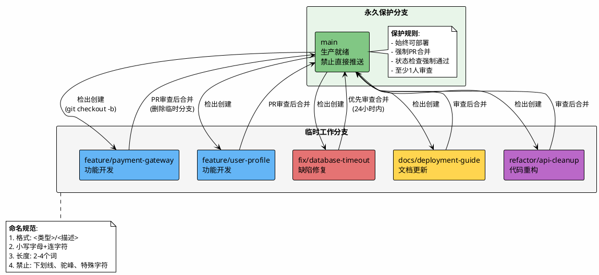
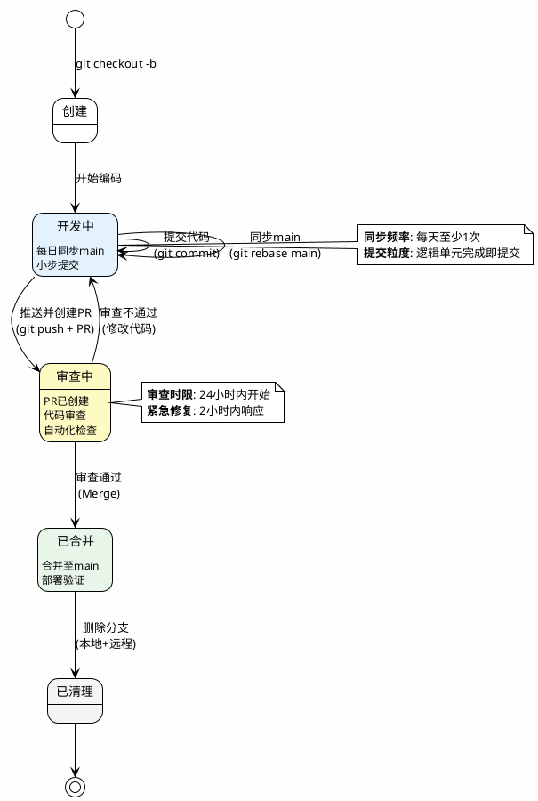
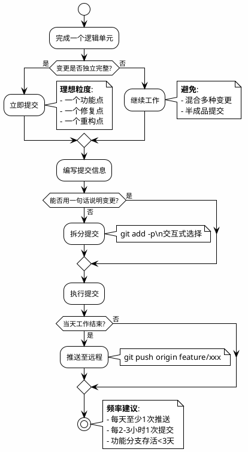
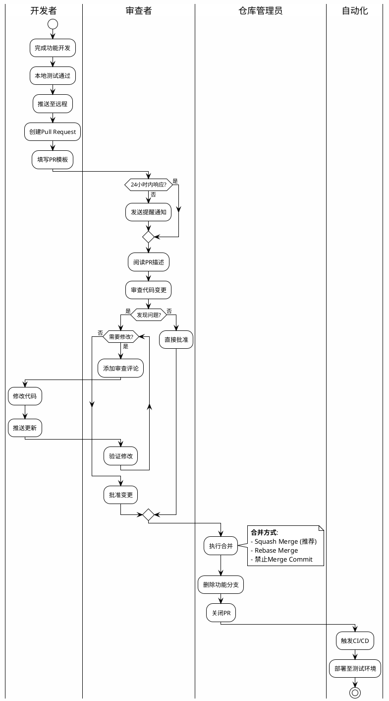
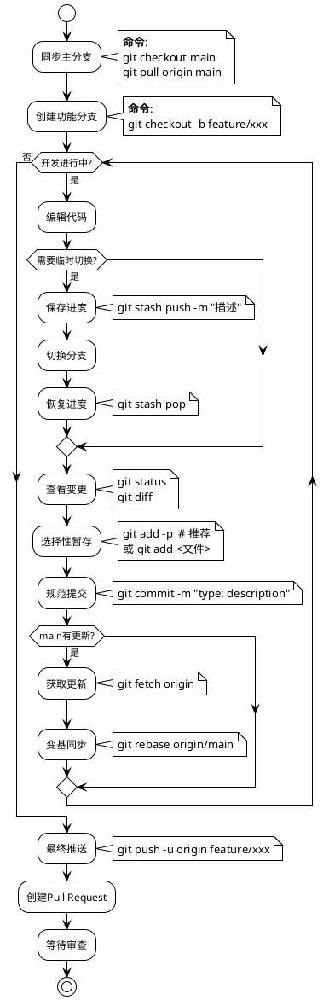
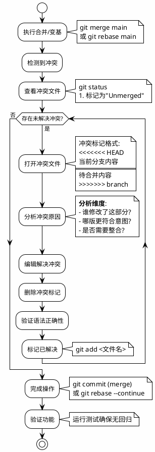
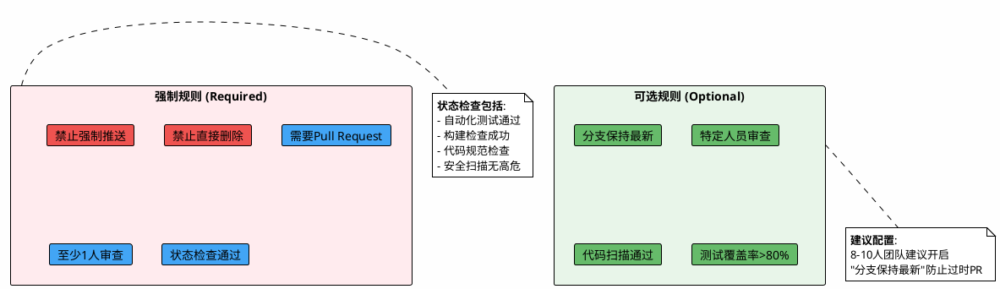
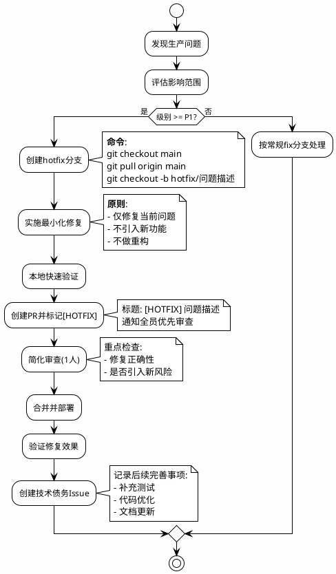
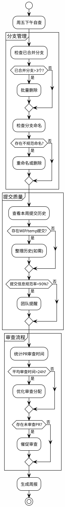

# Git使用规范

**文档版本**: v2.0 | **最后更新**: 2026-02-02

---

## 1. 分支策略

### 1.1 分支模型对比

|模型|适用场景|分支数量|复杂度|部署频率|本规范选择|
| ------| --------------------| ----------| --------| ----------| ------------|
|**GitFlow**|大型项目、版本发布|5+|高|周期性|⨉|
|**GitHub Flow**|持续部署、Web应用|2|低|每日多次|√|
|**GitLab Flow**|多环境部署|3-4|中|按需|⨉|
|**Trunk-based**|超高速迭代|1|最低|每日多次|⨉|

**选择理由**: 团队人数较少，采用简化版GitHub Flow，在保持代码质量的同时避免GitFlow的管理 overhead。

### 1.2 分支架构图



### 1.3 分支类型速查表

|类型|命名格式|用途说明|生命周期|审查要求|优先级|
| ------| ----------| -----------------------| ----------| -----------| --------|
|**功能开发**|​`feature/功能名称`|新功能、增强特性|2-5天|1人|正常|
|**缺陷修复**|​`fix/问题描述`|Bug修复、性能优化|1-3天|1人|正常|
|**紧急修复**|​`hotfix/问题描述`|生产环境紧急问题|数小时|1人(简化)|**紧急**|
|**文档更新**|​`docs/内容描述`|README、API文档、注释|1天|1人|低|
|**代码重构**|​`refactor/范围描述`|不影响功能的重构|2-4天|1人|正常|
|**性能优化**|​`perf/优化目标`|提升性能的专项改动|1-3天|1人|正常|
|**测试补充**|​`test/测试范围`|单测、集成测试补充|1-2天|1人|正常|

### 1.4 分支命名规范对比

|规范项|√ 正确示例|⨉ 错误示例|错误原因|
| --------| -------------| -------------| ----------------------|
|**格式**|​`feature/payment-gateway`|​`feature_New_Payment`|使用下划线而非连字符|
|**大小写**|​`fix/login-timeout`|​`fix/LoginTimeout`|使用驼峰命名|
|**长度**|​`docs/api-guide`|​`feature/very-long-detailed-description-of-changes`|描述过长|
|**语义**|​`hotfix/security-patch`|​`temp-branch-2026`|无意义命名|
|**类型前缀**|​`refactor/db-queries`|​`database-optimization`|缺少类型前缀|
|**特殊字符**|​`fix/issue-123-timeout`|​`fix/user@auth`|包含@特殊字符|

### 1.5 分支生命周期管理流程



---

## 2. 提交规范

### 2.1 提交信息格式详解

|格式级别|结构|适用场景|示例|
| ----------| ------| ----------------------| ------------|
|**完整版**|​`<type>(<scope>): <subject>\n\n<body>\n\n<footer>`|重大功能、破坏性变更|见下方示例|
|**标准版**|​`<type>(<scope>): <subject>`|常规功能提交|​`feat(auth): add OAuth2 login`|
|**简化版**|​`<type>: <subject>`|日常快速提交|​`fix: resolve timeout issue`|

**完整版示例**:

```bash
feat(auth): implement user authentication system

- Add JWT token generation and validation
- Integrate with Google OAuth2 provider
- Add session management middleware

BREAKING CHANGE: auth token format changed from 
session-based to JWT-based. Update client storage.

Closes: #456
```

### 2.2 提交类型决策矩阵

|变更内容|类型|示例|版本影响|
| -----------| ------| ------| ----------|
|新功能|​`feat`|​`feat: add dark mode`|MINOR|
|Bug修复|​`fix`|​`fix: correct calculation error`|PATCH|
|文档更新|​`docs`|​`docs: update API reference`|无|
|代码样式|​`style`|​`style: format with prettier`|无|
|重构|​`refactor`|​`refactor: simplify data flow`|无|
|性能优化|​`perf`|​`perf: optimize image loading`|PATCH|
|测试代码|​`test`|​`test: add unit tests`|无|
|构建/工具|​`chore`|​`chore: update dependencies`|无|
|回滚|​`revert`|​`revert: revert feat: add X`|PATCH|
|CI/CD配置|​`ci`|​`ci: add deploy pipeline`|无|

### 2.3 提交信息质量检查表

|检查项|要求|正确示例|错误示例|
| --------| ----------------| ----------| ----------|
|**语气**|祈使句、现在时|​`add user login`|​`added user login`|
|**首字母**|小写|​`fix: resolve bug`|​`fix: Resolve bug`|
|**结尾**|无句号|​`feat: add feature`|​`feat: add feature.`|
|**长度**|≤50字符|​`fix: resolve memory leak`|​`fix: resolve memory leak in user authentication module`|
|**明确性**|具体描述|​`fix: resolve login timeout`|​`fix: update code`|
|**类型匹配**|类型与变更一致|​`docs: update README`|​`feat: update README`|

### 2.4 提交频率指导



### 2.5 提交粒度对比

|粒度|描述|优点|缺点|适用场景|
| ------| ----------------------------| --------------------| --------------------| --------------|
|**原子提交**|最小逻辑单元，如单函数修改|精确回滚、审查轻松|提交次数多|核心功能开发|
|**功能提交**|完整功能点，如整个API端点|逻辑完整、历史清晰|变更较大|常规功能开发|
|**批量提交**|多个功能混合|减少提交次数|难以回滚、审查困难|**不推荐**|

---

## 3. 代码审查流程

### 3.1 Pull Request流程图



### 3.2 PR创建规范

**PR标题格式**:

|类型|格式|示例|
| ------| ------| ------|
|功能|​`[Feature] <描述>`|​`[Feature] Implement user authentication`|
|修复|​`[Fix] <描述>`|​`[Fix] Resolve database timeout`|
|文档|​`[Docs] <描述>`|​`[Docs] Add deployment guide`|
|重构|​`[Refactor] <描述>`|​`[Refactor] Optimize query performance`|
|紧急|​`[HOTFIX] <描述>`|​`[HOTFIX] Fix security vulnerability`|

**PR描述模板**:

```markdown
## 变更摘要
<!-- 一句话概括变更内容 -->

## 详细说明
<!-- 详细描述变更背景、技术方案 -->

## 改动清单
- [ ] 核心功能实现
- [ ] 单元测试覆盖
- [ ] 集成测试验证
- [ ] 文档更新

## 测试验证
<!-- 描述测试方法和结果 -->

## 关联信息
- 关联Issue: #123
- 设计文档: [链接]
- 影响范围: 用户认证模块

## 回滚方案
<!-- 如需回滚，操作步骤 -->
```

### 3.3 审查检查清单

|检查维度|检查项|通过标准|权重|
| ----------| --------------| ------------------------| ------|
|**功能性**|实现符合需求|与需求文档一致|高|
||边界条件处理|空值、异常、极限值|高|
||错误处理机制|有合理的try-catch|中|
|**代码质量**|可读性|命名清晰、逻辑简洁|高|
||重复代码|无冗余代码|中|
||复杂度|函数<50行，圈复杂度<10|中|
|**测试覆盖**|关键路径测试|核心逻辑有测试|高|
||测试有效性|测试用例有意义|中|
||回归测试|修复包含回归测试|中|
|**安全**|输入验证|所有输入有校验|高|
||敏感信息|无密钥、密码硬编码|高|
|**性能**|明显性能问题|无N+1查询、死循环|中|

### 3.4 审查响应时间标准

|PR类型|开始审查时限|完成审查时限|备注|
| ----------| --------------| --------------| ------------|
|**常规PR**|24小时内|48小时内|工作日计算|
|**紧急修复**|2小时内|4小时内|立即通知|
|**大型PR**(>500行)|协商确定|72小时内|可分批审查|
|**文档PR**|48小时内|72小时内|低优先级|

---

## 4. 日常操作流程

### 4.1 标准开发流程图



### 4.2 常用命令速查表

|场景|命令|说明|使用频率|
| ------| ------| ----------------| -----------|
|**开始工作**|​`git checkout -b feature/xxx`|创建并切换分支|每日|
|**同步代码**|​`git pull origin main`|拉取最新main|每日多次|
|**查看状态**|​`git status`|查看工作区状态|频繁|
|**查看差异**|​`git diff`|查看未暂存变更|频繁|
|**交互暂存**|​`git add -p`|逐块选择暂存|推荐|
|**规范提交**|​`git commit -m "type: desc"`|提交变更|频繁|
|**首次推送**|​`git push -u origin branch`|推送并追踪|每分支1次|
|**变基同步**|​`git rebase main`|保持线性历史|每日|
|**保存进度**|​`git stash push -m "desc"`|临时存储|按需|
|**恢复进度**|​`git stash pop`|恢复最近一次|按需|
|**查看日志**|​`git log --oneline --graph`|可视化历史|调试|
|**撤销提交**|​`git reset --soft HEAD~1`|撤销最近提交|紧急|

### 4.3 工作流场景对照表

|场景|操作步骤|关键命令|注意事项|
| ------| ---------------------------------------| --------------| ------------------------|
|**开始新功能**|1. 切到main<br />2. 拉取更新<br />3. 创建分支|​`git checkout main`<br />`git pull`<br />`git checkout -b feature/xxx`|确保基于最新main|
|**日常开发**|1. 编写代码<br />2. 查看差异<br />3. 暂存提交|​`git diff`<br />`git add -p`<br />`git commit`|小步提交，逻辑清晰|
|**同步main更新**|1. 获取更新<br />2. 变基分支<br />3. 解决冲突|​`git fetch origin`<br />`git rebase origin/main`|优先使用rebase|
|**提交审查**|1. 推送分支<br />2. 创建PR<br />3. 填写描述|​`git push -u origin xxx`|使用PR模板|
|**审查修改**|1. 查看评论<br />2. 修改代码<br />3. 推送更新|​`git commit --amend`<br />`git push --force-with-lease`|修改后force-push需谨慎|
|**合并后清理**|1. 切到main<br />2. 拉取更新<br />3. 删除分支|​`git checkout main`<br />`git pull`<br />`git branch -d feature/xxx`|本地远程都要删|

---

## 5. 冲突解决规范

### 5.1 冲突处理流程图



### 5.2 冲突类型与解决策略

|冲突类型|特征|解决策略|预防措施|
| ----------| ------------------------| --------------------------| --------------------|
|**同一文件修改**|双方修改同一文件不同行|手动合并，保留双方变更|频繁同步main|
|**同一区域修改**|修改了相同代码行|与作者沟通，确定正确版本|提前沟通分工|
|**文件重命名**|一方修改，一方重命名|确认最终文件名，合并内容|避免并行重构|
|**文件删除**|一方修改，一方删除|确认是否仍需该文件|删除前同步|
|**二进制文件**|图片、文档等冲突|选择版本，手动替换|避免多人编辑二进制|

### 5.3 冲突预防策略矩阵

|策略|具体措施|执行频率|
| ------| ----------------------| -------------|
|**频繁同步**|​`git pull origin main`|每天至少1次|
|**缩短分支周期**|功能分支<3天|每个功能|
|**提前沟通**|修改核心文件前@团队|修改前|
|**原子化提交**|相关变更集中提交|每次提交|
|**代码分层**|模块化设计，减少耦合|架构层面|

---

## 6. 分支保护配置

### 6.1 保护规则配置表



### 6.2 团队权限矩阵

|角色|人数|权限范围|特殊权限|责任|
| ------| ----------| ----------------------------| ------------------------| --------------|
|**仓库所有者**|1人|全部权限|修改保护规则、管理成员|最终责任|
|**维护者**|2-3人|合并PR、处理冲突、管理分支|强制合并、删除保护分支|代码质量把控|
|**开发者**|5-7人|创建分支、推送代码、创建PR|无|功能开发|
|**审查者**|全体成员|审查PR、添加评论|批准合并(需满足规则)|代码审查|
|**报告者**|外部人员|创建Issue、查看代码|无|问题反馈|

### 6.3 保护规则详细配置

|规则项|配置值|说明|风险等级|
| --------| --------| --------------------| ----------|
|**Require PR**|启用|禁止直接push到main|高|
|**Required approvals**|1人|至少1人审查通过|中|
|**Dismiss stale reviews**|启用|新提交后重置审查|中|
|**Require status checks**|启用|CI通过才能合并|高|
|**Require linear history**|启用|禁止merge commit|低|
|**Include administrators**|启用|管理员也受限制|高|
|**Allow force pushes**|禁用|禁止强制推送|高|
|**Allow deletions**|禁用|禁止删除main|高|

---

## 7. 紧急修复流程

### 7.1 生产环境问题分级

|级别|定义|响应时间|修复时限|流程|
| ------| ----------------------| ----------| ----------| -------------|
|**P0-紧急**|系统不可用、数据丢失|立即|4小时|hotfix流程|
|**P1-高**|核心功能受损|30分钟|24小时|hotfix流程|
|**P2-中**|非核心功能异常|2小时|3天|常规fix分支|
|**P3-低**|轻微问题、优化建议|24小时|下次迭代|常规流程|

### 7.2 紧急修复流程图



### 7.3 Hotfix与常规Fix对比

|维度|Hotfix (紧急修复)|Fix (常规修复)|
| ------| -------------------| ----------------|
|**触发条件**|P0/P1级生产问题|P2/P3级问题|
|**分支来源**|main|main|
|**分支命名**|​`hotfix/问题描述`|​`fix/问题描述`|
|**审查要求**|1人快速审查|1人标准审查|
|**测试要求**|快速验证|完整测试|
|**合并后操作**|立即部署|按发布计划部署|
|**后续工作**|创建技术债务Issue|无|
|**文档记录**|事后补录|正常记录|

---

## 8. 工具与自动化

### 8.1 工具链推荐矩阵

```plantuml
@startuml 工具链架构
!theme plain
skinparam backgroundColor #FEFEFE

title 推荐Git工具链配置

package "代码托管平台" {
    [GitHub] #24292e
    [GitLab] #FC6d26
    [Gitea] #609926
}

package "本地工具" {
    [命令行Git] #F05032
    [GitKraken] #179287
    [Fork] #0080FF
    [VS Code] #007ACC
}

package "质量门禁" {
    [Husky] #42b983
    [commitlint] #000000
    [lint-staged] #fff
    [Prettier] #F7B93E
}

package "CI/CD" {
    [GitHub Actions] #2088FF
    [GitLab CI] #FC6d26
    [Jenkins] #D24939
}

package "协作工具" {
    [Slack通知] #4A154B
    [JIRA集成] #0052CC
}

GitHub --> commitlint : Webhook验证
VS Code --> Prettier : 保存时格式化
Husky --> commitlint : 提交前检查
commitlint --> GitHub Actions : 阻断不合规提交
GitHub Actions --> Slack通知 : PR状态通知

@enduml
```

### 8.2 工具配置对比

|工具类型|推荐工具|用途|配置复杂度|团队收益|
| ----------| --------------------------| ------------------| ------------| ----------------|
|**提交规范**|commitlint + Husky|验证提交信息格式|中|自动化规范检查|
|**代码格式化**|Prettier + lint-staged|统一代码风格|低|消除风格争议|
|**分支保护**|GitHub Branch Protection|强制流程合规|低|防止违规操作|
|**CI/CD**|GitHub Actions|自动化测试部署|中|快速反馈|
|**通知集成**|Slack + GitHub|实时状态通知|低|提升响应速度|

### 8.3 Husky配置示例

**package.json配置**:

```json
{
  "husky": {
    "hooks": {
      "commit-msg": "commitlint -E HUSKY_GIT_PARAMS",
      "pre-commit": "lint-staged",
      "pre-push": "npm run test:unit"
    }
  },
  "lint-staged": {
    "*.{js,ts,jsx,tsx}": [
      "prettier --write",
      "eslint --fix",
      "git add"
    ]
  }
}
```

**commitlint配置** (commitlint.config.js):

```javascript
module.exports = {
  extends: ['@commitlint/config-conventional'],
  rules: {
    'type-enum': [2, 'always', [
      'feat', 'fix', 'docs', 'style', 'refactor', 
      'perf', 'test', 'chore', 'ci', 'revert'
    ]],
    'type-case': [2, 'always', 'lower-case'],
    'subject-empty': [2, 'never'],
    'subject-full-stop': [2, 'never', '.'],
    'header-max-length': [2, 'always', 72]
  }
};
```

---

## 9. 规范执行检查

### 9.1 每周自查清单



### 9.2 度量指标与目标

|指标|计算方法|目标值|测量频率|改进措施|
| ------| --------------------------| ---------| ----------| --------------------|
|**PR平均审查时间**|创建到首次审查的时间均值|< 8小时|每周|提醒机制、分配优化|
|**分支平均存活时间**|创建到合并的天数均值|< 3天|每周|拆分任务、每日站会|
|**合并冲突频率**|每周冲突次数|< 2次|每周|加强同步、提前沟通|
|**提交信息规范率**|规范提交数/总提交数|> 90%|每周|Husky强制检查|
|**代码审查通过率**|首次通过PR数/总PR数|> 70%|每月|审查清单、培训|
|**紧急修复占比**|hotfix数/总修复数|< 10%|每月|加强测试、预发验证|

### 9.3 规范执行检查表

|检查维度|检查项|检查方法|责任人|频率|
| ----------| --------------------| ------------------| ------------| ----------|
|**分支管理**|已合并分支及时删除|​`git branch --merged`|开发者|每日|
||分支命名符合规范|正则匹配检查|CI/CD|每次推送|
||main分支始终可部署|自动化部署检查|CI/CD|每次合并|
|**提交质量**|提交信息格式正确|commitlint|Husky|每次提交|
||提交粒度适中|代码审查|审查者|每次PR|
||无敏感信息泄露|密钥扫描|CI/CD|每次推送|
|**审查流程**|所有PR经过审查|分支保护规则|GitHub|每次合并|
||审查反馈及时|时间统计|团队负责人|每周|
||审查意见被落实|PR关闭检查|审查者|每次合并|
|**协作沟通**|大型改动提前同步|会议纪要检查|团队负责人|每周|
||冲突解决及时|冲突解决时间统计|开发者|每月|
||文档随代码更新|文档变更关联检查|审查者|每次PR|

---

## 10. 快速参考

### 10.1 每日启动工作流

|步骤|命令|预计时间|
| -----------------| ------| ----------|
|1. 同步主分支|​`git checkout main && git pull origin main`|30秒|
|2. 创建功能分支|​`git checkout -b feature/功能名称`|10秒|
|3. 开始开发|-|-|

### 10.2 提交前检查清单

|检查项|命令|通过标准|
| --------------| ------| ------------------------|
|查看变更范围|​`git status`|确认变更文件正确|
|查看具体差异|​`git diff`|无调试代码、无敏感信息|
|选择性暂存|​`git add -p`|仅暂存相关变更|
|规范提交|​`git commit -m "type: description"`|符合提交规范|

### 10.3 提交后流程

|步骤|命令/操作|注意事项|
| ---------------| ----------------| ----------------|
|1. 推送分支|​`git push -u origin feature/xxx`|首次推送加`-u`|
|2. 创建PR|GitHub Web界面|使用PR模板|
|3. 等待审查|-|24小时内响应|
|4. 合并后清理|​`git checkout main && git pull && git branch -d feature/xxx`|本地远程都删除|

### 10.4 紧急修复速查

|步骤|命令|时限要求|
| -------------------| -----------------------| ----------|
|1. 创建hotfix分支|​`git checkout main && git pull && git checkout -b hotfix/问题描述`|5分钟|
|2. 修复并提交|​`git commit -m "fix: 修复生产问题"`|30分钟|
|3. 推送并标记紧急|​`git push -u origin hotfix/问题描述` + PR标记[HOTFIX]|5分钟|
|4. 简化审查合并|1人快速审查|30分钟|
|5. 部署验证|-|15分钟|

### 10.5 常见问题速查

|问题|解决方案|预防|
| --------------------| ------------------| --------------------------|
|误提交到main|​`git reset --soft HEAD~1` + 创建分支|设置分支保护|
|提交信息写错|​`git commit --amend -m "新信息"`|使用Husky检查|
|需要修改已推送提交|​`git commit --amend`​ + `git push --force-with-lease`|避免在共享分支使用|
|误删分支|​`git reflog` 找回|谨慎删除，先确认合并|
|冲突太多|​`git rebase --abort` 重新开始|频繁同步main|
|忘记切换分支|​`git stash`​ + 切换 + `git stash pop`|使用命令行提示符显示分支|

---

我将为您编写一份详尽的Git指令速查表附录，采用表格形式分类整理，便于快速查阅。

---

## 附录：Git命令速查表

### 1 配置类

|命令|功能说明|常用示例|
| ------| -----------------------| ----------------------|
|​`git config --global user.name "姓名"`|设置全局用户名|​`git config --global user.name "张三"`|
|​`git config --global user.email "邮箱"`|设置全局邮箱|​`git config --global user.email "zhangsan@example.com"`|
|​`git config --global core.editor "编辑器"`|设置默认编辑器|​`git config --global core.editor "code --wait"`|
|​`git config --global init.defaultBranch main`|设置默认分支名|新建仓库默认使用main|
|​`git config --list`|查看所有配置|检查当前所有Git配置|
|​`git config --global alias.别名 "指令"`|设置指令别名|​`git config --global alias.st "status"`|
|​`git config --global core.autocrlf input`|处理换行符(Linux/Mac)|自动转换LF|
|​`git config --global core.autocrlf true`|处理换行符(Windows)|自动转换CRLF|

---

### 2 仓库操作

|命令|功能说明|常用场景|
| ------| ----------------------| -----------------------|
|​`git init`|初始化本地仓库|新项目开始时|
|​`git clone <仓库地址>`|克隆远程仓库|​`git clone https://github.com/user/repo.git`|
|​`git clone --depth 1 <地址>`|浅克隆(仅最新提交)|快速克隆大型仓库|
|​`git remote -v`|查看远程仓库地址|确认remote配置|
|​`git remote add origin <地址>`|添加远程仓库|关联GitHub/GitLab仓库|
|​`git remote set-url origin <地址>`|修改远程仓库地址|更换仓库地址时|
|​`git remote remove <名称>`|删除远程仓库关联|移除无用的remote|
|​`git fetch <remote>`|获取远程更新(不合并)|​`git fetch origin`|
|​`git pull <remote> <分支>`|拉取并合并远程分支|​`git pull origin main`|
|​`git push <remote> <分支>`|推送到远程分支|​`git push origin main`|
|​`git push -u origin <分支>`|首次推送并建立追踪|新分支第一次推送|

---

### 3 分支操作

|命令|功能说明|常用示例|
| ------| --------------------------| ------------------------|
|​`git branch`|列出本地分支|查看所有本地分支|
|​`git branch -a`|列出所有分支(含远程)|查看远程分支|
|​`git branch -vv`|显示分支详情(含追踪关系)|检查分支追踪状态|
|​`git branch <分支名>`|创建新分支|​`git branch feature/login`|
|​`git checkout <分支名>`|切换到指定分支|​`git checkout main`|
|​`git checkout -b <分支名>`|创建并切换分支|​`git checkout -b feature/payment`|
|​`git branch -d <分支名>`|删除已合并分支|​`git branch -d feature/old`|
|​`git branch -D <分支名>`|强制删除分支|删除未合并分支(慎用)|
|​`git branch -m <新名称>`|重命名当前分支|​`git branch -m feature/new-name`|
|​`git merge <分支名>`|合并指定分支到当前|​`git merge feature/login`|
|​`git merge --no-ff <分支名>`|非快进合并|保留分支历史|
|​`git merge --abort`|取消合并|合并冲突时放弃|
|​`git rebase <分支名>`|变基到指定分支|​`git rebase main`|
|​`git rebase -i HEAD~n`|交互式变基(整理提交)|合并多个提交|
|​`git rebase --abort`|取消变基|变基冲突时放弃|
|​`git rebase --continue`|继续变基|解决冲突后继续|
|​`git cherry-pick <提交ID>`|拣选指定提交|复制特定提交到当前分支|

---

### 4 日常开发

|命令|功能说明|常用场景|
| ------| ------------------------| ----------------------|
|​`git status`|查看工作区状态|随时查看当前状态|
|​`git status -s`|简短状态输出|快速查看变更|
|​`git add <文件>`|添加文件到暂存区|​`git add index.html`|
|​`git add .`|添加所有变更(不含删除)|批量添加新文件|
|​`git add -A`|添加所有变更(含删除)|完整的变更添加|
|​`git add -p`|交互式选择暂存|部分提交，精细控制|
|​`git rm <文件>`|删除文件并暂存|删除不需要的文件|
|​`git rm --cached <文件>`|从暂存区移除(保留文件)|误add后撤销|
|​`git mv <原文件> <新文件>`|重命名文件|保留历史记录的重命名|
|​`git commit -m "消息"`|提交暂存区变更|​`git commit -m "feat: add login"`|
|​`git commit -am "消息"`|添加并提交(仅修改)|快速提交已有文件|
|​`git commit --amend`|修改最后一次提交|修正提交信息或内容|
|​`git commit --amend --no-edit`|追加变更但不改消息|补充遗漏文件|
|​`git reset HEAD <文件>`|取消暂存|误add后撤销|
|​`git checkout -- <文件>`|丢弃工作区修改|放弃未暂存的修改|
|​`git restore <文件>`|恢复文件(Git 2.23+)|替代checkout的新指令|
|​`git restore --staged <文件>`|取消暂存(Git 2.23+)|替代reset HEAD|
|​`git clean -fd`|删除未跟踪的文件和目录|清理临时文件|

---

### 5 查看历史与对比

|命令|功能说明|常用示例|
| ------| ------------------| ------------------|
|​`git log`|查看提交历史|默认详细历史|
|​`git log --oneline`|单行显示历史|快速浏览|
|​`git log --oneline --graph`|图形化显示分支|查看分支合并历史|
|​`git log --oneline --all --graph`|显示所有分支图形|完整历史视图|
|​`git log -n 5`|显示最近5条|限制数量|
|​`git log --author="作者"`|按作者筛选|​`git log --author="张三"`|
|​`git log --since="2024-01-01"`|按日期筛选|查看某时间段提交|
|​`git log --grep="关键词"`|按提交信息筛选|搜索特定功能提交|
|​`git log -p <文件>`|查看文件修改历史|追溯文件变更|
|​`git log --stat`|显示统计信息|查看变更文件数|
|​`git show <提交ID>`|显示某提交详情|​`git show abc1234`|
|​`git diff`|查看未暂存的修改|工作区vs暂存区|
|​`git diff --cached`|查看已暂存的修改|暂存区vs最新提交|
|​`git diff HEAD`|查看所有修改|工作区vs最新提交|
|​`git diff <分支A> <分支B>`|对比两个分支|​`git diff main feature`|
|​`git blame <文件>`|逐行查看作者|追溯代码责任人|
|​`git shortlog -sn`|查看贡献者统计|按提交数排序|

---

### 6 撤销与回退

|命令|功能说明|使用场景|风险等级|
| ------| ------------------------------| ------------------| ----------|
|​`git checkout -- <文件>`|丢弃工作区修改|未add前的撤销|低|
|​`git reset HEAD <文件>`|取消暂存|已add未commit|低|
|​`git reset --soft HEAD~1`|撤销最近提交，保留修改|提交信息错误|中|
|​`git reset --mixed HEAD~1`|撤销最近提交，保留修改(默认)|需要重新整理|中|
|​`git reset --hard HEAD~1`|**彻底删除最近提交**|完全放弃修改|**高**|
|​`git revert <提交ID>`|创建反向提交(推荐)|撤销已推送的提交|低|
|​`git revert -m 1 <合并提交ID>`|撤销合并提交|回滚合并|中|
|​`git reflog`|查看所有操作记录|找回丢失的提交|恢复用|
|​`git reset --hard <reflog ID>`|恢复到指定状态|通过reflog恢复|**高**|

**撤销场景速查**:

|场景|解决方案|
| ---------------------| -------------------------------|
|修改了文件，未add|​`git checkout -- <文件>`​ 或 `git restore <文件>`|
|add了文件，未commit|​`git reset HEAD <文件>`​ 或 `git restore --staged <文件>`|
|commit了，未push|​`git reset --soft HEAD~1` 修改后重新commit|
|commit了，已push|​`git revert <提交ID>` 创建反向提交|
|误删分支|​`git reflog`​ 找到commit ID，然后 `git checkout -b <分支名> <ID>`|
|误用`reset --hard`|​`git reflog` 找到之前的HEAD，然后恢复|

---

### 7 Stash暂存

|命令|功能说明|使用场景|
| ------| ---------------------| -------------------|
|​`git stash`|临时保存当前修改|快速切换分支|
|​`git stash push -m "描述"`|带描述的保存|多个stash时区分|
|​`git stash list`|查看stash列表|查看所有暂存|
|​`git stash show`|显示最新stash详情|查看具体内容|
|​`git stash show -p`|显示最新stash差异|查看详细修改|
|​`git stash pop`|恢复并删除最新stash|恢复工作|
|​`git stash apply`|恢复但不删除stash|可能需要多次应用|
|​`git stash drop`|删除最新stash|清理不需要的stash|
|​`git stash drop stash@{n}`|删除指定stash|清理特定stash|
|​`git stash clear`|清空所有stash|**慎用**|
|​`git stash branch <分支名>`|从stash创建分支|stash有冲突时|

---

### 8 标签管理

|命令|功能说明|常用示例|
| ------| ----------------| ----------------------|
|​`git tag`|列出所有标签|查看版本标签|
|​`git tag <标签名>`|创建轻量标签|​`git tag v1.0`|
|​`git tag -a <标签名> -m "消息"`|创建附注标签|​`git tag -a v1.0 -m "版本1.0"`|
|​`git tag -d <标签名>`|删除本地标签|​`git tag -d v1.0`|
|​`git push origin <标签名>`|推送指定标签|​`git push origin v1.0`|
|​`git push origin --tags`|推送所有标签|发布所有版本|
|​`git push origin --delete <标签名>`|删除远程标签|​`git push origin --delete v1.0`|
|​`git checkout <标签名>`|切换到标签|查看特定版本|
|​`git describe`|显示最近的标签|查看当前基于哪个版本|

---

### 9 远程协作

|命令|功能说明|使用场景|
| ------| ----------------------------| ------------------------|
|​`git push origin <本地分支>:<远程分支>`|推送到指定远程分支|​`git push origin feature:main`|
|​`git push origin --delete <分支名>`|删除远程分支|清理已合并分支|
|​`git push --force-with-lease`|安全的强制推送|更新已推送的提交|
|​`git push --force`|**强制推送(慎用)**|重写远程历史|
|​`git fetch --prune`|获取更新并清理远程已删分支|同步远程分支状态|
|​`git pull --rebase`|拉取并使用rebase|保持线性历史|
|​`git pull --no-rebase`|拉取并使用merge|保留合并历史|
|​`git branch -u origin/<分支>`|建立追踪关系|关联本地与远程分支|
|​`git branch --set-upstream-to=origin/<远程> <本地>`|详细设置追踪|指定追踪关系|
|​`git remote prune origin`|清理本地远程追踪分支|删除远程已不存在的分支|

---

### 10 高级操作

|命令|功能说明|使用场景|
| ------| --------------------| --------------------|
|​`git bisect start`|开始二分查找|定位引入bug的提交|
|​`git bisect bad`|标记当前为bad|二分查找步骤|
|​`git bisect good <提交>`|标记某提交为good|二分查找步骤|
|​`git bisect reset`|结束二分查找|完成查找后|
|​`git worktree add <路径> <分支>`|添加工作树|同时处理多个分支|
|​`git worktree list`|列出工作树|查看所有工作目录|
|​`git worktree remove <路径>`|删除工作树|清理工作树|
|​`git submodule add <仓库> <路径>`|添加子模块|引入外部依赖|
|​`git submodule update --init --recursive`|初始化并更新子模块|克隆含子模块的仓库|
|​`git archive -o <文件.zip> <分支>`|打包归档|导出代码快照|
|​`git gc`|垃圾回收|优化仓库体积|
|​`git fsck`|文件系统检查|检查仓库完整性|
|​`git count-objects -vH`|查看仓库大小|监控仓库体积|

---

### 11 本规范专用流程

#### 11.1 每日启动流程

|步骤|命令|说明|
| ------| ------| --------------|
|1|​`git checkout main`|切换到主分支|
|2|​`git pull origin main`|同步最新代码|
|3|​`git checkout -b feature/功能名`|创建功能分支|

#### 11.2 提交前检查流程

|步骤|命令|说明|
| ------| ------| ----------------|
|1|​`git status`|查看变更范围|
|2|​`git diff`|审查具体修改|
|3|​`git add -p`|交互式选择暂存|
|4|​`git commit -m "type: description"`|规范提交|

#### 11.3 同步main更新流程

|步骤|命令|说明|
| ------| ------| ----------------------|
|1|​`git fetch origin`|获取远程更新|
|2|​`git rebase origin/main`|变基到最新main|
|3|​`git push --force-with-lease`|强制推送更新后的分支|

#### 11.4 紧急修复流程

|步骤|命令|说明|
| ------| ------| ----------------|
|1|​`git checkout main && git pull`|基于最新main|
|2|​`git checkout -b hotfix/问题描述`|创建hotfix分支|
|3|​`git commit -m "fix: 修复问题"`|提交修复|
|4|​`git push -u origin hotfix/问题描述`|推送并创建PR|

---

### 12 命令别名推荐配置

添加到 `~/.gitconfig`​ 或执行 `git config --global alias.别名 "指令"`：

|别名|对应命令|用途|
| ------| ----------| --------------|
|​`st`|​`status -s`|简短状态|
|​`co`|​`checkout`|切换分支|
|​`br`|​`branch -vv`|查看分支|
|​`ci`|​`commit`|提交|
|​`lg`|​`log --oneline --graph --all`|图形化历史|
|​`last`|​`log -1 HEAD`|查看最新提交|
|​`unstage`|​`reset HEAD --`|取消暂存|
|​`undo`|​`checkout --`|撤销修改|
|​`amend`|​`commit --amend`|修改提交|
|​`prune`|​`fetch --prune`|清理远程分支|
|​`save`|​`stash push -m`|保存进度|
|​`pop`|​`stash pop`|恢复进度|

**配置示例**:

```bash
git config --global alias.st "status -s"
git config --global alias.co "checkout"
git config --global alias.br "branch -vv"
git config --global alias.lg "log --oneline --graph --all"
git config --global alias.last "log -1 HEAD"
git config --global alias.unstage "reset HEAD --"
git config --global alias.undo "checkout --"
git config --global alias.amend "commit --amend"
git config --global alias.prune "fetch --prune"
git config --global alias.save "stash push -m"
git config --global alias.pop "stash pop"
```

---

### 13 场景化命令组合

|场景|命令组合|说明|
| ------| ----------| --------------------|
|**完全重置工作区**|​`git reset --hard HEAD && git clean -fd`|回到干净状态(危险)|
|**整理最近3个提交**|​`git rebase -i HEAD~3`|合并或修改提交|
|**只查看某文件历史**|​`git log -p -- 文件名`|追溯文件变更|
|**查找删除的代码**|​`git log -S "关键词" -- 文件名`|搜索代码片段|
|**同步所有远程分支**|​`git fetch --all --prune`|更新所有remote|
|**批量删除已合并分支**|​`git branch --merged \| grep -v "main\|master" \| xargs git branch -d`|清理旧分支|
|**导出补丁文件**|​`git diff > patch.diff`|生成diff文件|
|**应用补丁文件**|​`git apply patch.diff`|导入diff文件|
|**查看某行代码最后修改**|​`git blame -L 10,20 文件名`|查看10-20行|
|**统计代码行数**|​`git ls-files \| xargs wc -l`|项目代码量|

---

**使用提示**:

- 所有 `<>` 包裹的内容需要替换为实际值
- 使用 `--help`​ 查看详细帮助，如 `git commit --help`
- 使用 `-h`​ 查看简要帮助，如 `git commit -h`
- 危险操作(`--hard`​, `--force`) 执行前请确认
