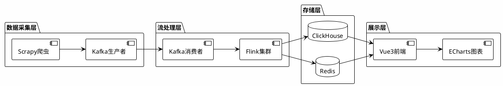
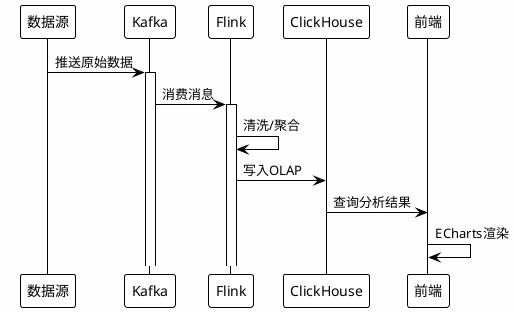
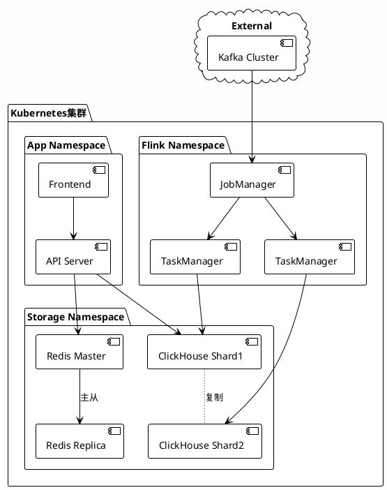

# 数据分析系统

## 架构概览



## 数据流



## 核心功能

### 1. 实时流处理

```python
from pyflink.datastream import StreamExecutionEnvironment
from pyflink.table import StreamTableEnvironment

env = StreamExecutionEnvironment.get_execution_environment()
t_env = StreamTableEnvironment.create(env)

# 定义Kafka源表
t_env.execute_sql("""
    CREATE TABLE user_events (
        user_id STRING,
        event_type STRING,
        event_time TIMESTAMP(3),
        properties STRING
    ) WITH (
        'connector' = 'kafka',
        'topic' = 'user-events',
        'properties.bootstrap.servers' = 'kafka:9092',
        'format' = 'json'
    )
""")

# 实时聚合统计
t_env.execute_sql("""
    CREATE TABLE event_stats (
        event_type STRING,
        event_count BIGINT,
        window_start TIMESTAMP(3)
    ) WITH (
        'connector' = 'clickhouse',
        'url' = 'clickhouse://localhost:8123',
        'table-name' = 'event_stats'
    )
""")

t_env.execute_sql("""
    INSERT INTO event_stats
    SELECT 
        event_type,
        COUNT(*) as event_count,
        TUMBLE_START(event_time, INTERVAL '1' MINUTE) as window_start
    FROM user_events
    GROUP BY 
        event_type,
        TUMBLE(event_time, INTERVAL '1' MINUTE)
""")
```

### 2. 亿级数据查询

```sql
-- ClickHouse 优化查询示例
SELECT 
    toStartOfHour(event_time) as hour,
    event_type,
    count() as cnt,
    uniqExact(user_id) as uv
FROM user_events
WHERE event_date >= today() - 7
GROUP BY hour, event_type
ORDER BY hour DESC
LIMIT 1000
```

## 性能指标

| 场景 | 性能 | 说明 |
|------|------|------|
| 数据摄入 | 100,000 条/秒 | Kafka + Flink |
| 聚合查询 | <1 秒 | 亿级数据 |
| 明细查询 | <0.5 秒 | 百万级数据 |
| 存储压缩 | >5:1 | 列式存储 |

## 部署架构


