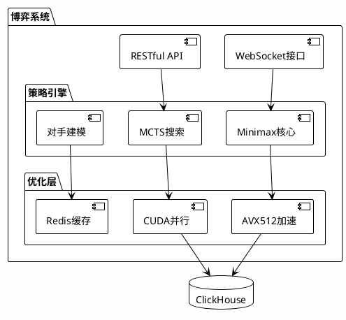
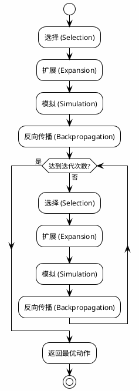

# 博弈程序开发

## 概述

我们专注于**零和博弈**与**不完全信息博弈**的算法工程化，提供高性能的博弈解决方案。

## 系统架构



## 核心算法

### Minimax with Alpha-Beta Pruning

```cpp
// C++17 + AVX512 优化示例
#include <immintrin.h>

class GameTreeSearcher {
public:
    double minimax(
        GameState state, 
        int depth, 
        double alpha, 
        double beta
    ) {
        if (depth == 0 || state.isTerminal()) {
            return evaluate(state);
        }
        
        if (state.isMaximizing()) {
            double maxEval = -INFINITY;
            for (auto& action : state.getActions()) {
                double eval = minimax(
                    state.apply(action),
                    depth - 1, 
                    alpha, 
                    beta
                );
                maxEval = std::max(maxEval, eval);
                alpha = std::max(alpha, eval);
                if (beta <= alpha) break; // Alpha-Beta 剪枝
            }
            return maxEval;
        }
        // ... 最小化方逻辑
    }
};
```

### MCTS (蒙特卡洛树搜索)



## 性能指标

| 指标 | 数值 | 说明 |
|------|------|------|
| 搜索延迟 | <10ms | p99延迟 |
| QPS | >5,000 | 单核 |
| 回测加速 | 50x | AVX512优化 |
| 内存占用 | <2GB | 单实例 |

## 技术参数

```yaml
runtime:
  language: C++17 / Python 3.11
  compiler: GCC 12+ / Clang 15+
  
optimization:
  simd: AVX512
  parallel: OpenMP
  cache: Redis Cluster
  
dependencies:
  - PyTorch 2.0+
  - Eigen3
  - spdlog
```
