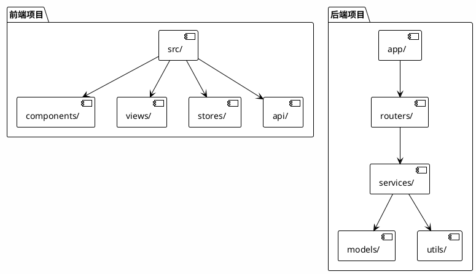
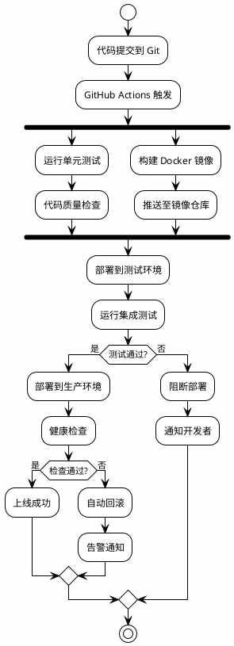

# Web 开发规范

## 技术栈

```
前端: Vue3 + TypeScript + TailwindCSS + Vite
后端: FastAPI / Go Gin + PostgreSQL/MySQL + Redis
部署: Docker + Nginx + Let's Encrypt
```

## 项目结构



## API 设计规范

### RESTful 接口

```python
from fastapi import FastAPI, HTTPException
from pydantic import BaseModel
from typing import List, Optional

app = FastAPI(title="SAKURAIN API", version="1.0.0")

class Project(BaseModel):
    id: Optional[int] = None
    name: str
    description: str
    status: str = "pending"
    budget: float

@app.get("/api/v1/projects", response_model=List[Project])
async def list_projects(
    skip: int = 0, 
    limit: int = 100,
    status: Optional[str] = None
):
    """
    获取项目列表
    
    - skip: 分页偏移
    - limit: 每页数量
    - status: 按状态筛选
    """
    # 实现...
    pass

@app.post("/api/v1/projects", response_model=Project)
async def create_project(project: Project):
    """创建新项目"""
    # 实现...
    pass

@app.get("/api/v1/projects/{project_id}", response_model=Project)
async def get_project(project_id: int):
    """获取项目详情"""
    project = await fetch_project(project_id)
    if not project:
        raise HTTPException(status_code=404, detail="Project not found")
    return project
```

### 响应格式

```json
{
  "code": 200,
  "message": "success",
  "data": {
    "id": 1,
    "name": "博弈算法系统",
    "status": "active"
  },
  "meta": {
    "total": 100,
    "page": 1,
    "page_size": 20
  }
}
```

## 前端规范

### 组件设计

```typescript
// components/ProjectCard.vue
<script setup lang="ts">
interface Project {
  id: number;
  name: string;
  description: string;
  progress: number;
  deadline: string;
}

const props = defineProps<{
  project: Project;
  loading?: boolean;
}>();

const emit = defineEmits<{
  click: [id: number];
  delete: [id: number];
}>();

const handleClick = () => {
  emit('click', props.project.id);
};
</script>

<template>
  <div 
    class="project-card p-4 rounded-lg border hover:shadow-lg transition-shadow"
    :class="{ 'opacity-50': loading }"
    @click="handleClick"
  >
    <h3 class="text-lg font-bold">{{ project.name }}</h3>
    <p class="text-gray-600 text-sm mt-2">{{ project.description }}</p>
    <div class="mt-4">
      <div class="flex justify-between text-sm">
        <span>进度</span>
        <span>{{ project.progress }}%</span>
      </div>
      <div class="w-full bg-gray-200 rounded-full h-2 mt-1">
        <div 
          class="bg-blue-600 h-2 rounded-full transition-all"
          :style="{ width: `${project.progress}%` }"
        />
      </div>
    </div>
  </div>
</template>
```

## 部署流程


